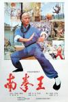

[南拳王](https://pewae.com/gaan/aHR0cHM6Ly9tb3ZpZS5kb3ViYW4uY29tL3N1YmplY3QvMTMwNDAxOC8=)

导演：萧龙主演：李彦龙 / 潘伟章 / 邱建国类型：剧情 / 动作地区：大陆 / 香港首映时间：1984

这片子早已在脑海里沉寂了好多年。
2016年冬天的一个夜晚，看到@姜辰发来的评论里出现了一个“跪”字，记忆犹如被扔了雷管的鱼塘一样翻滚不已。因为镜头上印象最深的一跪就来自这部电影。
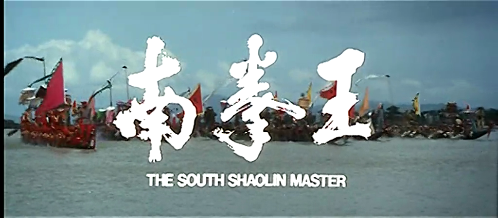

今天，800多天后才开始动笔，充分说明了我是个记性很好的拖延症晚期。
这部片子很热门。
在八十年代，这部电影是有周边产品的——圆牌（东北叫piaji）和小人书。
这可以充分说明本作有多流行。
作为一部少林寺like的影片，重播的次数不比少林寺少。甚至因为少林寺里有鼓励恋爱和吃狗肉的情节被老干部们批评，本片假期里播出的次数依稀还要更多一些。
那时没有电影频道。假期重播在CCAV1，平常周日重播在CCAV2。
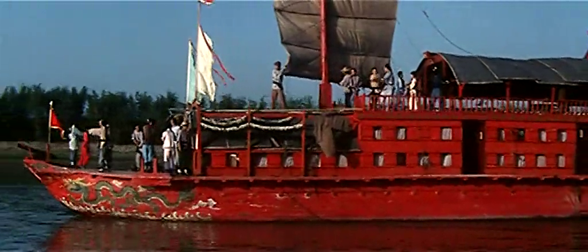

就在社会上造成的不良影响而论，本片也不弱于少林寺。
其一就是前面提到的记忆起源。男猪林海南最强大的超必杀技就是铁膝盖跪人。而这一招是通过先跪土再跪瓦片最后跪石头练出来的。八十年代路边的小平房几乎随处可见，于是少年们经常先用觉远的轻功上方揭瓦，然后练习林海南的铁膝盖。
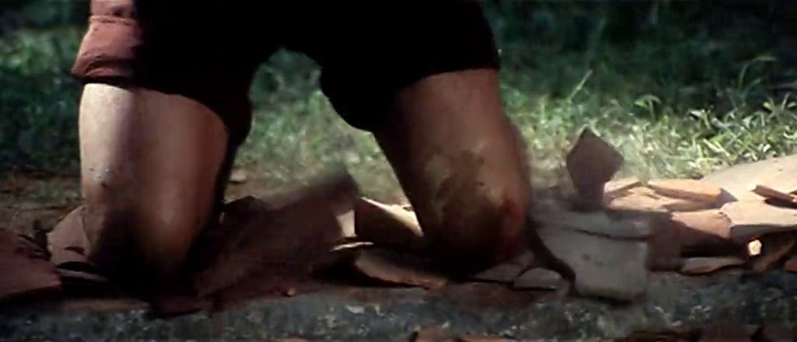
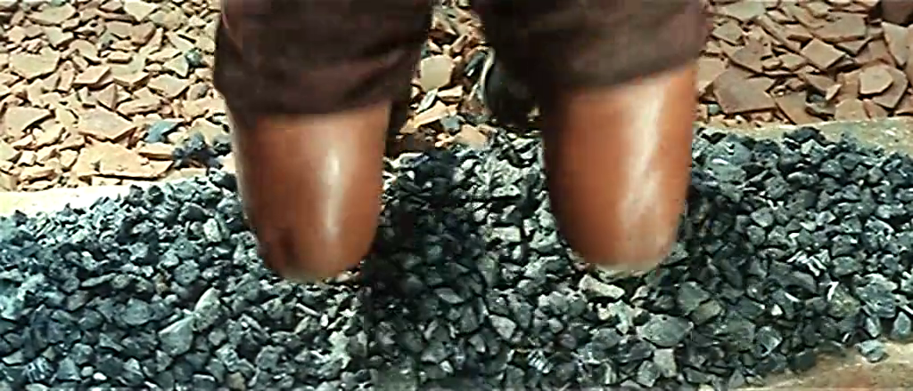

另一个危险镜头是男猪二次亮相的时候，跟某反派玩金枪刺喉。播放的时候也不像现在打两行“专业动作，请勿模仿”之类的。
真有照着练的。
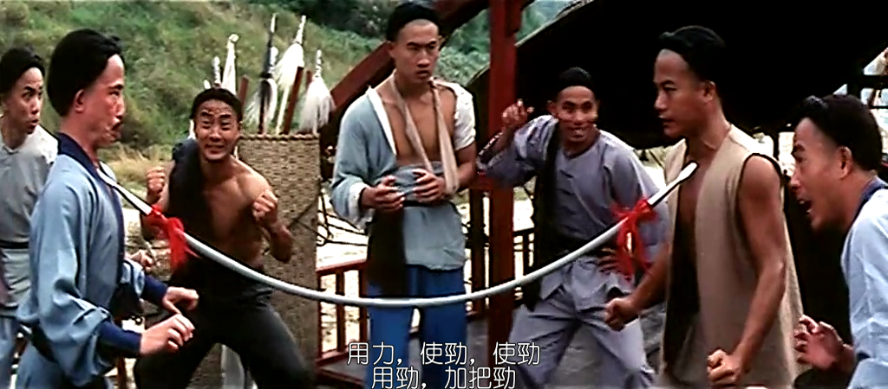

那时候的香港片总喜欢搞一些很cult的东西。本片里最“恶劣”的镜头出现在戏台逃脱一场戏。
男猪藏在戏班里，准备利用巡抚的老妈过寿的机会逃走。男二的戏班唱戏的时候，打斗戏真的砍下了假人头，制造混乱。
小时候理解能力有限，很长时间没搞明白这么做的目的是什么。
当然片子里这条计策也不算很成功，男猪是跑出来了，但戏班全被毁了。
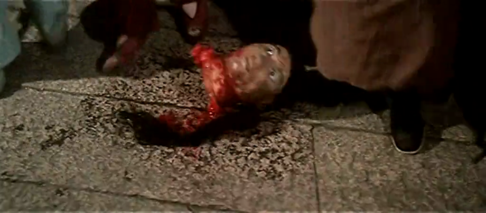

跟少林寺相比，比较不足的地方就是文戏了。情节很牵强。
男主角是作为南洋商人的代表，给太平天国的义军送捐款的。长大以后知道了太平天国究竟是什么德行，很怀疑这条主线是否成立。
这里的台词非常有问题，你都资助太平军了，还口称“大清皇朝”，这不跟陈佩斯嘴里的皇军一个味儿吗？
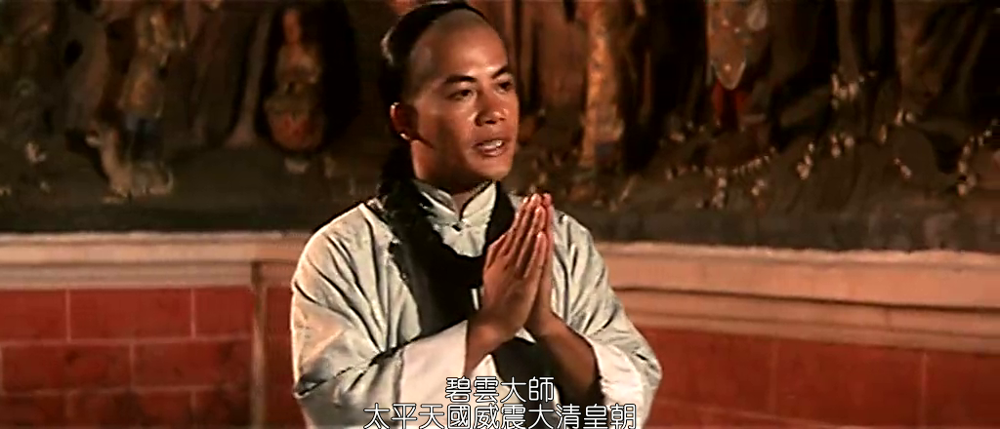

那时的港片流行的作风就是见面就干一架，精彩打斗的同时很容易拎不清谁是好人。
最明显的就是下面这个被掐得变成周杰的男二。跟片子里几乎所有的主要人物都交过手，从来没赢过，基于好人都能打的定律，这就是个十恶不赦的人啊！
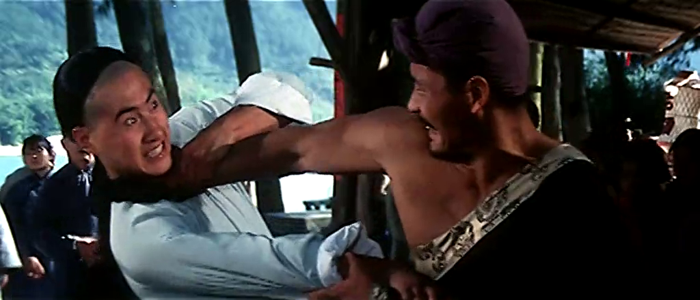

呃，其实也不是分不清。那个年代片子的一个特点是坏人看脸就行。
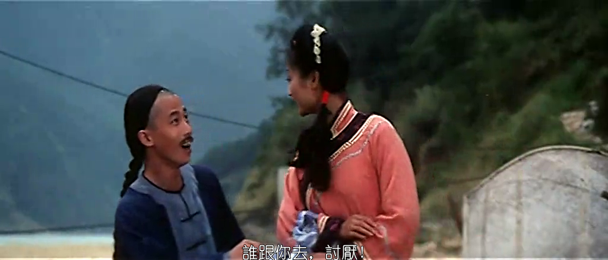
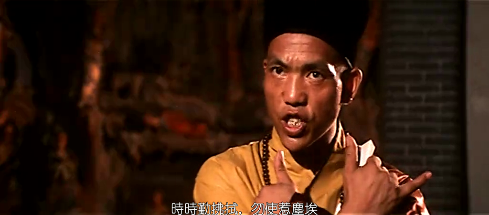
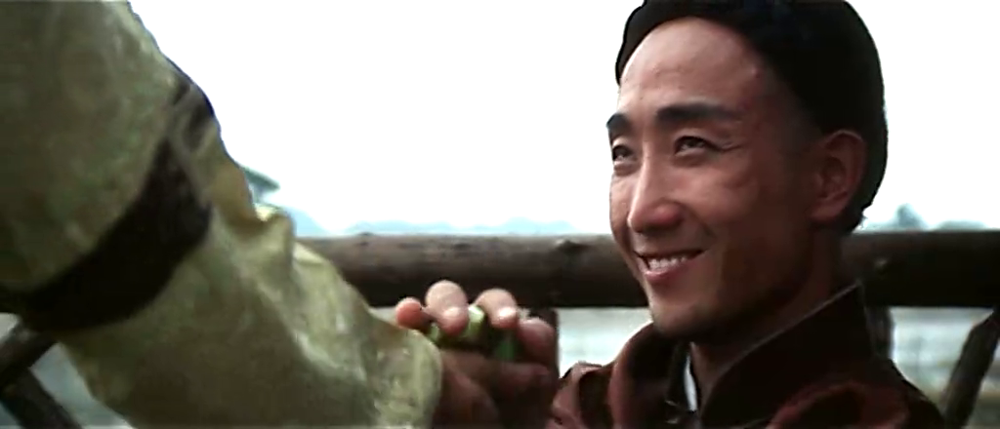

男主角名叫邱建国，是某年的南拳全国冠军，跟李连杰很相似。而且这部代表作的性质也跟少林寺非常类似。加之这位先生英年早逝，所以现在好多怀念的文章说他当时跟李连杰一时瑜亮。
我可以负责地说，绝对是给死人脸上贴金。
武功谁强谁弱不好说，本片是万万比不上少林寺的。单说打斗场面，少林寺里李连杰各种兵器都耍了一遍，花样百出。而本片可能是为了突出“南拳”二字，除了一场用短棍快速解决战斗以外，男主角一直是赤手空拳作战，即使再精彩也会审美疲劳。再加上弱爆了的文戏……
看他出场的台词，真是欠揍啊！
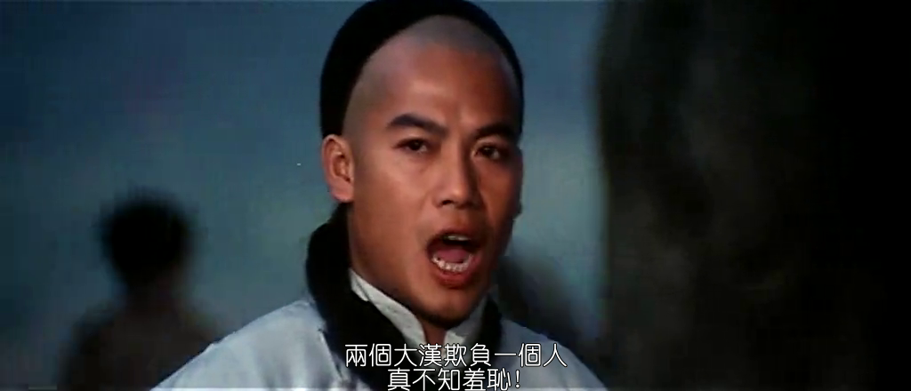
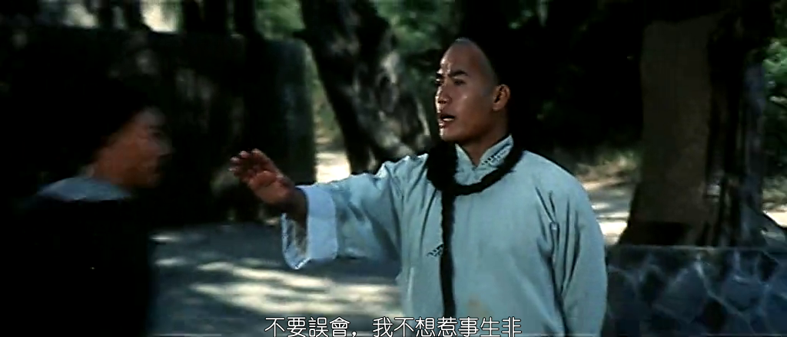

女主非常失败，是彻彻底底的花瓶，给人留下的印象还不如被一枪戳死的独臂大叔深刻。
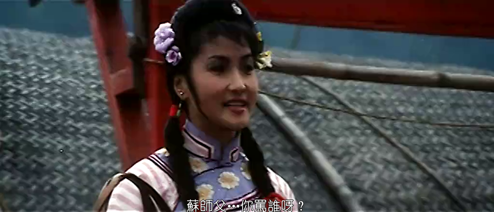
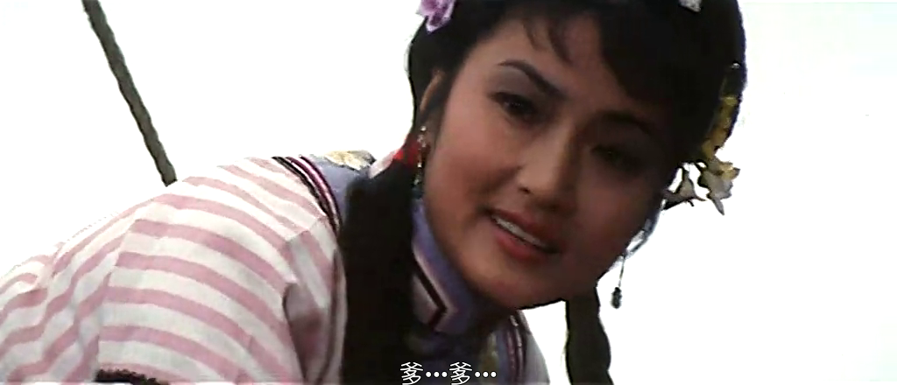
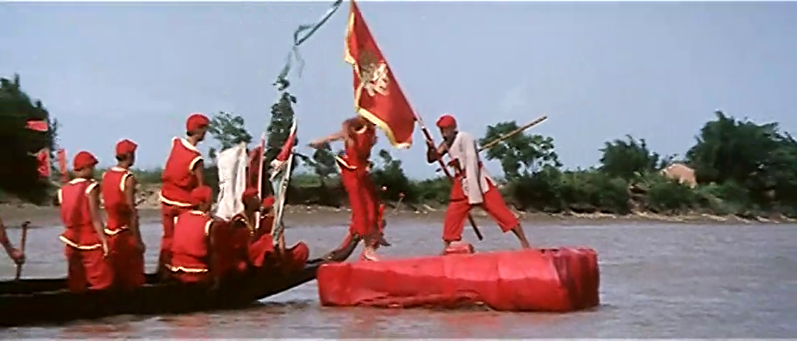

清朝的大官也是被标枪戳死的。之前男猪逃跑的时候还用上了撑杆跳技能，瞬间田径技能好像变得很有用。
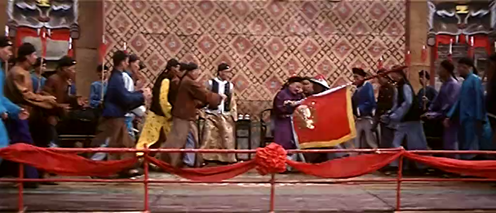

大反派名叫哈尔蚩，是个武功高强的太监。
这个名字小时候总跟说岳里的哈迷蚩记混。
哈尔蚩最厉害的功夫是凌空飞起，绞对手的胳膊，独臂大叔的胳膊就是被绞断的。主人公最后打BOSS之前，独臂大叔特意教了主人公破解的办法——跟着他一起转圈。
考虑到那个年代基本是不吊钢丝的，所以男主角和男反派的武功应该都很厉害。原地起跳转体七百二十度啊！
当然这里有个疑问，为啥哈公公斩草不除根，留了独臂大叔一条命。
下面图一是独臂大叔，傻傻站在原地，所以成了独臂；图二是男猪，跟着一起旋转，所以打赢了。
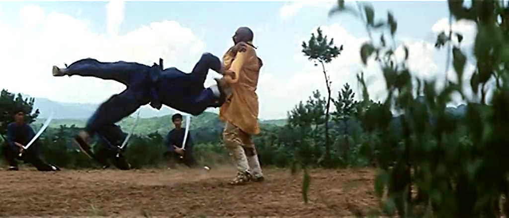
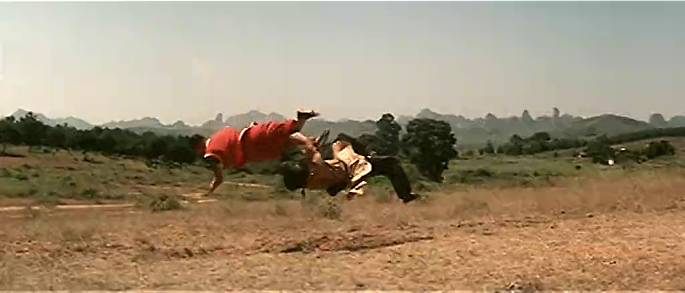

影片的高潮是龙舟争霸。
因为我从来不看什么“龙舟大会”，更是见都没见过真的龙舟，所以本片对我来说就是龙舟的代名词。
我一直觉得后来黄飞鸿系列的狮王争霸模式是借鉴了本片的龙舟争霸模式。
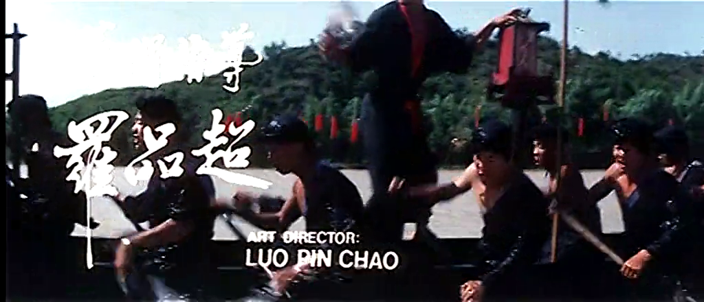
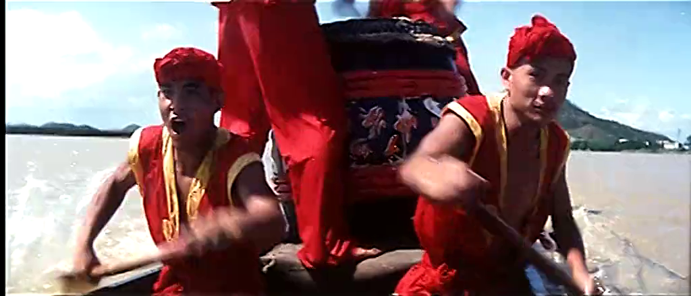
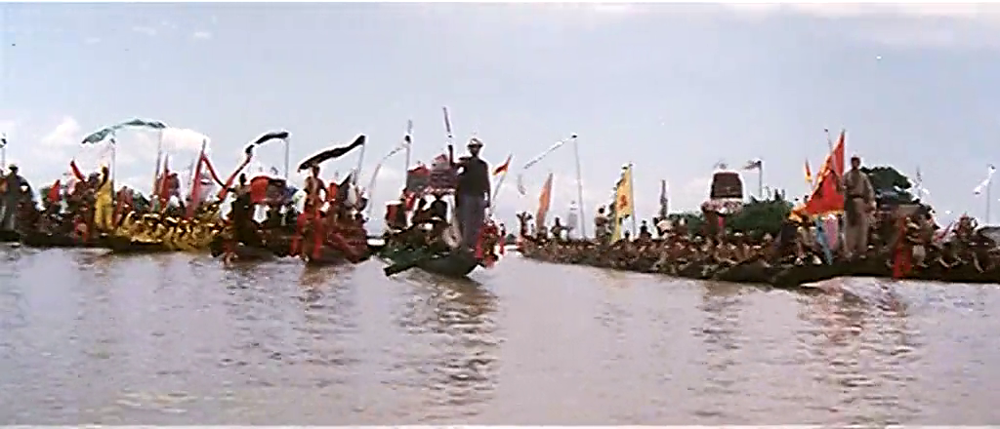

跪死哈尔蚩，geme over。
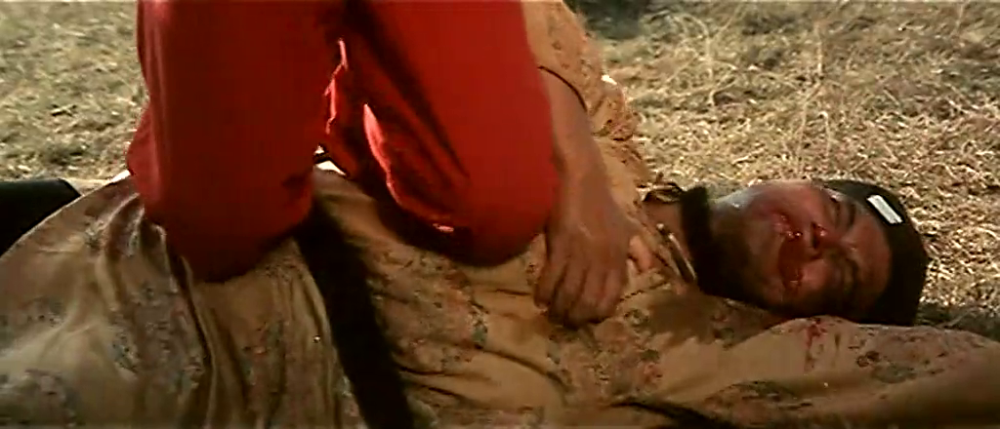