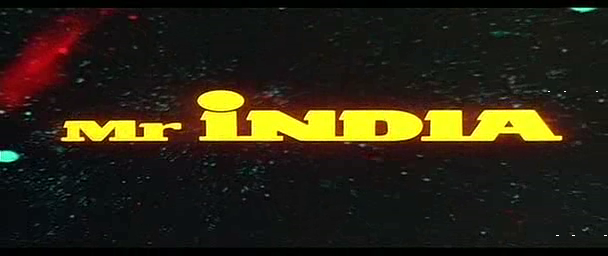
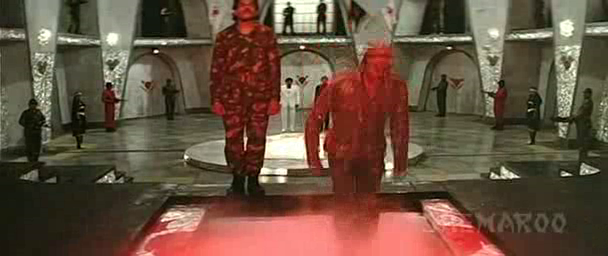
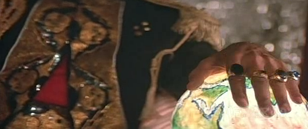
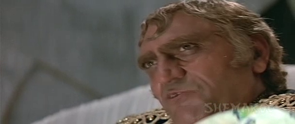
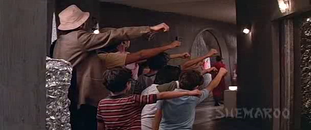
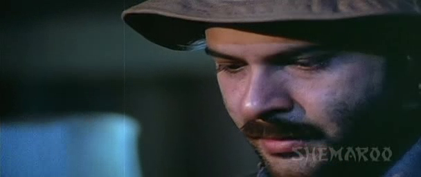
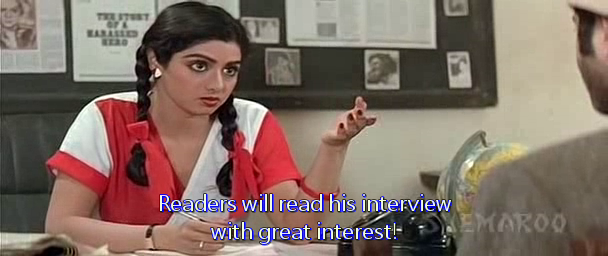
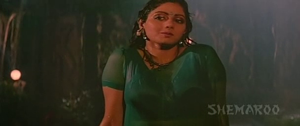
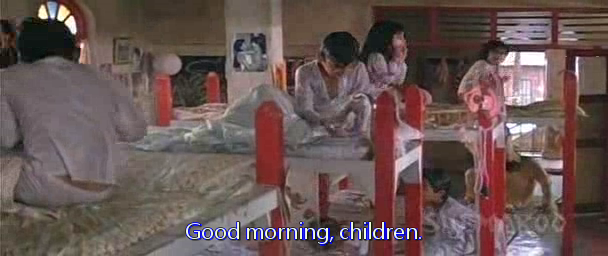

这部片子的出现是个意外。它本不在既定的单子上。

[印度先生](https://pewae.com/gaan/aHR0cHM6Ly9tb3ZpZS5kb3ViYW4uY29tL3N1YmplY3QvMTc3ODczNy8=)

原名：Mr. India导演：谢卡尔·卡普尔主演：Ajit Vachani / Karan Nath / Ramesh Deo / Tapan Shah / Venus Pujari / Yunus Parvez / 亚尼·卡普 / 哈里什·帕特尔 / 安努·卡波尔 / 沙拉蒂·瑟斯纳类型：冒险 / 剧情 / 动作 / 喜剧 / 奇幻 / 歌舞 / 科幻地区：印度首映时间：1987

大约十天以前，我走在下班路上，闻到泡桐花的香甜的气味，联想起小学包场看的电影的一个片段。然而回忆的数据库仿佛盖上了亡灵天幕，铺展不开。可回想不起来又总觉得心里痒痒的，就微信求助场外观众——3P大哥。
*我：“哥，帮我想个咱小学看的电影。89年春天泡桐开花的时候看的，最后BOSS的宫殿里有个酸池子，人掉进去就变成骨头架子了。”
3P：“终结者吧。”
我：“是宫殿不是工厂，而且我也确定不是成龙演的那个。”
3P:“也是。终结者也不是电影院看的。”
我：“我还能记起一句台词‘统统死蛮基’。”
3P：“外国片儿啊。咱们小学包场，一共就看过两部外国片。”
我：“一我能想起来，你直接说二。”
3P：“印度片。印度先生。里面的大BOSS十个手指头上戴满了戒指。主人公有个能隐身的道具。这么有意思的片你怎么就记了个酸池子？”
我：“艹，你一说我想起来了，男主角养了一大帮小孩。”*
然后我们俩就陷入了长时间的冷场。咱哥俩这记性已经到了不是针对谁的程度了，吧？

我记忆里的酸池子。片子一开场，为表现大BOSS的邪恶，他指使两个手下往下跳。

3P记忆里手指头上的戒指。因为拇指上没有戴，所以他记错了。

其实这片子的故事是非常简单的。
男猪的老爹是个科学家，发明里一个能隐身的手镯。
大反派穆甘博先生是个恐怖分子，盯上了这个发明，没抢到就把老爹弄死了。
男猪靠着这个神器道具到处拯救印度并认识了女猪。
大反派绑架了男猪收养的孤儿，威胁他交出神器。
男猪单刀赴会破坏了大反派的基地并neng死了他。
全剧终。

片中男猪带着孩子们行了个恐怖组织的特殊礼节，就被寻山小妖无视了。动作喜剧嘛，剧情简单一点儿也能接受。否则学校怎么能组织小孩去包场看呢（请无视前面俩骷髅头）。

动作喜剧这种形式，为全世界人民所喜闻乐见。成龙在日本是怎么红的，阿兰德隆在中国怎么红的，这个印度先生就是怎么被引进的。不过这个挺帅的胡子男猪在中国人气可不怎么样，几年前在碟中谍里小露了个脸。

印度片的一个好处是不会缺美女。这个女猪非常有名，据说霸占印度影坛影后宝座十数年，拍片量达到300多部，是比武藤老师都勤快的存在！遗憾的是该女子在本片里的扮相略胖。

用的哏也老。印度片总喜欢在电影里进行科普教育，可也不能套个盒子就当高科技啊。说你呢，2016年的王晶先生。

然而就这么个普通的动作喜剧，冗长到了2小时50分钟的地步！印巴片里惯用的插舞蹈行为，本片里达到了令人发指的程度。舞蹈乱入了四次，每次都是10分钟起。所以当年我只记得酸池子及3P记得大戒指这事儿就非常好理解了——那都是在片子开始10分钟的时候出现的镜头。当年的我应该是在20分钟开始跳舞的时候就睡着了——我还一直以为影院处女睡奉献给大决战之辽沈战役了呢。
所以这次重温的过程是非常痛苦的。印式英语跟印地语混搭，配合英文字幕，看完仍觉得脑子晕晕的。国配的“统统死蛮基”的台词，就在记忆的角落里老老实实地待着吧。我知道你存在就好。
