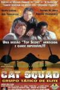

[反恐怖别动队](https://pewae.com/gaan/aHR0cHM6Ly9tb3ZpZS5kb3ViYW4uY29tL3N1YmplY3QvNTA0ODI3OA==)

导演：William Friedkin主演：Jack Youngblood / 乔·柯蒂斯 / 巴里·柯宾 / 帕特丽夏·夏博诺 / 斯蒂夫·詹姆斯类型：剧情 / 动作地区：美国首映时间：1986

没想到这个春节假期，一个“有生之年”的坑被我填上了。
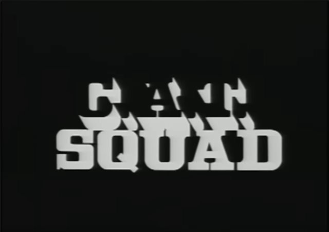

3P哥是我从小玩到大的好朋友，小学时一年里我大概至少会去他家敲门120次。所以对3P哥的父亲宋叔叔，我是很熟悉的。但是宋叔叔的工作单位，我却只去过一次。
不去朋友家长辈的工作单位，听起来挺正常的，但宋叔叔的单位例外——该单位位于3P哥家北侧40米，位于我家西南侧150米。此单位的名称叫做干休所。
我家那块的干休所不知是什么级别的，但总之非常mini就是了。一共只有121、123、125号这3栋楼的范围——没有卫兵，没有围墙，没有篮球场，没有电影院，没有食堂，没有养猪场，没有小护士。活动室1989年以后就没了，一个小医院，一个残疾人福利工厂，仅此而已。干休所三栋楼与旁边普通居民楼只有两点区别：边上一圈楼都是1梯6户，他们1梯3户；边上一圈楼一楼门户大开，他们楼下有铁皮门，门上有五角星，焊的。
那圈楼的老头老太们看着也不像很大的干部（但也许有老红军）。反正就那样子吧。
在我心目中，宋叔叔的干休所工作大概等同于物业工作人员。
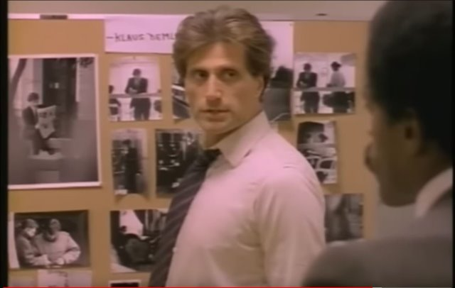

大概是1993年或者1994年吧，终于去了宋叔叔单位一次。某个周末，我去找3P哥，3P哥因为点什么事要去找他爸，就带着我到了后楼，宋叔叔工作的地方。但是宋叔叔并不在办公室，而是在休息室看电视。当时还不理解，为什么不工作也不回家，现在自然是懂的了。
他们父子要办什么事实在是忘了。宋叔叔看到电视上放了一部片子，就说：“这片儿好，等我看完再什么什么的。”
当时我就跟着瞅了两眼，记住了一个很酷的镜头：杀手把枪藏在箱子里，到了楼顶把枪组出来，然后把目标一枪爆头。
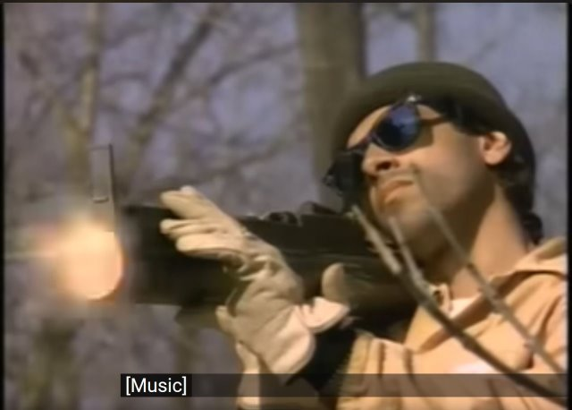

就这么个片子我找了将近30年。在论坛上问：“箱子里面装把枪的电影”回答就只能得到《杀人三步曲》或者《杀手悲歌》。补充说：“不是琴盒是普通手提箱。”，就只能得到“你记错了。”
我倒确实是记错了——盒子里装的不是狙击枪，而是手电筒、胶枪或者射钉枪之类的工具。当反派把这些个工具组成一把枪一样的东东的时候，相信90年代初的电视观众只有一个反应：这也太酷了。
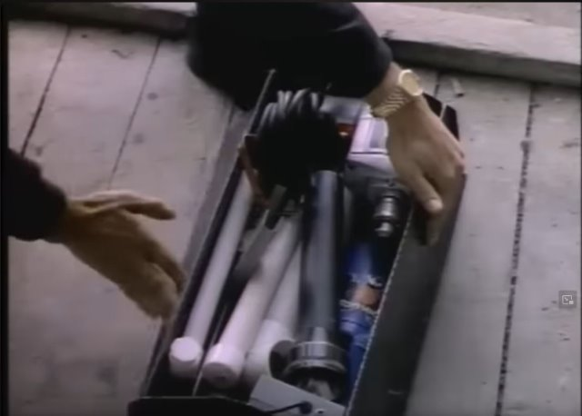
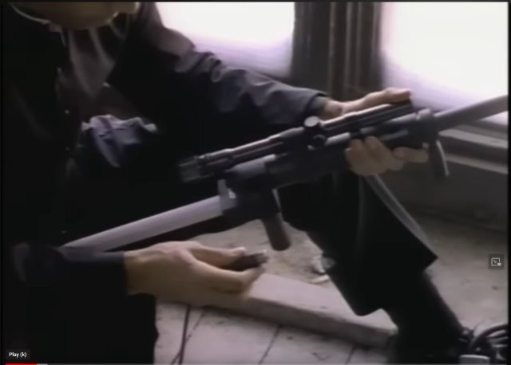

反派不仅有垃圾拼的一把枪，他还有一个箱子里藏了一把乌兹，使劲一甩把手就能拔枪。可惜这枪自始至终也没个用武之地。最终决战还是因为枪出慢了被男主一枪干掉。
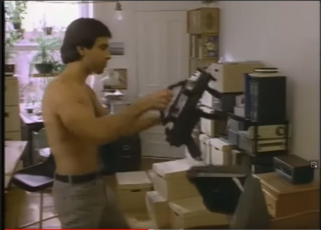
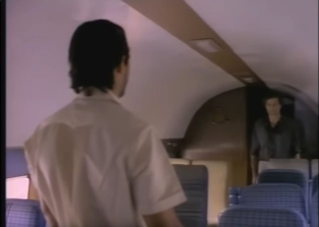

这次找到纯属偶然。本意是找另外一部记忆中的译制片，得到的“译制片列表”与我之前保存的那份有不小的出入。我忽然意识到可能是穷举的来源就不对。然后再一次核对90-95年翻译的片子，搜索可能的片名，终于真相大白了。
这是一部由NBC拍摄于1986年的电视电影，导演是大导演，但演员名气都不大。可能片子在美国的影响力还没有在中国的大。而译制片或者说正大剧场的真正受众，其实是比我年纪要稍微大一些的75前，他们早已不活跃在当今的网络江湖。所以就是问都问不到。
于是也找不到高质量的片源。最后只好在油管上看。
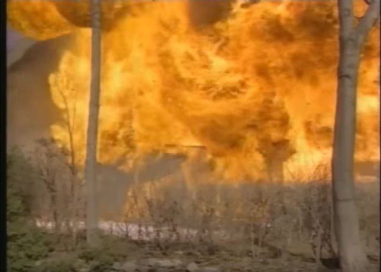

片子本身不太有趣。反派卡洛斯是个杀手，专门暗杀各种老头。擅于变装和使用各种武器。主角团是由大概5个人组成的反恐部门。三个行动者，一个女的负责支援辅助，以及一个一脸衰像的倒霉蛋。因为年代久远，片子的图像质量和声音质量都很差，开油管的AI字幕也跟没开一样，所以我始终也没搞清楚那是一群怎样的老头，以及反派为什么要杀他们。
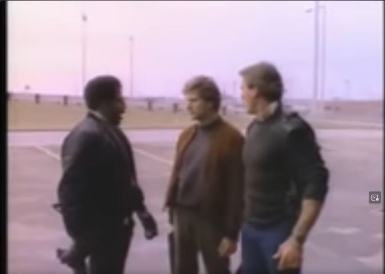

宋叔叔为什么会觉得这片有趣呢？可能是里面的侦破情节吧。
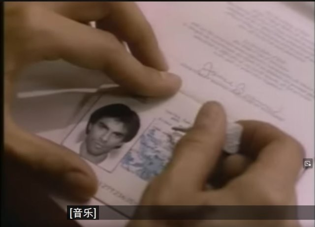
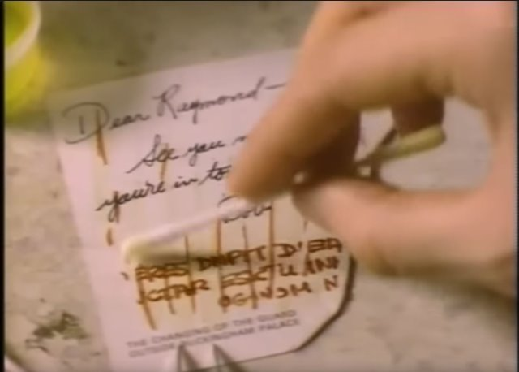

转眼，宋叔叔已经去世20年了。而我们也到了他当时的年纪。