[古今大战秦俑情](https://pewae.com/gaan/aHR0cHM6Ly9tb3ZpZS5kb3ViYW4uY29tL3N1YmplY3QvMTMwMDA4Mi8=)

导演：程小东主演：于荣光 / 吴天明 / 巩俐 / 张艺谋 / 陆树铭类型：冒险 / 古装 / 奇幻 / 爱情地区：大陆 / 香港首映时间：1990

第一次看这片应该是在1990年的深秋，小学组织看的包场。别问学校为什么组织看这种电影，问就是爱国主义教育。
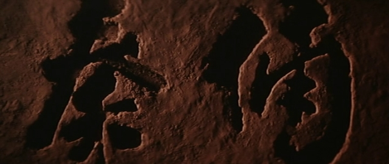

那时内地电影遇到香港电影人来拍合拍片的时候可是政治任务，倾其所有地配合。香港电影大师们也只有在大陆的帮助下才能拍摄出大场面。
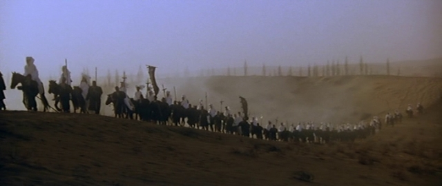

也只有那时的政策才能造就出本片这样的香港幕后+内地演员的神仙组合：
导演兼动作导演程小东，编剧李碧华，男主角张艺谋，女主角巩俐，男二号于荣光，特效导演徐克，剪辑麦子善，摄影鲍德熹，美术奚仲文，服装余家安，音乐顾嘉辉+黄霑，主题歌演唱叶倩文。
连配音都找了上影厂的译制片配音天团（虽然我不知道巩俐张艺谋还要什么配音）。
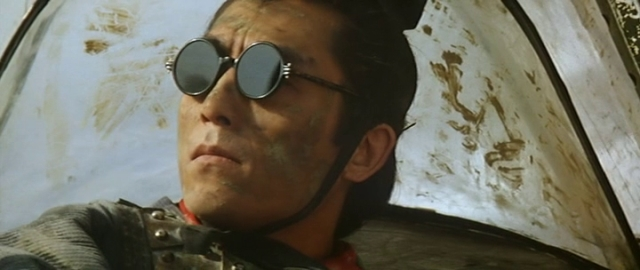
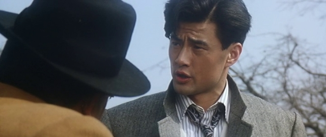

搭戏的还有《百鸟朝凤》、《变脸》的导演吴天明，以及西影厂镇宅之宝陆树铭。没错，这回关二爷演了始皇帝，不细看认不出来。
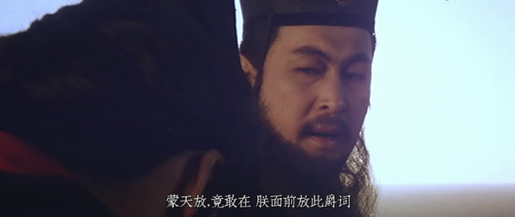

巩俐那时二十四五岁，正值颜值巅峰，窃以为其扮相比几年后的巫行云和秋香还要更美。
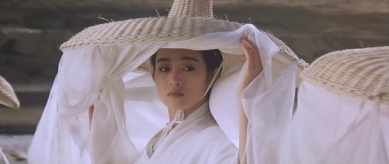

彼时老张和巩皇正奸情炽烈，从眼神里就能看除了俩人有事儿。但是当年这种商业片的尺度还是很小的，巩俐也就露了个背，俩人的激情戏不过两张大头表情照而已。当然也没有教坏被包场的我们。
这片对我来说唯一的不良影响是很长一段时间，我都以为兵马俑就是像电影里演的那样活人外面糊层泥，每具兵马俑里都有一具尸体来着。
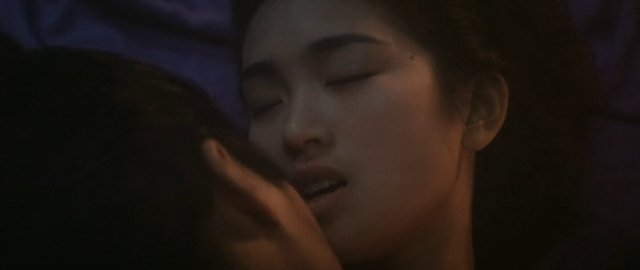

虽然老张和巩皇这对老搭档在，但本片根本不是张艺谋的电影，而是一部地地道道的程小东式商业爽片。也正因为是程小东的电影，所以像什么飞机掉洞里之后能被一个傻逼老娘们开出来这种既不符合逻辑也不符合物理定律的事情根本不重要，只要爽就完了。从片名也能看出，人李碧华的原著明明叫《秦俑》，只有程小东这种人才能起出《古今大战秦俑情》这种听起来就飞在天上的俗烂名字。
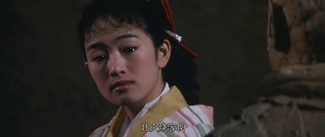

老张是拿过金鸡奖表演奖的人，演技是完全在线的。开始部分有一段两人勾搭，一个在树林里练剑，另一个在边上弹琴的镜头。原来《英雄》里章娘娘那段弯刀舞，其实是老张从程小东那里借鉴来的啊！
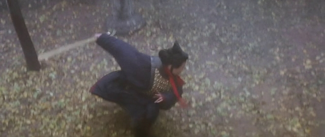

虽然不是看过的第一部穿越电影，却是第一部古代穿现代的片。所以李碧华阿姨所使用的，诸如吹电灯、跟汽车赛跑、撞玻璃之类的老哏，当年的我们还是蛮受用的。更何况我那时还不满十周岁呢。
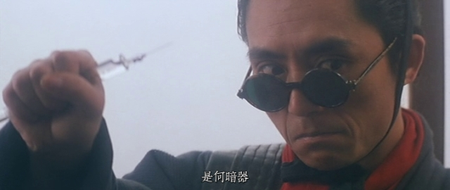

这次重温的高清复刻版，其质量惊到我了。虽然已经过去了30年，但除打斗的音效略渣以外，其余各方面都堪称精良，丝毫不逊于当下八成的动作片。相比类似题材的2005年的《神话》，可以说除了没电脑特效以外，其余各方面均是《古》胜出。即便是特效，我也更加青睐有军队助阵、有战马驰骋的真实镜头。
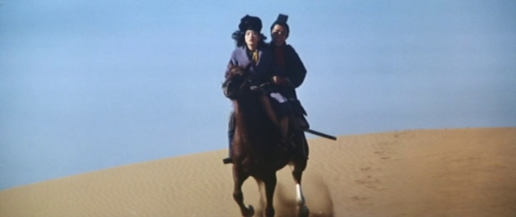

记忆中的镜头一：巩俐回眸一笑，一袭红衣奔向火场，叶倩文“焚身以火让火烧了我”响起。
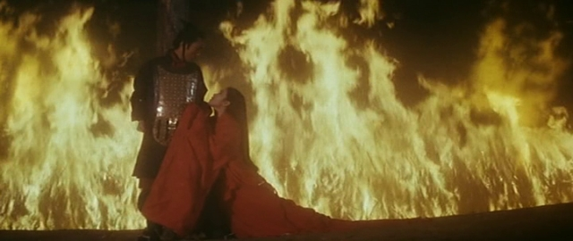
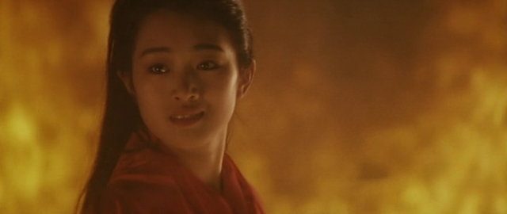
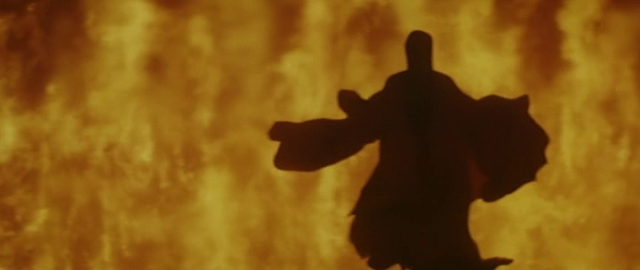

记忆中的镜头二：老谋子窜房追汽车。他夕阳下的奔跑，是我逝去的童年。
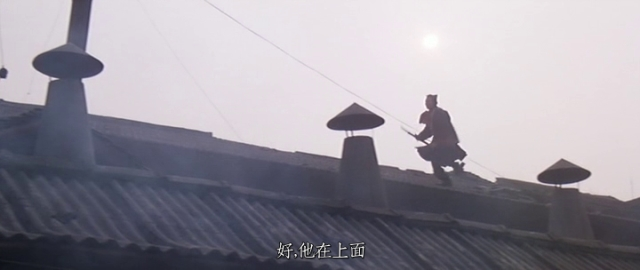