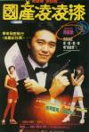

[国产凌凌漆](https://pewae.com/gaan/aHR0cHM6Ly9tb3ZpZS5kb3ViYW4uY29tL3N1YmplY3QvMTMwNzczOS8=)

导演：周星驰 / 李力持主演：于荣光 / 古明华 / 周星驰 / 李健仁 / 李力持 / 罗家英 / 袁咏仪 / 郑祖 / 陈宝莲 / 黄锦江类型：动作 / 喜剧地区：香港首映时间：1994

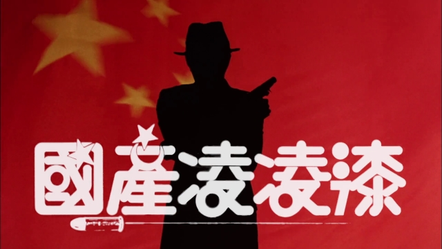

星仔只会迟到，不会缺席。
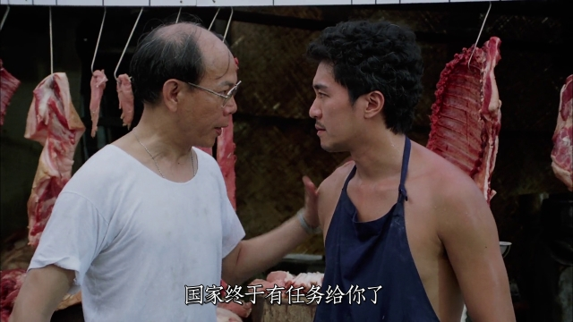

我接触周星驰真的就很晚。虽说我们家[1990年的时候就有了单放机](https://pewae.com/2017/07/memories_of_vhs.html)，但1991-1993，星仔大爆发这几年，我竟然没有看过任何一本周主演的录像！最早接触周星驰是1994年年初寒假，在有线电视的10点档看的《唐伯虎点秋香》。而且当时很奇怪的，《唐》在电视报上的宣传点是巩俐。实际上巩俐始终游离于全片的体系之外，格格不入，是《唐》片里最大的败笔。看完之后我只记得陈百祥的小鸡吃米图和恶搞古龙了。开春之后，家门口电影院《九品芝麻官》的巨幅海报挂了一个月，我也一点儿兴趣都没有。
转过年,1995夏天,[《大话西游》上映](https://pewae.com/2014/10/something-out-of-case-of-dahuaxiyou.html)，以前说过了。
1995年暑假的主题是美洲杯、打麻将和看录像。补了一大堆周星驰电影，91-93年周星驰主演的几部名作全在一个夏天补完，靠着《逃学威龙》和《武状元苏乞儿》刷新了对周先生的认知。
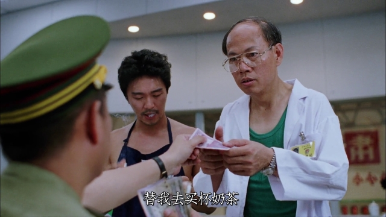

《国产凌凌漆》这部片子，我是在96年初升高的暑假，跟朋友[大胃猴](https://pewae.com/2010/12/big-stomach-monkey.html)一起租录像带看的。大胃猴租带子回来的时候相当兴奋，因为店老板跟他说，这片电视台永远不会放。在2001年以前我还看电视台节目的岁月里，是没见过本片上CCAV6的，至于之后有没有，或者播放的时候删没删，就不是我的认知范围了。以这部片子的尺度，周先生真应该感谢自己活跃在长者的年代。要是换成今天，早被打成劣迹艺人了。尤其现在的年轻人们也许根本不知道周星驰是97之后根本没打算留香港，计划移民加拿大来的，因为跟黑社会有牵连加拿大不准他移民，才被迫继续留港而已。
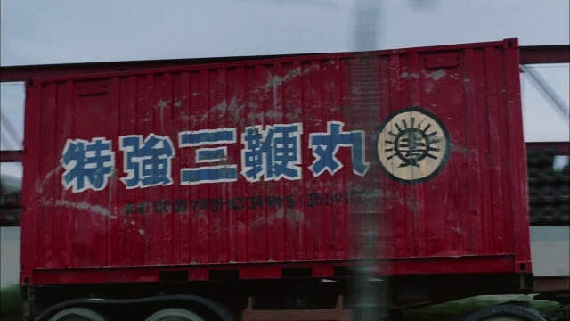

本片从头至尾充斥着对于大陆的嘲讽：凌凌漆和李香琴的两极化出身论；部队干部之间的互相倾轧；以权走私；行贿100块钱买一条命；近乎于傻逼的科研系统……要说黑得最漂亮的，还得是下面这个深圳的海报。
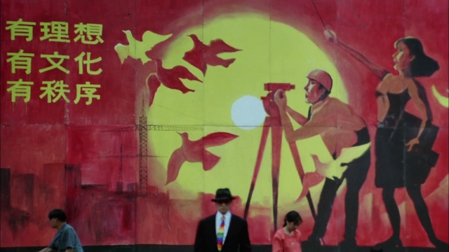

我心目中的“周星驰电影”是个狭义的概念。只有周星驰【主导创作】并且周星驰【主演】的，才能叫周星驰电影，二者缺一不可。像《九品芝麻官》、《鹿鼎记》是王晶电影，《审死官》、《济公》是杜琪峰电影，《逃学威龙》、《武状元苏乞儿》则是陈嘉上电影（虽然陈嘉上没什么个人特色）。虽然周星驰的名字出现在导演栏上是从《国产凌凌漆》开始的。但我们现在已经知道《唐伯虎点秋香》和《破环之王》已经是由周来统筹全局的，“李力持是执行导演啦”[[1]](https://pewae.com/2021/05/review-from-beijing-with-love.html#inner_anchor_1)。
作为特例的是借BBS文化咸鱼翻身的《大话西游》。这部戏的导演刘镇伟虽然名气很大，可周星驰是投资人啊！难道老板说要加戏改戏，你葡萄作为一个打工人敢说个不字？我的个人感觉，上集的《月光宝盒》刘镇伟的风格更强一些，而下集的《仙履奇缘》周星驰味儿更多一点。
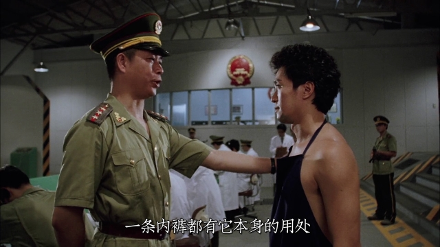

周先生主导创作的角色要么是农民工、捡破烂的、跑堂的、小混混、猪肉佬这种社会的底层，要么是9527到唐伯虎、至尊宝到孙悟空、食神到破产食神这种身份的转化。由是，周星驰电影总是有一种压抑的情绪，而且随着年龄的增长越来越压抑，这就是我并不十分推崇他的原因。
我是个低级趣味的嘛，所以我更青睐王晶的屎尿屁。宁可看5遍电影频道放烂了的《九品芝麻官》，也不愿意看一遍深刻有内涵的《喜剧之王》。
不过本片里出现的色情杂志那块儿就很王晶嘛。搜了一堆资料，确定这位是拍片那个年代正当红的日本艺术家朝岡実嶺，不细看确实容易当成林青霞。
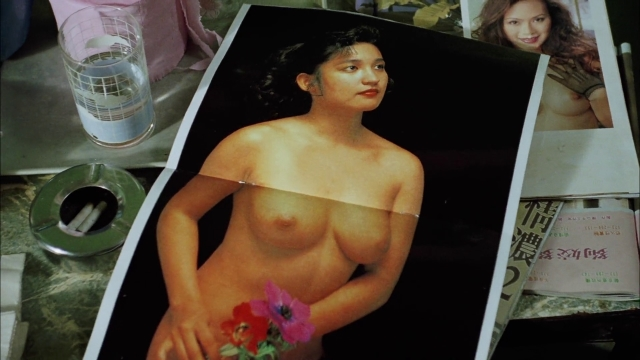

说说工具人李力持。2001年的《少林足球》，周星驰可能是预感到自己要得劳模奖了，忽然开始在导演栏上只署了自己一个名字，而李力持也首次变成了“执行导演”。该片一举收获最佳影片最佳导演最佳男主，这引起了李力持的强烈不满，从那以后就没再给周星驰打过工。所以后面的《功夫》周同学还能再次雄起，我是相当佩服他的心理承受能力的。
离开周星驰的李力持能拿得出手的作品很少。有点名气的只能想起来《十兄弟》和《铁拳无敌孙中山》而已。他倒是个不错的喜剧演员，《大内密探零零发》里鼻毛外放的那谁和本片里的铁腿水上漂给人留下的印象都挺深。“哈哈哈哈，苦练三十年，今天终于派上用场。想杀我铁腿水上漂，哪有这么简单？”然后被一发RPG轰碎了。
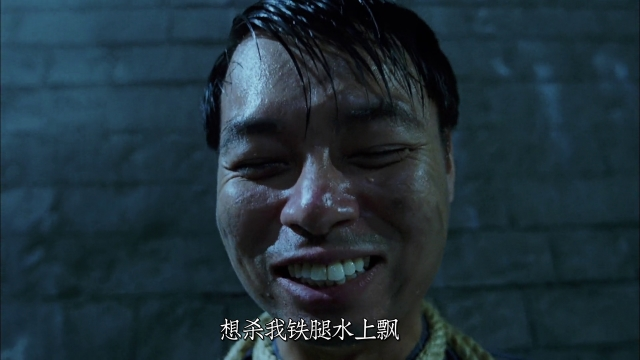

本片最大的特色是对007系列的解构和重组。周星驰以他的视角向詹姆斯邦德致敬。玩得好就叫致敬，玩得不好就叫抄袭。香港电影这两者的区分也不大，全世界范围抄007的也多了去了。周星驰这次干得相当漂亮。主线故事没有大瑕疵，爆破枪战靓女阴谋一样不少，可以说相当难得。
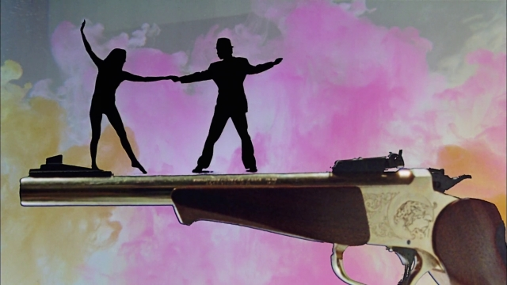

说到靓女就不能不再次提到靓靓袁咏仪了。这可是我心目中排名第二的短发女神。她跟后来的周迅、周冬雨一样，是老天爷赏饭吃的天才演员。女主角的性格前后变化很大，演起来应该蛮不容易的。开始时是面无表情的工具人，到后来因为身世问题的愤恨，再后来被周星驰所打动，微表情的表现非常到位。
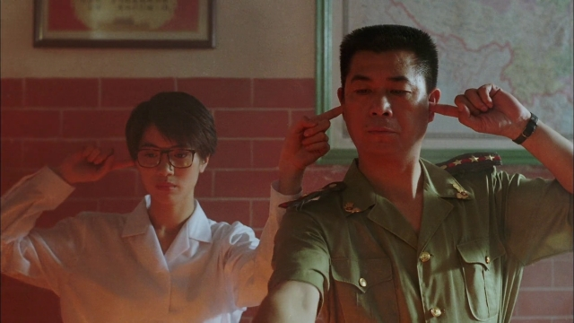
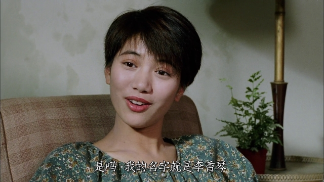
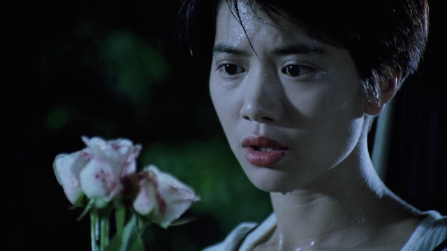
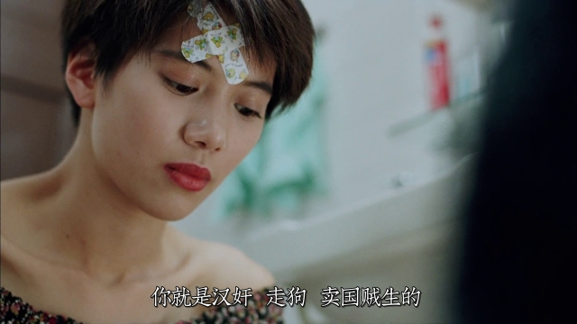
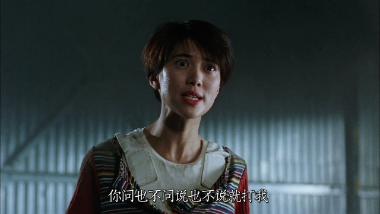

如果一部电影能有一处剧情令人印象深刻，就可称得上佳作了，本片却至少有三处。
其一是周星驰一身华服，自弹自唱《李香兰》。这段是我记忆中电影插曲最恰如其分的一次嵌入。
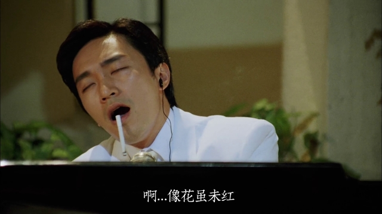

其二是周显露飞刀本事，电梯杀劫匪一段。周星驰看向救孩子的父亲那里，眼神绝了。
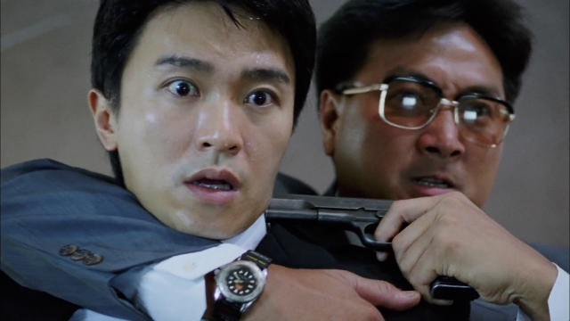

最后就是周星驰交任务被司令陷害要枪决的那段了。实在是华语电影值得铭记的名场面。黄一飞演的被冤枉的偷看机密的瞎子[[2]](https://pewae.com/2021/05/review-from-beijing-with-love.html#inner_anchor_2)被一枪崩了；两个家里有权的公子哥照样被严打还被鞭尸；一身武功的李力持被轰成了渣。主角最终脱困是用一个极其别扭的姿势奉上了百元大钞。有一说一，1994年的100块钱，没那么值钱。这段说明了啥？第一是有钱才有一切；第二是出了事别瞎BB，躺平起码还能留个全尸。
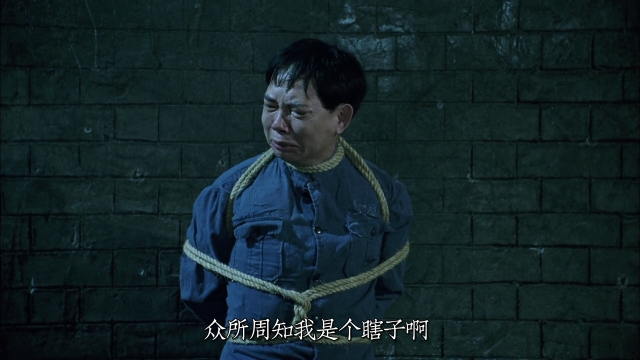
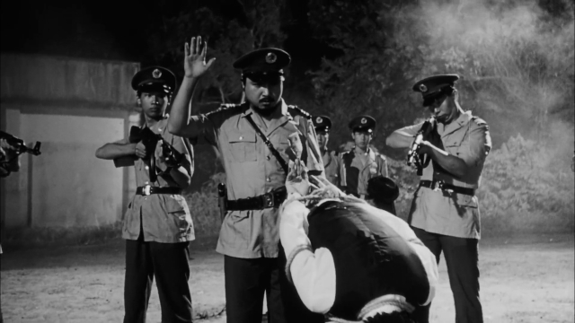

来看看配角们。
北方的司令被害以后，来了一男一女两个同党为他报仇。其中爱美神的扮演者是陈宝莲。2002年陈死的时候满大街都在卖陈宝莲6CD合集“陈宝莲的一生”。陈宝莲吧，长相一副小三样，当不起女主；身材马马虎虎也就那样，所以主演的三级片也没什么爆款。本片是陈宝莲参与的影片里票房最高的。按说演本片的时候陈宝莲只有21岁，正是好时候，可从特写镜头上看已经尽显老态。如果有人想深入研究陈宝莲的话，给你们推荐一部《剑奴》。
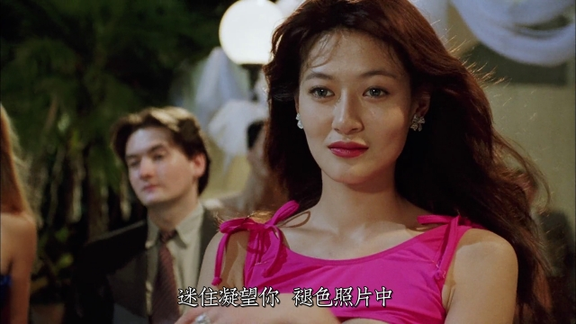

片子开头客串零零义的是于荣光。他当年是签了香港公司吧，真没少在港片里出现。本片里身手挺帅的，但衣服土掉渣。
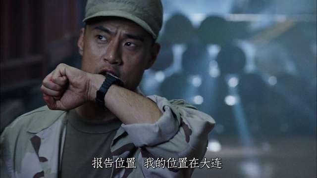

片中名字很不雅的罗家英。
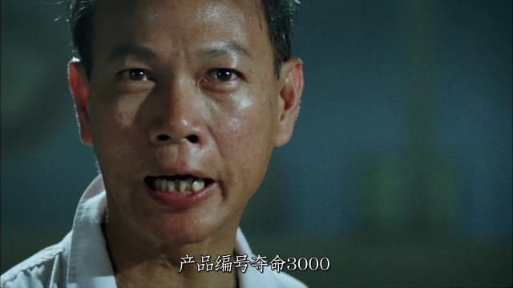

客串的李健仁。周星驰专用的三翻四抖小工具。
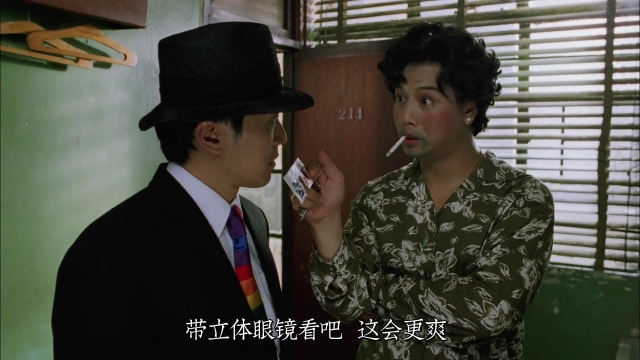

记忆中的镜头一：
小平赠。
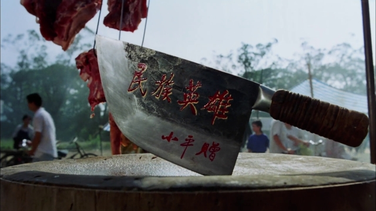

记忆中的镜头二：
老汉推车。
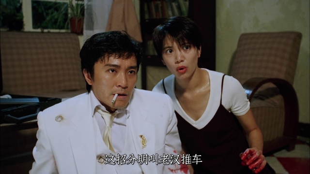

附：我心中的周星驰作品排名
1.《国产凌凌漆》
2.《功夫》
3.《喜剧之王》
4.《食神》
5.《唐伯虎点秋香》
6.《长江7号》
7.《大内密探零零发》
8.《大话西游之仙履奇缘》
9.《破坏之王》
10.《少林足球》

---

- [(1)](https://pewae.com/2021/05/review-from-beijing-with-love.html#inner_ref_1)：郑佩佩上金星的节目时如此说
- [(2)](https://pewae.com/2021/05/review-from-beijing-with-love.html#inner_ref_2)：此处国语版与粤语版不同。粤语版是瞎子，国语版改成了文盲。