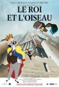

[国王与小鸟](https://pewae.com/gaan/aHR0cHM6Ly9tb3ZpZS5kb3ViYW4uY29tL3N1YmplY3QvMTMwODM2Ng==)

原名：The King and the Mockingbird导演：保罗·格里莫尔主演：于贝尔·德尚 / 克洛德·皮埃普吕 / 勒诺·马克斯 / 帕斯卡尔·马佐蒂 / 罗热·布兰 / 菲利普·德雷 / 让·马丹 / 阿尔贝·梅迪纳 / 阿涅斯·维亚拉 / 雷蒙·比西埃尔类型：动画 / 奇幻地区：法国首映时间：1980

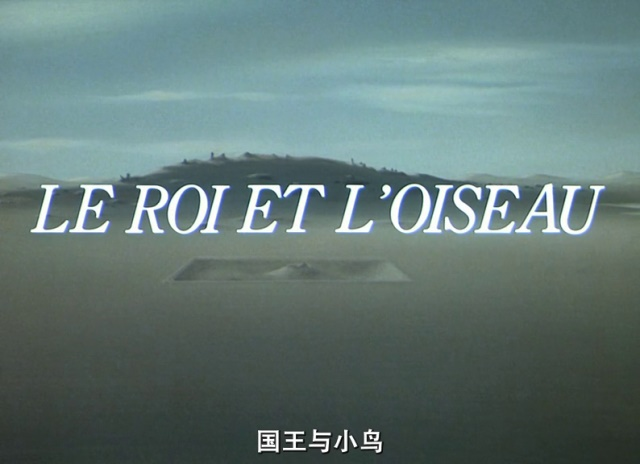

历史上不存在的那一年，一个春寒料峭的星期天，我跟3P哥在外面跑了半个下午，有点儿发烧，就回家了。我妈没怎么管我，我便没精打采躺在床上有一搭没一搭地看电视。本来迷迷糊糊的，看到传送带那段的时候忽然被一个激灵吓坐了起来，然后就一直看到了结束。
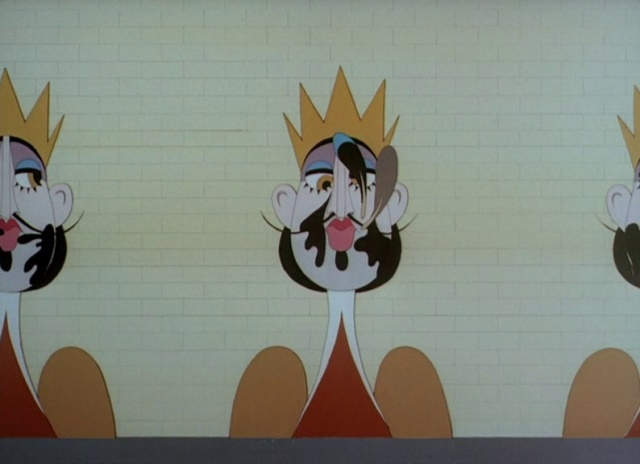

2001年暑假，我拥有了自己的PC。当时就很想把电脑当VCD来用。自己仰慕已久却没看过，或者看了还想再温习的作品，像什么《满清****》啊，《玉**之****》啊，《*肉**包》啊，《**奇谭》啊，《**侠》啊，《**神探》啊，《不***的女孩》啊，什么叫徐*瑄啊，杨*敏啊，**爱啊，高树***啊，都想统统刷一遍。bt虽然已经兴起，但通过拨号上网的方式下片，我妈非把我打死不可。那时电脑城流行买压缩盘——主要是港片、好莱坞大片和美日韩港台剧，甚至MTV、演唱会、台综韩综百家讲坛都有得卖。国配动画片这种东西就长尾得很了。倒是VCD、DVD市场正火爆。跑了几个市场，终于在一个卖译制片的货架上找到了本片。这是本人购买的第二张DVD，也是最后一张。
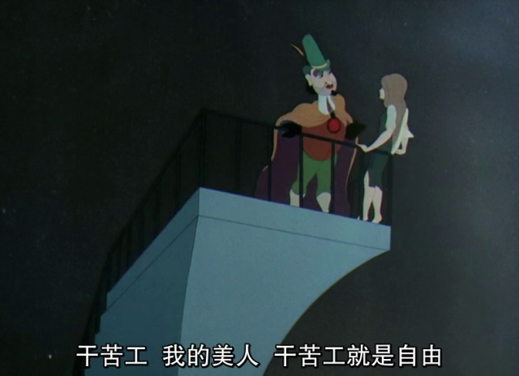

上译版实在是太舒服了，甚至比法语原片还要棒。
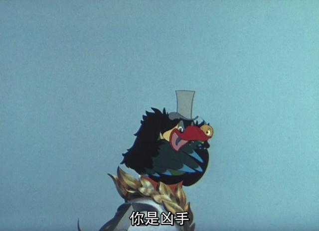

本部动画改编自安徒生童话《牧羊女和扫烟囱的人》。原著很短，两页就没了。对主角几乎毫无印象，只记得文章嘲讽了一个傻逼中国老头。在本片中中国老头仍旧是塑像，不过被假国王给干碎了，不知出于何种顾虑，身上并没有明显的中国特征。
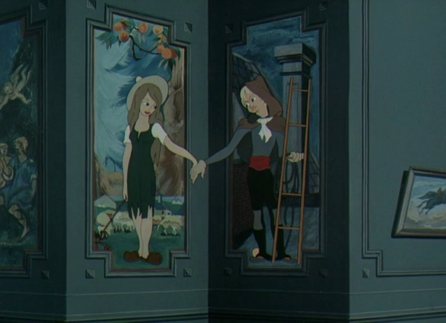
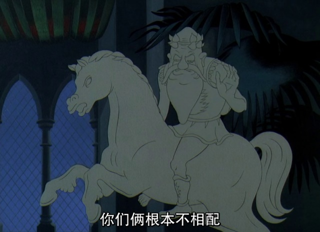

本部作品的核心是假国王，也就是“第五加三等于第八，八加八等于十六国王陛下”的画像。这名字一看就是法国人为了嘲讽美国国父路易十六的。真国王出场没多久就被假国王neng死了，二者的区别是真国王带着皇冠，而假国王带的是绿帽子。
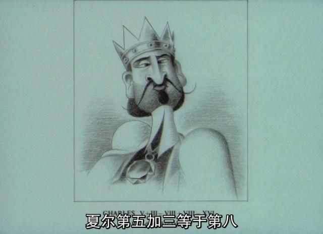
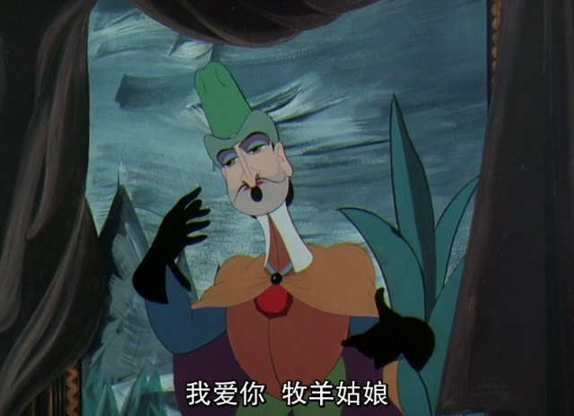
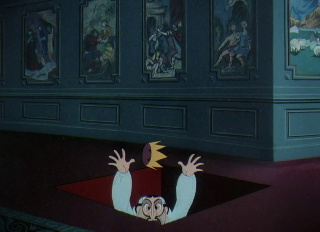

片子的前半部分假国王台词很少，完全是用动作和神态勾勒出了一个附庸风雅的小人，非常之厉害。下面这个镜头，国王对着被鸽子覆盖的雕像大加赞美，怀疑就是骂路易十六资助美国，以至于羡慕美国的自由女神像。
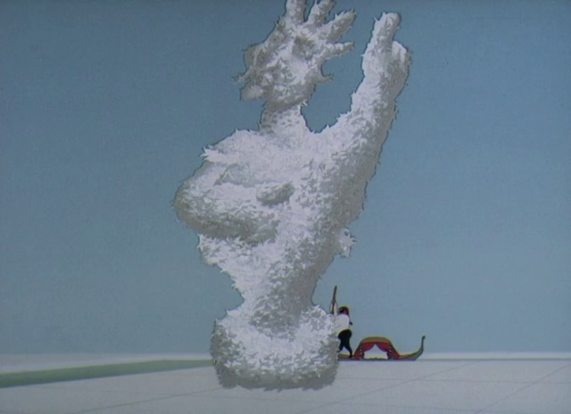

其实小时候并没有看出多少嘲讽，几次重温才咂摸出那么点味儿来。比如小鸟动员底层的狮子老虎时，理由并不是要拯救恋爱中的狗男女，也不说是自己要救孩子的私心，而是说国王抓走的牧羊女是为狮子老虎牧羊的，牧羊女没了，羊就没了。但是小鸟就是个大忽悠，全片从始至终都没出现过一根羊毛。
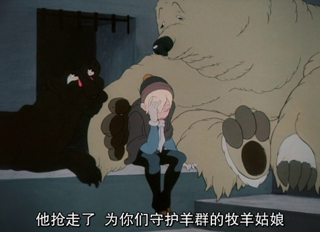

现在有人把这种崇尚机械的风格叫做赛博朋克。所以若干年后某某的巨人出场的时候，那可是一点儿也不震撼啊！
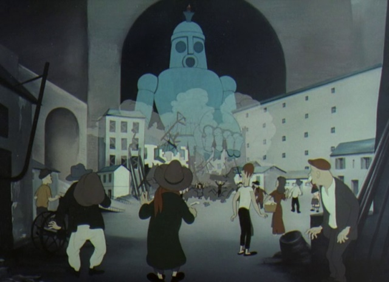
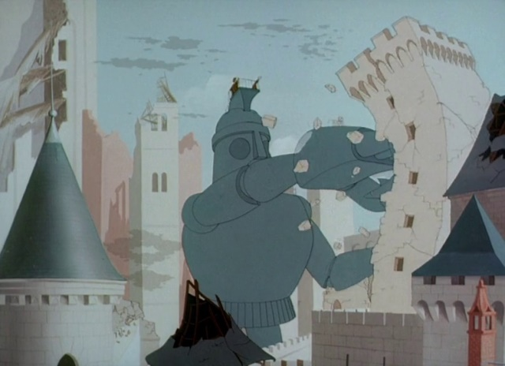

说起这宫殿。其实小时候并没有什么对国王盖个278层的宫殿有什么反感，反倒想的是“彼可取而代之……”
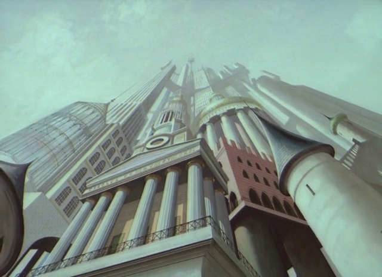

最先加入反国王队伍的人类是个瞎子，他一直向往着阳光和小鸟，仿佛这些真的跟他有关系一样。这就好有一比啊，一群掏粪男孩的粉丝里混进一个周云蓬。
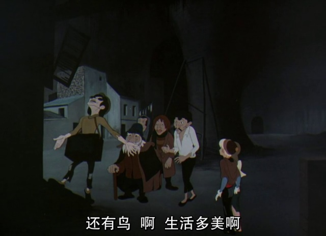

记忆中的镜头：狮子老虎什么的都走上街头。
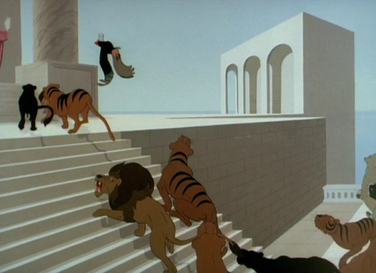