[大丈夫日记](https://pewae.com/gaan/aHR0cHM6Ly9tb3ZpZS5kb3ViYW4uY29tL3N1YmplY3QvMTI5NTY3NS8=)

导演：楚原主演：叶倩文 / 吴家丽 / 周润发 / 太保 / 成奎安 / 李子雄 / 王祖贤 / 胡大为 / 郑则仕 / 金燕玲类型：喜剧 / 爱情地区：香港首映时间：1988

又是一部来自录像带时期的美好回忆。那是在1993年的小升初暑假。
应该是个周六。我爸妈都上班，表姐单位团建，海边活动就把我带上了。下午三点多活动结束，中巴把我扔在合适的公交车站，我就自己坐车回家了。
到家之后发现没带钥匙，我就毫不犹豫地坐一站车去了奶奶家——虽然当时姥姥家离的更近一些，不到一站。
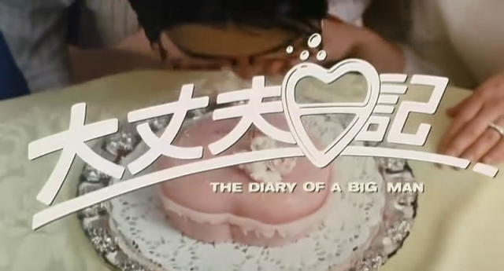

傍晚七点多，老妈气急败坏地来找我，劈头盖脸就是一顿骂。当然她在我奶奶面前不能太过分，只是反复强调：“没拿钥匙，为什么不去离得更近的姥姥家？”
她表面上强调是离得近，其实想谴责的是我跟姥姥及大舅不亲。
我跟我奶奶也没多亲啊。所谓亲疏远近的概念完全是不存在的。奶奶跟二姑住一起，二姑父给表妹买了游戏机，我跟游戏机更亲，仅此而已。

但是我找的理由无懈可击：“我从海里出来浑身是咸的，大舅家小平房旱厕根本没法冲澡，奶奶家好歹有单独的厕所和热水器啊！”
老妈根本没想到这一点，以至于无言以对。只好说：“我在厂里跟人换了两盘带子，明天自己回家看。”摔门走了。
于是这两盘带的印象都很深。其中之一就是这部《大丈夫日记》，另一部以后有合适的机会再说。
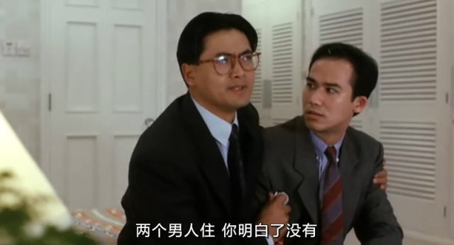

本片的出品方是电影工作室，徐老怪挂名监制。据说发哥自己有投资。故事特简单，就是一个男人周旋于两个老婆之间，疲于应付，产生误会最后大团圆。典型的三段式结构。作为喜剧，哏也没太新鲜的。倒是拍摄和剪接手法非常纯熟。
这片最后的结局被现在女权们抓住的话，估计徐老怪的公司得被查封——太男权了，周入了阿拉伯籍，一男二女就那么没羞没臊地一块过了。
一个特色是演员们片中的名字都跟本名很像：周润发——周定发，王祖贤——祖儿，叶倩文——莎莉，李子雄——志雄，吴家丽——家丽，郑则仕——郑警官。
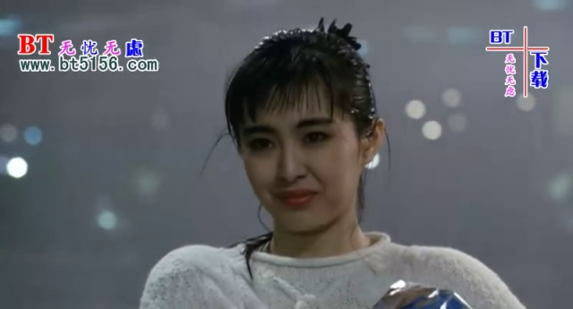

上次[写大傻的时候说过的](https://pewae.com/2016/08/review_jing_zhuang_qing_bu_zi_jin.html)，我心目中的最佳恶人是李子雄。
香港电影界的四大恶人，一般指的是大咪，大傻，丧标和基哥，以及候补的B哥，很少有人算上李子雄。
可能是因为跟那些恶行恶像的歪瓜劣枣不同，李君相貌周正浓眉大眼，从来也不曾张扬地坏过。他所演的坏人只是骨子里的阴，往往会道貌岸然地中途叛变主角，所以他又有“香港电影第一反骨仔”的美名。
据说其演艺生涯只演过七次好人，比上面的五大恶人都要少。对我来说尤其如是，本片是我唯一一次见李子雄演好人。
李子雄演的是发哥的好朋友，发哥需要欺瞒其中一个老婆的时候用来当另一个老婆男朋友的工具人，被发哥反复利用，半夜救场搞到神经衰弱也不离不弃。演的只能说中规中矩吧，李君不仅好人演得少，喜剧也演得不多。
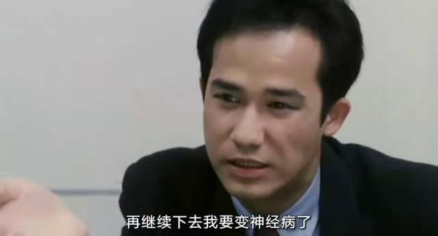

这是我看过的王祖贤演得最自如的一部片子，全面压制了叶倩文，略胜发哥。“手如柔荑，肤如凝脂，领如蝤蛴，齿如瓠犀，螓首娥眉，巧笑倩兮，美目盼兮”我觉得这些美好的形容词都是因为王祖贤定制的。
什么叫老天爷赏饭吃，这就是。
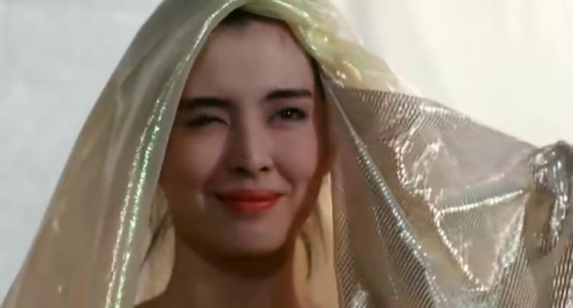

周润发演过很多喜剧片，成功的不多，反正给我的感觉是不够亲切。作为当时的天皇巨星，本片当中发哥表现可以说是非常卖力，扮丑、扮GAY、挨揍也都做了，但始终有那么点“紧绷”的感觉。就说这倒霉汉奸头造型吧，跟他的经典形象虽然相差不大，却贱贱的非常像曹查理。
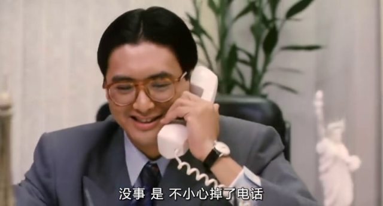

莎莉姐要更僵一些。而且可能得罪了造型师，完全没表现出自己的好身材。
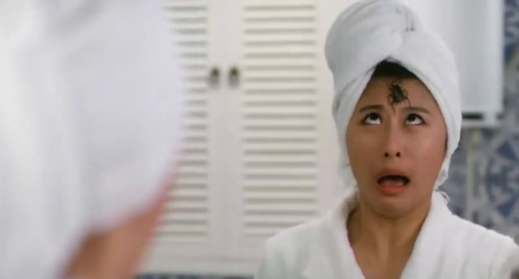

电影中的高潮是两女识破周润发而合伙对其报复。但这里除了几人飚戏过瘾外，并无太多笑点。最搞笑的几次都是对自己的官方吐槽：周润发说自己得奖全是内定；周润发说王祖贤个太高胸太平，像荷包蛋，肥猫在一边补刀说还是凉透的；以及吴家丽问许文强是怎么死的，周回答：“被乱枪砰砰砰砰打死的。”
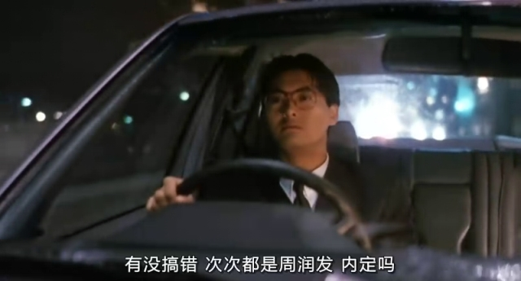
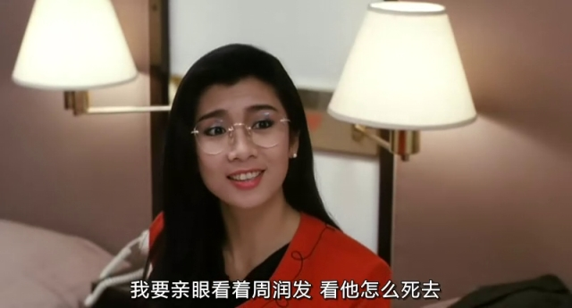
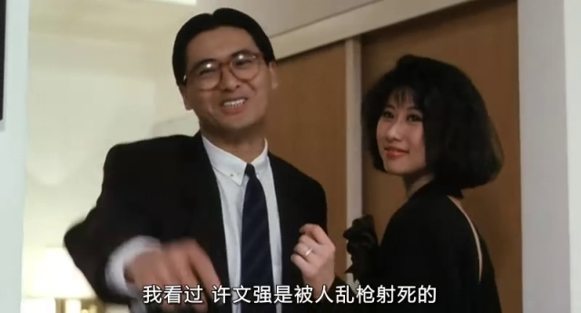

本片在当年的金像奖评选中还得了最佳原创歌曲的提名。这歌是典型的黄霑风格，癫狂搞笑，混杂了粤语和闽南话。主唱是周润发，和音叶倩文，连王祖贤这位音痴级别的选手也有参与。这段从片中单抻出来当MV看还蛮有趣，放在整部片子里略有不搭。
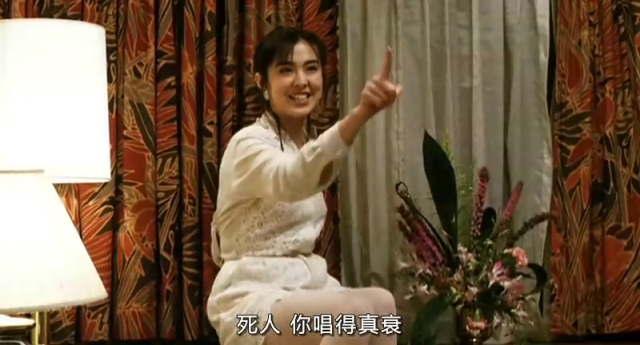

临近结束的时候，莎莉和祖儿被绑架。其中的绑匪乙简直意外惊喜：在2020年5月刚刚荣膺金像奖最佳男主角的太保先生。只有一句台词，怪叫了一声，充其量只能算个特约。30多年过去才熬出头，实在是令人唏嘘。
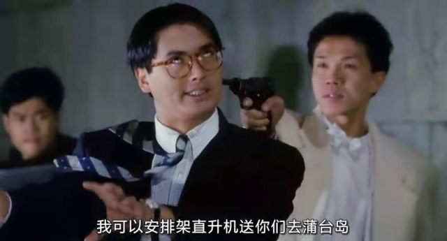

记忆中的镜头之一：周伯伯在眼皮上画眼睛的时候，郝劭文还没出生。
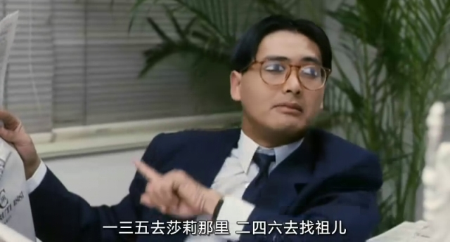

记忆中的镜头之二：IQ博士来啦！
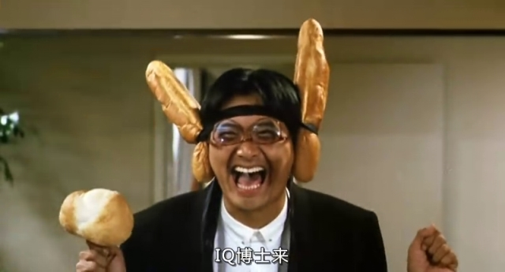