冯小宁是个毁誉参半的导演。能拍出《紫日》、《战争子午线》这样深邃的作品，也能拍《超级台风》、《举起手来2》这样的超级烂片。
早年这片在AV总重播，看过五六遍吧，剧情熟得很。
这是部国内少见的环保题材的科幻片或者说灾难片——一个小孩忽然发现自己能听懂动物说话，然后配合动物和路人拯救大气层的故事。有人说，这是大陆迄今为止最好的科幻片。这种说法挺靠谱。因为国内的科幻题材作品实在是太少了。

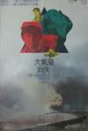

[大气层消失](https://pewae.com/gaan/aHR0cHM6Ly9tb3ZpZS5kb3ViYW4uY29tL3N1YmplY3QvMTUyODg0OC8=)

导演：冯小宁主演：吕丽萍 / 吴京安 / 张京生 / 张宁 / 王咏歌类型：儿童 / 科幻地区：大陆首映时间：1990

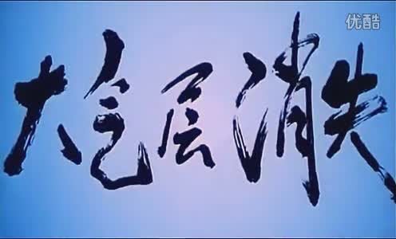

冯小宁电影的一个特色是喜欢下猛力，把劲用到死。从片子一开始，人类就处处站在自然的对立面。森林火灾、最后一只东北虎、不信任人的狗、被砍伐的森林、找不到一片好水的鱼……好听的说法叫深刻，不好听的叫刻意。但无疑这部片子会给小孩们一个关于环保的深刻印象。
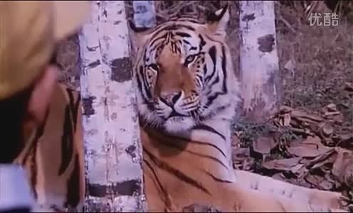

片头是一帮小孩在嘻嘻哈哈地用放大镜烧蚂蚁。这事儿我小时候也经常玩，而且至今也不觉得这跟环保有什么关系。
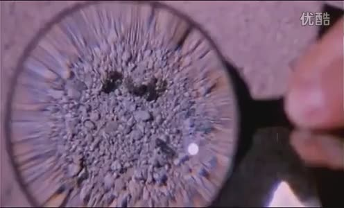

不过偷伐山林的人把有毒物品罐车当成油罐车，拿着桶去偷油打开了阀门这个设定我很喜欢，很合理。
不少人对于这片子最深刻的一个镜头出现在片子最后——吕丽萍烧车未遂，小主角拿起火把想去烧，狗窜出来叼走火把，冲向装着化学品的车皮。
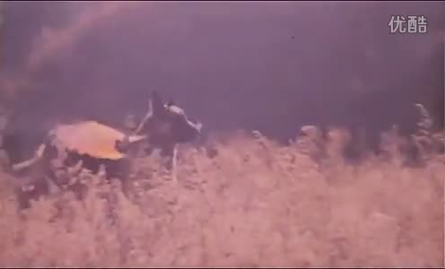

另外一些人（包括我）印象最深的镜头：主角从一条快干的河里救了一条鱼，死命地跑向下一条河，结果那条河里全是污水。
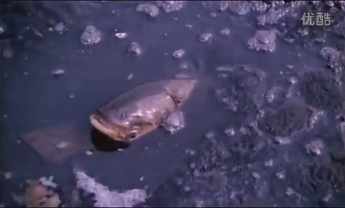
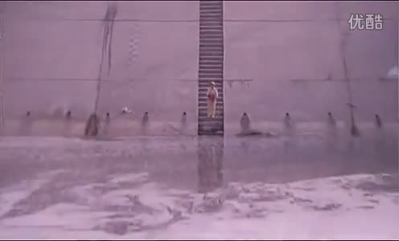

黑熊有句很渗人的台词：“谁也跑不掉，太阳会杀死所有的生命，哈哈哈哈哈哈！”
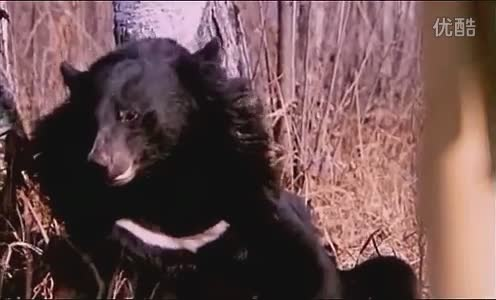

当时已经小有名气的吕丽萍是女主角，扮演劫匪的女朋友。化工厂女工这个设定实在是太刻意了。
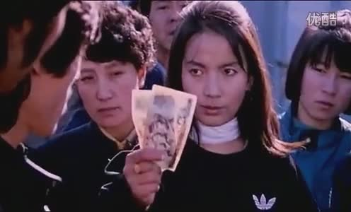

吕丽萍阿姨在片子里可没轻折腾，先去给抢银行的男朋友放哨；然后按照约定跑到了集合地点发现毒气泄漏了，走回市内；发现主人公；跟主人公来到一片芦苇荡救了条鱼；陪主人公去市集上找猫；又一块搭盗猎人的车回到毒气泄漏点。
最终在主人公的感召下，终于幡然悔悟，认识到自己不是主人公，把自己给献祭了。
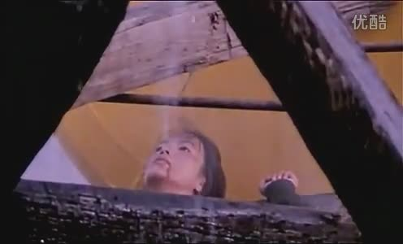

吕丽萍的男朋友抢完银行抢火车。即使在大街上没什么摄像头的80年代，这么拍也太藐视警察了。
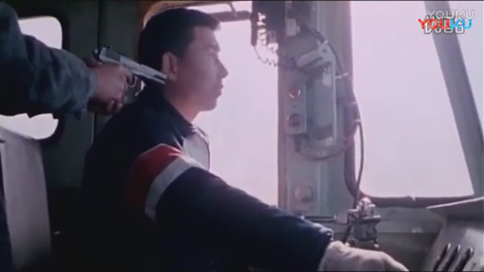
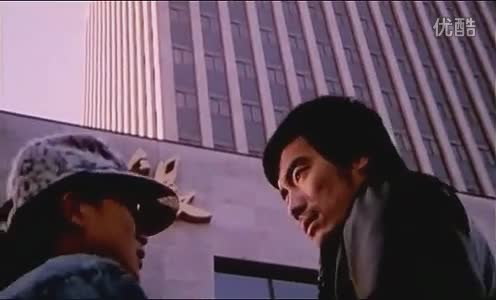
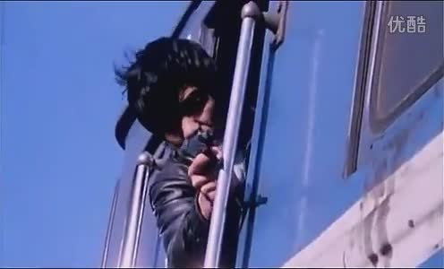

葛优扮演什么研究机构的研究员。这个研究机构的人简直都是吃干饭的，从头到尾的作用就是在讲述化学品的危害和臭氧层的作用，从臭氧层出现洞开始到化学品被一把火烧掉泄漏终止，这帮所谓的科学家既没找到原因，也没找到对策。
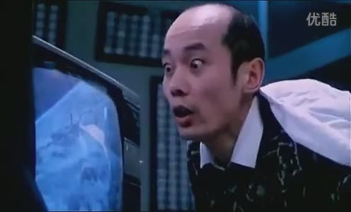
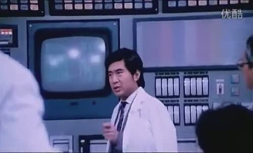

但是，本片有个天大的BUG存在：片中说两个罐车里装的是液态氯化烃，这是一类东西，如果以破坏臭氧层而论，很可能就是氟利昂。可是氟利昂是一种低毒性的化学品，远远达不到片子里那种人闻了就死的效果；且氟利昂的化学性质稳定，很难分解，不易燃烧，遇明火之后反倒会反应生成剧毒的光气。所以说，吕丽萍提出的把罐车炸了，就不会破坏臭氧层了，根本是瞎扯。即使以环保的名义亵渎科学是要不得的。
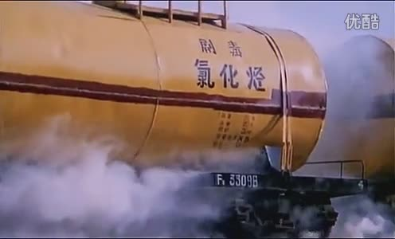
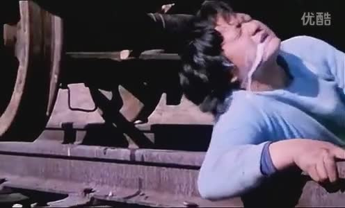

冯小宁很喜欢在自己的电影里露脸，这部片子里他演了个交警。
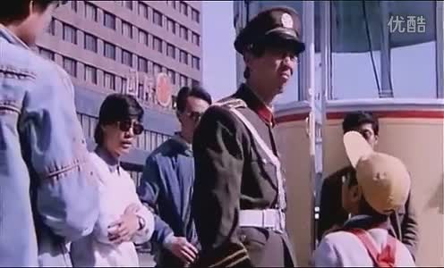

对了，主演的这个小孩，其实是个小女孩，真不是沈腾。
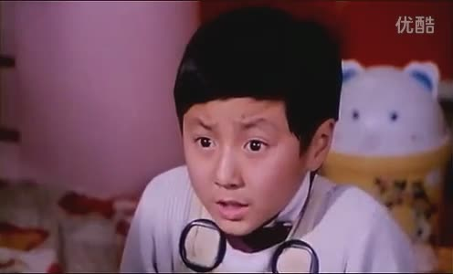