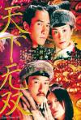

[天下无双](https://pewae.com/gaan/aHR0cHM6Ly9tb3ZpZS5kb3ViYW4uY29tL3N1YmplY3QvMTMwNzMyMy8=)

导演：刘镇伟主演：刘镇伟 / 宁静 / 张耀扬 / 张震 / 朱茵 / 梁朝伟 / 潘迪华 / 王菲 / 葛民辉 / 赵薇类型：古装 / 喜剧 / 歌舞 / 爱情地区：香港首映时间：2002

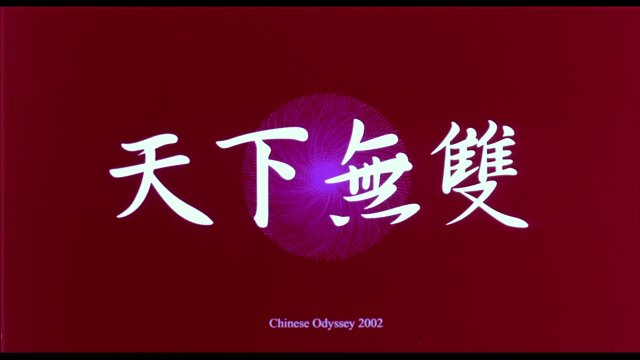
这部片是2002年春节的贺岁片。当年的3月份一开学就出了盗版，看了之后觉得特别对胃口，然后的一年里，差不多看了八九遍十来遍吧。
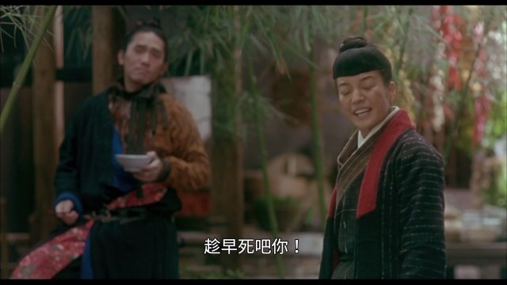

这片要说搞笑呢，不是特别搞笑，很多都是老段子和刘镇伟对自己、对周星驰、对王家卫的“致敬”，这个臭不要脸的甚至连朱延平都不肯放过；要说言情呢，这感情也很平淡；游龙戏凤更是土的掉渣的老故事。但它就是“对味儿”
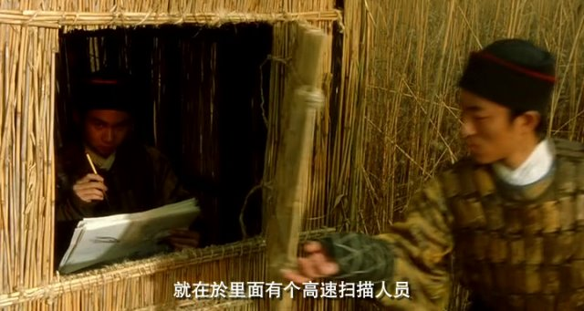

这味从那来呢？可能是刘镇伟今何在的台词，可能是黎耀辉的光影镜头，可能是区丁平的红扑扑的小脸蛋，可能是张叔平的棉帽子，但我觉得最重要的是陈勋奇的音乐。陈勋奇在片中前前后后反复使用黄梅戏的“对花”，让片子始终包围在欢乐与祥和的氛围中。
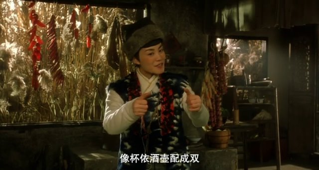

刘镇伟是个长不大的熊孩子，他作为编剧是天马行空的，但一旦放任让他独揽导筒，那他一定会化身成拉都拉不回来脱缰野驴。除了极致癫狂的《东成西就》外，他的几部好片背后都需要有一个大家长盯着——《大话西游》的周星驰，《猛鬼差馆》的邓光荣，《92黑玫瑰对黑玫瑰》的浮乐莲。本片也一样，监制王家卫先生的存在是片子没有跑飞的关键。本片的一些光影运用，王菲和赵薇的嘴角眉梢，都能看到墨镜王的影子，这些细腻的东西是刘镇伟身上根本不具备的。
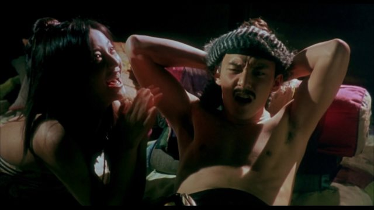

这片有不止一个版本。大学时代保存至今的rmvb压缩光盘早就失去了价值。随便下了一个，看到最后桃花都开了才发现“这不是我看过的啊”。主要是因为，此版本把我非常喜欢的，梁朝伟和王菲被从地里抠出来之后，在老乡家里的一大段唱给整个删掉了。重剪版剪掉的两大块，除了提到的那场歌舞以外，还剪掉了梁朝伟出场，交代其小混混身份的与刘镇伟本人的一大段戏。
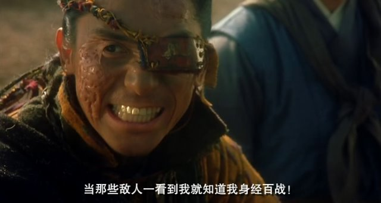
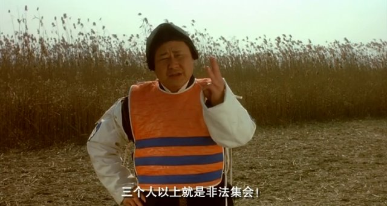

而增加的部分，主要增加在张震身上。一是出场对战张耀扬时多了不少动作戏，再是给赵薇显摆小发明那场戏多了好多内容。
在看本片以前，我不认识张震。看了这片之后，直到2020年看《牯岭街》之前，我还是不太认识张震。本片里他表现得比较一般。
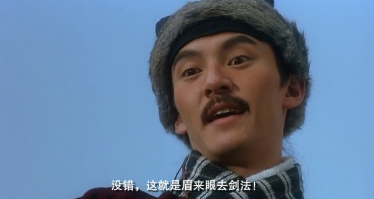
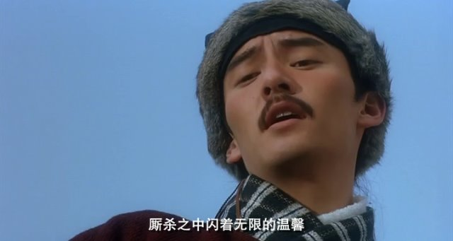
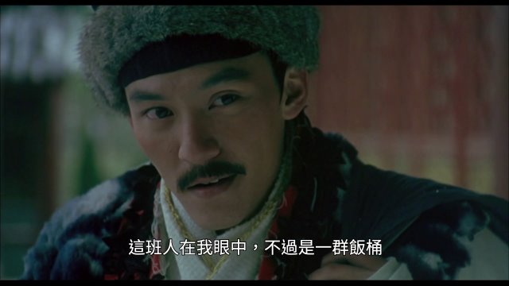
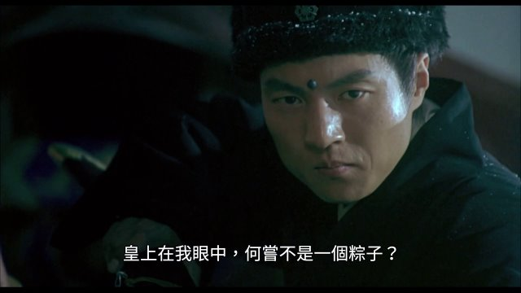

总有人说王菲说不会演戏。其实王菲主演的片子口碑都相当不错。甚至于墨镜王在我这里评分最高的作品正是《重庆森林》啊！
本片里她近似于定格的演法跟片子的整体风格特别搭调。曝晒装也很适合她。只是片尾的金色长裙和小辫子实在不敢恭维。
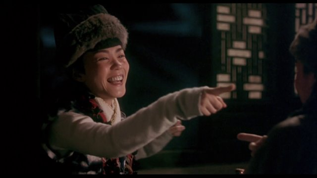
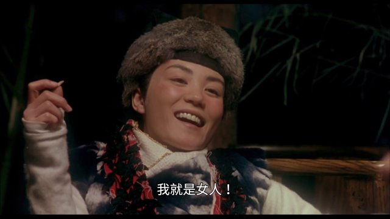
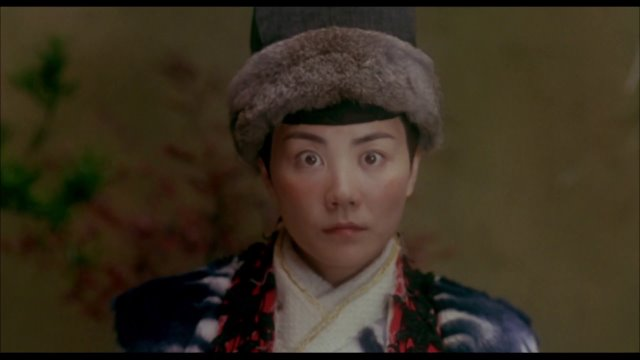

赵薇在世纪之交的时候是香港电影眼中的香饽饽。其实那时候她还没开窍，很多时候还是很僵硬的。但在这片里，这种慢半拍给人的感觉很憨甜。窃以为李凤姐是赵薇30岁前在大银幕上最好的一次演出。李凤姐出场时在和面做面条，很难让人不认为这是在蹭《少林足球》的热度。
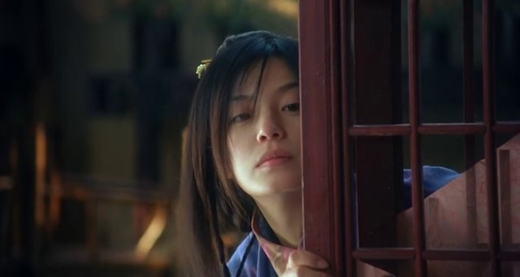
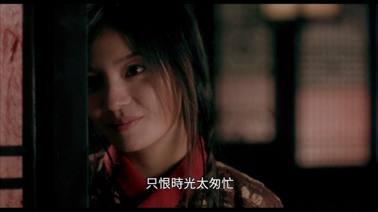

伟哥全程正常发挥。唱（国语）歌的部分甚至可以说超水平了。
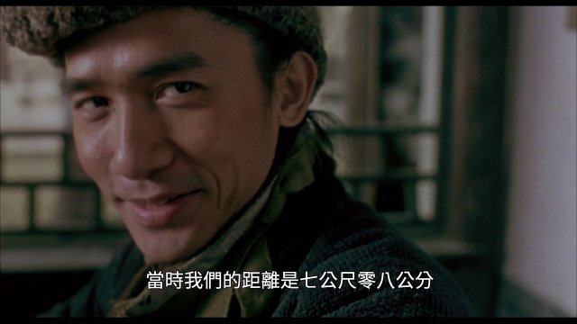

以贺岁片的通常配置来看，除了四位主演，本片的客串阵容并不强大。有头有脸的演员只有潘迪华、宁静、张耀扬、葛民辉、朱茵以及刘镇伟本人。
朱茵的角色神经兮兮的，应该是今何在搞出来的产物。整部片子里最不美观的就是朱茵了，光打得朱茵的小脸黄不拉机的，像得了黄疸。以及刘镇伟这个臭不要脸的，早在2002年就开始炒自己的冷饭了——片中有好几处朱茵致敬至尊宝的镜头，其中朱茵学《仙履奇缘》片尾猴子大吼的样子，奶凶奶凶的。这个好玩的镜头重剪版也给剪掉了。
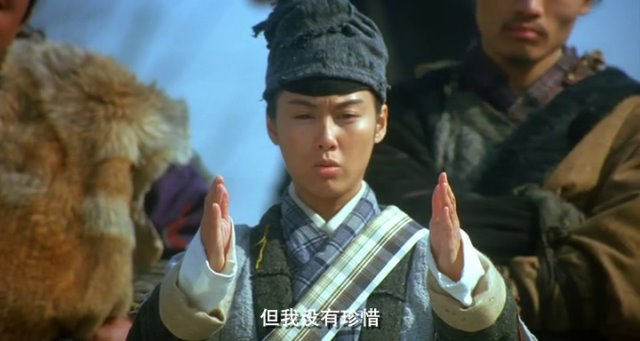
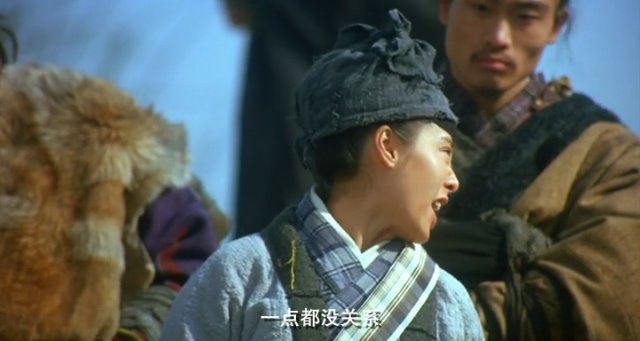

记忆中的镜头一：
这位朋友话好多，请你到外面聊聊。
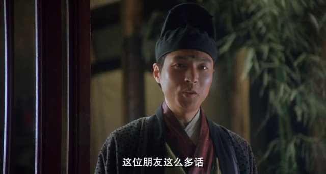
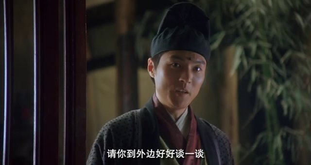

记忆中的镜头二：
你这样好像我爹啊，满嘴冒泡。
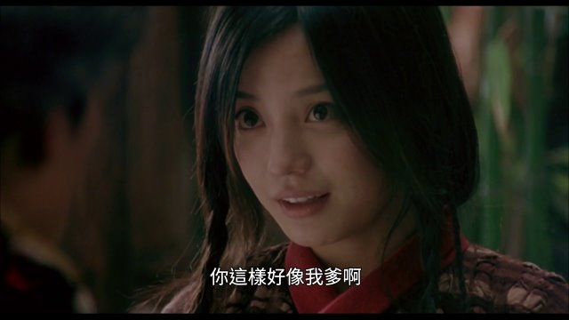
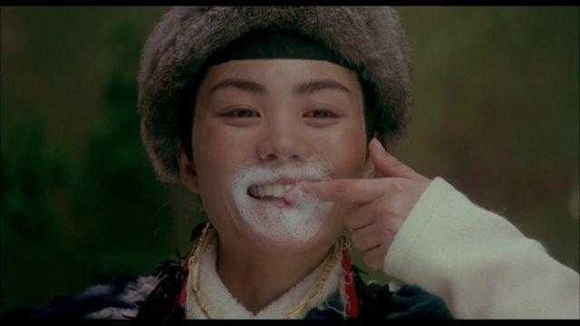
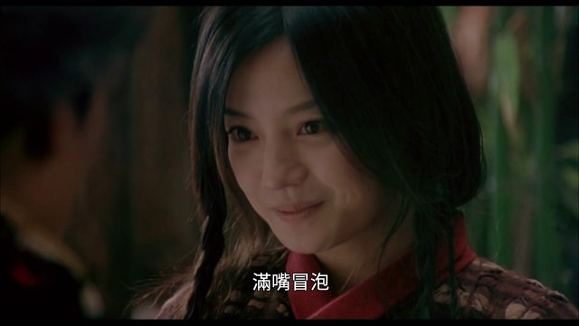