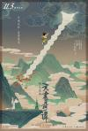

[天书奇谭](https://pewae.com/gaan/aHR0cHM6Ly9tb3ZpZS5kb3ViYW4uY29tL3N1YmplY3QvMTQyODU4MS8=)

导演：王树忱 / 钱运达主演：丁建华 / 于鼎 / 孙渝烽 / 尚华 / 施融 / 杨成纯 / 毕克 / 程晓桦 / 胡庆汉 / 苏秀类型：动画 / 奇幻地区：大陆首映时间：1983

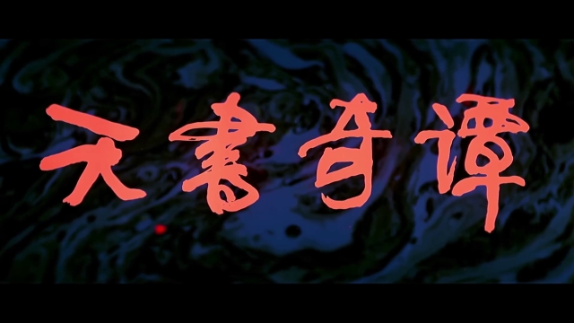
《天书奇谭》是我心中国产动画片的No.1。
曾经一度犹豫，这个系列里究竟要不要涉及动画片。但是某瓣竟然冥冥之中替我做出决定：《天书奇谭》修复重映版上映后，排名竟然断崖式地跌出了豆瓣TOP250！这完全接受不了。写就写罢,横竖小时候看过的动画长片也没几部。
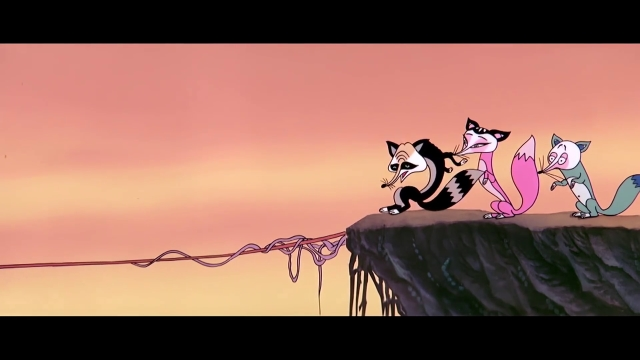

1985年的春天，我妈出差，我爸偷懒把我扔到奶奶家（而不是去幼儿园，这样他不用做饭）。
那时候寒暑假以外的时间，CCAV1周一到周六每天上午都放电大课程。[10：15分](https://pewae.com/2015/08/beginning-from-fifteen-past-ten.html)是课间休息时间，播动画片。某日，就轮到了《天书奇谭》。《天书奇谭》这样的长篇，一定是要拆成几集分开播的。
播到第三天的时候，奶奶去外屋地忙些什么，没有第一时间给我开电视，喊她她也不答应。我追剧着急，学着大人的样子，踩着椅子爬上高桌去插电视机插头。那是我第一次插电器插头，没经验，食指和拇指特意搭在两块铜片上……
当然就被打了个跟头，摔了下来。索性屁股着地没什么大碍。只不过整个右胳膊都是酸的。我一没喊人，二没哭闹，找了个晾衣服的夹子夹住插头怼了进去，然后开电视看动画片[[1]](https://pewae.com/2022/05/review-the-legend-of-sealed-book.html#inner_anchor_1)
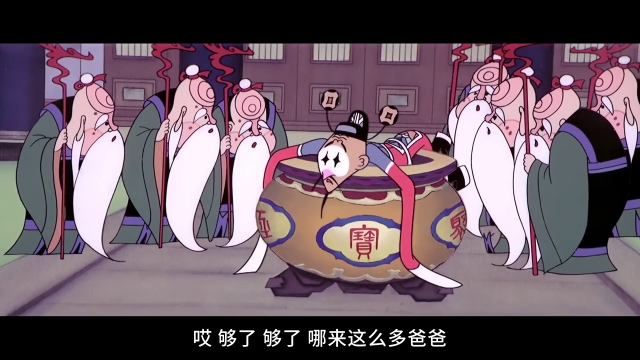

作为上美影的第三部长片，《天书奇谭》跟前两部的大场面完全不同。原著《平妖传》其实并不算太出名，可以说故事的生命完全是编剧重新赋予的。虽然线索是普罗米修斯是的悲剧，但那只是一个由头，并不是片子的核心内容。本片最重要的特点是“有趣”。主要人物特点突出憨态可掬，配乐也俏皮。
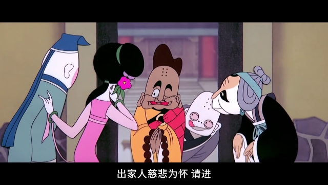

虽然主角是蛋生，但他的戏份其实并不是最重的。反派的三只狐狸才是本片的灵魂。尤其是灵魂人物老狐狸，丑得吓人，却又能说会道，别有魅力。老狐狸的形象设计是很有意思的，如果说《大闹天宫》是在支持主席的“造反有理”，《哪吒闹海》是支持二代目的“粉碎四人帮”，都是明火执仗的话，这老狐狸确是含沙射影地指向了某位。结合该人物神叨叨的设定，上美影的主意可是够正的。
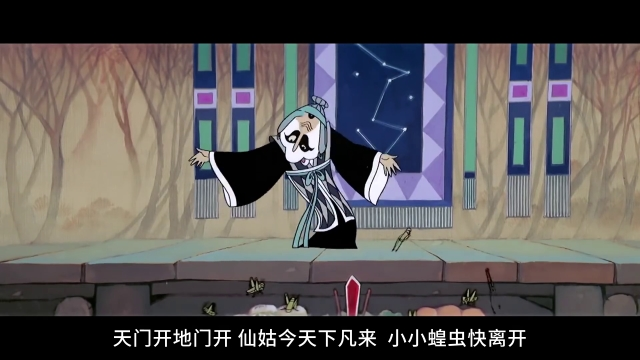

美女狐狸采用戏曲里旦角似的大浓妆，倒没觉得怎么特别出彩，倒是单腿的男狐狸一蹦一跳的特别呆萌。
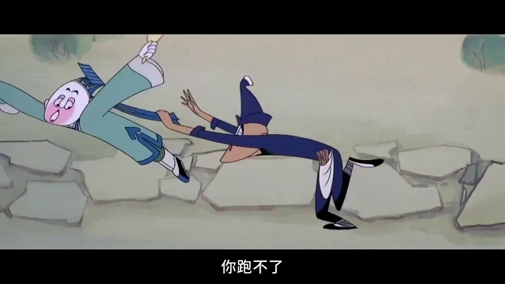
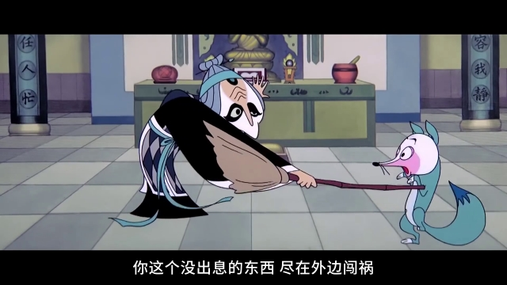

其余配角也有精彩的演出，像贪心的老小两个和尚就贡献了非常精彩的动作戏。一胖一瘦两个店伙计的出场也很有喜剧效果。县令、府尹、皇帝要么贪要么蠢，要么又贪又蠢，个性方面都是戏剧效果拉满。
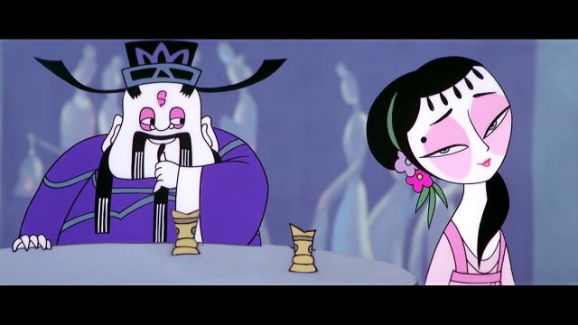
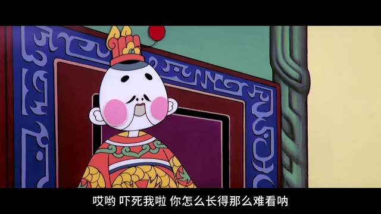

蛋生本身亮点不多，形象是足够可爱了。
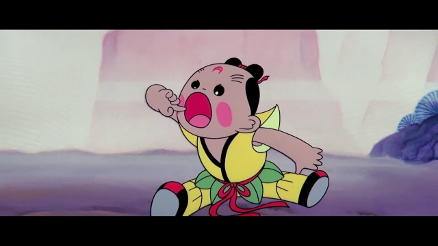

天书的设定颇有些象征意味：说是能造福人类，其实还不是被有权势的人物占据，闹一大堆乱子之后束之高阁。兲朝几千年来，搞出点新东西，无外乎如此下场。
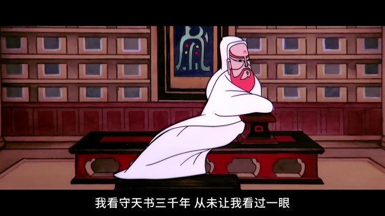
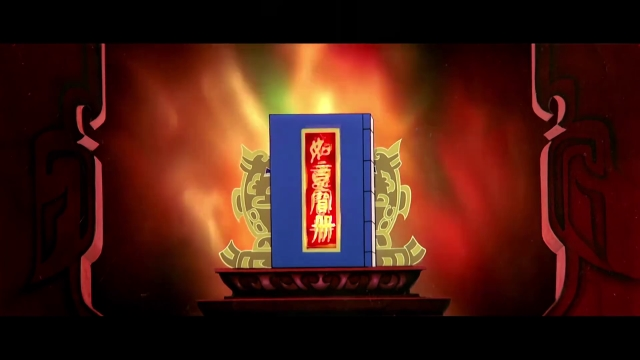

小时候百看不厌的部分有两处。一是聚宝盆变出一堆爸爸，二是蛋生和狐狸精斗法。特别热闹和喜庆。
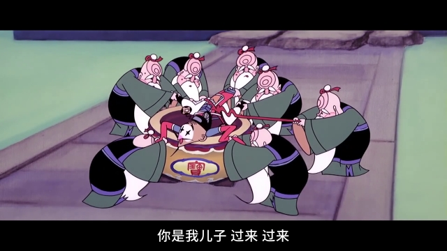
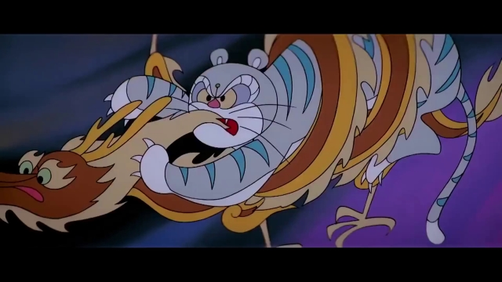

记忆中的镜头一，斗法时草叶变成的三只小鬼。上集结束在三只小鬼带走蛋生，所以对这三个感到特别害怕。
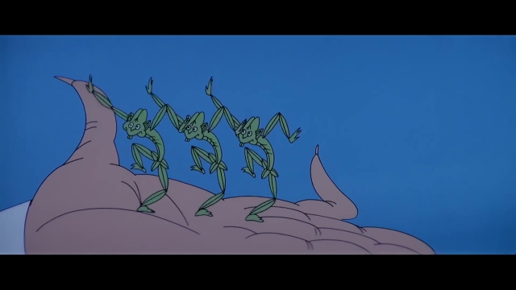

记忆中的镜头之二，三只狐狸跳大神。
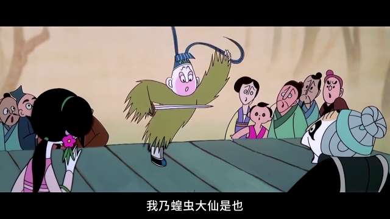

---

- [(1)](https://pewae.com/2022/05/review-the-legend-of-sealed-book.html#inner_ref_1)：那天晚上再观察大人插插头，才知道只要不碰铜片就行。