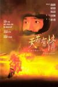

[天若有情](https://pewae.com/gaan/aHR0cHM6Ly9tb3ZpZS5kb3ViYW4uY29tL3N1YmplY3QvMTI5NzcxMC8=)

导演：陈木胜主演：刘德华 / 刘江 / 吴倩莲 / 吴孟达 / 朱铁和 / 林聪 / 黄光亮类型：剧情 / 动作 / 爱情地区：香港首映时间：1990

看肯定是在录像带时代看的，但是第一次看印象很浅。后来2000年左右暑假辽宁台中午放过。
本片本来不在回顾列表内，因为怀念吴孟达先生而特意追加。
[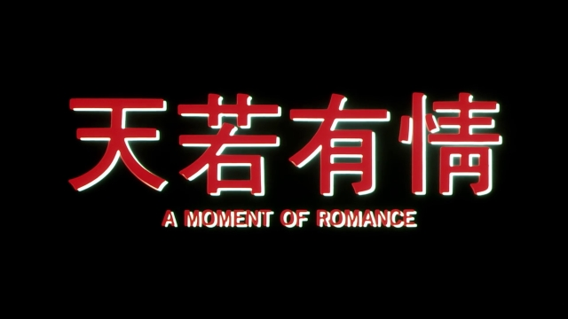](https://pewae.com/wp-content/gallery/videosnap/vlcsnap-2021-03-01-19h48m43s729.jpg)

为什么不在呢？太有名了嘛！
而且我向来不怎么喜欢刘德华，也不怎么喜欢爱情片。最主要的是，我讨厌《灰色轨迹》这首歌！初中的时候学校门口有抢钱的小混混，其中总盯着我抢的那个，没事就喜欢哼哼“我已背上一身苦困后悔与唏嘘”。恨屋及乌，对把这首歌当插曲的《天若有情》自然也没多少好印象。这首插曲出现在片子开始不久，刘德华第一次让吴倩莲上车的时候。
[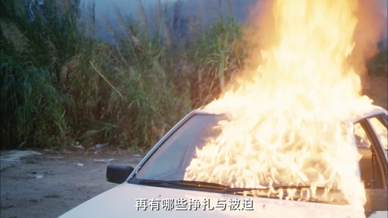](https://pewae.com/wp-content/gallery/videosnap/vlcsnap-2021-03-02-22h10m17s516.jpg)

本片是吴倩莲的处女作。杜琪峰作为本片的监制，从一堆照片里挑出了当时还是学生歌手身份的吴倩莲。吴倩莲本身不是特别靓丽那种类型的女演员，但确实有种属于她自己的味道。吴也算是女演员中的一时之选，九十年代香港当红的男演员，除了成龙李连杰外都跟她共同担纲演过电影。刚刚20岁的吴倩莲青春可人，默默含泪的样子感动了无数痴男怨女。可惜吴倩莲几次获得提名，却没有什么头衔傍身。
爱什么情嘛，还不是斯德哥尔摩综合症。
[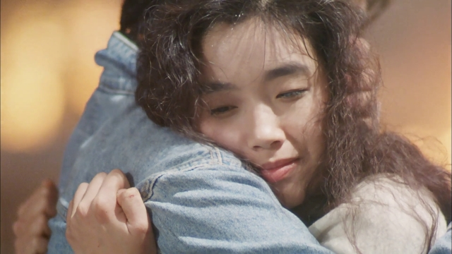](https://pewae.com/wp-content/gallery/videosnap/vlcsnap-2021-03-02-22h57m12s218.jpg)
[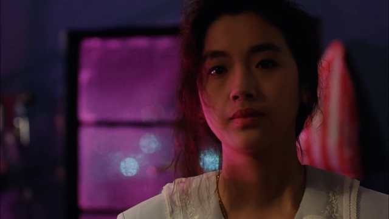](https://pewae.com/wp-content/gallery/videosnap/vlcsnap-2021-03-03-22h35m45s912.jpg)

刘德华在本片里表现得非常一般。年轻的刘天王就没什么演技的，但是嘛，帅就完了。
[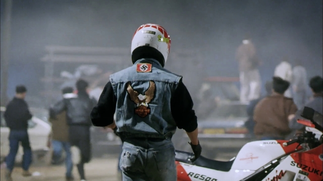](https://pewae.com/wp-content/gallery/videosnap/vlcsnap-2021-03-01-19h53m00s318.jpg)

片子同时也是陈木胜导演的处女作。陈导演在此之前曾长期担任杜琪峰的助手。本片的策划是王晶、杜琪峰和林岭东三位大导演，任~~一~~意一位出来执导都是没问提的，但因为片中有大量的飚车戏，杜琪峰就提出让喜欢开车的陈木胜执导，而杜担任监制。于是，一部~~活~~火遍东亚区的动作爱情片就此诞生。陈木胜导演成功地完成了工具人的任务，从此走上名导演之路。倒也不是很有名。跟吴倩莲一样，多次提名无一获奖。
[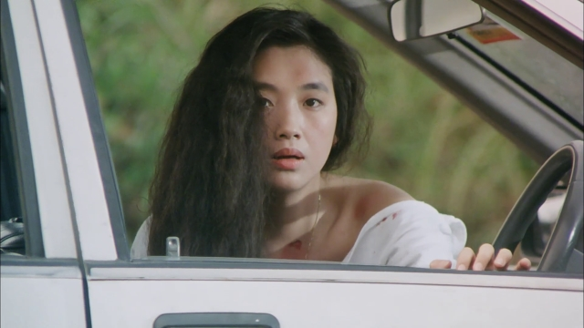](https://pewae.com/wp-content/gallery/videosnap/vlcsnap-2021-03-01-20h00m08s032.jpg)

本片其实是一部集动作爆炸戏戏飚车戏爱情戏于一体的大杂烩电影。要说哪个方面最突出还真没有，给人印象最深的就是几次飚车了。刘德华和吴倩莲关于“上车”有大约三四次对手戏，每次的台词和表现都不太一样，也许这就是导演想表达的吧。人家想表达什么，咱未必能看懂。不懂也有不懂的看法。差不多罗大佑“追梦人”的主题伴奏响起的时候，就是在提示“戏肉到了”。
《追梦人》在这部电影里其实是另一个名字：《青春无悔》。电影上映半年之后三毛去世，罗大佑为了纪念三毛改了四句词，从那以后这歌才是真正的追梦人。
[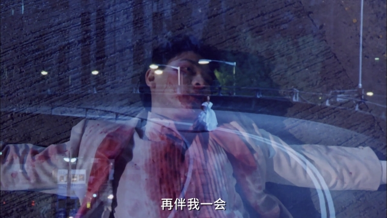](https://pewae.com/wp-content/gallery/videosnap/vlcsnap-2021-03-03-22h58m33s892.jpg)

重点还是得说说达叔。本片拍摄的时候，达叔跟星爷两个刚准备从电视转行电影。本片的三位策划都是无线的老朋友，达叔同样也是。所以就拿这部片来试一下水。吴孟达在片里出演刘德华的小弟，一个胆小怕事的小混混，以替人看车洗车谋生。最后却出于义气帮刘德华背刺了大反派。片中达叔把小人物的胆小却有讲义气的特点发挥得淋漓尽致。也真是凭借此片，达叔拿到了演艺生涯中唯一一个头衔。其实某种程度上说，最佳男配角比最佳男主角还要更难拿到。因为参评男配的对手中经常出现尚未成名的影帝（比如1988年的梁朝伟），或者偶尔客串的影帝（比如2008年的刘德华），或者巅峰已过的影帝（比如2000的狄龙）之类。而专门演配角演员的想要担纲主角却很难很难。君不见出演过百多部电影的胡枫先生辛苦一辈子，连个提名都没捞到过。
[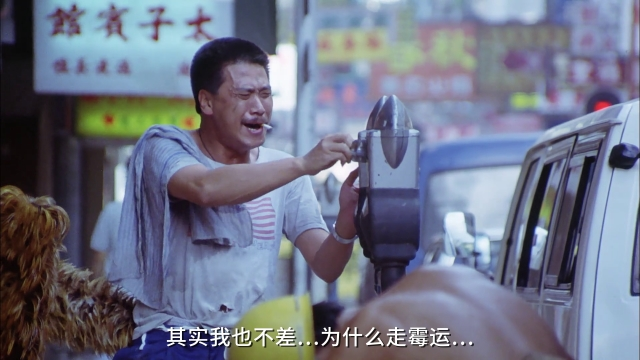](https://pewae.com/wp-content/gallery/videosnap/vlcsnap-2021-03-02-22h30m00s080.jpg)
[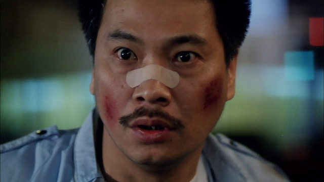](https://pewae.com/wp-content/gallery/videosnap/vlcsnap-2021-03-03-22h54m37s106.jpg)

其实片中大反派，四大恶人之一的黄光亮表现也非常有气场，其表现不弱于吴孟达，更是好过刘德华数倍。但他是个类型被固定的演员，演恶人出色似乎是应该的。
[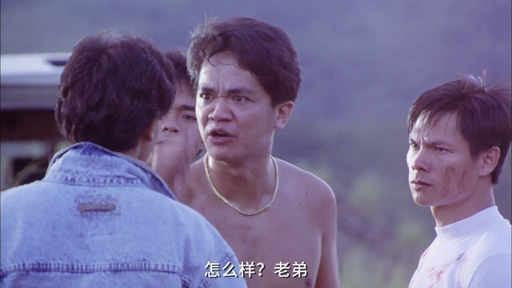](https://pewae.com/wp-content/gallery/videosnap/vlcsnap-2021-03-01-19h59m58s400.jpg)
[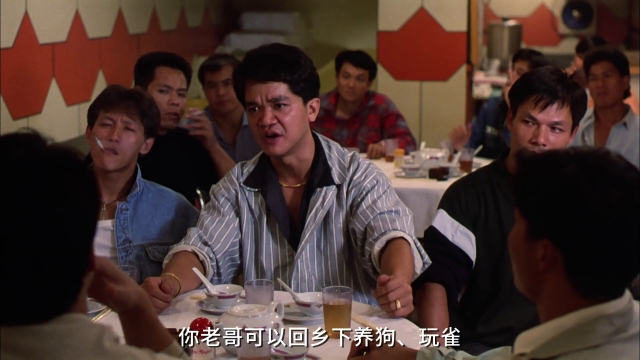](https://pewae.com/wp-content/gallery/videosnap/vlcsnap-2021-03-03-22h39m16s048.jpg)

记忆中的镜头：
还用说嘛，这片值得铭记的就一个镜头。
[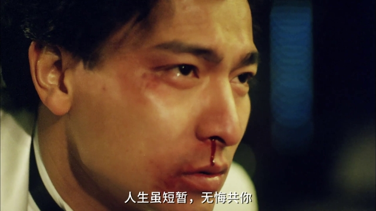](https://pewae.com/wp-content/gallery/videosnap/vlcsnap-2021-03-03-22h50m02s439.jpg)
[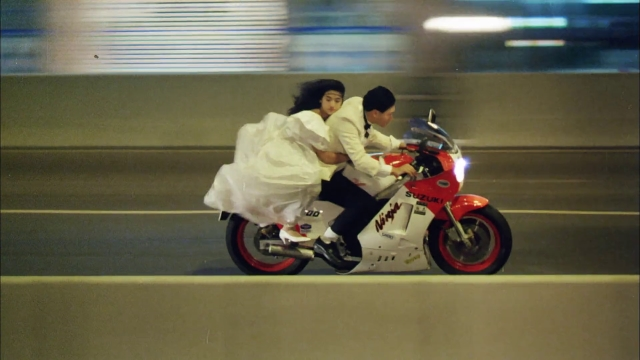](https://pewae.com/wp-content/gallery/videosnap/vlcsnap-2021-03-03-22h50m27s767.jpg)