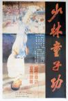

[少林童子功](https://pewae.com/gaan/aHR0cHM6Ly9tb3ZpZS5kb3ViYW4uY29tL3N1YmplY3QvMjMzMzgwNi8=)

导演：薛后主演：张龙 / 王丽莎 / 王庆玉类型：动作地区：大陆首映时间：1984

这部片子虽然看得早，印象却很深。因为这是我上小学一年级以后看的第一部包场电影。
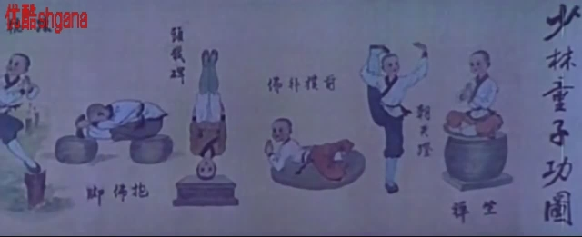
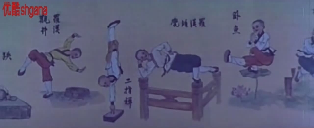

话说一部《少林寺》获得成功以后，国内跟风上了一批少林like的片子。而且那时的片子往往会打着一个合拍片的名头，少林寺方面也是尽量配合。
本片的含少量还挺高的，因为导演薛后是少林寺的编剧之一。少林寺的塔林也同样借出来用了。
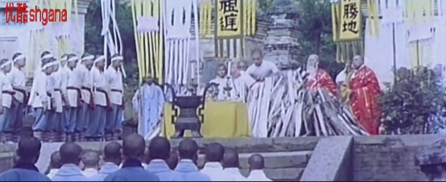

蹭热度不分年代。这张，明显是打海灯牌。而显然那时候少林寺也没站出来说海灯不是少林寺的人。
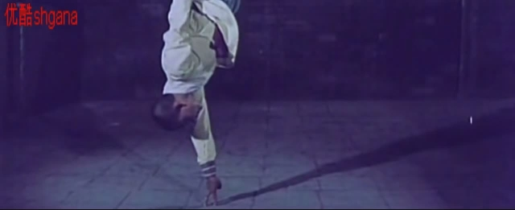

男主角张龙。毫无特色。根本没红起来。
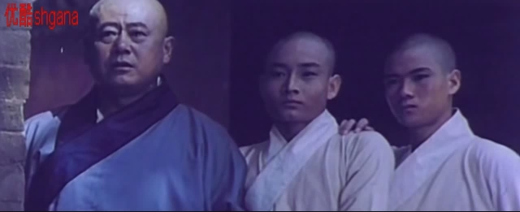

女主角王丽莎，算起来也是李连杰的师姐也不是师妹。在故事里是主角的表妹。跟牧羊女的设定相当一致，只是更能打。反正那时候照着少林寺安排就对了。
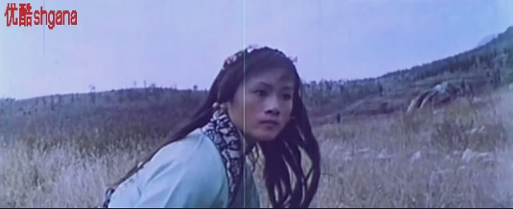

演反派的邱方俭倒是有点来头。他是当时国内缺稀的武术指导。最有名的参与作品应该是山东版的电视剧《武松》。
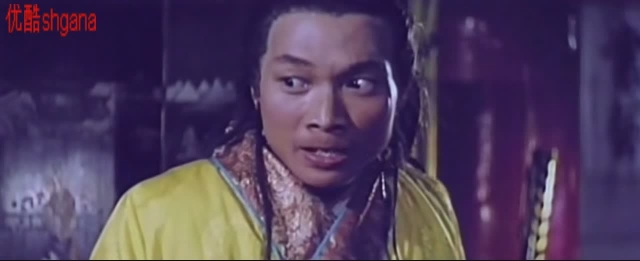

这位扮演的是历史上有名号的小福王，也就是南明的第一个皇帝弘光。电影里应该是参照了史可法的看法，说他即位前就不是什么好东西。这位可是相当能打，一腿就踢死了主角的爹，踢晕了主角的妈。
话说本片最大的贡献就是小福王的这记绝招。后来被我们用在《双截龙》上。一说“霹雳旋风腿”，懂的都懂。仅限于我们学校周围那一亩三分地。若干年后隆和肯的“加加不落根”可就没这个待遇了，显然是已经过去了四五年，早就忘干净了。
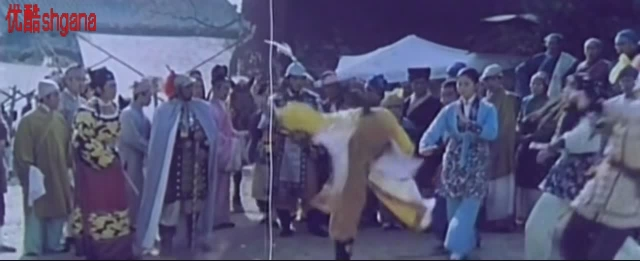
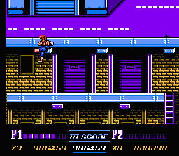

但是这动作戏水平就很不怎样了。很费解的就是无论正方反方，无论拿起刀枪剑戟哪样武器，总是三五下就被打掉了，然后就变成了肉搏。场景设计也没啥新意，这段围墙上的打斗戏跟少林寺连镜头角度都是一样的。
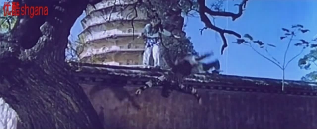
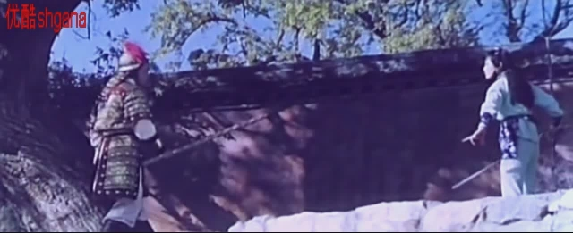

在相当长的一段历史时期内，国产电影里农民起义一方都是正义的化身。比如《神鞭》里的义和团，《南拳王》里的太平军，《黑旗特使》里的黑旗军和捻军，以及本片里的李自成军。
片中男主父亲被干死，母亲被抓走以后，就藏在少林寺里，天天盼着闯王的队伍来打福王。到了片子结尾的时候，小福王跑了，老福王被女主杀了。然后男女主角拜堂成亲，至于童子功成亲之后还灵不灵，就没人管了。
这里有个细思极恐的细节。最后一个镜头是杀了福王之后，全城百姓在其乐融融地吃大餐。根据半正不野的史的记载，福王可是被直接炖成了福禄宴了。那镜头里拍的岂不是吃人肉？
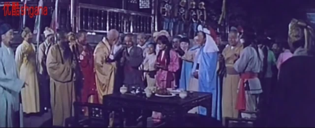

> 闯贼迹福王所在，执之。王见自成，色怖乞生。贼置酒大会，脔王为俎，杂鹿肉食之，号福禄酒。

记忆中的镜头之一，女主他爹摆脱追兵的方案，像极了折纸游戏“老头上山”。
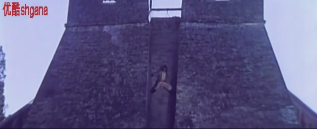

记忆中的镜头之二，对追兵撒尿。
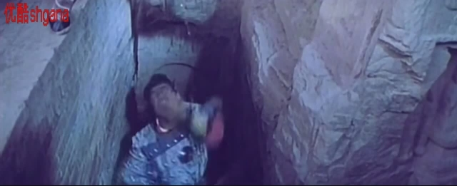

记忆中的镜头之三，秘奥义，童子拜佛。可还是让坏人跑了。
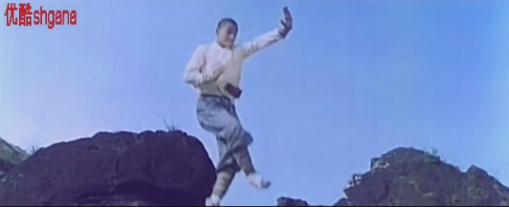