这个专题开了两年了，终于盼来了2018，因为有一部作品终于达到了自己给自己订下的20年的标准。

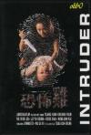

[恐怖鸡](https://pewae.com/gaan/aHR0cHM6Ly9tb3ZpZS5kb3ViYW4uY29tL3N1YmplY3QvMTQ3MjUzMi8=)

导演：曾瑾昌主演：元彬 / 吴倩莲 / 林雪 / 陈豪 / 黄文慧 / 黎耀祥类型：恐怖 / 惊悚 / 犯罪地区：香港首映时间：1997

——拍摄于1997年的《恐怖鸡》，我是在1998年暑假租录像带看的，这也是我这辈子租的最后一盘录像带。
那可是马上升高三的暑假，好像只有四天还是五天？就被这么一部片子给废掉了。
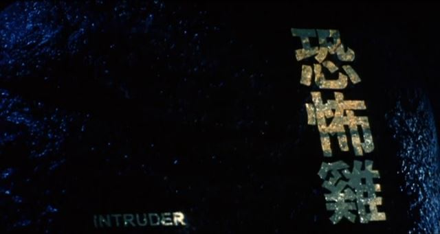

其实我是被封面骗了。那时在租录像带的小店里，新片是单独放了一个架子的。都是翻录的带子，黑白复印机复制出来的带皮儿已经有些模糊了。但“吴倩莲出演三级片！！”几个大字还是非常醒目。
因为沾刘德华“吴倩莲的风和雨”大流行的光，所以吴倩莲那几年还挺红的，这种当红明星主演的三级片当然要鉴赏一下，至于死鱼眼厚嘴唇要胸没胸要屁股没屁股之类的事，根本不用在意嘛！
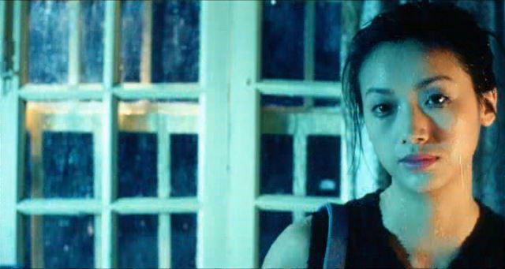

然而，三级倒是三级，却不是我想的那种三级。全片都在一种阴森鬼谲的气氛下进行，满满的都是杀戮和虐待的镜头。
彼时还是新手上路，远非大学里磨练成的老司机。所以看到吴倩莲弄小孩的地方，整个人都不好了。
其实这个片子现在看来真不算啥了，随便找个盒子，一搜就能出来，只剪掉几个镜头而已。
嗯，下面这个镜头就被剪了。
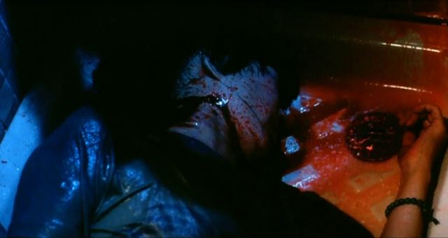

犯罪剧有两种拍法，一种是抽丝剥茧，不知道坏人是谁，到片子的一半左右开始加快进度；另一种是一开始就把罪犯曝露出来，表现犯罪人的狡猾和残忍。港片一般第二种拍法拍出来的比较好看。
本片一开始就是血花四溅的剧情——吴倩莲在深圳杀了一个无亲无故的妓女，然后冒用她的身份证进入香港。
接着，吴色诱了一个出租车司机，趁其不备把他绑了起来。后来又杀了司机的老妈和妓女的未婚夫，把司机的孩子活埋的一个地洞里。
最后孩子被暴雨冲了出来，被人救起，吴才又不得不再次逃亡。
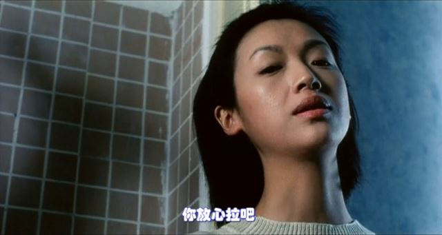

本片是那种纯粹的大女主的片子，所有的剧情人设什么的都是围着女主转。一旦女主角撑不起来，片子就完了。幸好杜琪峰找来了吴倩莲。按说吴倩莲那时正当红，演一个反派角色是要考量一番的。可据说吴二话不说就接了，可谓扶持新生的银河映像于水火。固然吴倩莲有报恩的想法在——吴正是被杜琪峰发掘才走上了演艺道路，而杜正是吴的首任经纪人，可这种两肋插刀的做法，说明吴女士的人品钢钢地啊！
要说吴倩莲在本片里的表现可谓演技炸裂，可惜本片在那个香港电影的黄金年代，连个金像奖最佳女主角的提名都没捞到。
曾几何时，吴倩莲在《天若有情》里的微笑感动了无数人，可在这部片子里，笑得实在是渗人啊！
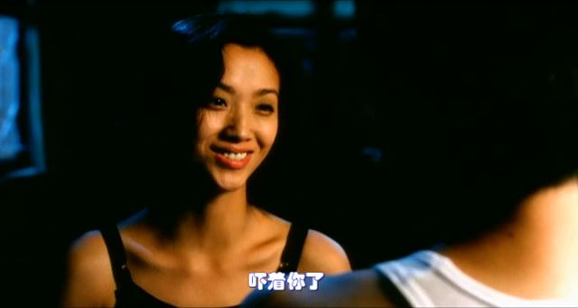
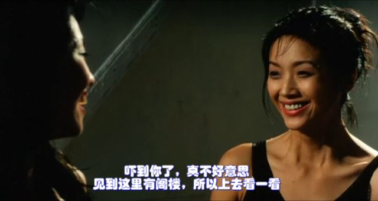

不笑的时候更吓人。
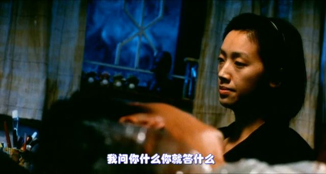

片子里的吴倩莲化名斯琴爱儿，以至于我对整个蒙古族叫斯琴的都有了偏见。大学本系有个学姐叫斯琴哈斯的，是学生会的什么干部，每次她来布置什么任务，我都是能躲多远就躲多远。
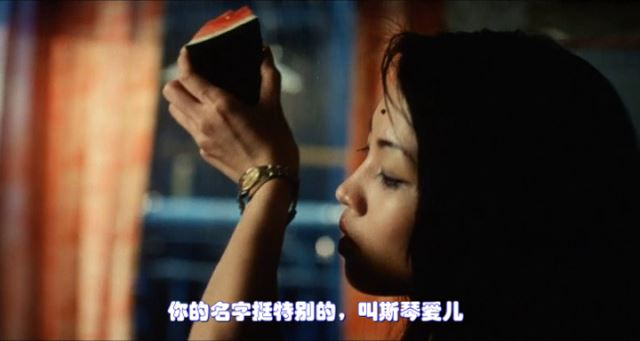

导演是曾锦昌，更出名的身份是编剧，并且是周星驰近十多年的御用。《食神》、《喜剧之王》、《少林足球》、《功夫》、《长江七号》、《美人鱼》都是他的编剧作品。呃，《唐伯虎点秋香2》、《白蛇传说》也是。所以这部片子虽然是小成本，但剧情还算说得过去。现在的评论里有好多什么大陆啊97啊之类的延伸阅读，反正我是没看出来。片名直译的话是“入侵者”，倒是对大陆满满的恶意。剧情中吴倩莲色诱黎耀祥之后不杀反而留着，要用他的双手和身份这个设定，还蛮有亮点的。虽然一个看着学历不怎么高的女逃犯进行换两只砍刀砍下来的手臂这样的大手术这事儿怎么品怎么玄幻。

黎耀祥当时在TVB就是个死跑龙套的。这部片子里虽然是男主之一，但大部分时间都被裹得跟个粽子一样。也许这样更需要演技？
黎上当还颇有曲折的——吴到香港后，带着妓女留下的一堆名片挨个打，接电话的男人没一个搭腔的，吴走投无路才选择站街。
还是豆瓣那句评论说的好：“叫鸡不要带回家。”
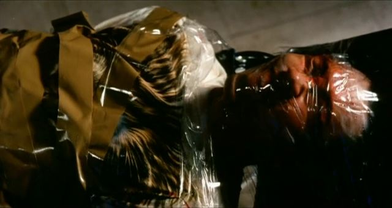

七小福里一直比较低调的元彬大叔是这部片子的动作指导，而且难得地在镜头前露脸了。这部片子的动作非常凌厉，杀人就是那么几下，挺有看头的。
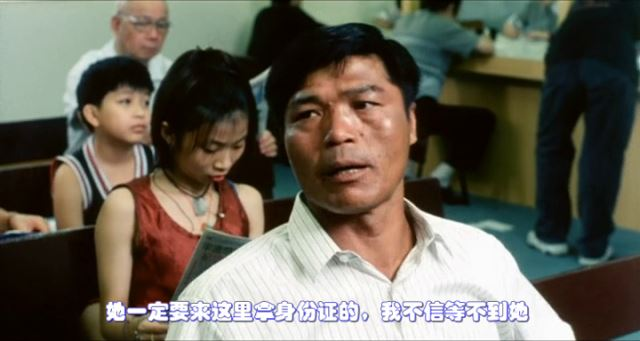
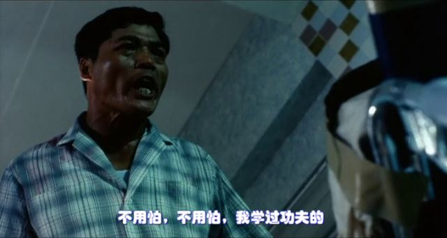

陈豪演吴倩莲的通缉犯老公，没有什么特别出色的表现。身材高大、步履沉重、目泛凶光……整体感觉就像暴走之后的乔巴？？
颜值还是很高的，这张截图乍一看像陈坤。
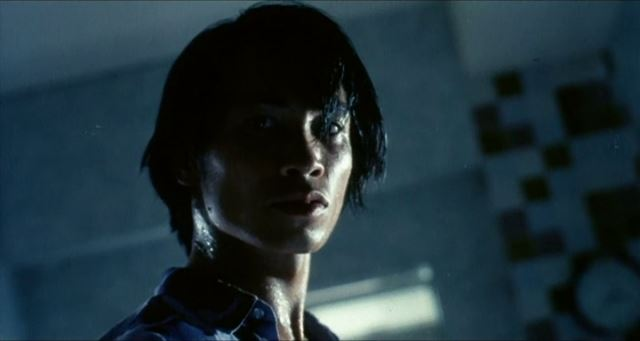

对了，还有个死跑龙套的片子快结束时大概有3秒的镜头，没台词。
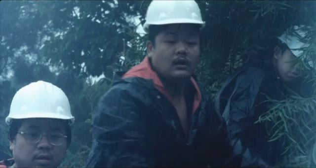

片子的结局，小女孩没死，坏人跑路了。
吴倩莲因为自己一时心软没让陈豪用钢筋扎死小女孩，而只是填土埋上而耿耿于怀。
“怪就怪自己一时心软，不够狠不够坏。不过也不要紧，下次做好一点。”