80年代家里有电视的小伙伴应该都看过这片。

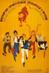

[意大利人在俄罗斯的奇遇](https://pewae.com/gaan/aHR0cHM6Ly9tb3ZpZS5kb3ViYW4uY29tL3N1YmplY3QvMTMwMTg1OS8=)

原名：Невероятные приключения итальянцев в России导演：佛朗哥·普罗斯佩里 / 埃利达尔·梁赞诺夫主演：塔诺·希玛罗萨 / 安冬尼娅·桑提利 / 安德烈·米罗诺夫 / 尼内托·达沃利 / 阿利耶罗·隆歇热类型：冒险 / 喜剧地区：意大利 / 苏联首映时间：1974

80年代后期到90年代头两年，每个周日晚上AV1都会播上一部“译制片”，可能是为了响应“对外开放”的号召。一大批如今被奉为经典的老片都是在那段时间被引进制作的。比如《茜茜公主》55年拍摄，88年引进；《伦敦上空的鹰》69年拍摄，86年引进；这些既老又新的片子，成了五〇后六〇后七〇后们能找到共同的话题。这并不是因为片子多么经典，只是被攒到一起了而已。哦对，这时候我可以算做七〇后。
虽然这些片子良莠不齐，但上译的配音质量可是杠杠地。童自荣先生、乔榛先生、丁建华先生可都是家喻户晓的大明星。
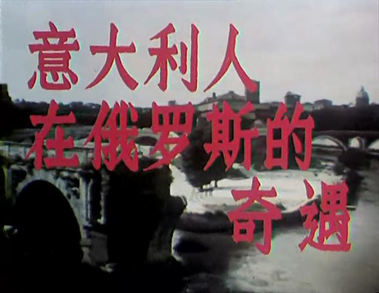

当然片子那么多，能被小孩记住的可没几个。本片因为其喜剧和独特标志而令人难忘。
先不说喜剧部分，本片最大的特色是一头狮子。因为片名太长又缺乏特色，跟我们这么大的人说起片名几乎没几个人能跟片子对上号，但只要一说“狮子笼子底下埋宝箱”，你就会收获到一个会心的眼神。
动物参与拍摄的电影如过江之鲫，但像这部片子这样真实的狮子参与大半戏份的，可谓凤毛麟角。尤其新世纪之后特效不值钱了，这种动物担纲戏胆的情形可以说绝种了。感兴趣的建议去看一下豆瓣排第一的热评，这狮子也算是命运多舛。
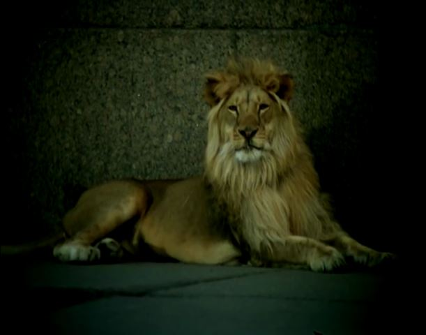

因为故事的起点在意大利，又是合拍片，所以片头三分钟完全是罗马风光秀。似乎无论中外无关题材，但凡异地取景的电影都要交待一下“我们这是在XX”，生怕观众误会的感觉。罗马这一圈都是地标建筑，长得跟几年前陪老婆看《花儿与少年》里面的几乎一模一样。一方面人家意大利文物保护做得好，四十年风采依然；另一方面所谓地标其实也没几样。
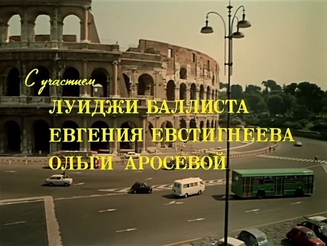

故事说的是当护工的姐夫和小舅子把养老院里的一个快死的老太太往医院里送，送到医院听到老太太交待遗嘱——她有90亿里拉的财宝埋在俄罗斯的狮子下面。听到消息的护工、孙女、黑手党、瘸子和医生展开了疯狂的寻宝之旅。
其实这个开头就细思恐极——意大利的医院管理得蠢到什么程度，才能把内科（濒死的老太太）、产科（黑手党的老婆）、骨科（断腿的瘸子）安排到同一个病房里？然而片子的编剧导演投资人都是苏联人啊！冷战玩得热火朝天的，不贬低你资本主义软柿子贬低谁？加上意大利向来没节操，为了两个小钱钱，贬低一下国内的医疗水平也不叫事儿，说不定还能起到迷惑敌人的作用呢。
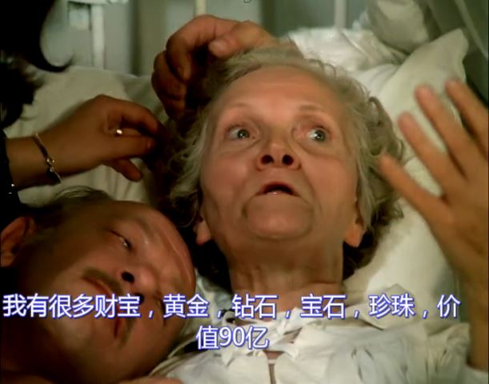

这片子俄罗斯拍的时候应该是花了不小的力气的。飞机在公路上迫降和高速上的追逐镜头就挺有魄力的，更不要说后期狮子在列宁格勒的大街上乱晃是要清场的。

可是战斗民族可能太注重大场面了，有些小细节没怎么处理好。比如房子炸了，就主人公几个身上有土。
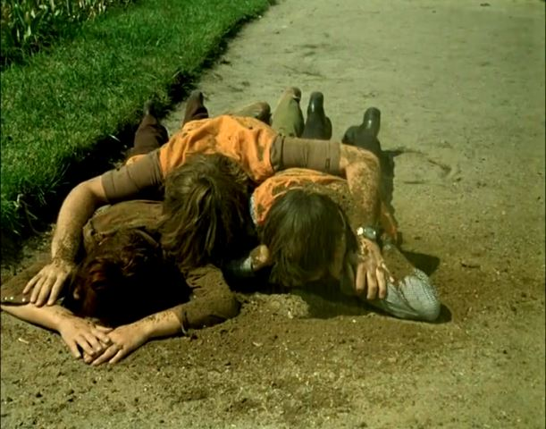

再比如瘸子踹断的柱子，这是5卢布的特效吗？
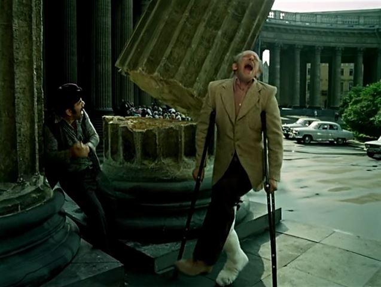

女主角蛮漂亮的。虽然建议大家看国配版，但原版1小时10分钟的位置有福利，女主露点了。但一考虑女主49年生人，已经年逾古稀了。影星这东西，在我看来只要看ta活在影片中的状况就够了。不然梦露生于1926年，简方达今年整80，叶子楣50挂零，连大家耳熟能详的苍老师不也三十好几了么。人就应该活在他所在的年代。
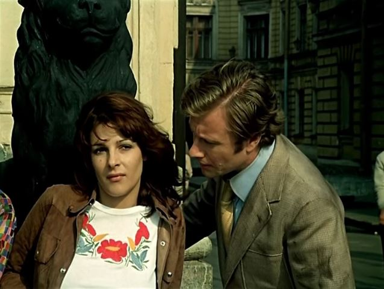

男主角挺壮的，反正毛子名字那么长，咱也记不住。男一号当然要由当家小生童自荣先生配音，但女一号却不是丁老师，而是当时的新人狄菲菲配的。2000年代初的时候，爆出过童乔丁反目内讧的新闻，实在令人唏嘘。
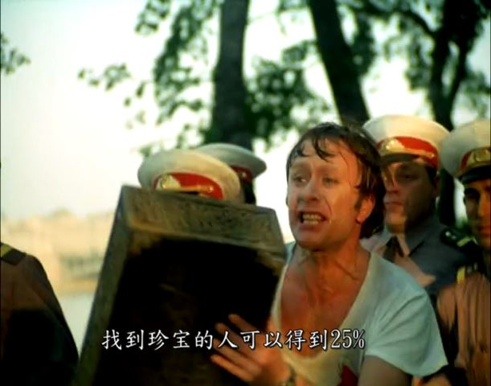

坐俄航飞机降落时要鼓掌感谢，这个梗怕是70年代就有了……
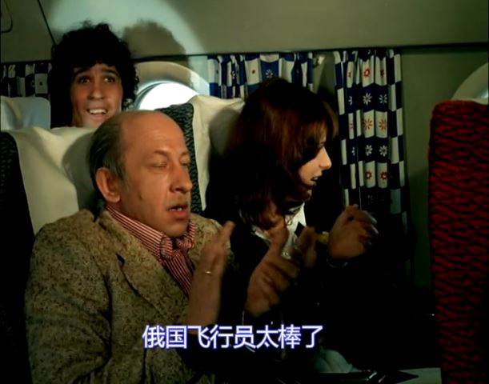

片子印象深，一是因为热闹，二是各个角色性格鲜明。
男主是秘密警察，忠于革命忠于党，女主狡黠，姐夫心思多，小舅子呆萌，黑手党坏，瘸子惨，尤其医生出师未捷身先死，在飞机上被黑手党扔了护照，俄罗斯和罗马都不允许其下飞机。这种人物形象显得非常饱满。
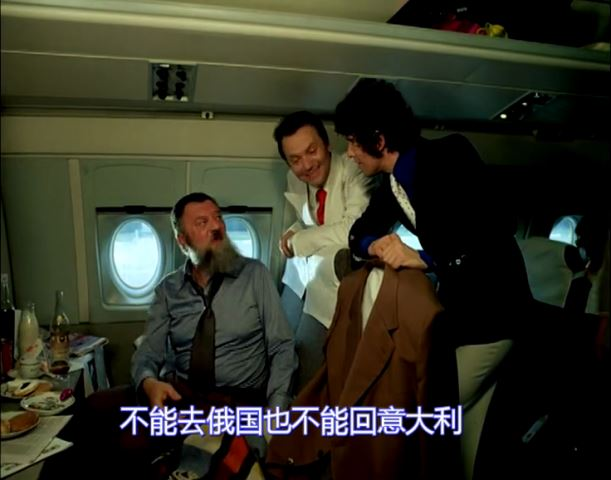
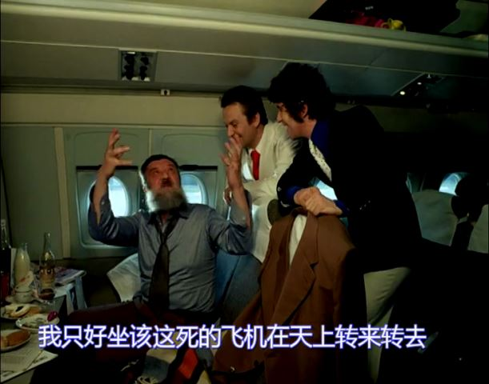

记忆中的经典镜头一：消防车怼民宅，怼出一个洗澡的女人。当年能在电视上看到一个光着的女人，小伙伴们能就此讨论好几个月。
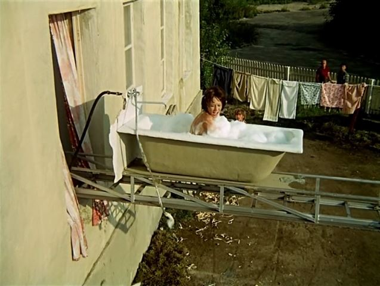

记忆中的经典镜头二：能抬起来的大桥。而且这桥上还是有铁轨的。总觉得这玩意儿很神奇，直到97年开始修三峡的时候，电视里还说什么修好之后万吨巨轮直抵重庆，脑海里就呈现出了这种能升起的桥的样子。然而又20年过去了，还是没见过实物。
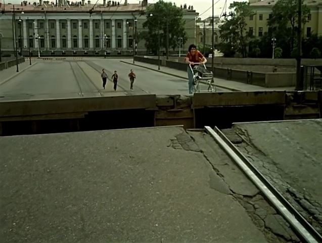
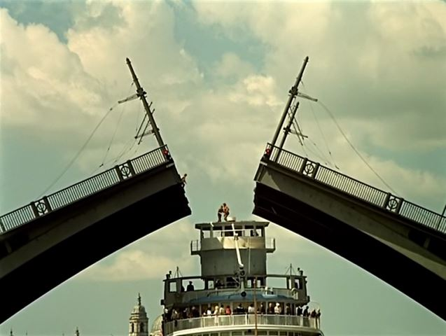

记忆中的经典镜头三：主角一伙谎称剧院的煤气漏了，一堆带着行头的人往外跑。
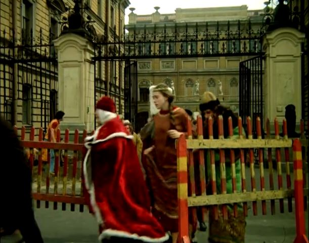

记忆中的经典镜头四：狮子等红灯。
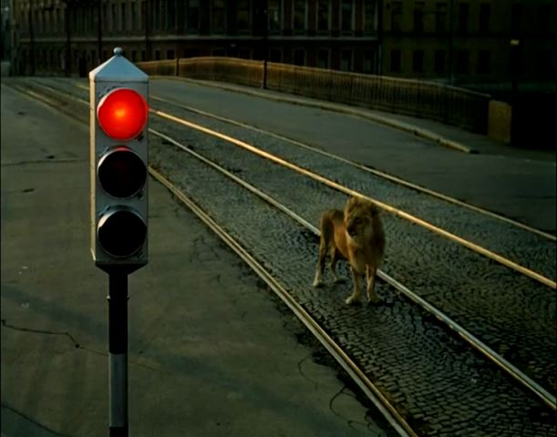

记忆中的经典镜头五：主角一伙被逼着用套娃脱身。狮子明明是没有表情的，却分明带出了恼怒的情绪。
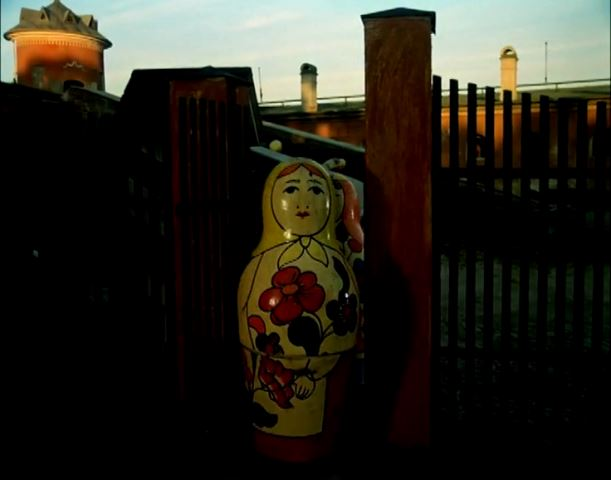

最后，跟另一个社会主义国家相比，老大哥还给人留点。但剧情到这里有个bug：老太太的遗产有90亿里拉，在飞机上众人商量要平分的时候，姐夫欺负另外几个傻，说要每人分5亿。黑手党当时就表示5亿连他抽烟都不够。可最后90亿的25%再经过5个人（不算医生）平分，每人才4亿，一个二个反倒喜气洋洋的。
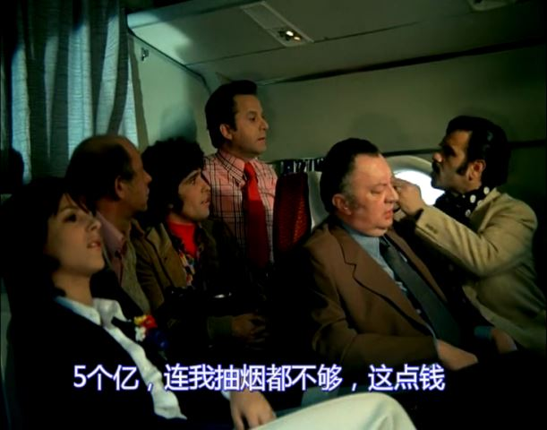

大结局就没劲了，狗男女没羞没臊地在一起。