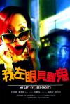

[我左眼见到鬼](https://pewae.com/gaan/aHR0cHM6Ly9tb3ZpZS5kb3ViYW4uY29tL3N1YmplY3QvMTI5OTM3NA==)

导演：杜琪峰 / 韦家辉主演：任达华 / 刘青云 / 应采儿 / 李珊珊 / 林熙蕾 / 林雪 / 郑秀文 / 黄文慧类型：喜剧 / 家庭 / 恐怖 / 爱情地区：香港首映时间：2002

片子出了没多久就在宿舍里看的压缩盘。大学时的常态是在自己宿舍看一遍，在隔壁宿舍再看一遍。因为我自己的显示器只有14吋。
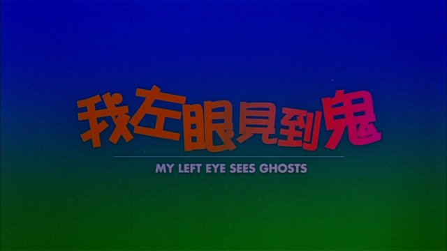

自从这个系列策划的那天，这部电影印象深刻的那个镜头就一直在名单上。只是由于记忆产生了偏差，我把这部片子跟另外两部绞在了一起，所以一直没能重温。另外两部以后有机会再写，单说这部片子，比另两部名气要大得多。我一直找不到的原因是把男主角错记成了冯德伦。当然是一无所获。
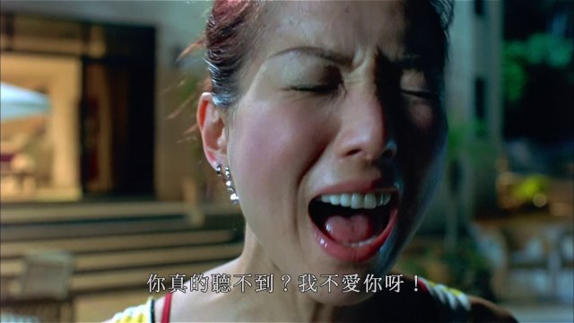

好在冯德伦这个衰仔比较仆街，产量小很容易就排除了。于是改为遍历另一个记忆点，侯焕玲女士。侯焕玲女士出演的电影数量至少是冯德伦十倍，但是用1999-2002加鬼片作为条件过滤，终于还是给我找到了。其实片子我一直就知道，既不冷门也不缺片源，产生灯下黑的现象的原因，是把片子打上了爱情片标签，而完全忽略了其鬼片属性。要不怎么说贴标签不是个好习惯呢。感谢侯焕玲。
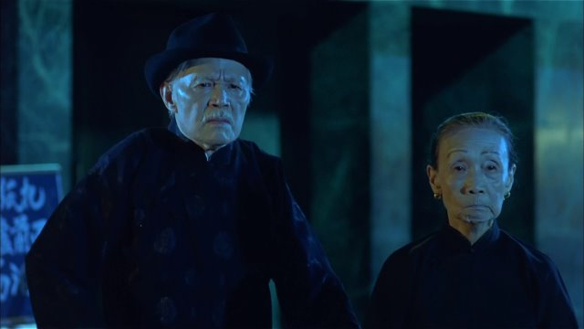

新世纪刚开始的5年，郑秀文超级超级红。在大学宿舍这种环境下，她的几部片子想不看都难。她接连出演了好几部银河映像的片子——《孤男寡女》、《瘦身男女》、《钟无艳》，这部《我左眼见到鬼》，还有后面的《百年好合》、《龙凤斗》。一方面我想不出有哪个女演员跟银河映像合作比她更多，另一方面她一部标准的银河类型黑帮片都没参与过。郑女士最红的那几年一到金像奖时间就有人给她鸣不平，并且借用谐音梗，说她如何如何《值得》。不给她倒也正常，无视古装和现代的区别的话，她那些年只演过一个类型，就是爱情喜剧，这种类型对评奖来说相当不利，你再好又能好到哪里去呢？当然郑秀文演技的确厉害，本片中她在泳池旁边的独白一场戏，深入人心。
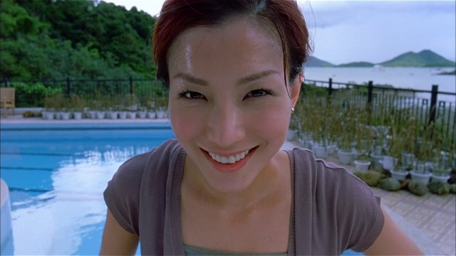
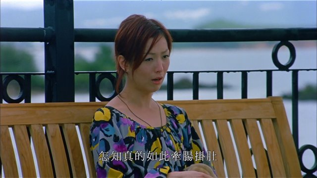

女二李珊珊，女三应采儿，客串的林熙蕾，哪个都比郑秀文盘亮条顺，但片中气场都矮了郑秀文一头。
李珊珊的固定人设就是讨人厌的神经质女二，我也记不住这部片子是不是此种固有印象的来源了。除了她那部出道电视剧里的“小棠菜”，一看到这张脸就觉得这人酸叽溜的，不好相处。
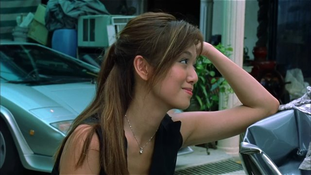
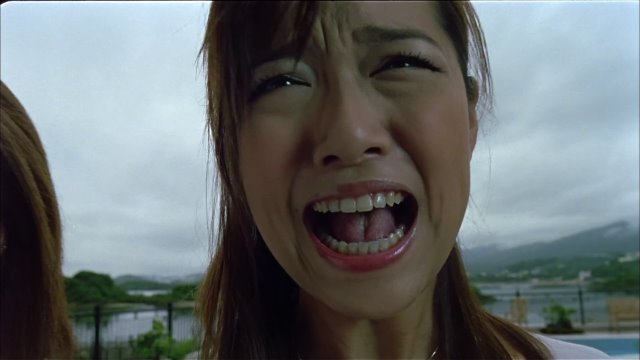

应采儿那时还是一枚青春无敌美少女。那年她才19岁，带有婴儿肥，被鬼上身的时候奶凶奶凶的。应采儿这辈子就没演过什么令人印象深刻的角色，本应是个被时代淘汰的小花瓶，现在还能被人记起，只能归结为爱笑的女孩运气不会差。
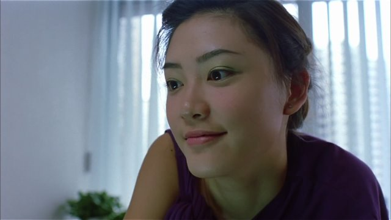
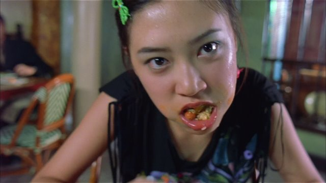
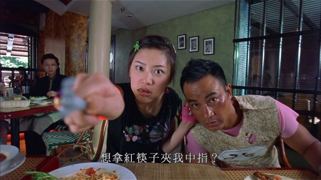

就像前面说的，本片是套了个鬼外壳的腐臭的爱情片。剧本大框架虽然俗套，不过小细节质量还挺高的，玩了个人鬼情未了的悬念故事，老公鬼把老婆推给新老公。银河映像的片子由刘青云担纲简直毫无波澜。刘青云片中的发挥不多，前半段装疯卖傻，后半段扮深情就够了。或者说这片子本就是大女主电影，刘青云只是个工具人。
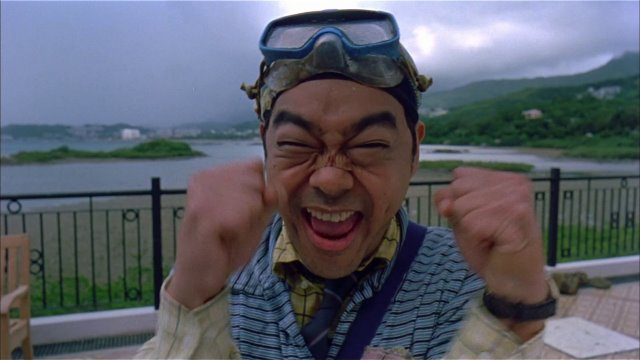

不知道杜韦二人不知谁来了恶趣味，给刘青云整了个《呆佬拜寿》（杜琪峰监制）的造型，致敬他自己。
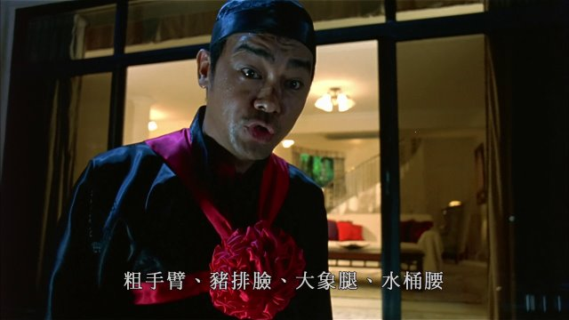

对郑秀文也恶搞了一下，《嫁个有钱人》是她半年前主演的贺岁片。
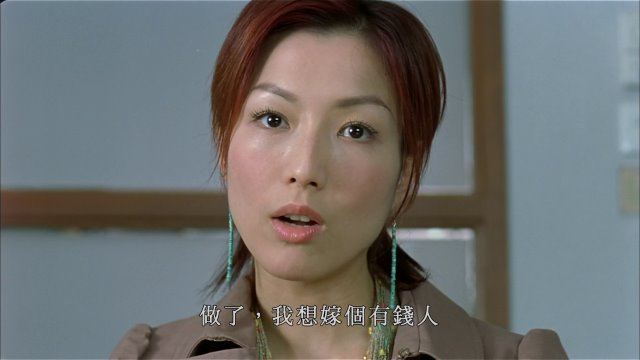

任达华林雪镜头都不太多，却是不可多得的银河映像招牌调味料。
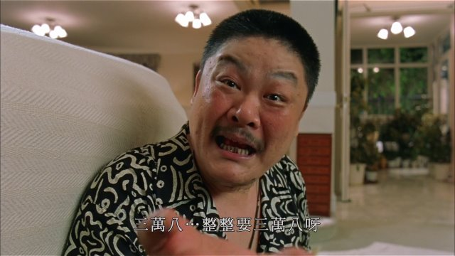
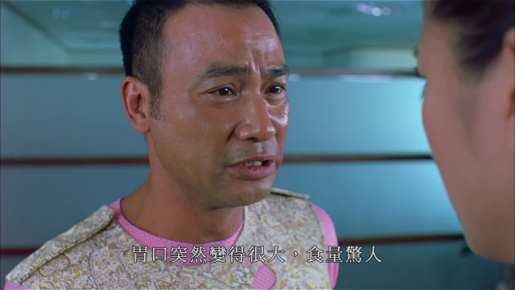

胖姑娘令人印象深刻，演员的名字是罗雪玲。
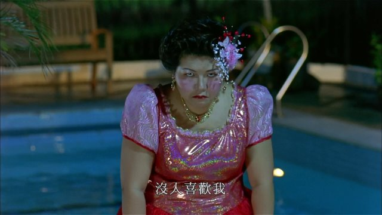

因为是时装剧，所以片里植入了一款减肥药。只是你觉得让王天林在片里吃这药能起到正面宣传效果？
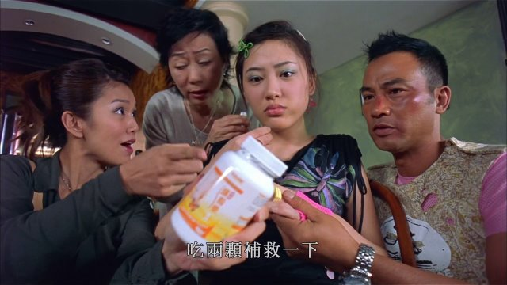
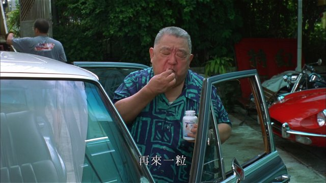

最后是我心心念念多年的记忆中的镜头：郑秀文为了救刘青云，跑去殡仪馆门口找有经验的鬼求助。老年鬼说没救了，小孩鬼说要把水鬼扔水里。老年鬼说小孩别打岔，小孩鬼说你死了几年，我都死了多少年了。
错误的记忆：~~冯德伦开天眼第一次见鬼，在泳池边看到老太太鬼吓个半死，转头遇见小孩鬼说这样的鬼我不怕，小孩鬼说老太太鬼才死了几年，我都死了多少年了。~~
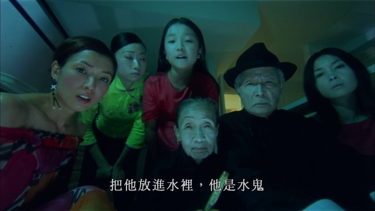
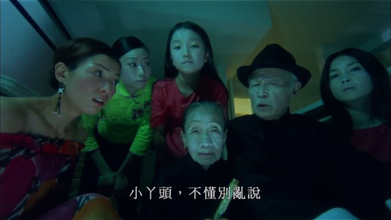
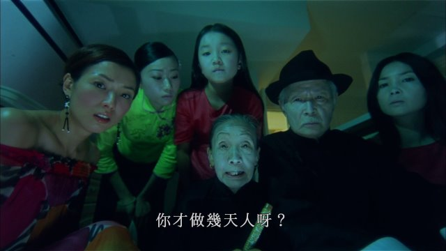
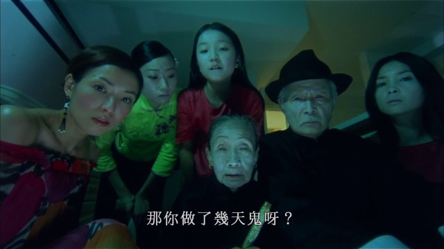
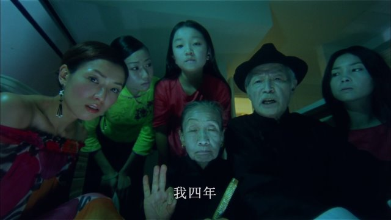
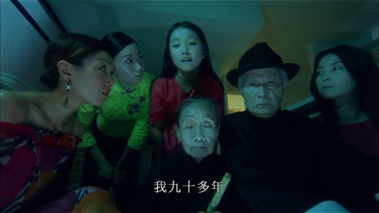

记忆中的镜头2：孟婆靓汤。
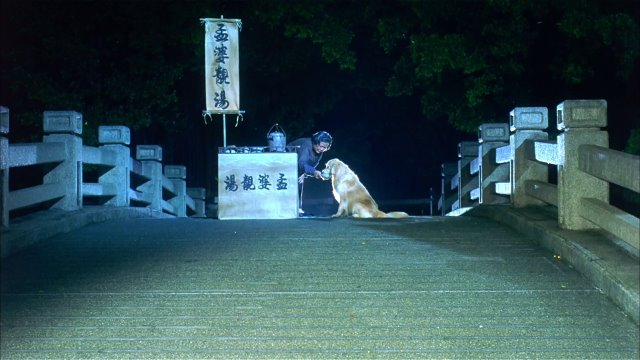