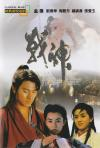

[战神传说](https://pewae.com/gaan/aHR0cHM6Ly9tb3ZpZS5kb3ViYW4uY29tL3N1YmplY3QvMTMwMDA2MC8=)

导演：洪金宝主演：刘德华 / 张曼玉 / 张翼 / 梅艳芳 / 王霄 / 钟镇涛 / 钱嘉乐类型：冒险 / 动作 / 爱情地区：香港首映时间：1992

这片跟[《大丈夫日记》](https://pewae.com/2020/06/review-the-diary-of-a-big-man.html)一块儿换回来，一块儿看的。所以本来也应该一起写。
但这部的质量实在是很差劲，好几次都提不起写的兴趣。刚好前两天找别的片子的时候偶然发现了一个高清版，才重启了计划。
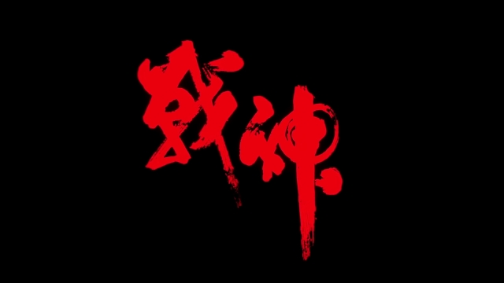

小时候看只觉得没劲，并没有途径获悉其背后的故事。现在一搜之下，才发现这片子背后的故事比片子本身有趣多了。九龙治水，能拍好才叫见鬼。
本片是刘德华自己开办的“天幕”公司投资拍的。号称6000万港元的成本。找来洪金宝大哥当导演，程小东、元奎做动作导演，庞大的武指队伍中还有钱嘉乐和倪星。所以当然有很多大场面的动作戏咯。只是四个主演都不是打星，也丝毫没有什么舞蹈功力在身，刘德华的动作作出来蛮丑的。
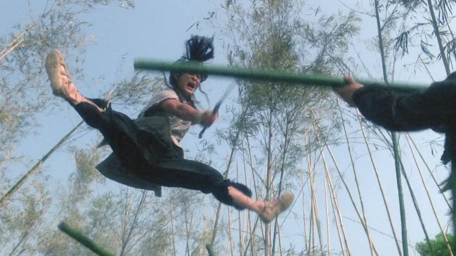

除了动作导演，刘德华还找来了两位文学导演。所以一些深沉的故事也要加咯。本身故事的主线是两个皇子为了争皇位而互相残杀，主角是B哥这一派的，代表正义一方。但文艺片出身的文学导演要加戏，就搞了好多双方其实是一丘之貉的台词。在动作戏之余，显得特别拧巴。光拧巴也就算了，就为了几句故作深沉的台词，需要一片野花田。香港据说找不到这样的实景，就花好多钱现种了一片出来……
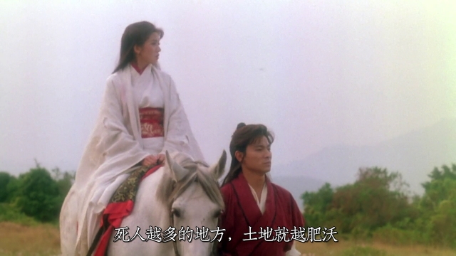

张曼玉那时颜值巅峰，怎么拍都美。据说张曼玉当时太忙，只能抽出两天来拍这个戏。于是洪金宝和程小东联合编剧连夜改剧本重分镜头，两天之内拍了一堆张曼玉穿各种服装的大脑袋和摆拍片段。后面的动作戏远景戏全是替身。有一场张曼玉和梅艳芳在古墓里交手的戏，借助现在的高清片源，能明显看出飞来飞去的是两个戴着假发的大男人。可能是因为张曼玉亲自拍的镜头太少，所以片头张曼玉并不算是主演，而是友情客串。
本片也是刘德华和张曼玉的最后一次合作。
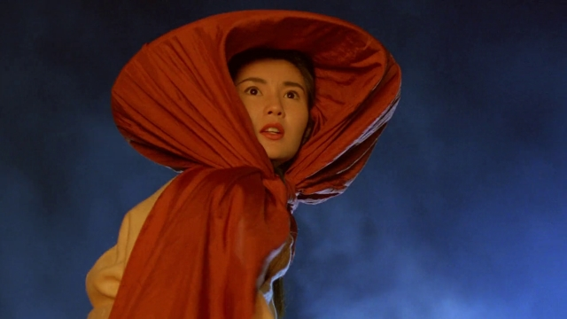
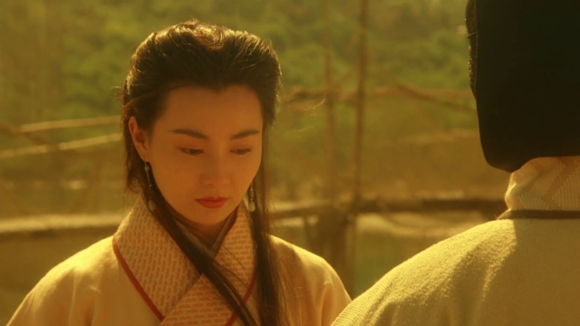

梅姑就很惨。先遭遇了她很难驾驭的王祖贤式的白衣女鬼套装，然后又遇上了不合适的发型和妆。小时候我还不怎么认识梅艳芳，只觉得这个女的好丑啊，凭什么跟张曼玉齐名！
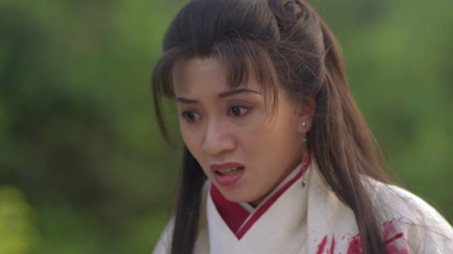
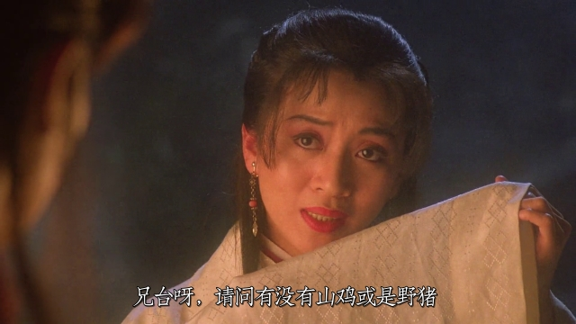

阿B哥一点儿也不出彩，就像演了个中年老干部。倒是反派专业户王霄还有那么点儿嚣张跋扈的感觉。
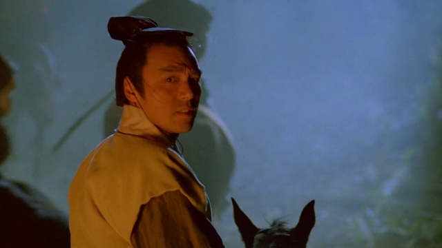
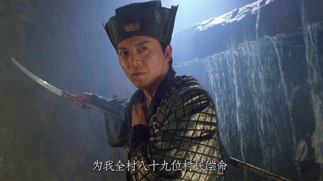

但还是很蠢啊，都当上皇帝了还半夜凹造型拉弓，拿弓弦勒属下脑袋玩。不好好在皇宫里待着是脑子有病吧。这段夜戏的音乐很赞。要说本片成本高，跟请大咖多有关的话，那么这些大咖里最物有所值的就是音乐指导黄霑。叶倩文唱的古风主题曲美极了。片子刚开始竹林的戏，刘德华唱的那首插曲《最自由是我和你》非常非常明快潇洒，但是很奇怪没收录在刘天王的任何一张专辑里。难道是刘觉得这歌晦气？
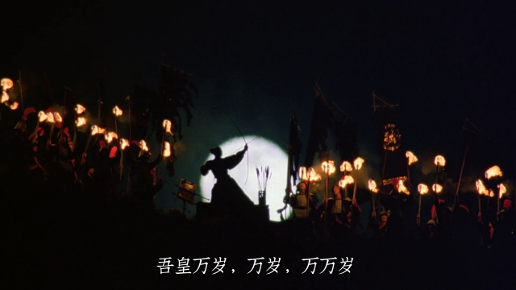

为啥说晦气呢？因为6000万的投资，票房非常糟糕，海外也没卖出去，刘德华裤衩都赔进去了。天幕公司就此破产，刘也走上了拍烂片还债的不归路。我其实是从本片才开始意识到刘德华有多敬业的。这片子里最大的明星其实不是刘德华，而是一只名叫“海威”的虎鲸。这头虎鲸是当时香港海洋公园的镇园之宝，片子里风头也盖过了任何一位主演。新鲜嘛！说《战神》几乎没人能想起来是什么片，但一说“刘德华跟鲸鱼/海豚演的那个古装片”，能想起来的小伙伴还蛮多的。
我当时看的录像版本是有花絮的，可以看出片子里所有刘德华跟虎鲸互动的镜头都是亲自上阵实拍的！面对满嘴细牙体重好几顿的庞然大物，刘德华要化身饲养员，这心理素质实在是钢钢地！
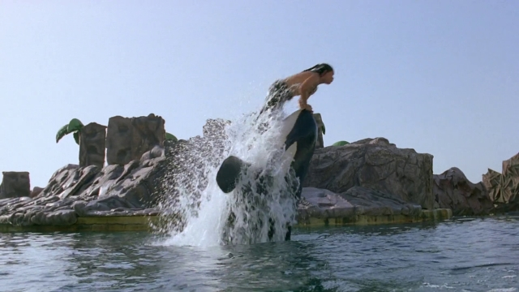
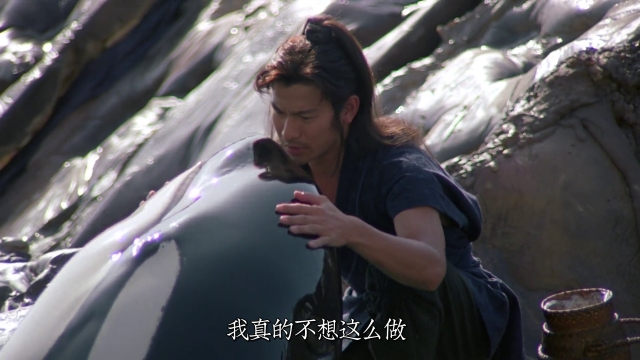

剧组还搭了一个皇陵的实景，为了给虎鲸安排上戏，里面有瀑布有水池的。据说这景就花了2000万港币。
且不说谁家的陵墓里会有瀑布，单说这碑就一言难尽。也就骗骗标清放映厅的九十年代做题青年吧。
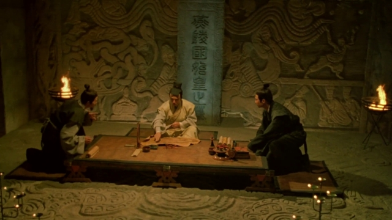

剧情实在是没什么剧情。就匡匡打+狗血的四角恋爱而已。
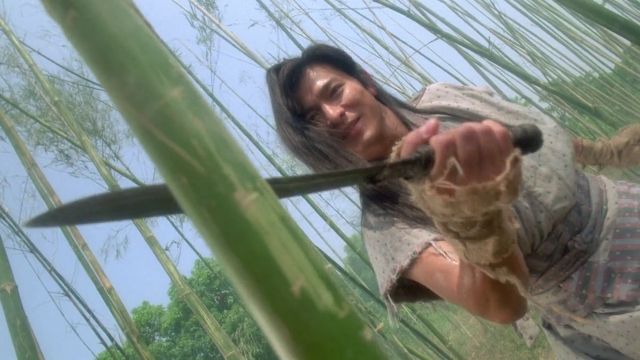

记忆中的镜头：主角队伍被团灭，大反派在立死亡flag满嘴乱喷之际被鲸鱼一尾巴呼在脸上。
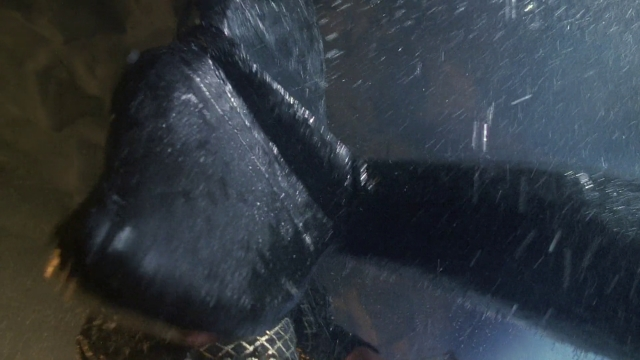