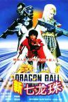

[新七龙珠](https://pewae.com/gaan/aHR0cHM6Ly9tb3ZpZS5kb3ViYW4uY29tL3N1YmplY3QvMTc4MjAxNy8=)

导演：陈俊良主演：李宜娟 / 欧兰英 / 江龙升 / 胖三 / 苏沅风 / 谢金燕 / 郑同村 / 金涂 / 陈子强 / 黄仲裕类型：动作 / 奇幻地区：台湾首映时间：1991

这片第一次看应该是在92年的暑假，劫持辽台的信号的《[方正剧场](https://pewae.com/2016/03/unlimit_pain_and_happiness_made_by_signals.html)》里看的。
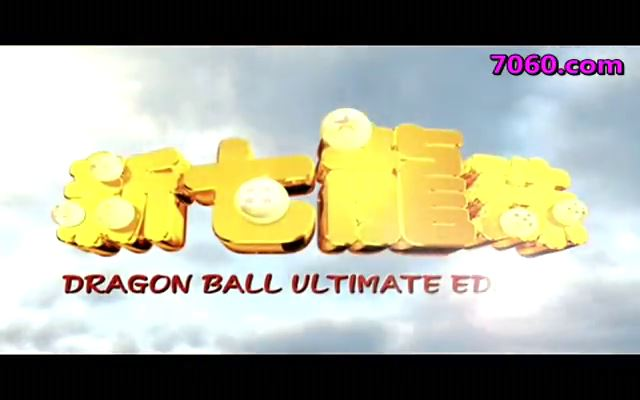
彼时龙珠漫画大火，协弃市能收到的信号范围内还没播过龙珠动画，而这部片子大约50%忠于原著，所以看着非常亲切。
后来才知道，这片根本是盗用IP，鸟山明和集英社没在这部片子上收到过一毛钱！话说台湾至今也没加入国际版权公约。

演的布尔玛、悟空和乐平的演员当时都是十六七岁，剧情单线化，台词模式化，动作夸张化，一看就是给小孩拍的。再品品，这熟悉的模式，不就相当于现在我闺女看的《巴拉拉小魔仙》大电影嘛！
先说说主角吧。可能悟空的刺猬头实在不好表现，给改成了MJ式的满头小卷儿，服装倒是忠于原著的。
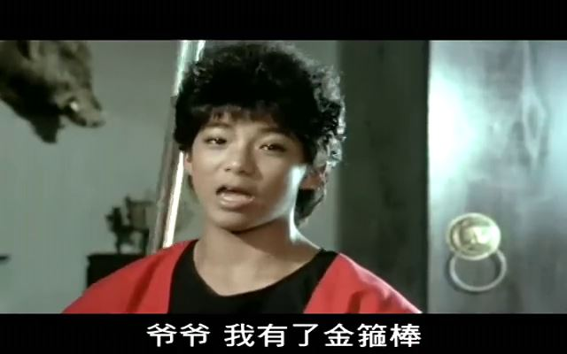

布尔玛是星二代谢金燕演的。总觉得十六七岁的时候是谢金燕的颜值巅峰，后来越长越歪歪。
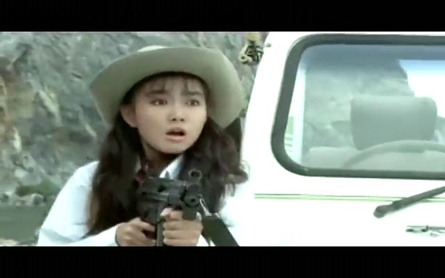

乐平算男二吧，乍一看还有点小帅。像年轻版的黄磊？反正这三个主演里，两个男主演没挺到新世纪就销声匿迹了。
乐平肩膀上的鹦鹉，是代替普尔的角色。可能制作方是觉得以当时的技术搞一只猫出来太难了吧。鹦鹉名叫“白冰冰”，出了台湾就没人知道这个梗了。
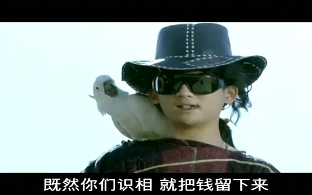
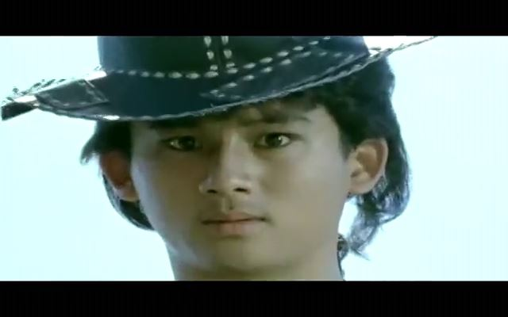

小八戒出场的时候保留了色色的设定，记得漫画里是变了个怪物，而这里改成了一只黑色的猪状物——这也太能糊弄了，“乌龙”并不等于是“乌”的啊！
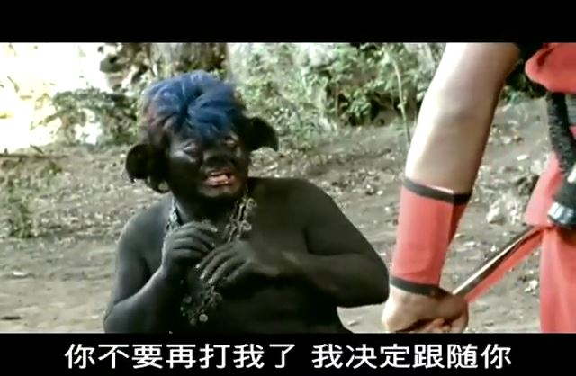
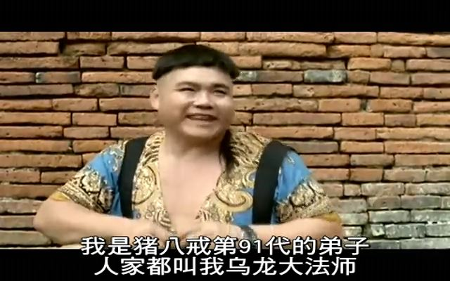

龟仙人的扮相跟原著简直一模一样，是片子里最大的亮点。
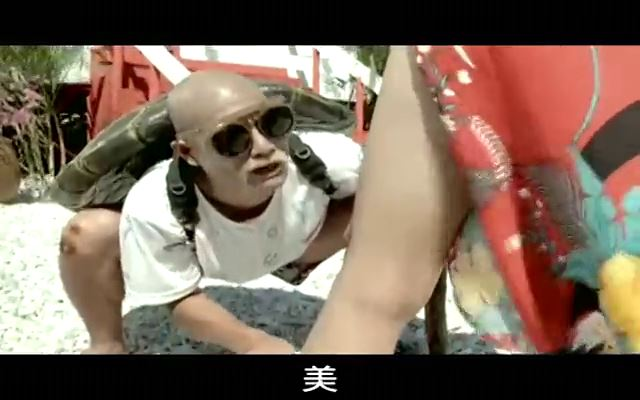
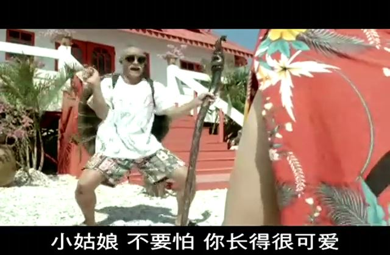

值得一提的是这部电影的电脑特效，属实是下了功夫的。比如片头这条龙，国内公司大概得到93年才能做出这样的水准。中间外星人的飞碟啊、乌龙变的蝙蝠啊，虽然现在看上去一眼假，但在当时算是顶尖的了。估计制作方也挺自信的，把中间大约2分钟的悟空和乐平的对决做成了CG，赤裸裸地炫技——这技术在现在看来很尴尬就是了，也就大专毕业实习生的水平。
横向比较一下吧，大约同时期的《封神榜》，号称采用了当时最先进的电脑技术制作特效，结果表现所有神仙妖怪祭法术的时候，就是用个喷桶工具划一条直线而已。
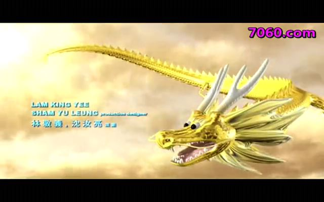
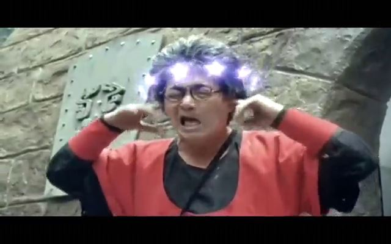
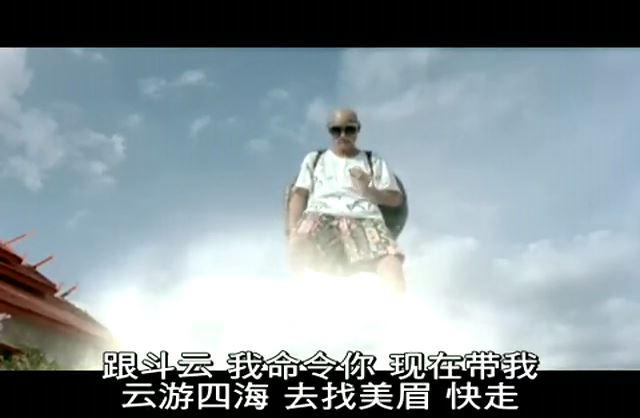

反派应该是在皮拉夫一伙的基础上改的。两个小弟的造型看上去非常山寨。
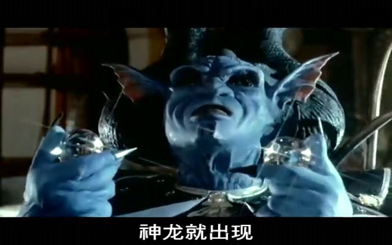
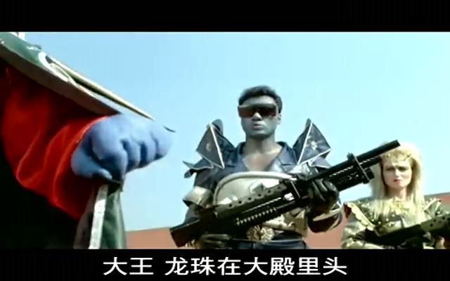
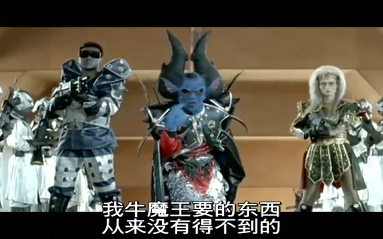

因为低龄向，所以主线进展的很慢，无关主题的插科打诨比重非常大。一些原著的经典段子直接扒过来用了。
配合萌萌哒台普，感觉还蛮可爱的。
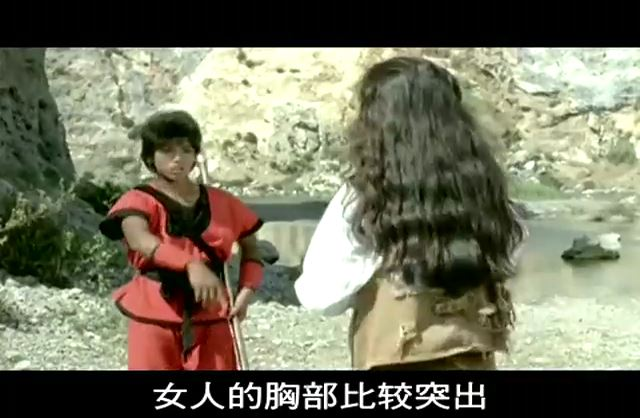
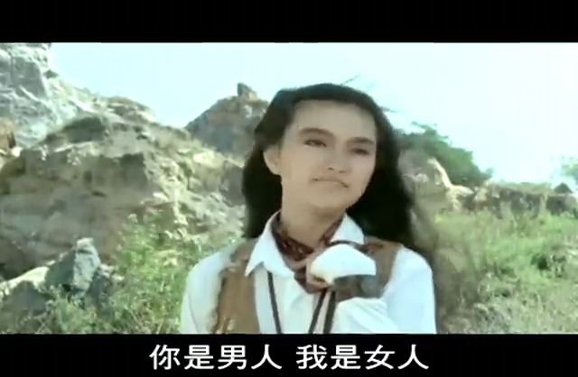

还有什么悟空抓鳄鱼，龟仙人乌龙好色，乐平怕女人，筋斗云要好孩子才能坐之类，看着很亲切。
主线就很蛋疼了：外星人占领了有龙珠的国王的王国，把国王往后弄死了，把龙珠抢了，被公主跑了。
公主逃跑的过程中恰好遇到了有龙珠的悟空布尔玛乌龙乐平龟仙人，集齐队伍反攻。
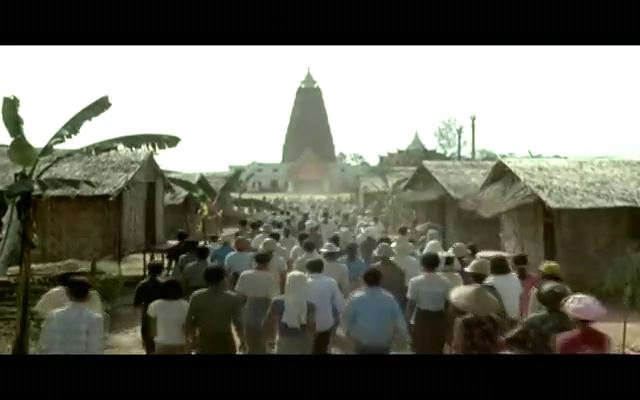

无聊地打打打，先打小弟再打BOSS，BOSS很厉害大家车轮战到并肩一起上，套路化严重。
也有跟原著背道而驰的设定。比如悟空跟乐平都会飞。要是真这么牛叉，22届就不会被天津饭打那么惨了。
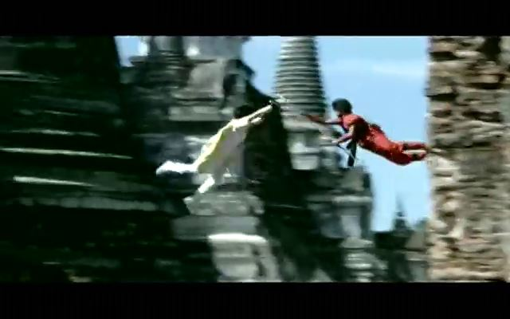

最后BOSS的死法很有创意——把七颗龙珠一股脑喂到BOSS的肚子里，神龙出现把BOSS给撑爆了！
遗憾的是初期的神龙只能满足一个愿望，把死掉的人都复活了，没能重现“我要内裤”的经典画面。