[新扎师妹2](https://pewae.com/gaan/aHR0cHM6Ly9tb3ZpZS5kb3ViYW4uY29tL3N1YmplY3QvMTMwODIzMg==)

导演：马伟豪主演：吴彦祖 / 周聪 / 张英才 / 杨千嬅 / 林雪 / 森美 / 蒋怡 / 许绍雄 / 郭晓冬 / 黄浩然类型：喜剧地区：香港首映时间：2003

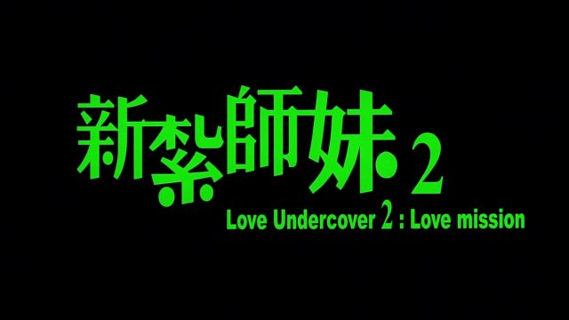

2004年4月，我工作后的第一个春天。
当时的海事局项目要到全国各地实施。此项目属于眼瞅着收不上来钱的将死项目，老员工都找各种理由不愿意出差，部门领导只好派了5个新员工出来抗雷。海事局嘛，出差地点都在沿海沿江，或者京畿[[1]](https://pewae.com/2024/04/review-love-undercover-2.html#inner_anchor_1)。我负责江浙沪，第一站是浙江。那时公司控制成本，去杭州不能坐飞机，而是坐了24小时的火车先去上海，然后坐长途客车到了杭州。在浙江我要跑5个地方：杭州、宁波、舟山、台州、温州。前面4站有浙江省局出人出车陪着。不过那哥们是台州人，加上临近五一，最后一站他没跟着我跑，假公济私，直接猫家里过节了。我需要自己搭长途客车从台州前往温州。
不算大学期间因为买不到火车票而坐过几次沈阳到大连的虎跃快客的话，这次差旅的上海到杭州是我第一次单独坐长途，台州到温州是第二次。下午3点多从台州出发，没上高速就下起了小雨。当时我身上唯一的娱乐设备是3P哥借给我的GBA，那玩意儿不带背光，天色暗的时候根本没法玩。并且，浙江南部多山，雨中钻山洞这件事搞得本大巴菜鸟心情颇为紧张，注意力便自然而然地转移到了车上播放的电影上。
正是这部《新扎师妹2》。
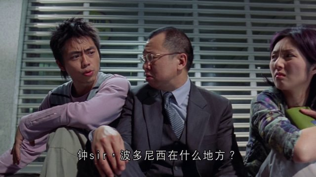

然而这部跟前作根本无法相提并论。可能是因为合拍的原因，上海的部分跟香港结合得非常生硬，大陆演员（郭晓冬）也是明显的合不上拍。
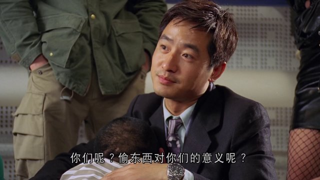

虽然保留了黄浩然、森美、黄泆潼等人在内的第一部的原班人马，但第二部的剧本实在太差了。前作那种润物无声的笑点消失殆尽，除了一两处好笑以外，剩下都很生硬。
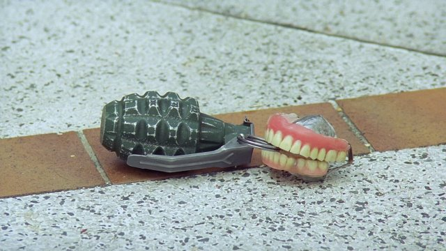

杨千嬅本来就不是美女。第一部里利用身份的冲突制造出来的呆萌，在第二部里就真的变得傻呵呵了。很多场景就像在用傻笑凑戏份一样，杨小姐也开始在“大笑姑婆”的道路上渐行渐远。

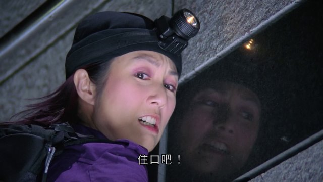

吴彦祖帅中总带着丝丝疲惫，只是一只好看的花瓶。本片里他完全是飘着在演，毫无真情实感。甚至可以说，除了《新宿~~地带~~事件》以外，我就没对阿祖的演技留下过任何印象。

剧情发展很长的一段时间里，上海的杨千嬅吴彦祖跟在香港的配角夕阳红劫匪团是完全脱节的。许绍雄周聪们第一部再怎么出彩，也不应该给他们安排这么多单独的戏份，实在是太影响主线进程了！
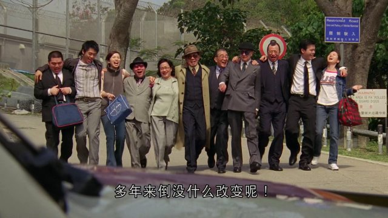
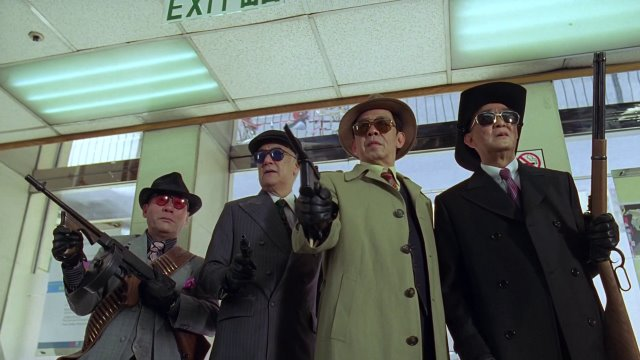

唯一的亮点就只有饰演波多黎西小王妃的蒋怡了。可惜戏份不多。相当长一段时间里，把蒋怡和蒋欣的名字记反了。到2008年无意中看到香港一档美食节目以后才认清，白胖的是蒋欣，黑瘦的是蒋怡。

记忆中的镜头一：我以波多黎西最高的荣誉赏赐你们：亲吻我的右脚。（片中出现两次）

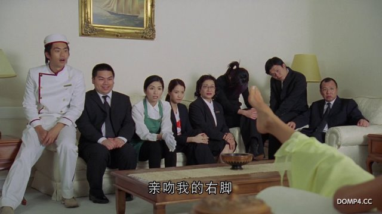
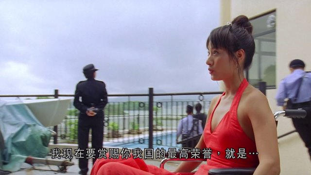
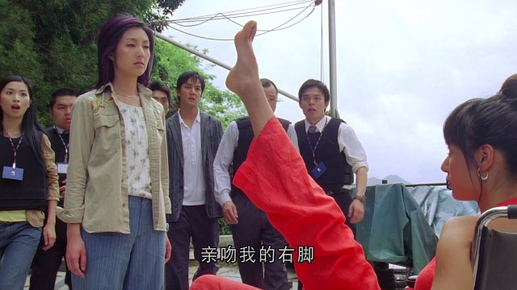
记忆中的镜头二：上海的夜景堪比上海的日景啊！（我并不确切地知道这是哪里，但是几天后我坐长途进上海路过了这个地方。）
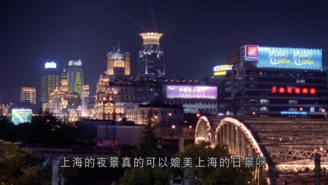

---

- [(1)](https://pewae.com/2024/04/review-love-undercover-2.html#inner_ref_1)：五人分工：辽冀鲁，津京，江浙沪，闽粤桂，深圳+长江（武汉）