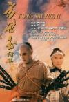

[方世玉续集](https://pewae.com/gaan/aHR0cHM6Ly9tb3ZpZS5kb3ViYW4uY29tL3N1YmplY3QvMTI5NTQ4NQ==)

导演：元奎主演：元奎 / 李嘉欣 / 李连杰 / 萧芳芳 / 计春华 / 郑少秋 / 郭蔼明类型：动作 / 古装 / 喜剧 / 武侠地区：香港首映时间：1993

准备好的那部上次被我亲哥一句留言喊破了，不爽，只好换个片子耍耍。
这次破例选了一部只要经历过那个年代，就一定看过的热门片。
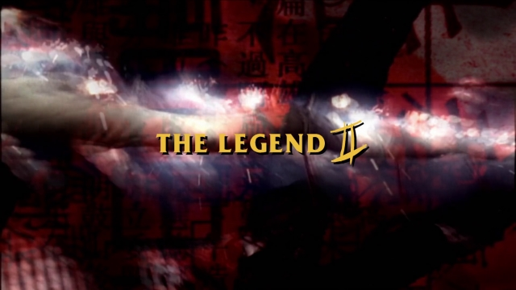

这个话题开展了这么久了，还有哪位有头有脸的明星还没出场？
——李连杰。
其余人等，尤其港星，无论大牌小牌，友情客串也好、特别演出也罢，总还是露过脸的。唯有李连杰，在去好莱坞之前，是真没演过配角。因此如果不专门搞他，那就真的是出现不了。
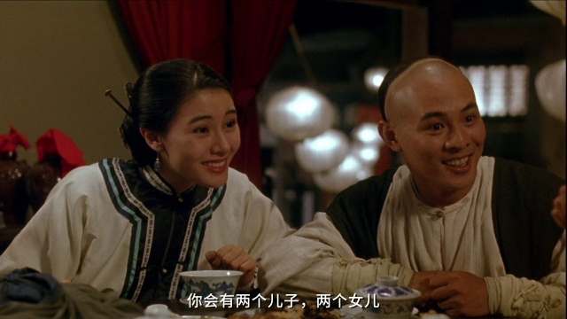

在我还看电视的年代里，六公主的“动作片剧场”简直就是李老师的后花园，《方世玉》、《黄飞鸿》、《新少林五祖》、《精武英雄》、《倚天屠龙记之魔教教主》、《中南海保镖》这些，最少看过十几二十遍。有点毫无根据的小猜测，李连杰算是大陆出去的，多少也算是为国扬威？
那就挑一部印象最深的吧，这是1993年秋天，初中入学后的第一部包场电影。
剧情近乎于没有，就是方世玉泡妞打架的简单故事，套了个乾隆身世的老掉牙的背景。
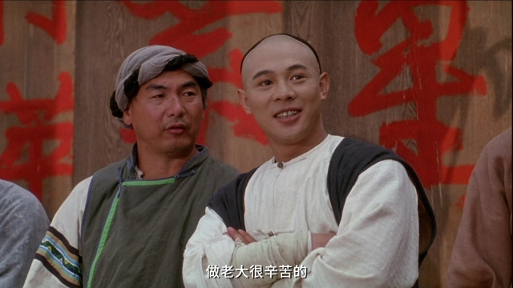
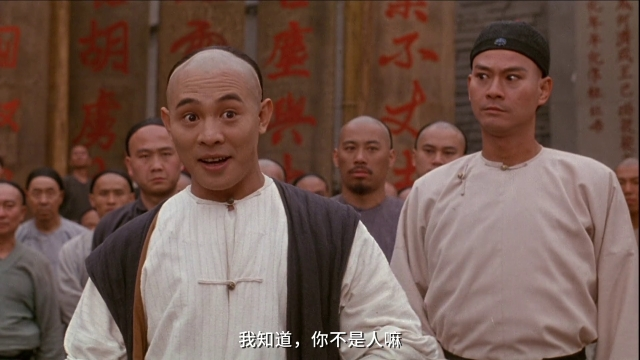

李先生的功夫自然是无可挑剔的，但若要论演技，也就只能算个稳当。试想黄飞鸿跟方世玉有啥区别，琢磨半天，可能是方世玉的骚话要稍微多一点吧。李先生的动作戏就是票房保证。不仅要打，还要打得漂亮。片中李连杰的动作戏名场面大约三处：跟东洋浪人抢锦盒；持刀蒙眼闯红花会，以及最后的母子板凳BOSS战。不用管别的，帅就完了。
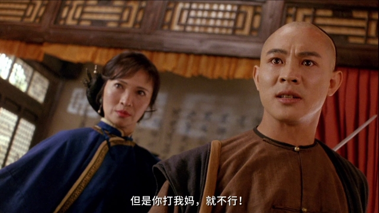
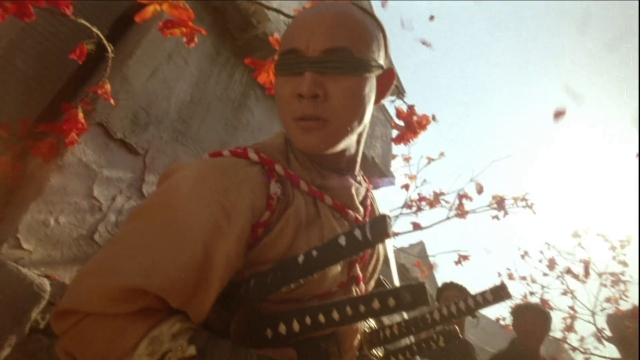

《方世玉》系列并不是李连杰的第一序列代表作品，但确实是元奎先生的生涯巅峰——无论作为导演还是演员都是。
作为导演，元奎在本作里非常有特点地跟木头架子干上了。从一开场舞火龙的木楼，到战浪人的水车，再到抢亲的高轿子，再到最后救妈的板凳阵，动作戏里有75%都在跟木头较劲。
作为演员，元奎亲自出演苗翠花的师兄。“安全第一”是他的口头禅。他演起老实人来都不用怎么夸张，只靠那张敦厚的脸就能完全入戏。跟萧芳芳的对手戏真是爆笑全场。
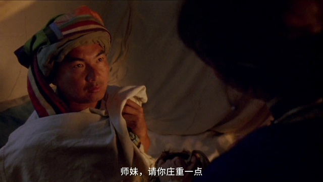
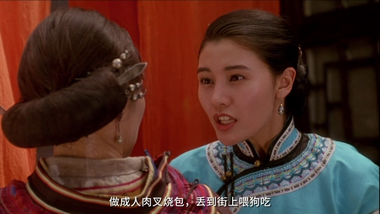

一般来说续集无论如何是比不上第一部的。但这部续集在我心目中却要远远强于第一部。影院加成那是必须的，但更重要的原因是：萧芳芳开挂了。
萧芳芳是我往上一两个时代的女明星，1993年的时候，她已经46岁了。剧本的烘托之下，她把一位全心全意为儿子着想的母亲形象塑造得具体生动。彼时伴随着“世上只有妈妈好”的音乐，全班女生和个别男生洒泪当场。啥？我当然是看见了。那时候刚入学，还不怎么熟悉，黑暗的环境下正是寻么美女的最佳时机啊！
印象最深的时刻就是萧芳芳被掼得满脸鸡蛋还要维持表情，这种镜头真不是一般人能坚持下来的。
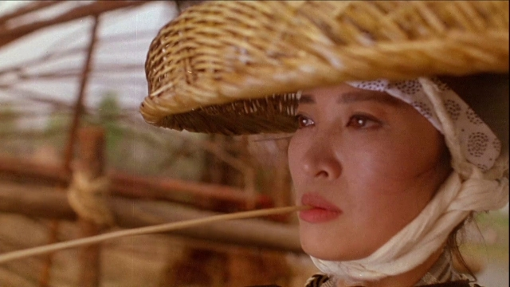
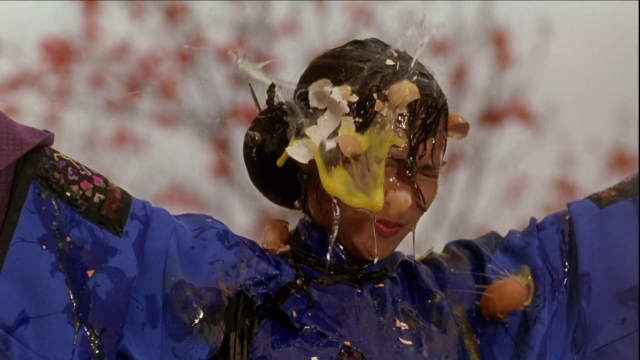

不能不提的还有天赋异秉的计春华。他的一张没有眉毛的妙脸在本作里发挥里最大的作用，那就是讨打！
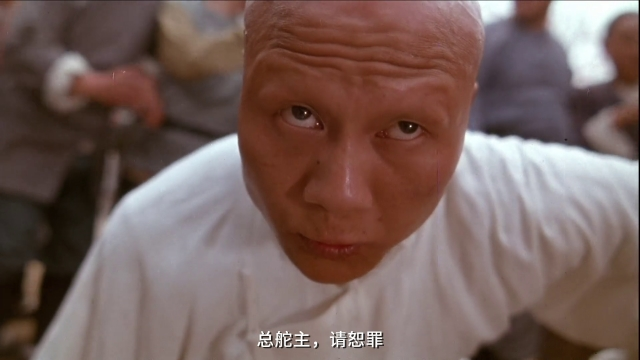

另外还有“最丑港姐”郭蔼明。除了脸不如李嘉欣水灵，其余无论手眼身法步都强过于李嘉欣太多太多。可惜这位嫁给刘青云后出现的次数就日渐稀少了。
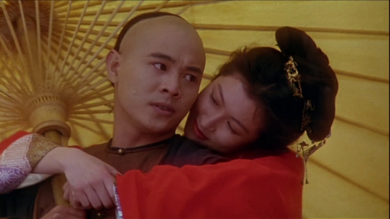
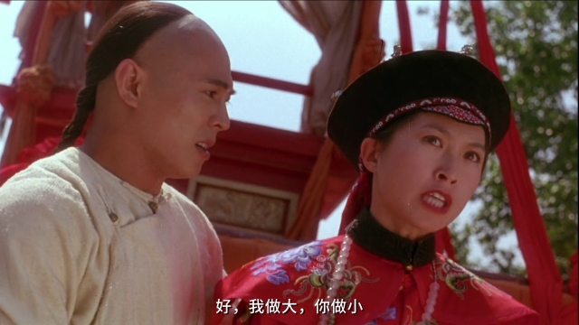
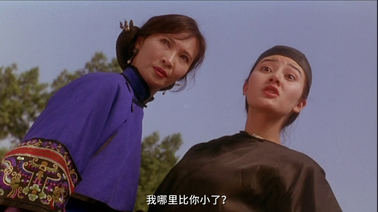

记忆中的镜头：
被点穴的母鸡。
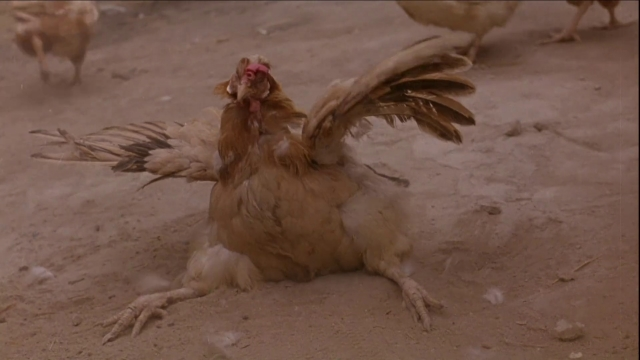

看我的口型：
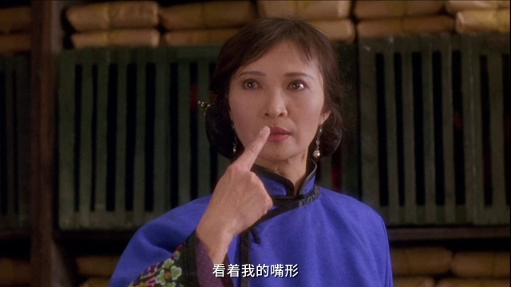
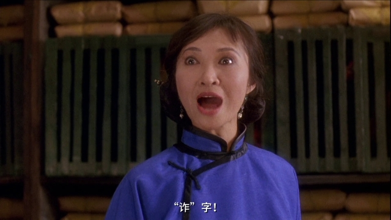