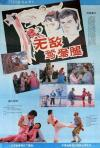
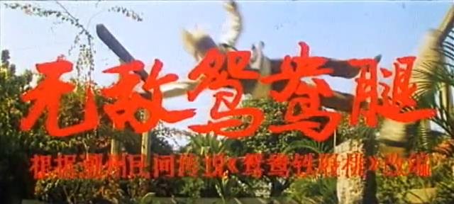
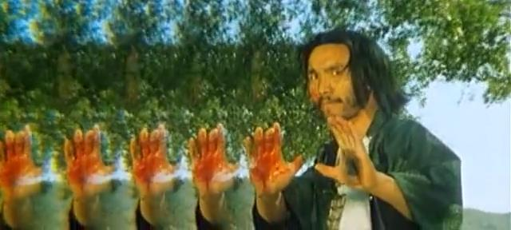
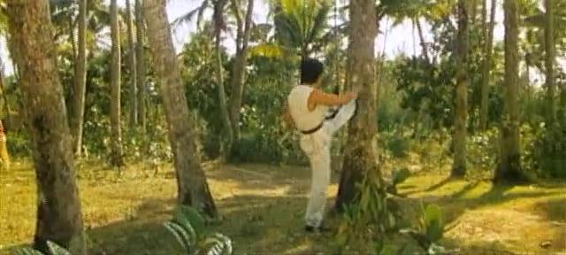
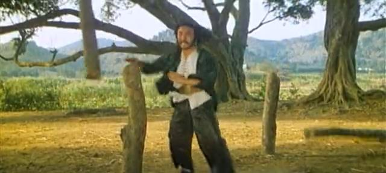
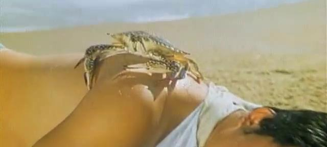
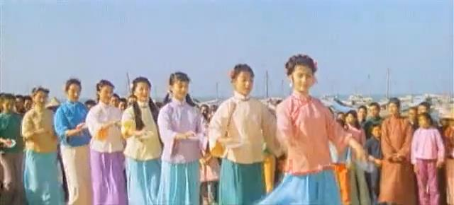
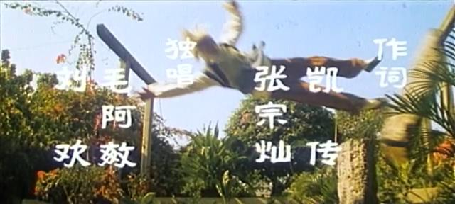

上次跟路易斯互动之后，就有把这部提前的打算了。今天终于把坑填上了。真提前了。

[无敌鸳鸯腿](https://pewae.com/gaan/aHR0cHM6Ly9tb3ZpZS5kb3ViYW4uY29tL3N1YmplY3QvMjAwNDI1Mw==)

导演：李文化主演：李光 / 王群 / 王赤类型：动作地区：大陆首映时间：1988

对于我来说，这是一部非常有纪念意义的电影。这部片子是我小学二年级的时候看的，学校即使不是在一上映就组织观看，也没隔太久。
放映的那天，电影院先放了大约半个小时的交通安全教育片，尽是写血淋淋的事故现场，压粘的或者烧焦的尸体毫不避讳地呈现在祖国的花朵面前。可能从那时起对血浆就建立免疫了。

这部片子有个头衔。好像是“第一部国产6声道立体声宽银幕彩色武打故事片”。定语很多，所以这头衔也就没那么值钱。

上次说《蛇形刁手》的时候，查到袁八爷曾自夸片子的文戏好，重温的时候还没觉得什么；这次重温《无敌鸳鸯腿》，对比之下才发现《蛇》是真好。尽管两部片子相差了十年。要么说他们嘴里经常说“全是同行抬举”，并不是一句客套话吧。
换句话说，这剧情是真土。
主人公老爹被会黑沙掌的大反派弄死了，找人学艺想要报仇。偏巧就遇到了一个会号称黑沙掌克星的鸳鸯腿的姑娘，偏巧就跟姑娘的爹学了鸳鸯腿，偏巧师傅也被黑沙掌打死了（这还叫克星？），偏巧姑娘爱上了男主，偏巧俩人苦练了几个月就能打过黑沙掌了，偏巧黑沙掌手底下二三十号人就是不群殴非要跟男女主人公单挑，偏巧黑沙掌放大招偷袭姑娘档了枪眼，偏巧主人公马子被弄死必爆发定律得到验证，大结局。

动作设计得可谓乏善可陈，偏偏剧情不够打戏来凑，几乎从头打到尾，直看得人昏昏欲睡。不过小时候倒还觉得挺热闹的。尤其是两方面的绝招。黑沙掌放大招前在胸口连续做太极拳的抱球+南斗水鸟拳的起手式，然后向左右两方伸出手掌，掌心对敌。两掌心一红一黑。
这可不是五毛钱特效，当年这种效果要用一种特殊的镜头，着实不便宜呢！

鸳鸯腿相对好练一些，要先两腿分叉呈圆规立，也就是拳皇里king的那种姿势。然后非重心脚脚尖在地上画三个圈，然后用力踹即可。
因为片中男女主人公曾经苦练这个绝技，所以看完电影之后小伙伴们也有样学样地跟着练习——天天中午吃完饭在学校里踹树。

黑沙掌也能把树打断。我就不明白了，说一个坏人厉害，干嘛要那木桩子做假想敌。

小时候印象最深的一个镜头，小屁孩笑点低。
当年男主人公的名字被记成“鸭蛋”，这次重温听着像“亚泰”，豆瓣上说叫“家泰”。算了，这不重要，人家是立体声大片才重要。

还有个遗憾的事。话说女主来自一个街头卖艺的舞蹈队。这个舞蹈队在潮汕一代巡回演出，演出的项目是——碟子舞。
我就不明白了，即使在清末民初，人们的业余文化生活也不会无聊到看碟子舞还付费吧。
舞蹈不是重点，重点是这批姑娘除了女主都被黑沙掌抓走了。后来跑出来一个，对着女主呜呜哭。小时候就琢磨，她们被抓去干嘛了呢？到了网络一查，果然同样的故事，香港是拍过三/级/片的。可资料太少，终究没搜到姊妹篇，甚憾。

最后说一片里的音乐。看到这两尊大神没？毛阿敏的片尾曲磅礴大气，与一贯的风格一致。刘欢的插曲就有意思了，烟嗓摇滚风，在他的作品里算凤毛麟角。

在电影频道还没创建的日子里，这部电影经常在CCAV2的周日下午四点档重播，也算放烂了。有了电影频道后倒没注意过有重播。