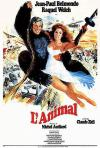

[替身演员](https://pewae.com/gaan/aHR0cHM6Ly9tb3ZpZS5kb3ViYW4uY29tL3N1YmplY3QvMzcwODI5OC8=)

原名：Lanimal导演：Claude Zidi主演：Raquel Welch / 克洛德·夏布洛尔 / 简·伯金 / 让-保罗·贝尔蒙多 / 达妮·萨瓦尔类型：动作 / 喜剧 / 爱情地区：法国首映时间：1977

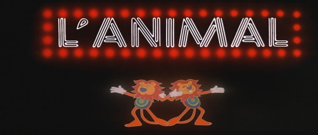

这次主要为了怀念上个月去世的法国艺术家——让-保罗·贝尔蒙多先生。
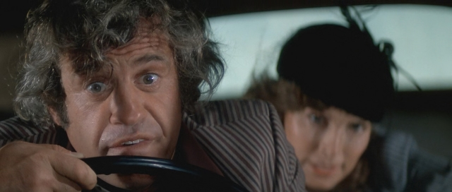

贝尔蒙多活跃在上世纪六七十年代，本不应该跟我这个年龄产生什么交集。但中国有个神奇的东西叫“译制片”，这东东从上世纪的八十年代风靡到九十年代前期，从我大爷那样的40后到我这样的83前，对于译制片拥有共同的回忆。而贝尔蒙多先生恰好是法国译制片中的一位标志性人物。他拥有一张辨识度非常高的脸孔，被称为“法国最丑的美男子”。并且贝先生被窝里放屁能文能武，不仅演得了文艺片和搞笑片，在动作片方面也很擅长。据说他拳击运动员出身，号称特技镜头都不用替身的。本片里有一段跟老虎的对手戏，还有一组站在飞机上的镜头。经本人鉴定，近景都不是替身。如果说老虎是个头比较小的华南虎，安全能够保证的话，那么从直升机垂下的软梯跳到飞机上，并在飞机上站立这场戏就真的很硬核。
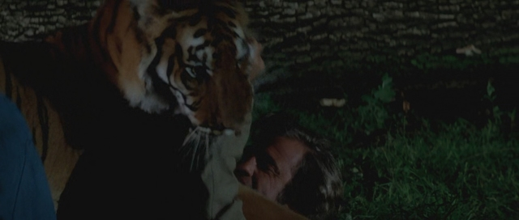
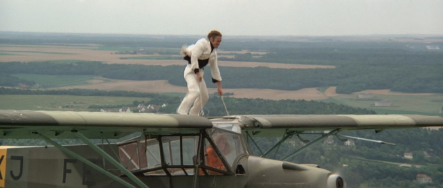

1994年左右的协弃教育台大抵会在每个周末播放一部译制片，且以喜剧类型的居多。第一次看这片应该就是这出处了。官方记录显示本片虽然拍摄于1977年，却是1993年才译制完成，故而我在95或94年看，真不算老。最可惜是没找到本片的配音版片源，法语原声+英文字幕看着好吃力。好在法国喜剧片还是以动作和情节为主，忽略台词梗完全没影响。
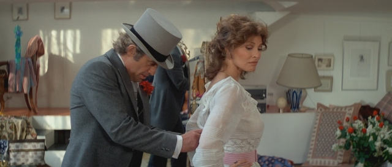

我对本片的所谓深刻印象其实来自一段错误的记忆：“贝尔蒙多跟大猩猩演了一段电影。”然而重温后才发现，正确的表述应该是：“贝尔蒙多和很多动物演了一部电影，其中贝尔蒙多扮演大猩猩。”
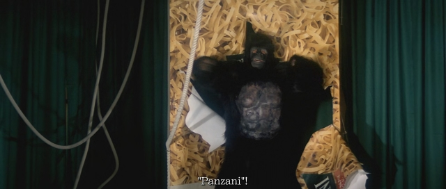

也不对了啦！
正确的故事是，贝尔蒙多A是一个散漫且鲁莽的特技演员，他未婚妻也是一位特技演员。在一次拍片中因为他漫不经心地秀操作，导致两人双双受伤。于是媳妇跟人跑了，工作也没了。贝尔蒙多A只能靠坑蒙拐骗以及打零工糊口，比如在超市里扮演大猩猩促销意大利面。后来电影公司找来胆小如鼠的意大利电影明星贝尔蒙多B。制片方为了拍贝尔蒙多B的特技镜头又把贝尔蒙多A给找了回来。最后贝尔蒙多A借拍片机会又把未婚妻给勾搭了回来。
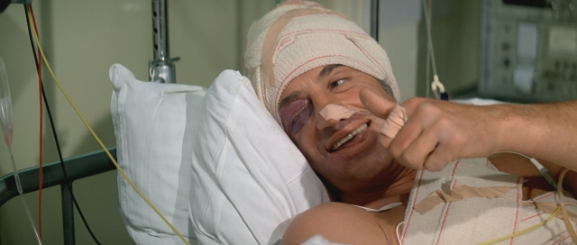

没错，贝尔蒙多A和贝尔蒙多B是一人分饰两角。主要差别是头发颜色不一样，以及贝尔蒙多B是个基佬，穿花花衣服抹眼影。某瓣上有人说这片现在不重播了就是因为这个基佬角色政治不正确，对此本人表示不置可否。
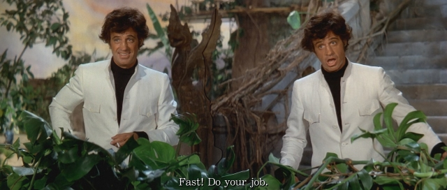

片里有很多动物朋友，都是拐走未婚妻的贵族大款养的。除了前面提到的老虎，还出现了大象、狮子、狒狒和马来熊。仿佛法国人和苏联人是地球上最喜欢跟动物朋友一起拍电影的民族。犹记贝尔蒙多还有一部电影，主要配角是一个小孩和一只熊，但完全想不起那片叫什么了。
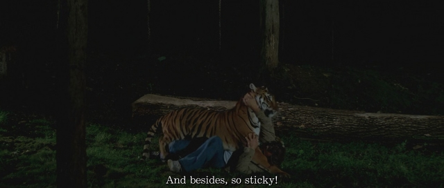

下面是本批次的温故知新。欧洲电影嘛，一言不合就发福利的存在。我实在是记不住当年电视台看的版本下面这镜头是否被剪掉了。即使没剪，估计在当时300度近视的我把脸怼在20吋50Hz576线隔行扫描的屏幕上这个一秒的镜头我也是啥都看不清。就感谢技术的进步呗。
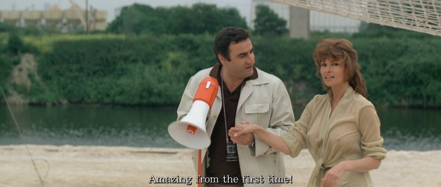

记忆中的镜头：贝尔蒙多A反复从台阶上摔下的戏中戏。
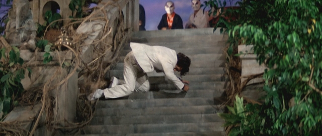