[最佳女婿](https://pewae.com/gaan/aHR0cHM6Ly9tb3ZpZS5kb3ViYW4uY29tL3N1YmplY3QvMTQwMDY2Ng==)

导演：黄华麒主演：吴耀汉 / 周星驰 / 廖启智 / 张学友 / 张敏 / 梁荣忠 / 沈殿霞 / 胡枫 / 莫少聪 / 郑欣宜类型：喜剧地区：香港首映时间：1988

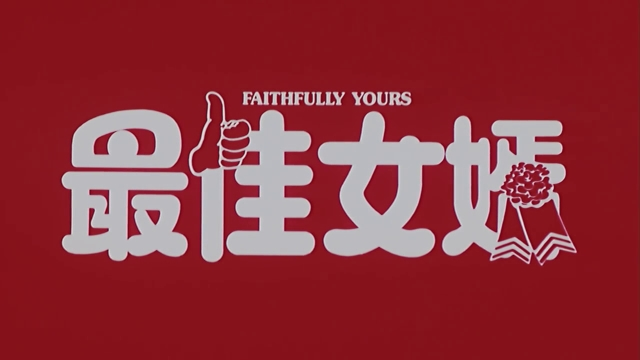

本片是很平庸的量产喜剧片，所以我还是先说故事吧。
那是在1992年春天的一个周二。学校忽然放假半天。其实是提前一天通知的，但我根本没跟家里说。周二半天是很痛苦的事，因为没有电视看嘛。所以我和我的朋友[马莲花](https://pewae.com/2010/12/my-friend-lotus-ma.html)决定跟往常一样，去电游厅晃荡。可是隔着马路就看见附近闻名的一个大混子在门边跟小弟晒太阳聊天呢，赶紧又退了出来。
马莲花灵机一动，说：“XXX平时都待在录像厅，今天他来打电游了，就说明录像厅没人，咱俩去看录像！”
那个录像厅挺破的。下午的价格是1.5元一场，2.5元两场。马莲花一向大方，想请我连看两场。但我一看第二场是《飞鹰计划》，就不想看了，因为那片我家里就有，都看过十几遍了。马莲花也挺不高兴的，于是AA，他看两场，我只看一场，就是这部《最佳女婿》。
第二天马莲花就表示后悔没跟我一块儿走了，因为第一场结束之后不久，社会大哥就杀了回去，他兜里剩的7块5全没……
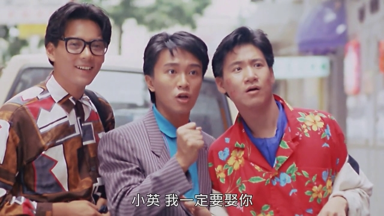

片其实是马莲花非要看的。因为他认识莫少聪。据他说，这个大眼睛哥哥演过不少“好片”。
其实那时三位男主演里我只认识一个张学友。女主角张敏我也不认识，当时还想，这么水灵的小姐姐，也能演“好片”？
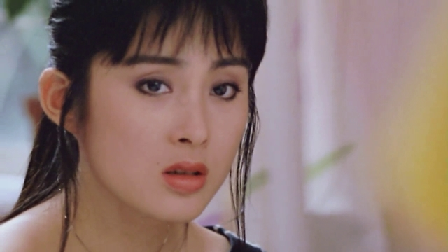

本片里三位男主角戏份差不多，如果按最后的结局看，第一男主角是莫少聪。就是号称铁打的梁宽流水的黄飞鸿的那个莫少聪。
莫少聪先生，无线出身，跟梁朝伟、周星驰、刘德华年纪仿佛。他堪称是香港演艺界因丑闻而导致名声下滑次数最多的人之一。据说现在只能种茶叶了。莫先生最大的特色就是那一双大眼睛，不少片中都以大眼XX为名字。他所扮演的梁宽跟十三姨同框出现的时候，那简直是整个屏幕上就看四只眼睛了。
本片中莫少聪是三个男主里最“老实”的一个，所以也不甚出彩。不过到结局阶段，拼命让张敏生孩子这种设定显示他其实并不单纯。
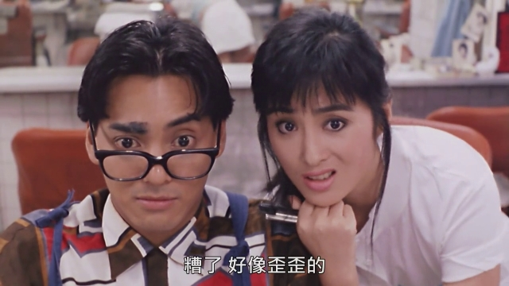

好消息好消息，五年了，周星驰终于在本系列出现了！这其实是我看过的第一部周星驰出演重要角色的电影，但在这次重温之前我竟完全没这个意识，除了张学友以外的两个主演对我来说就像两个柯南里的黑衣人。所以我仍旧不打算重点说他。本片拍摄的时候周星驰尚未发迹，配音也不是熟悉的石斑鱼。好像有关方面整理“周星驰电影全集”的时候也会忽略此片。实际上，这可是周星驰和张敏的第一次合作，非常有意义的！看看这满脸胶原蛋白的样子！
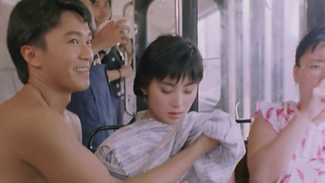

学友哥。在四大天王三十郎当岁的时候，学友哥的演技其实坐二望一，秒杀郭舞王和黎面瘫，堪称被唱歌耽误的影帝。只不过学友哥没有另三个那么帅，又更多放飞自我，演了好多的喜剧片配角。也就因为这样，他成为了表情包的一口富矿。张学友六次提名却没拿过金像奖影帝，真是挺遗憾的。个人认为他离金像奖最近的一次是《男人四十》，可惜那年金像奖偏偏在那一年给周星驰发劳模奖。所以回头看看二人合作的这部片子，只能喟叹造化弄人啊！
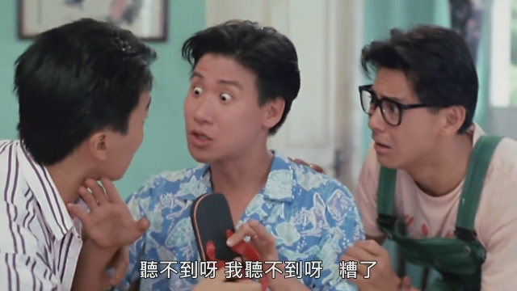

张敏出演这部片子前只演过两部电影。只不过她从出道资源就特别好，《精装追女仔》搭了顺风车，属于极具上升潜力的新人。表现嘛，也就一合格花瓶吧。不过看二十出头的张敏这个粉嫩的哟！
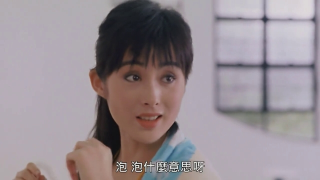

扮演张敏老爹的是吴耀汉先生。全片的节奏也都靠他镇场子了。
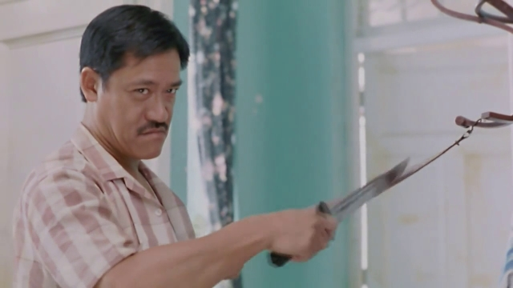

张学友是肥肥的干儿子，肥肥是张学友的干妈。二人在颁奖礼上合作很多，在电影里合作却很少，本片是难得的一部。不过肥肥片中几乎没有表现，不提也罢。但是本片主演中却有一个奇怪的名字——郑欣宜。查IMDB资料的时候，说郑欣宜演的是Baby。
于是寻找郑欣宜成了我重温本片的一大乐趣。根据郑欣宜小姐的年龄、本片的上映时间、以及香港电影的拍摄速度，拍片的时候她应该一岁多点儿，所以我推测最后一个镜头里被肥妈抱着的这个就是。这凭关系进组也太牛了吧？香港电影协会要是给记工龄的话，郑欣宜得多牛逼啊！
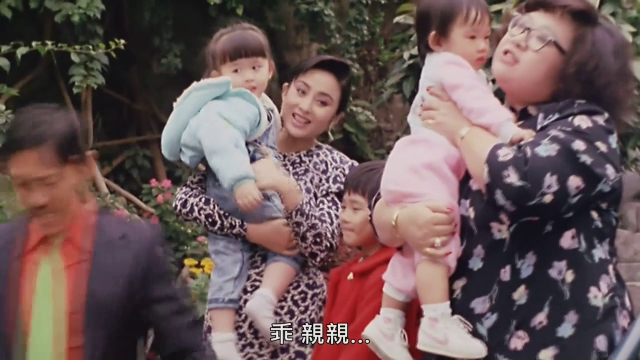

剧情其实相当无聊的，就是三个男的追一个女的，大家喝多了女的意外有了，三人争着当爹的故事。那么问题来了，女方如果是张敏，你要不要争着当爹？并且吴耀汉是老丈人肥肥是丈母娘的时候呢？
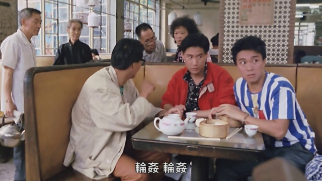
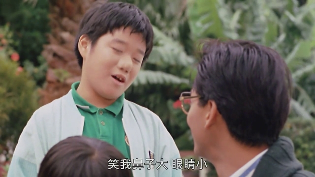

廖叔此时也未成名，也是白里透红地演了一个化验科医生。廖启智的辉煌期恰恰是港片已经开始没落的时候，所以他的后来的众多提名和获奖未必有第一次获奖那么有技术含量。我对他最深的印象还是在《刑事侦缉档案N》。转眼间30年过去了，肥肥和廖叔都已经不在了，张敏早已淡出江湖，莫少聪名声臭不可闻，周星驰满头华发，张学友胡须斑白，吴耀汉大叔不仅身体不好，最近更是被两个女儿牵连晚节不保。唉，人生啊！
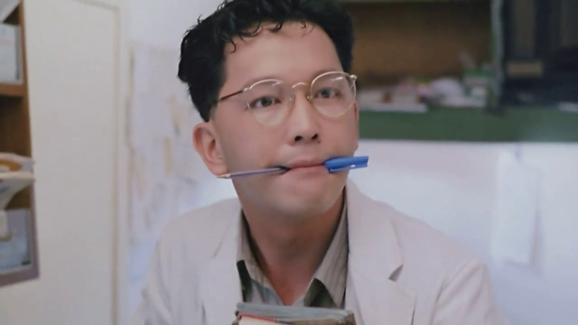

这哥们名叫罗青浩，90年代电影里也是常客，自带笑果的一位。
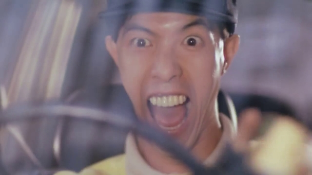

记忆中的镜头一：
我先天好，我后天强，我心地善良。
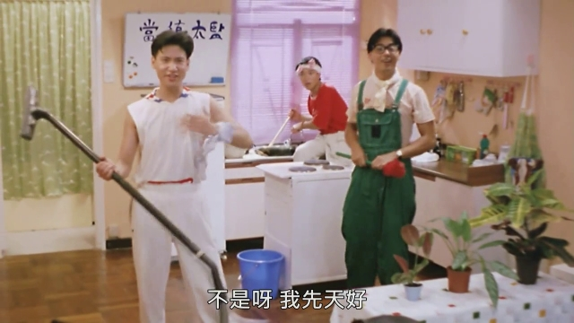
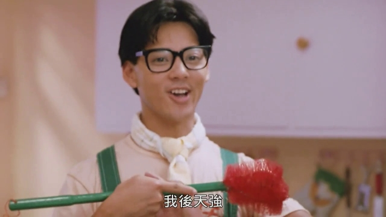
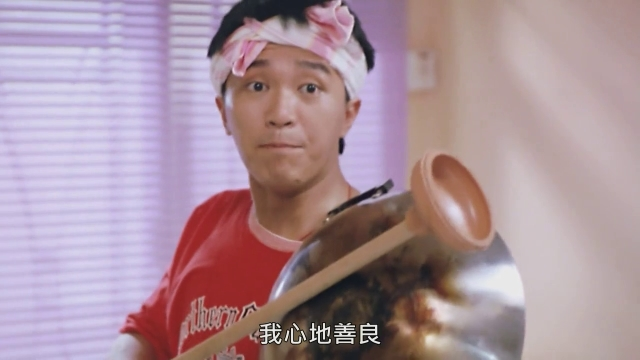

记忆中的镜头二：
片中胖保姆追的正是我最喜欢的一版阿拉蕾，现已绝版。
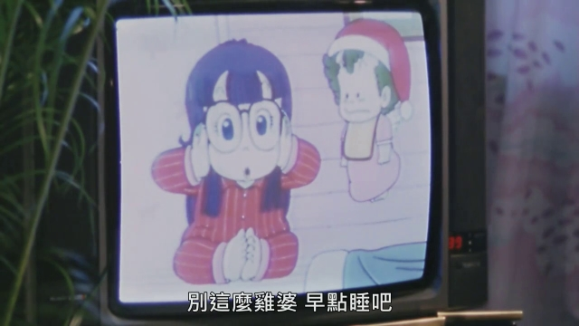