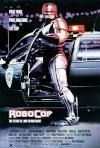

[机器战警](https://pewae.com/gaan/aHR0cHM6Ly9tb3ZpZS5kb3ViYW4uY29tL3N1YmplY3QvMTI5NDc5MQ==)

原名：RoboCop导演：保罗·范霍文主演：丹·奥赫里奇 / 南茜·艾伦 / 彼得·威勒 / 柯特伍德·史密斯 / 罗尼·考克斯类型：剧情 / 动作 / 惊悚 / 犯罪 / 科幻地区：美国首映时间：1987

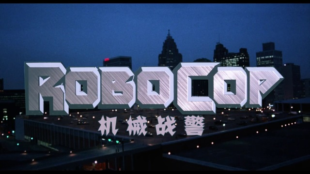
看这片是在1990年的春节。初四还是初五的，忘了。
地点是在一个远房亲戚家。具体的说，跟我爷爷奶奶两头都沾点亲。比较近的一边，他家女主人是我奶奶的五妹的三闺女，跟我爸是两姨表兄妹，我叫三姑；远的那边，男主人是我爷爷的大哥的四女婿的三弟，就只能算带故，跟着三姑论。三姑父算有点本事，是我爸所在系统的“局”里的小领导。头年大爷爷葬礼上，三姑父帮忙出了车，跟我爸聊了几句。正好那时候搞“政企分开”，吵吵着要改制，他就约了我爸过年上他家，互相交换一些消息。
年前商量好，不吃饭不喝酒，我们晚饭后过去。他们家离我家也不太远，一千米左右，吃过晚饭，19：00左右，我们一家三口溜溜达达就去了。
到楼下有些尴尬，我妈记地址的小纸条，看不清楼号末尾是1还是7了。
他俩又根本记不清亲戚家两公婆任意一人的名字。只能在两个楼下瞎喊：“英娣——英莲——”，还让我跟着喊：“三姑——”。最后老爸没办法，换了个喊法，喊：“老祝——祝三——”才算进得了门。
一进门，三姑就开始抱怨：“二哥，我是英华，英娣是老四，英莲是老六……”（其实我爸只比她大三天，跟她很熟，但只知道小名不知道大名，大过年总不能在人家楼下喊“三孬子”吧！）
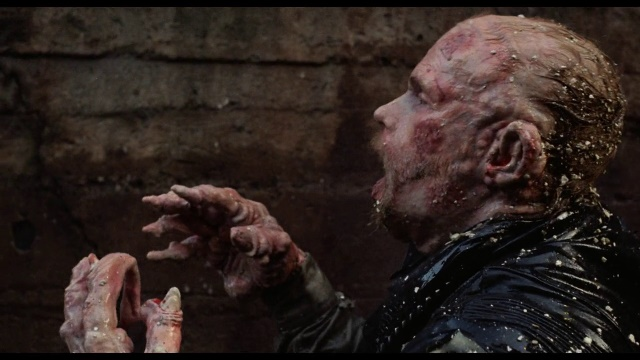

大人们唠嗑，招待我这个小孩子自然就是那个年代流行的录像带了。看他们家那位小哥哥一副生无可恋的样子，我就猜到这片子是他们家的“镇宅之宝”，一定被他看了无数遍，就跟我们家的《飞鹰计划》一个性质。
本身我小时候对“枪战”题材是不大感兴趣的，但这片子的开头实在太抓人了，10分钟的时候就放了一个大招：机器警卫做实验的时候突突突地把实验品给干死了。此处在当年的20寸电视上也觉得血肉横飞，血腥味要溢出屏幕了。
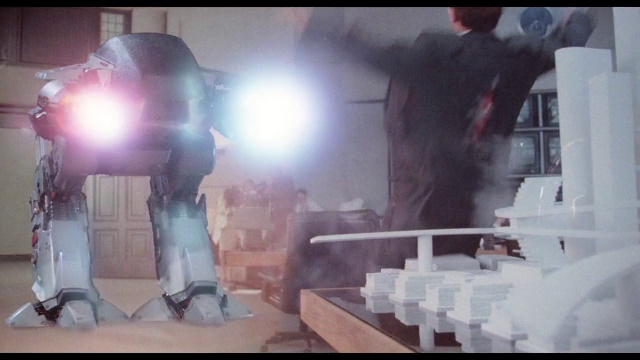
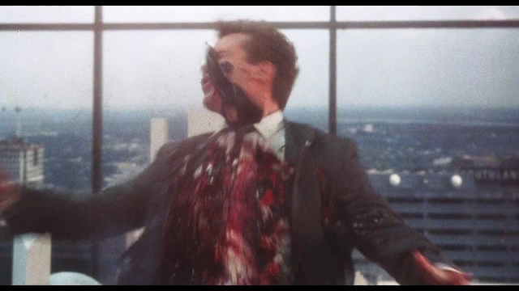

那时候连大人们都是逮着个片子就看，哪里还顾得上适不适合给小孩看。这片我也是这次重温才发现，片中血腥色情一点儿都不少，甚至刚开始的时候是有漏点的！片子开始，墨菲去警察局报到的时候，可能是为了表现警察局条件差，男女警察的换衣间是混用的。然后就出现了一位金发老阿姨换防弹衣的镜头。很短，不到2秒。小时候根本没注意到。后来电视台播过，估计也掐了吧。
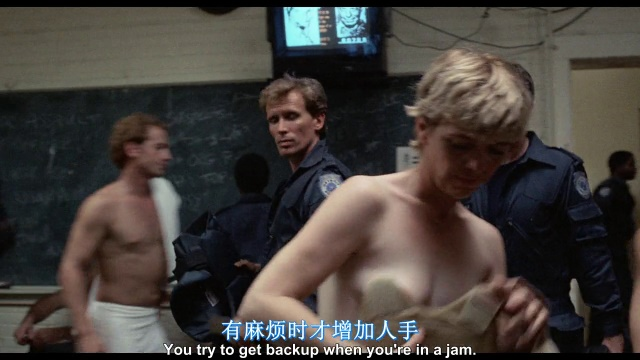

本片是荷兰导演范霍文在好莱坞的成名作，当年可谓横扫全球。其热度从红白机上该作品的改编游戏层出不穷就可见一斑。片子讲的是警察墨菲一次任务中被干到濒死，被抢救回来改造成了机器警察，随后逐步觉醒记忆，找杀死他的人复仇的故事。故事不算新鲜，但半人半机器这个设定可太酷了。机器战警收枪的动作在当时的孩子们中间可是风靡一时——这其实是表现他尚且存有人类记忆的小彩蛋。
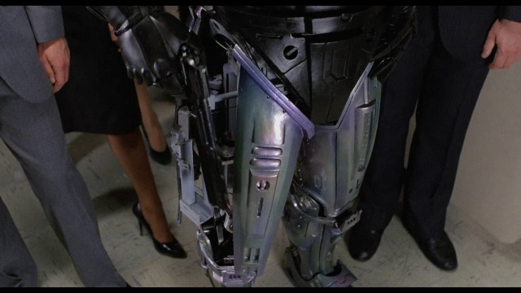

本片最好的地方就是节奏飞起绝不拖泥带水。前15分钟交代背景，到第25分钟男主挂掉同时表现女主车技，到第40分钟机器战警已经办了三件小案子，人设完成。接下来转变且恢复记忆的过程也绝不狗血，文戏尽量克制，减少对话，把大量的时间留给了枪战和动作场面。其中机械战警刚出场的三个小案子就很有特色。第一个体现刀枪不入，第二个体现精准射击，第三个是穿墙扫描。
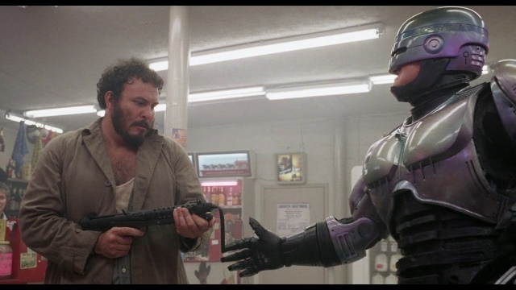
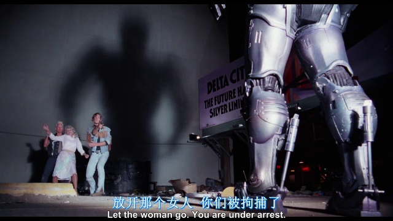
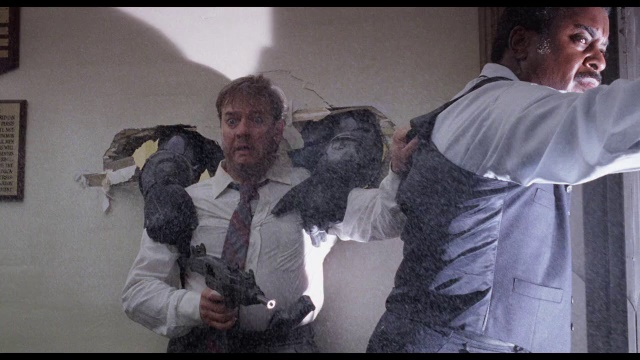

说起来机器战警是个高攻高防低敏的角色。坏人想出用吊车坠物来对付他，也是相当有创意的。
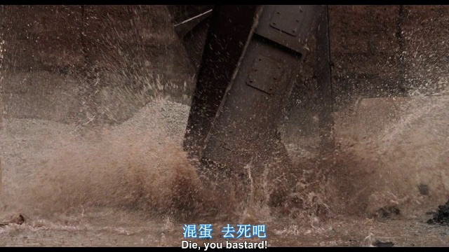

八十年代电影的金属质感真令人怀念。
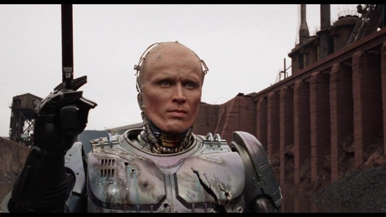
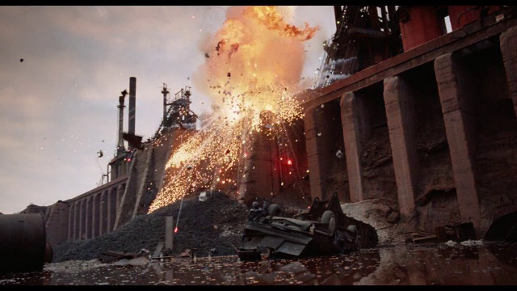

对于我来说，本片还占了好几个第一。
当年，这是我第一次看英文原声加中文字幕的外国电影，之前看的都是“译制片”。虽然不久之后这部片子电视台也放了。
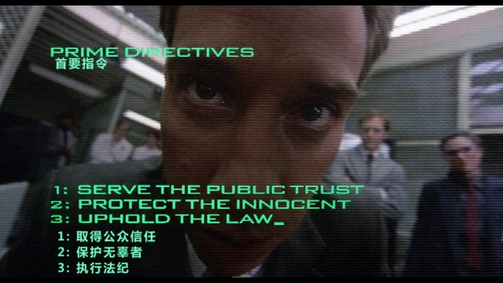

再是第一次在片子里出现“片中片”放广告。而且这些广告看着也不太像植入。可能是为了讽刺电视节目不停给人洗脑，片中的好人、坏人、路人没事的时候都在看电视，电视机也砸坏了好几个。甚至前面说的那个转枪，也是墨菲在实验室一睁眼，看到电视广告里播放才想起来的。
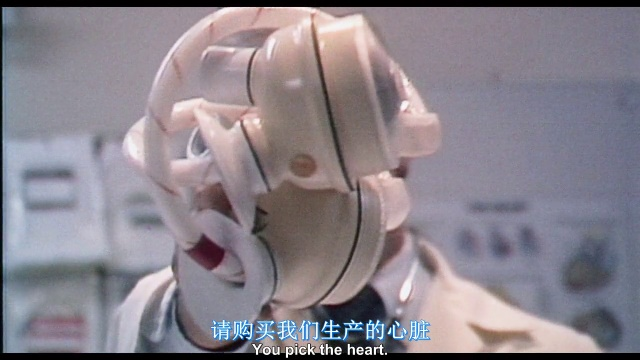
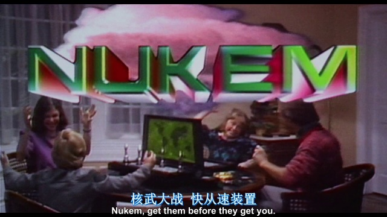

同时，也是第一次在片里看到警察念“米兰达警告”。这甚至让我幼小的大脑产生了一些错误的认知，我以为这种警告是为了体现机器人的刻板教条才要念的。很多年以后才知道人类警察也得这么念。
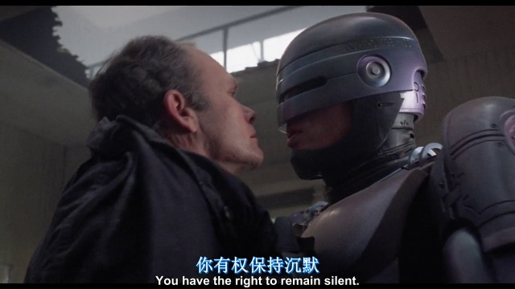

一个有趣的地方是，影片拍摄地和故事背景都是在底特律。片中底特律警察因为待遇不好而组织罢工，而罢工以后治安更差了。而真实世界里的底特律，若干年后整个政府都破产了，警察也不干活了。也不知当时的编剧是如何做到未卜先知的。
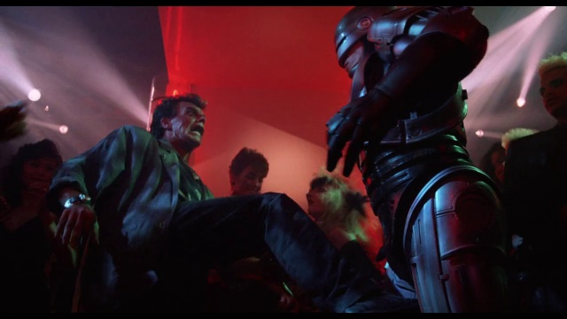

记忆中的镜头：机器战警对着被劫持的女的裙子打了一枪，以为是串糖葫芦了，结果正中后面劫匪的二弟，人质毫发无伤。
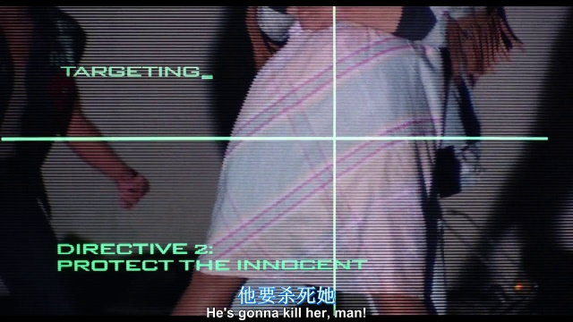
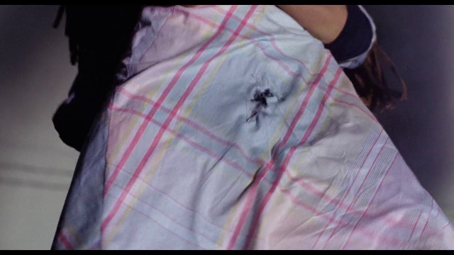
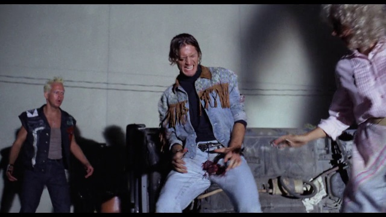