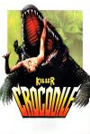

[杀人鳄鱼潭](https://pewae.com/gaan/aHR0cHM6Ly9tb3ZpZS5kb3ViYW4uY29tL3N1YmplY3QvMTMwNjAwNQ==)

原名：Killer Crocodile导演：法布里齐奥·德安杰利斯主演：Ann Douglas / Anthony Crenna / Ennio Girolami类型：恐怖地区：意大利首映时间：1989

这部片子可能是我看的最后一部有印象的正大剧场。在1993或者1994年的寒假。
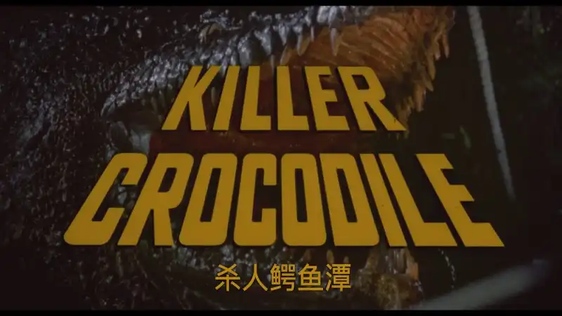

正大综艺周六晚上首播，周日下午重播。这片子重播那天，刚好是元宵节或者我大爷过生日，一帮亲戚在奶奶家乌泱乌泱乱糟糟，我和表妹也不好意思把游戏机接上占着电视，只好跟着大人，似模似样地一起看片。恐怖片。甚至都不是好莱坞的，而是意大利的。
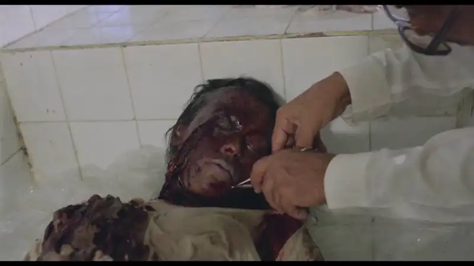

这是一部以现在的眼光看来非常非常套路甚至堪称范式的变异生物类恐怖电影。毫无惊喜可言。
先是与主剧情完全无关的小引子，河里游泳的比基尼美女被直接咔嚓掉，剧情开始。
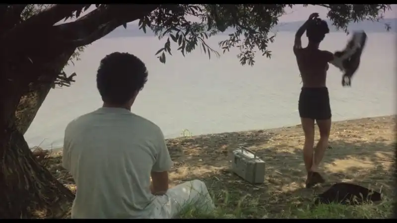
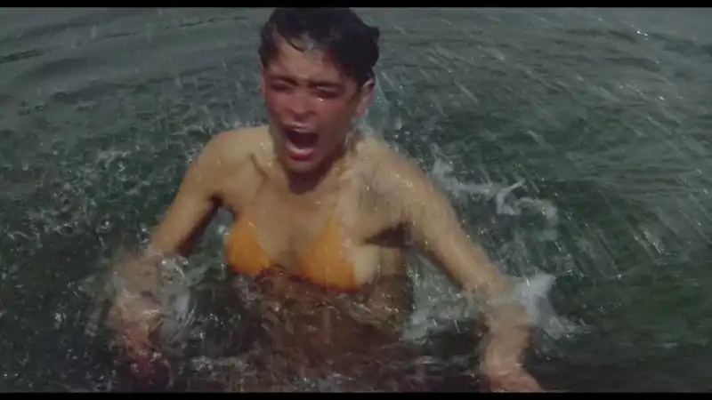

南美偏僻的雨林小镇，法官勾结工厂往河里倒有毒废料，引起了鳄鱼的变异。
鳄鱼杀人，主角小队挨个送人头。法官遭报应也被鳄鱼干掉。男主最后一刻拼尽全力干掉鳄鱼。最后留个鳄鱼蛋孵化的小尾巴。
以现在的眼光赖看，一切都是那么普通。
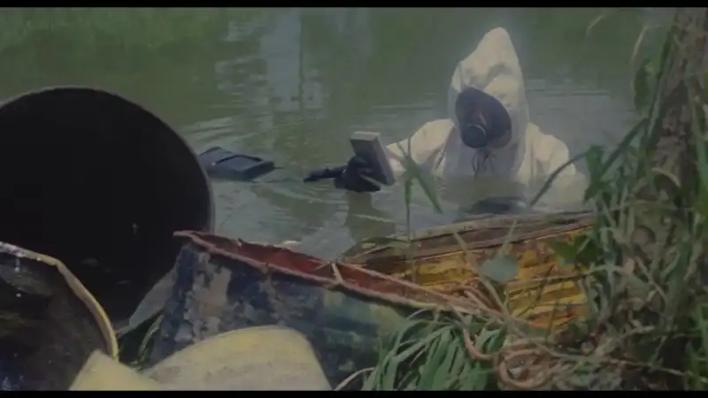

其实以当年的眼光看，也没吓人到哪去。只是有丢丢恶心。以当时的电视分辨率也看不出血浆飞溅的效果，自然也没有太恶心。
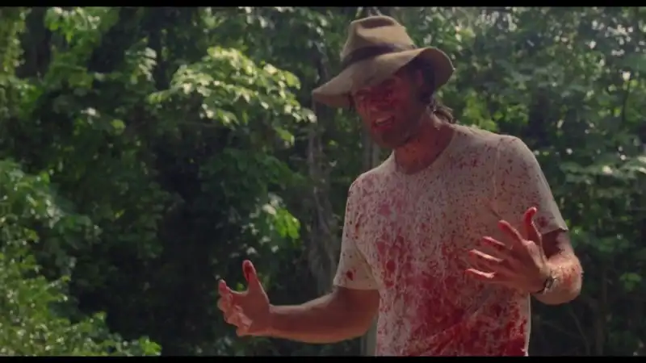

有点感觉的是鳄鱼身子藏在水中，只把天灵盖和眼睛露出水面的镜头。爬行动物的眼睛天生看起来就邪恶。用这种引而不发来吓人也能节约很大的成本。
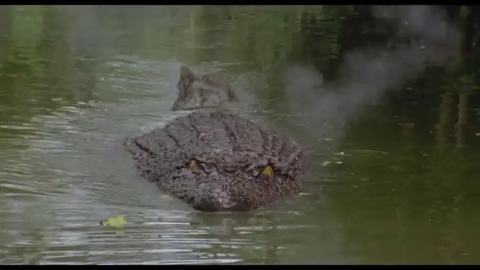

鳄鱼真窜出来咬人的时候反而显得很假。
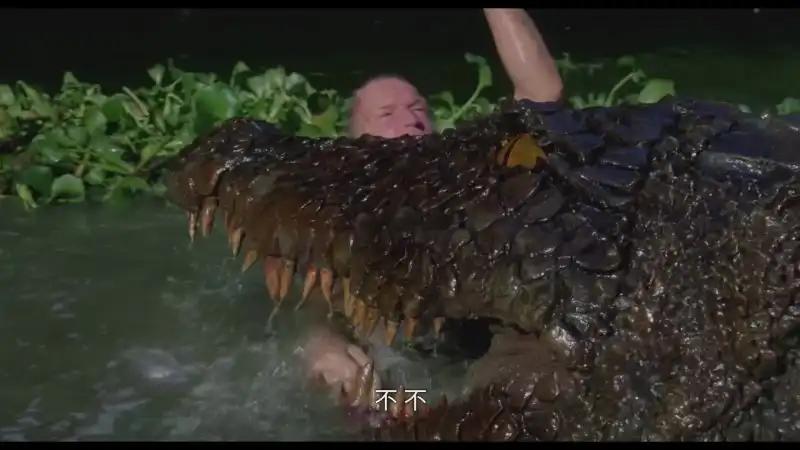

以这种教科书式的影片作为怪兽恐怖片的入门，其实挺舒适的。
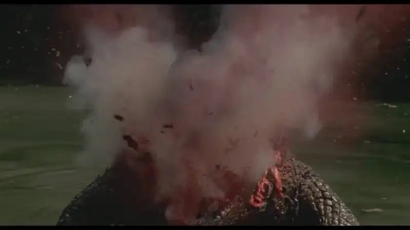

记忆中的镜头一：
突然浮出的队友尸体。算是观影生涯中第一个跳脸杀。
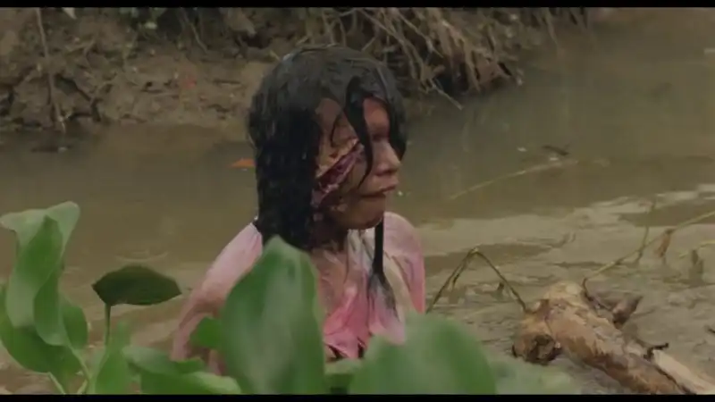

记忆中的镜头二：
片尾孵出的小鳄鱼，意思是还有续集。
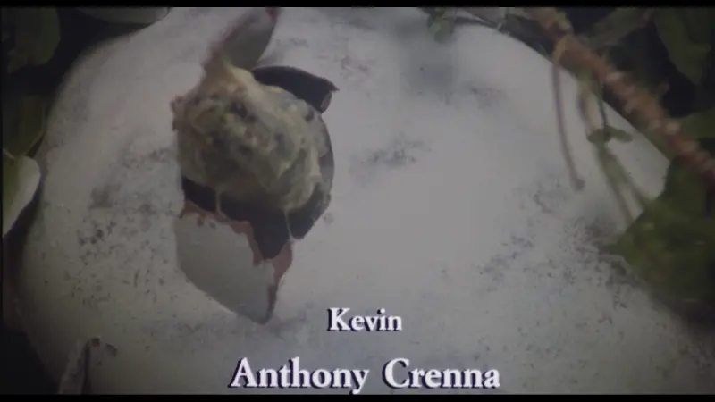