这片儿是在小学二年级下半学期，学校组织看的。没记错的话按时间顺序应该是小学时代看的第四部非教育片。如今对着画面越回味越想不通，为什么会允许小学生看这个，20年前的真理部开不出饷了吗？

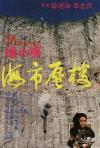

[海市蜃楼](https://pewae.com/gaan/aHR0cHM6Ly9tb3ZpZS5kb3ViYW4uY29tL3N1YmplY3QvMTMwMzQ5Mi8=)

导演：徐小明主演：于荣光 / 帕夏·乌买尔 / 徐小明 / 曹荣类型：冒险 / 动作地区：大陆 / 香港首映时间：1987

1987年的老物，迄今小三十年了。即使以我的记性，印象深的镜头也只不过剩下了两个半而已。剧情早忘干净了。
这次重温为了那么一丢丢清晰度的提升，找到了一个英文发音配日文字幕的版本，这酸爽……
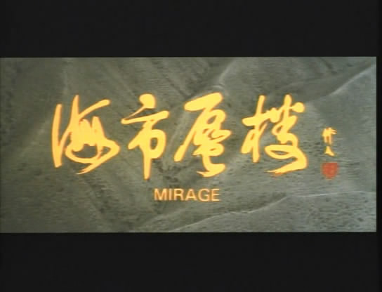
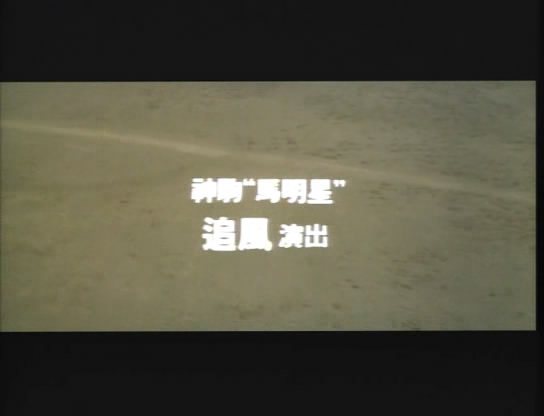

言归正传，这部片子是80年代中期吃到合拍甜头的徐小明根据倪匡原著改编，联合大陆的电影厂制作的动作探险片。以当时的标准衡量，是绝对的大制作。其中大量的爆破场景，马队的使用，以及真人特技，换今天拍成本可能是天价——在最后的鸣谢单位里可是实打实地有三只部队的参与，也就是说，当时的甘肃内蒙新疆的地方政府和部队，是把这电影当政治任务来完成的，如今的八一厂以外的商业片投资方可没那么大的能量。
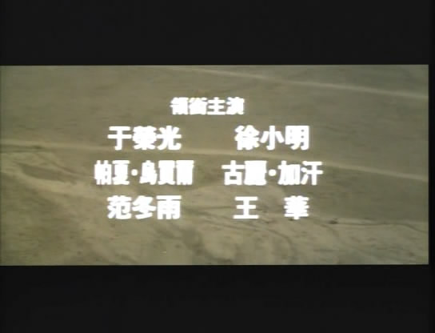

影片讲述的是30年代的故事。海龟记者于荣光跟着一个商队在新疆附近转悠，在一山谷里被土匪伏击。叮叮咣咣轰轰轰啪啪啪把土匪打跑了。这时峡谷里出现了海市蜃楼现象。主角是个高清无码的红衣女子。于荣光两眼放光，用相机拍下了这个女人。
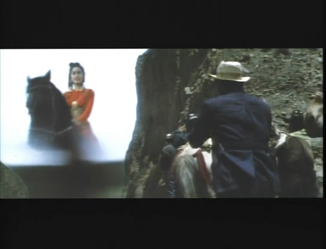
两个半镜头中的半个就出现在这个时点上：一个大胡子悍匪占据了一个小土坡，扔手榴弹的姿势非常奇特：拿起手榴弹抡胳膊三圈后再投出去，嘴里还自带“嘿嘿嘿”的音效。如此装逼的玩法在影片后就被小伙伴们模仿秀了——那时满操场丢沙包都是“嘿嘿嘿”个不停。我也是回味了镜头才想起当年流行动作的来历。
如此装逼的龙套当然要有牛逼的死法——抡胳膊的时候被包抄上来的于荣光一顿王八拳干懵，手榴弹塞进怀里踢下山坡，站起来的时候自爆了。这镜头绝对算得上cult了，学校没被起诉要感谢当时低清的胶片和放映设备。
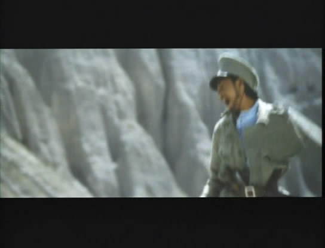
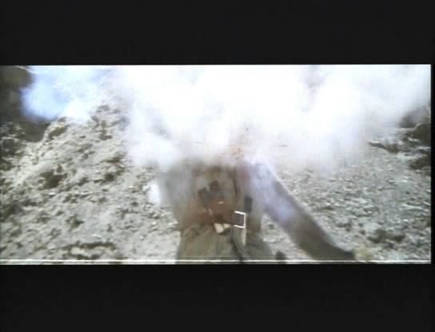

于荣光先生京剧武生出身，被徐小明发掘后开始拍动作片。他年轻的时候演好人的遭数屈指可数，这部《海市蜃楼》就是难能可贵的一次。其实我的记忆里只记得这片的男主角很帅，却完全是柯南那种只有黑影没面目的记忆模式。直到近景镜头一交待：我了个叉叉，就说那么帅不会是无名之辈！
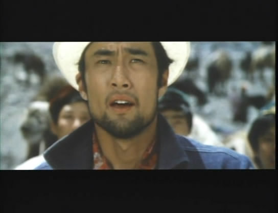

精虫上脑的于先生回到上海后就跟报社表示新疆那么大我想去看看，遥远的地方有个女郎，我一定要找到她。他先去马场找了死党徐小明（喂~三十年代的上海为什么会有养马场!）。徐小明先生年轻的时候远没有老了之后那么猥琐，虽不英俊倒也不难看。自导自演这事儿我们见得多了，可要么是男一女一，要么是客串走个过场，演男二的真真是凤毛麟角。
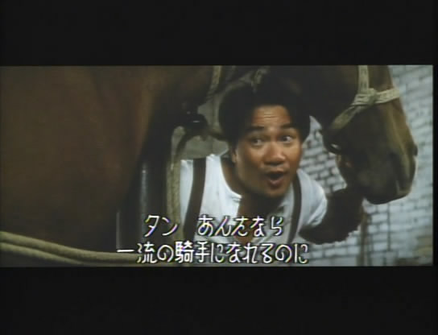

徐领着于去找一个卖大盘鸡的新疆朋友。大盘鸡老板表示没见过照片上这种打扮的，但是餐厅里的服务员女二可能会知道些什么。徐于二人跟女二聊了几句，女二表示可以带他们回老家看看。随后餐厅里就莫名其妙出现了一堆小混混，两人人遂见招拆招秀了一下身手。动作片嘛，总归不出10分钟就要干一架的。
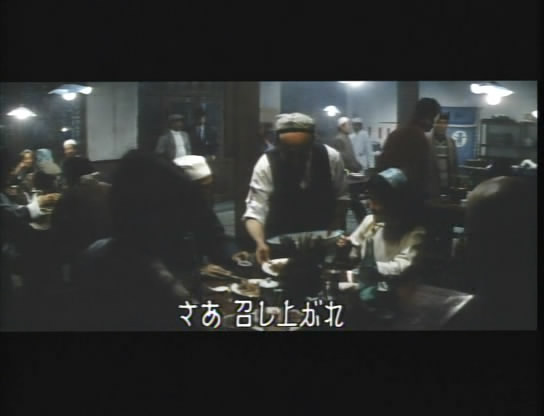

到了新疆，两人受到了女二老爹的热情招待。我了个去，服务员的老爹竟然是个酋长！你确定是来自新疆而不是北朝鲜吗？为了迎接客人的到来，酋长准备了歌舞和篝火晚会。我是非常反感这种印巴画风乱入的，估计是当地政府要求加的戏。
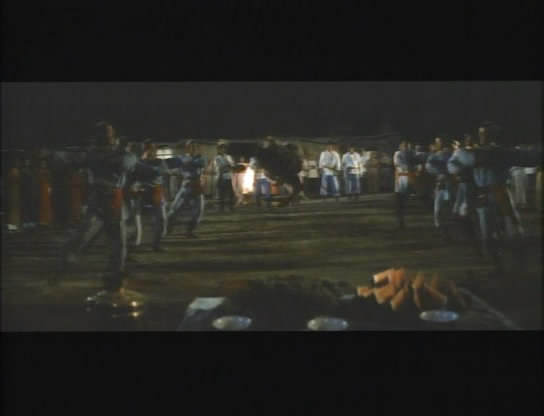

过没几天，几个部落联合开“叼羊大会”，土匪方的无间道偷偷割了几个部落小伙的马鞍，导致比赛的时候维族小伙纷纷落马。于大侠见状不妙——一个在中国电影史上数得着的帅气场景横空出世——于跨着摩托从房子上面飞入场内，参加叼羊比赛。没错，这就是我永远铭记的第一个镜头，百分之一万的大场面。马队抢羊是真抢，骑手落马是真摔。这样的镜头，在CG横行的年代里，再也见不到了。可惜，这片子没有高清的片源，不然真推荐朋友们重温一下这段热血的情节。
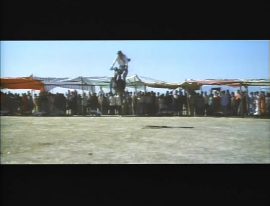
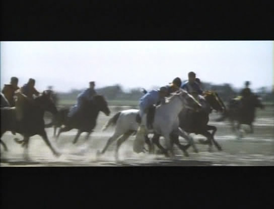
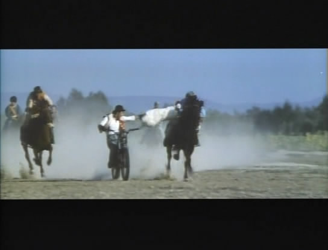

接下来的过渡就非常狗血了，徐小明看上了服务员，服务员爱着于荣光，于荣光迷恋着照片里的神秘女人。老酋长看于大侠也挺顺眼，就把叼羊大赛的奖品——白马追风送给了于。接下来的庆功宴上，于和徐莫名其妙中了蒙汗药，连白马一起被土匪抓走了。
土匪说于大侠我也不为难你，你跟我们这儿最厉害的高手打一架，赢了就放你走。此时女一蒙面出场。打了四分之一柱香之后，于大侠成功地打落了这个蒙面人脸上的黑布。惊艳！于大侠和观众都这么觉得的。尤其于大侠没想到这种方式遇到照片上的女人，错愕之下，自然打输了。
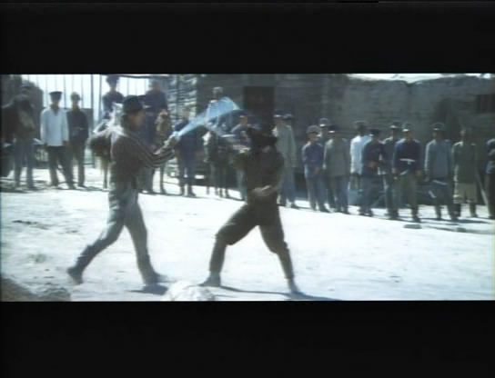
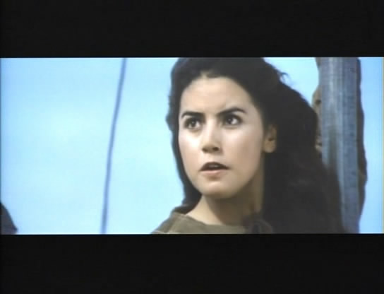
海市蜃楼里的红衣=女一=匪首，她单独在房间里接见于大侠，想问明白你什么表情包我跟你熟吗。匪首问：“你身上怎么会有我的照片？”其实我也想问，什么码率的海市蜃楼能让于大侠你拍出那么清楚的照片？
女一的民族特色服装扮相不如军装好看。
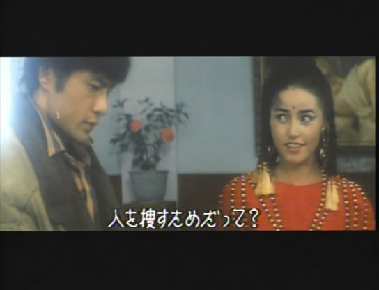

徐小明同学成功地摆脱了囚禁，抢了辆车就往外跑。于荣光搭车逃跑失败，但是白马及时来援。于骑白马跑，女一骑黑马追，缠缠绵绵这俩人就到了天涯。啊不对，是大漠深处。于跟女一都体力严重下降渴得不行，白马倒很给力，把黑马给踹死了。女一发飙直接把于荣光扑倒喝血。继而一刀捅死白马，又上去喝血。此处就是我记忆里的第二个镜头。求广大祖国花朵心里阴影面积。
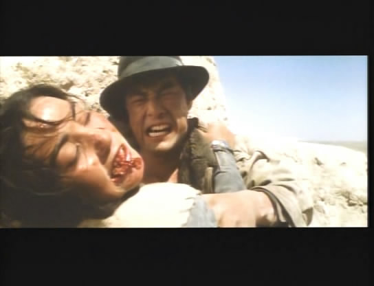
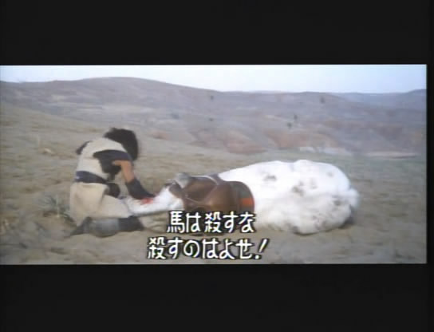
这里的台词同样非常的震撼：“我先喝它的血，再喝你的血。”
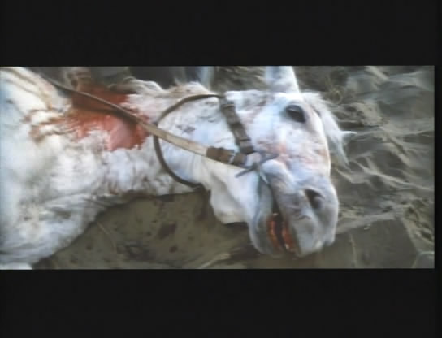
电影看完了照例要写读后感的，我也糊弄了一堆“海市蜃楼是自然现象”之类的屁话。shen字太难写还用了拼音。可心里想的却是：“这辈子别惹新疆人。”从这个角度来看，这两毛钱花得也算有教育意义了。
问我为什么不把这句心里话也写下来？jiang字笔画更多更难写啊混蛋！

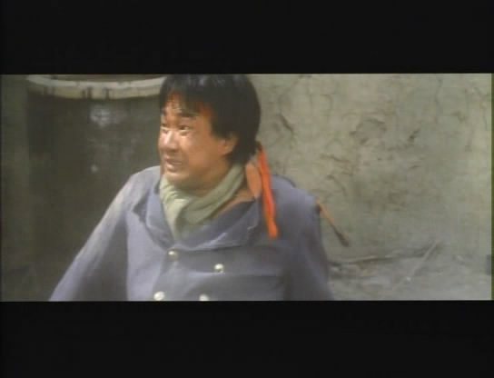
然后于和女一被土匪的后援救（抓）了回去，女土匪倒对于产生了性趣，要留他做压寨丈夫。于宁死不从。逃跑的小明召集村人来救朋友，然后就打啊打啊的呗。说实话徐小明的动作设计比较单调，没有袁八爷的飘逸，也没有程小东的迅猛，看得我都要睡着了。忽然，神转折出现了——徐先生绑了根红头带学兰博——然而战斗力不行，被人打得回光返照了。徐先生大叫一声召唤黄继光加邱少云的真灵附身，往自己身上浇了桶汽油，自焚之后跨上摩托车，毅然冲向土匪的军火库，放了个大烟花。
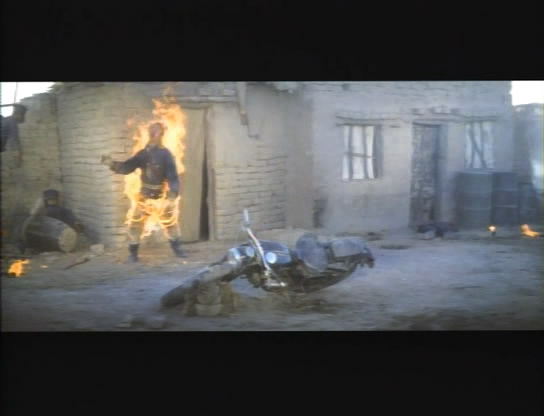
徐小明这个心机婊，这是借助导演之利赤裸裸地抢戏啊！客观地说，徐也真tm够拼了，从片尾的花絮来看，这场戏的火是真的，旁边随时灭火器伺候着。而据说全片拍下来，于荣光和徐小明都没用替身的。

最后一个镜头，给到目瞪口呆的降格的前男一和升格的前女二（女土匪被炸死了），全局终。