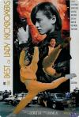

[火种](https://pewae.com/gaan/aHR0cHM6Ly9tb3ZpZS5kb3ViYW4uY29tL3N1YmplY3QvNDMxNzE1Mw==)

导演：陈鎏 / 鲁俊谷主演：大岛由加利 / 李赛凤 / 杨菁菁 / 白彪 / 罗烈 / 胡慧中 / 苏菲亚 / 邱建国 / 黄子扬类型：动作地区：香港首映时间：1993

八十年代中期以后，香港动作电影产生了一个特殊的分支——霸王花电影。录像带时代这是很受欢迎的一个系列——武打片本来就过瘾，何况还有美女养眼。
但是，霸王花系列电影能给人留下深刻印象的却不多，毕竟题材太受限制了。
这部片子是我在十一期间逛某资源站时随便下到的，直到开始20分钟之后，才反应过来：这片我看过！
可以肯定的是，当年我看的时候，既不是现在这个官方名字《轰天皇家将2火种》，也不是片源里的《街女》，而极很可能是跟“天使”啥啥有关的名字。
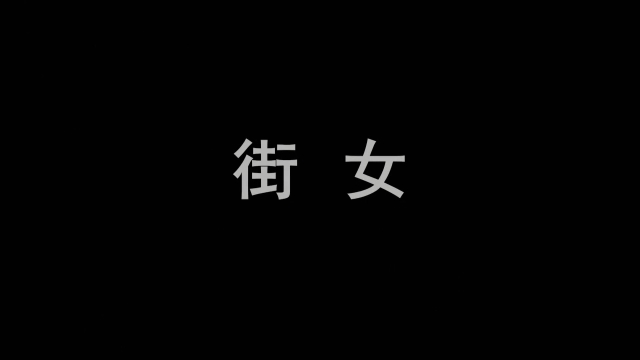

本片凑齐了胡慧中、李赛凤、大岛由加利三位顶尖打女（惠英红和杨紫琼更多出现在古装片中），在类型片中已经算顶配了。
其中，胡慧中是成名最早的那个。胡早年其实是文艺片女神出身，85年阴差阳错出演了《霸王花》之后才逐步转型打女。她自己原本并不怎么擅长动作戏，连打女最基本的舞蹈基础都没怎么听说。只是很拼，从毫无基本功到似模似样，其中苦功可以想象。到90年代，胡的岁数已经很大了，这部片子里能看出很明显的抬头纹。
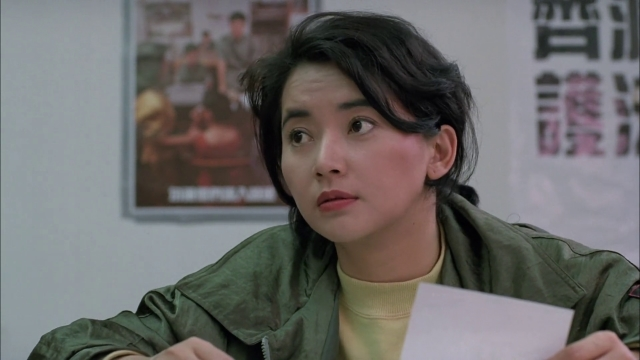

最富盛名的的是李赛凤，八十年代末九十年代初的头号打女。长得好的没她能打，比她能打的没她长得好看。我说印象中本片片名中应该带“天使”，依据就是李赛凤。她所主演的大量打片，片名中就含有天使二字。李赛凤最遗憾的是在如日中天的时候，拍一场爆炸+跳楼的戏，跟本没用替身。跟特技师没配合好，她和胡慧中二人都被严重烧伤。胡慧中烧伤面积更大，但她比胡慧中更糟糕的是被烧到了脸！所幸后来并没有毁容。
说起来李赛凤还真是靠脸吃饭的，因为她短胳膊短腿，动作只是占了个利落，并不是最舒展的。李赛凤老了之后的遭遇实在令人唏嘘，有兴趣的自己可以查。
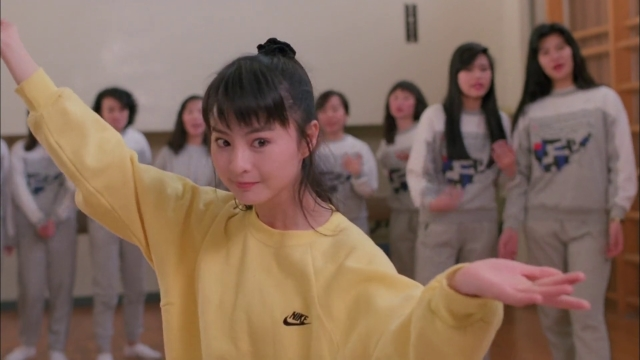

最后是来自日本的大岛由加利。这位眉目之间带有一股英气，动作迅猛，正派反派都能出演。大岛算是有真功夫的，师父是日本动作片巨星仓田保昭（精武英雄里的日本老头），16岁的时候拿过日本空手道冠军。她的前夫之一是郑浩南，她请求自己的丈夫去演出三级片的故事乃一时之佳话。本片当中，大岛的角色虽然提前死了，但是留下的印象绝对要比另外两位更加深刻。
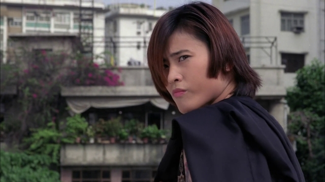

三位打女可谓各有特色。大岛动作刚猛有力，打击大开大合，是典型日本空手道的路子；而李赛凤则是动作迅捷灵便，颇似南拳或咏春。至于胡慧中，出场时中规中矩打了一架，后面竟然是拿把22喷子跟坏人BOSS对喷，变枪战戏了。
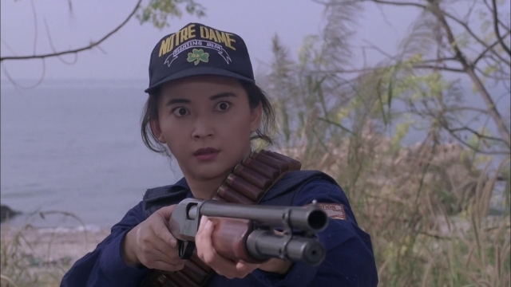

白彪大叔演大岛的父亲，看的时候觉得极为眼熟，他在片里挂掉之后才想起来这不是小白脸古天乐版神雕里的郭靖嘛！
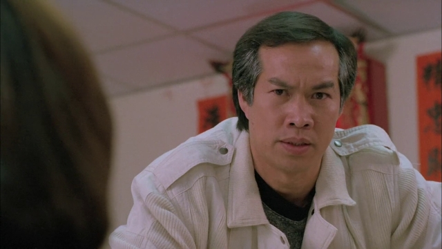

大反派的扮演者是有资格入选港片四大排不上十大有富余的恶人专业户黄子扬兄。
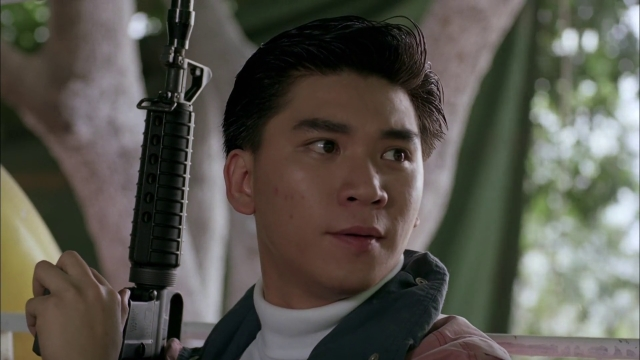

小反派是邱建国演的。邱是当年[《南拳王》](https://pewae.com/2019/04/review_nan_quan_wang.html)的主角。现在有水流公众号瞎掰，说什么邱的名声在当时不下李连杰，这简直是大言不惭——在香港有人敢让李连杰演反派吗？又不是好莱坞。
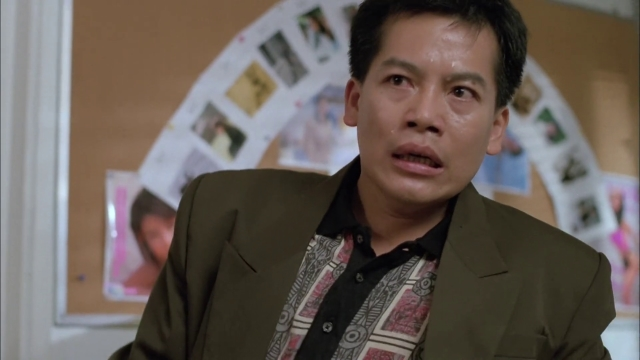

剧情就没啥可特别说的了。反正是叛逆少女大岛由加利出狱之后仍旧各种不忿，跟损友李赛凤一起继续招惹是非。连续得罪两个黑帮老大。随后招致黑帮报复，还搭进了另外两个损友、李赛凤干爹和大岛亲爹的性命。大岛亲自去报仇，身死。最后李赛凤和大岛的暧昧后妈胡慧中一顿轰轰轰啪啪啪把坏人都neng死了。胡慧中当不成警察，李赛凤也因为杀人被抓了起来。最后一个镜头把片头大岛放出来的场景昨日重现一遍，只不过把中心人物换成李赛凤。（这张图能明显看出胡慧中手背上烫伤的疤痕）
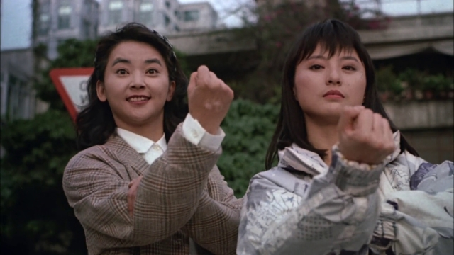

霸王花电影有个特点：动作场面特别不真实。相对于已经很不真实的动作电影，打女电影为了凸显女性格斗家们的身材，会追加更多的腿部动作，于是动作就愈加夸张。如果说一般的格斗电影有体操的影子的话，那么打女电影就更接近舞蹈。这大约也就是为啥有舞蹈功底的女演员更容易成为打星的原因。
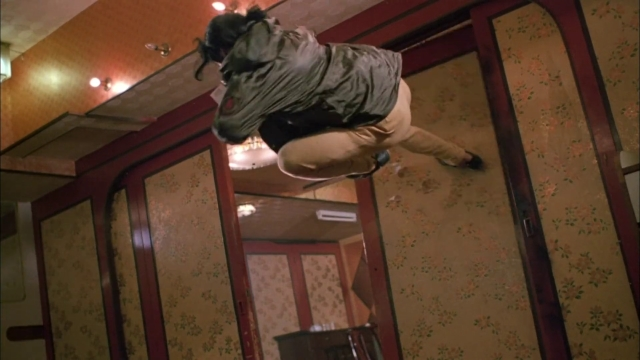

打女红不红，不光要凭自身的身段样貌，跟背景关系也很大：李赛凤的师父是徐小明；惠英红的哥哥是惠天赐师父是刘家良干爹是张彻；大岛由加利的师父是仓田保昭；杨紫琼是洪金宝发掘的而且是德宝的老板娘；杨丽菁是杨紫琼要结婚德宝找来的替补。要不就真得会点儿什么——罗芙洛是空手道世界冠军，西协美智子是日本健美冠军。
故而杨紫琼凭借《警察故事3》拿到当时女星的最高片酬，固然是因为她能打，却绝不仅仅是因为她能打——离婚复出的炒作性、成家班亚洲范围内的扩张热点需要、东南亚地区的号召力应当也是不得不考虑的因素。
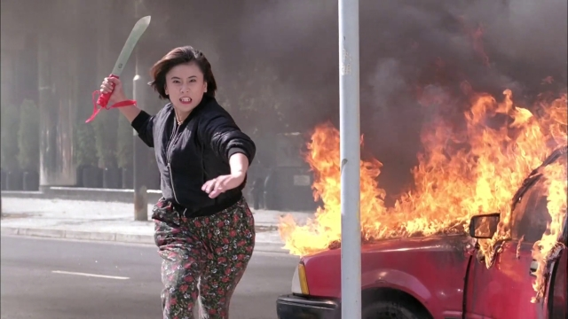
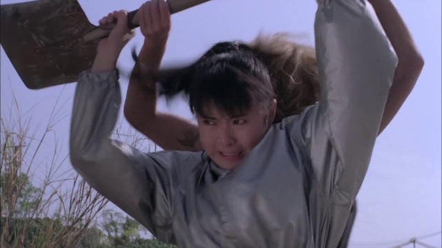

主题歌是胡慧中的《城市行囊》。她还凭借这首歌上过92年的春晚。所以当时真以为胡慧中是个影视歌三栖明星，地方台点播节目重播无数，也来过协弃市曾经著名的服装节。多年以后消息没那么闭塞了，才知道胡慧中的歌有且仅有这么一首能打的……

记忆中的镜头一：大岛由加利出狱。狱警说，别再回来了。
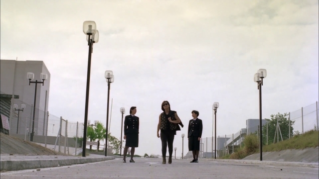

记忆中的镜头二：大岛手持两瓶莫洛托夫鸡尾酒冲向敌方大佬。
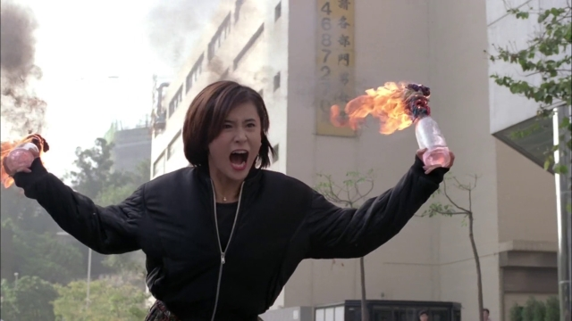