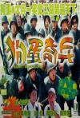

[狗蛋大兵](https://pewae.com/gaan/aHR0cHM6Ly9tb3ZpZS5kb3ViYW4uY29tL3N1YmplY3QvMzI2NDIzNA==)

导演：朱延平主演：吴奇隆 / 吴宗宪 / 张宇豪 / 杨小黎 / 翁虹 / 郝劭文类型：喜剧地区：台湾首映时间：1996

前两天我大爷甩给我个微信名片让我加，原来是我一个30岁的远房大侄子。对他唯一的印象是害我一部片没看完。又从害我没看完片的人，想到了这部没看完的片。
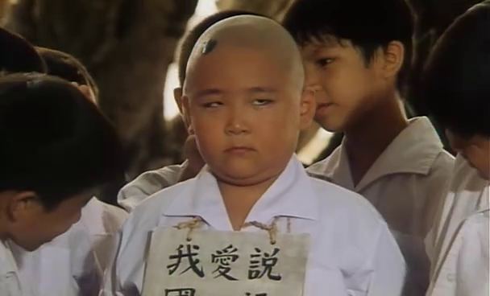

1999年夏天，奶奶家这边似乎全家都混得挺好。我考上了大学，大爷家的堂姐研究生毕业还找了个姐夫，大姑家的表姐嫁到了日本、表哥买了新车。
我爷爷就我一个孙子，虽然我根本没见过他，但总归也算是光宗耀祖了。恰好99年是爷爷去世20周年。周年是在10月底，我在沈阳上学肯定回不来。在大姑的撺掇和老妈的附和下，全家决定在七月十五回老家进行一次隆重的祭祖——主要是显摆表哥的车和我这个人。

爷爷兄弟四个，我爷爷行二。爷爷16岁就离开了老家。四兄弟在文革前期就因为划成份的事情闹得很不愉快，很快就分了家。老二老三老四相互之间都不来往，各自只跟老大有联系。老大守家嘛。
爷爷去世之后，我大爷和我爸就更少回去了，一般来说每年清明回一次，七月十五和十月初一赶上休息再回一次，都是看鬼多于看人。有时甚至不回太爷爷的祖宅落脚，上完坟直接回市内。

99年的时候，大爷爷已经不在了，他们家的独子也去世了，只有一个大我一轮的独孙和他的寡母。返乡团的我的上一辈们住在寡嫂家里不太方便，都去了同村的我奶奶家的亲戚家住，只留下小辈们在堂哥家里投宿。

堂哥很热情，把主卧留给我们几个小的，自己两口子跑去了客房。怕我们闷，特意上镇上租了几张VCD给我们几个小的看。
第一张，放的就是这部《狗蛋大兵》。不过当时封面上可不叫这个名字。
这片我跟表妹都很喜欢，大哥家的侄子（当时10岁）却非常不乐意，吵吵着要换片。怎么说我们也是当叔叔姑姑的，只好给换了《东方三侠》。没想到这一换20年就过去了。

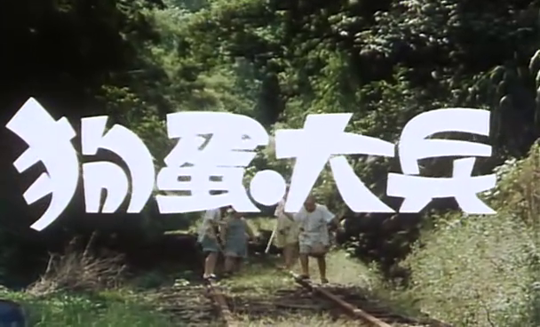
回正题。
这部片子只是一部再普通不过的屎尿屁电影，讲述的是台湾的一个小村子里，一帮阿兵哥跟一群熊孩子小学生胡搞瞎闹的故事。牌面应该算不小——唱歌主持两开花的吴宗宪、优质偶像吴奇隆、靠几部三级片成功蹿红的翁虹和越胖越有人气的郝邵文。
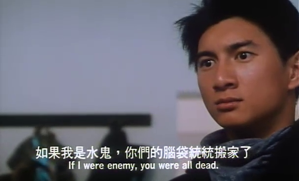
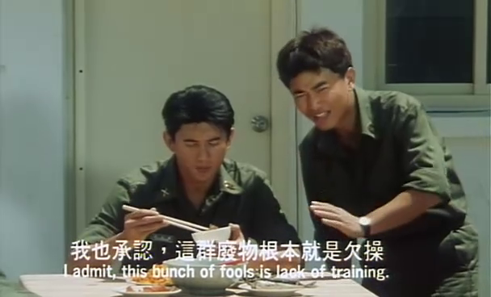
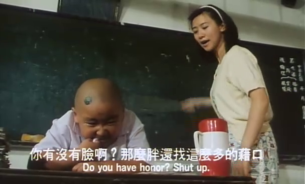

片子的开头是郝邵文等一帮小孩偷地瓜，被以吴宗宪为首的阿兵哥吓跑了；然后一个反转，阿兵哥也不是好人，也是来偷地瓜的。非常传统的手法，但莫名其妙就很好笑。可能是演老农的老头演得好吧。
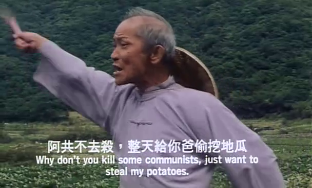

影片里充满了对国民党政府的揶揄。张口“蒋总统”，闭口“反攻大陆”，所以在电视台我是没见放过。
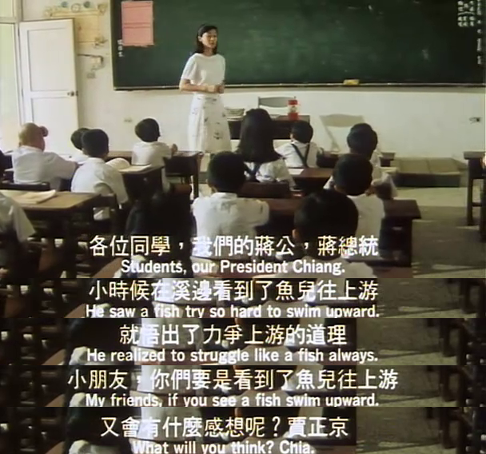
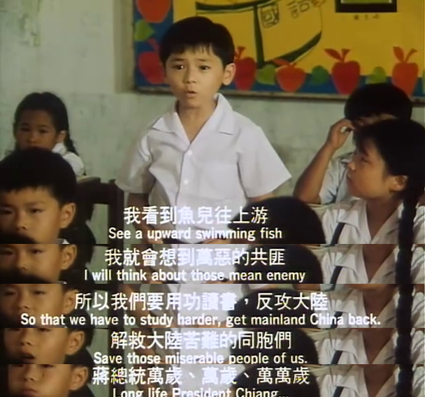

还有个神经病冒充教官去军营一顿狠操，最后被精神病院带走。几乎是指着鼻子骂想反攻大陆的都是神经病了。所以这明明是部心向祖国的红色电影，咋就不给放呢？
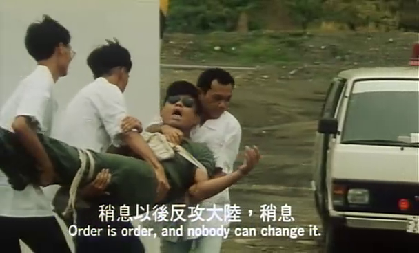

在影片拍摄的1996年，阿扁是台北市长，朱高正是高雄的明星立委，马英九是法务部长，连战是副总统，赵少康是新党秘书长。所以这段台词也不知是夸还是骂。
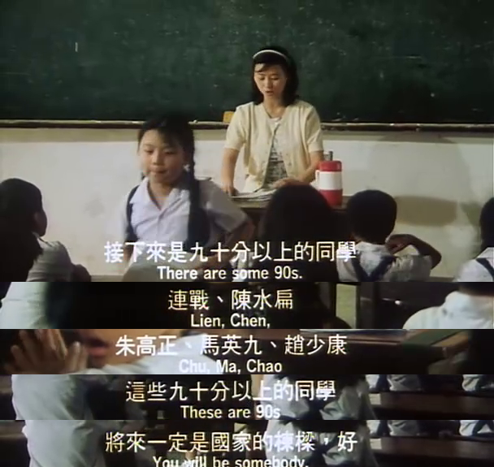

朱延平这家伙还在片子里自嘲了一下。不过呢，同样是越老越完蛋，他可是比王晶完蛋得更彻底。
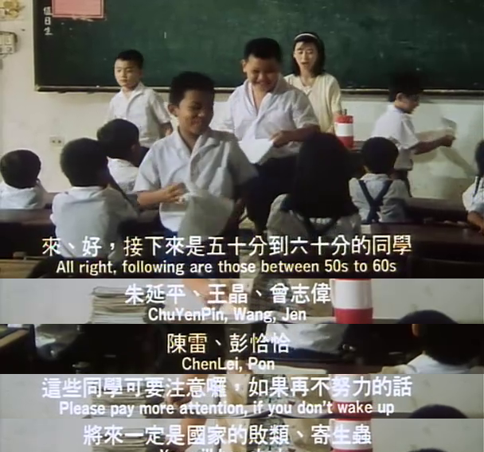

其实从魔鬼教官吴奇隆出场开始，就变得没那么有趣了。吴奇隆和翁虹的剧情充满了酸臭气，而翁虹在片子里的角色非常不讨喜，她表演得也是毫无灵气。阿兵哥跟美国大兵的冲突也很刻意，三段式的剧情加一起不到20分钟。可人家吴奇隆就是帅有什么办法！帅就够了，带绿帽子都那么帅，而且没有刘海。
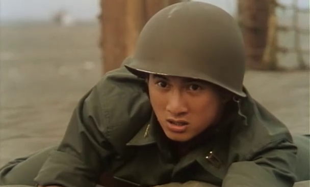

后期，不学无术的郝邵文被他爹打怕了，想出一个好主意，他学会了用笛子吹国歌。一考不好就对着父母吹国歌，他父母就得肃立站着，不能动手。真是讽刺啊。
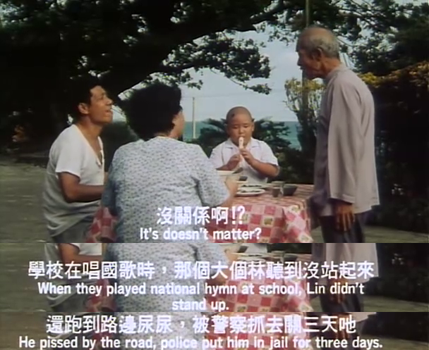

尤其是下面这段两个小孩的滑坡谬误演绎，即使是9012年，即使在大陆，仍是言犹在耳。文化如此一脉相承，两岸不统一，天理难容啊。
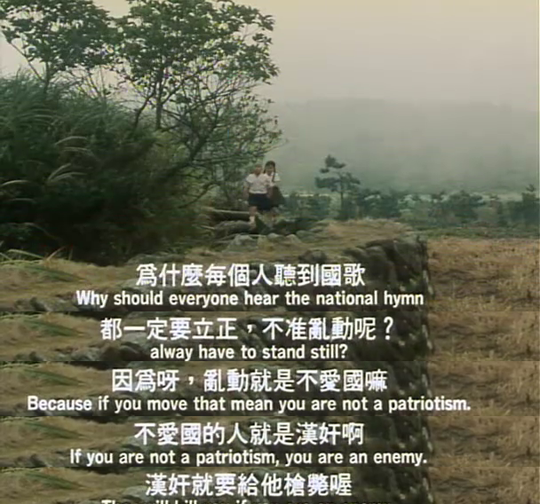

对了，从片头到片尾只有一首插曲：蝴蝶飞呀。一个半小时下来，不会唱也会唱了。

记忆中的镜头之一：
吴奇隆操练阿兵，有个家伙匍匐前进的时候不停放屁，队友不堪其扰。吴宗宪掀开他裤子塞进去一颗小石子后哈哈大笑。谁知这家伙压强太大，一屁把小石子蹦进吴宗宪嘴里。
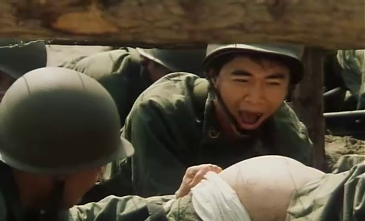

记忆中的镜头之二：
郝邵文的伯父从美军军营里偷了一堆套套，吹成气球挂了一脖子，还很慷慨地送给侄子。
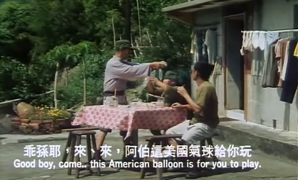