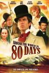

[环游世界八十天](https://pewae.com/gaan/aHR0cHM6Ly9tb3ZpZS5kb3ViYW4uY29tL3N1YmplY3QvMTQzNjcxMS8=)

原名：Around the World in 80 Days导演：巴兹·库里克主演：彼得·乌斯蒂诺夫 / 朱莉娅·尼克森 / 杰克·克卢格曼 / 皮尔斯·布鲁斯南 / 艾瑞克·爱都类型：冒险 / 剧情 / 科幻地区：美国首映时间：1989

第三部正大剧场了。这部应该是在正大综艺开播后不久播放的，89或者90年吧。
这不是成龙参与的那部，比那要早十多年呢。那部印象很浅，而且不足20年，不在回顾之列。
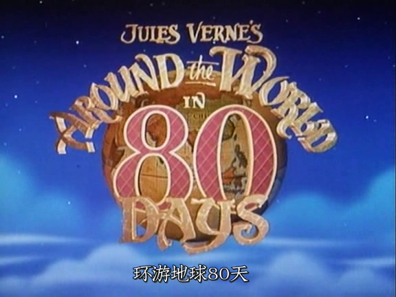

英国的电影，剪辑就是出乎预料：第一个礼拜放完，请看下集；第二个礼拜回来，以为是“下”，结果是个“中”。
这部片是我第二次接触到凡尔纳的作品的衍生品。当时好奇之下还去图书馆找了原著来读，算是本人读科幻小说的启蒙。也就是在凡尔纳的合集反推，才知道之前看过的小人书《十五少年》竟然同样是凡尔纳的作品。本作是与其说科幻小说，倒更像是冒险小说。但因为作者被打上了科幻作者的标签，写的书也便统统成了科幻。
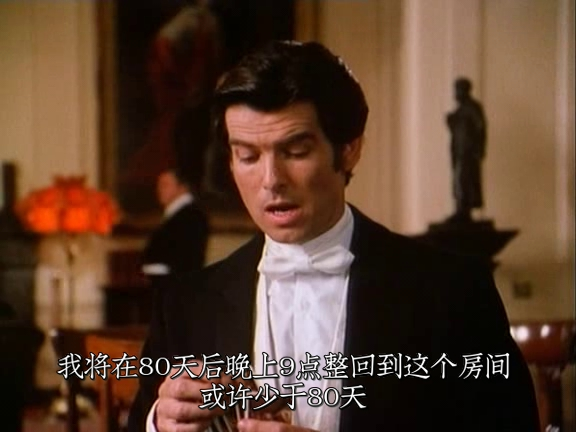

布鲁斯南是我这个年代的人最熟知的一任007先生。当时因表演木讷而为人所诟病。但对于一个连续打破007系列全球票房记录的功勋男主角来说，这样的评价是非常不公允的。何况人家还是个大帅比。
从本片的表现来看，布鲁斯南亦庄亦谐，恰到好处，是有演技傍身的。
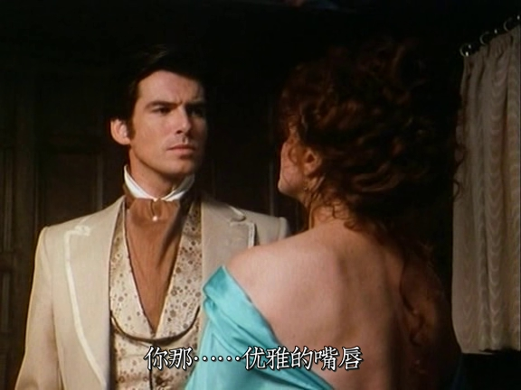

女主角好像是个电视咖，仆街得很。也不怎么漂亮。倒是知道了印度有人殉这回事，小时候还觉得挺惊悚的。
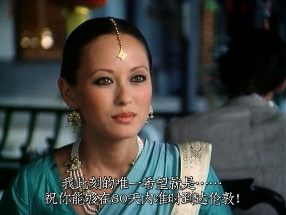
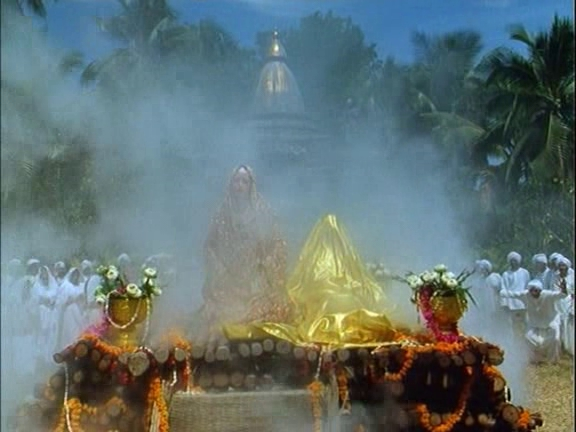

倒是配角都挺棒的，包括一路跟踪布鲁斯南的胖侦探，忠仆路路通什么的。在香港的故事里，客串的老人家竟然是老熟人……
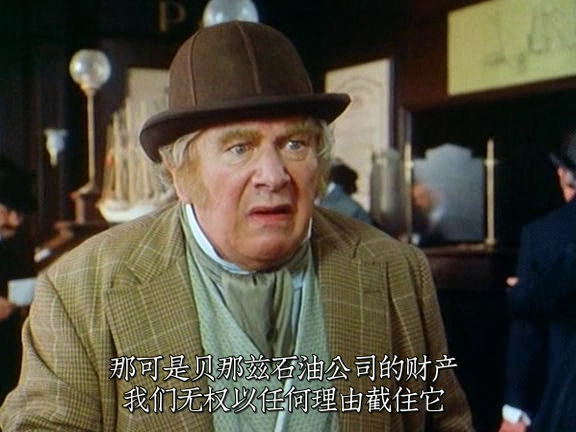
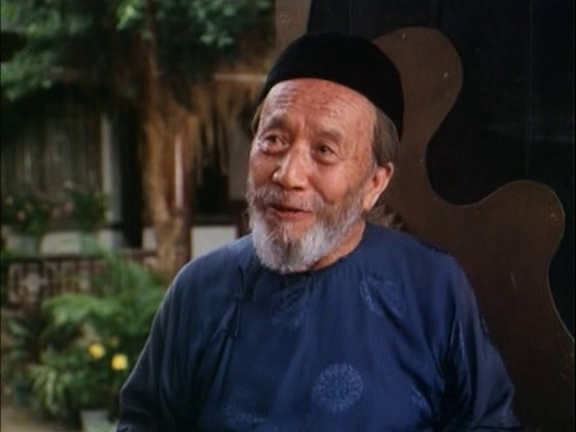

本片最大的缺点来自于一处漫不经心的改编：主角一行在香港错过了开往横滨的航班，不得不乘坐小船赶往上海，因为那里是开往旧金山的轮船的始发站。原著中只是说遭遇了风暴，可本片改编的时候硬给加了个在上海郊区遭遇满清皇帝出行的情景。且不说皇帝根本就不会在上海周边出现。片中寒酸的皇宫和宛如乡文化宫一般的紫禁城，就绝对出戏。更不要说当天抓当天见皇帝当天放这种事，在无论哪个年代的中国也没这么高的效率好么！
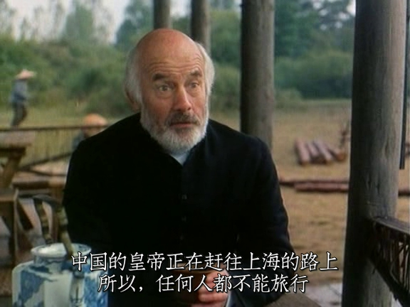
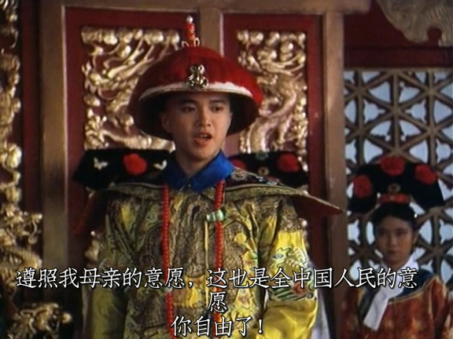

另外，可能是为了政治正确，原著中在北美被印第安人抢劫的故事被一笔带过了，也挺双标的。这部分的缩水直接导致了三集里的下集在结局之前没什么看点。
所谓环游世界，不过是伦敦–多佛–巴黎–罗马–那不勒斯–（地中海、苏伊士运河）–孟买–加尔各答–缅甸–香港–上海–横滨–旧金山–纽约–伦敦，偌大的非洲，被绕过去了。什么非洲，非洲算世界吗？
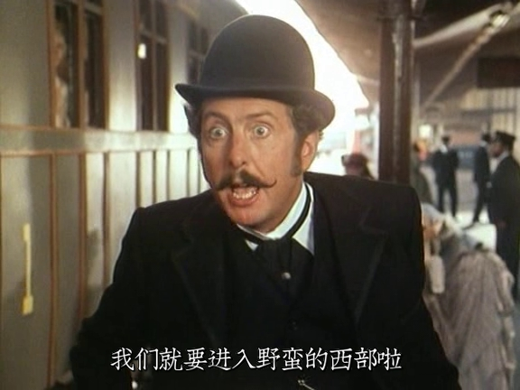

当时技术所限，气球飞过罗马上空的镜头简直是一眼假。
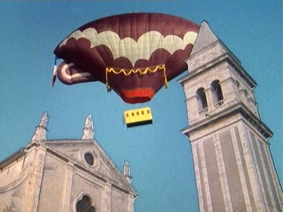

其实花了好久才搞明白绕地球一周后差了一天这回事。电影里交待了好几次对表。也就是每过一个时区主人公会把表往前拨一个小时，这样下来绕地球一周才差出了一天。
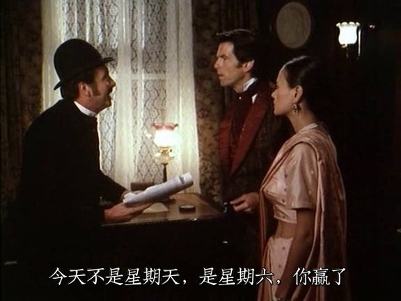
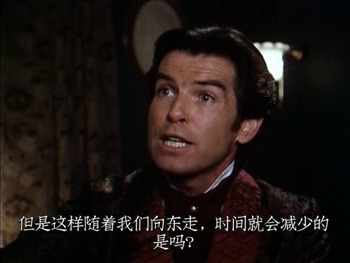

记忆中的镜头：
印度人民百年传承的传统绝技。
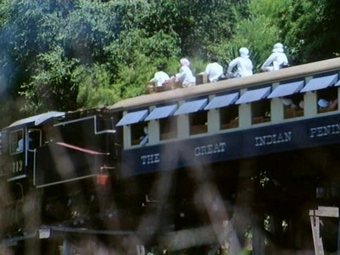