[痴情快婿](https://pewae.com/gaan/aHR0cHM6Ly9tb3ZpZS5kb3ViYW4uY29tL3N1YmplY3QvMTc2ODIwNC8=)

导演：陈勋奇主演：叶慧红 / 吴浣仪 / 周慧敏 / 徐少强 / 简而清 / 郑则仕 / 郭秀云 / 陈勋奇 / 黎明类型：喜剧 / 爱情地区：香港首映时间：1992

周五，臭宝放学到家，宣布了一条打听到的重要消息：他们今年换的班主任，不是快退休，而是退休返聘，今年都57了。
我一听57啊，那不就是1967年出生，跟周慧敏同岁？赶紧开始回忆周慧敏演过的电影。很遗憾周女神的大银幕作品实在缺少爆款：记不清哪一部的追女仔like，记不清哪一部的倩女幽魂like，能记清标题完全想不起内容的《三人X世界》。四十几岁复出的《得闲炒饭》倒是才看过不久，却不符合这个系列的主旨。除了电视剧里的“小犹太”，有深刻印象的唯有这一部而已。

这盘录像带是我们全家在金南路老房子看的最后一盘录像带。是跟我爸的一个工友兼邻居借的。看了一次之后就搬家了，搬家前想还，这盘带子却找不到了。一直拖了两个月，新房子的电压稳定下来，老爹又有了看片子的闲情逸致之后，才发现这盘带子在机器里没退出来。
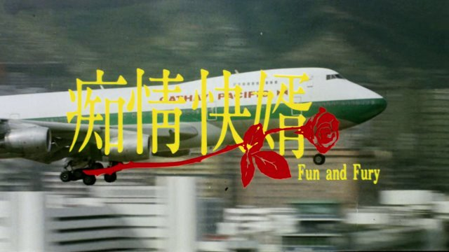

本片的一切都很平庸。因为它是由一个平庸的导演，小胡子陈勋奇导出来的。陈勋奇就像家普通的吉野家，能填饱肚子，能保证下限，但说他有多好吃，他自己都不信。他这种没有特色的平庸杂糅风格其实也相当好辨认。谁会在普通的爱情片里加黑帮元素加爆炸加动作戏加摩托车特技加喜剧加臭豆腐还要加四驱车呢？对，片子的开头郑则仕就在玩四驱车，而男二的陈勋奇自己，攻击的主要手段之一也是放四驱车炸弹。他身上背的棍子打开之后竟然是一条四驱车赛道，说好听的是脑洞大开，说不好听的是强行加戏。猜测的方向是，四驱车是1992年香港的流行文化，陈勋奇是为了蹭热度；但是我家这边，我明确记得是1994年开春之后玩具摊前才开始摆起了各种各样的赛道。是否是流行元素的时光涟漪，如今已不可考。
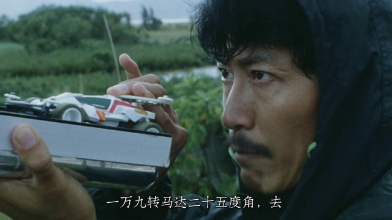

要说陈勋奇是这个系列以来又一个仗着导演身份给自己疯狂加戏的男二（上一个是[《海市蜃楼》](https://pewae.com/2016/04/review-mirage.html)的徐小明）。最终的4个BOSS除了金毛虎是被黎明一脚KO掉以外，剩下三个都是被小胡子给干掉的。但无论是动作戏还是枪战戏，却又都没什么特色。
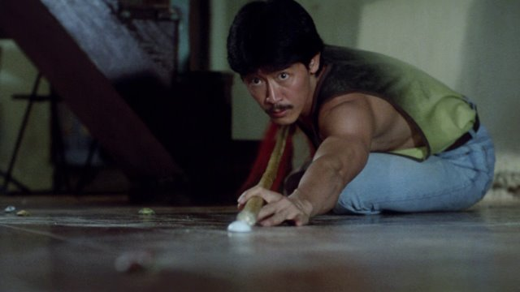

咱还是说周慧敏吧。周慧敏大多数时候就是一只花瓶，本片里也不例外。爱吃臭豆腐的黑帮大小姐，被人横刀夺爱，又被棒打鸳鸯又被绑票的，按说可供表现的地方还挺多的，但是发挥真就一般般。这张脸的局限性还是很大的，就当不了坏人，对吧？
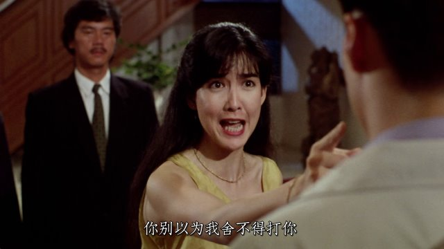
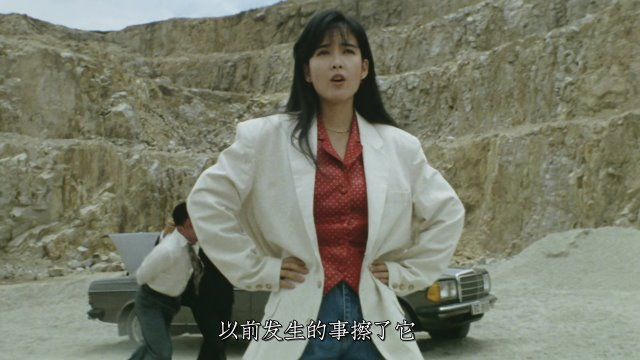
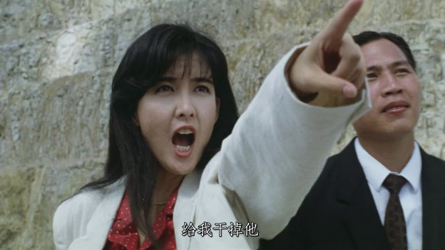

里面有场一袭红裙的飙舞戏，真是美得发光。
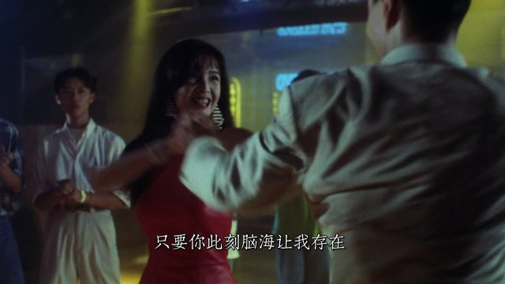

编剧还是有些恶趣味的，给周慧敏起名青霞，给黎明起名汉哥……
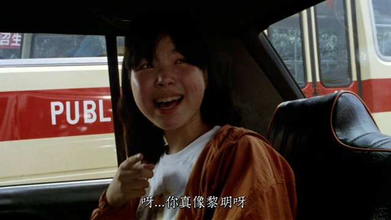
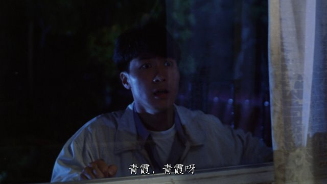

这个话题开展了这么久了，还有哪位有头有脸的明星还没出场？
——黎明。
黎明在青年时期的我心目中，印象很浅。你说他唱歌拿奖无数吧，都是些粤语歌，国语歌能记住的只有一首《今夜你会不会来》，第二首有印象的一竿子撅到世纪末的~~《爱在2000》~~《爱天爱地》，而且更多还是为了看舒淇。你说他演技好是影帝吧，《甜蜜蜜》这种片子正常中二少年会感兴趣？九七前黎明在我这里的最有印象的竟然是电视剧《老师早上好》。九七以后忽然摇身一变成实力派老艺术家了，也是令人费解。不过黎明确实是帅的。
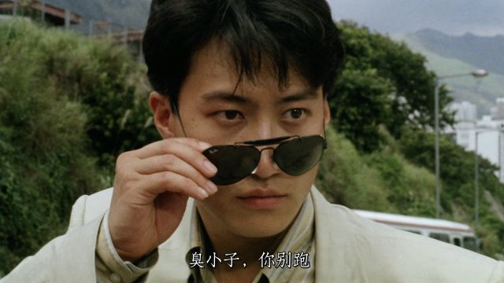

郑则仕演周慧敏的爹，一个黑帮大佬。很明显在划水没卖力气。估计他是看不上陈勋奇的导演水平吧。
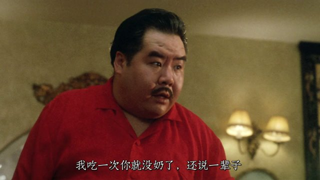

陈勋奇也不是所有的镜头都拍得平庸。他拍女二郭秀云就拍得肉香四溢鲜嫩多汁的。
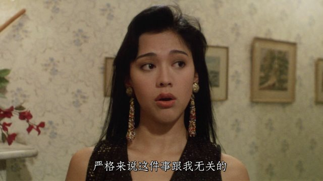
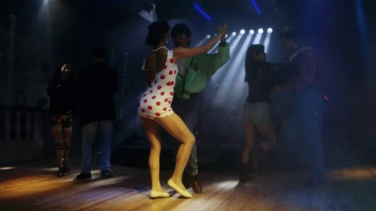
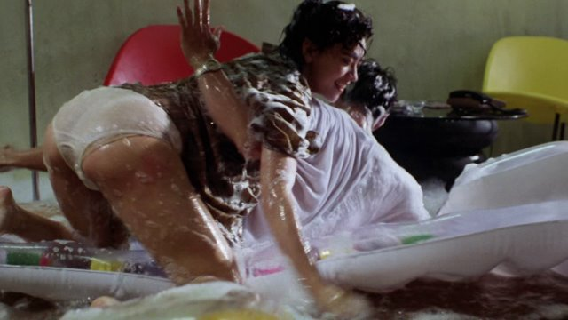

全片最出彩的是郑则仕的光头狗头军师，坑叔。扮演坑叔的是简而清老爷子。他的主业是专栏作家、主持人，主攻方向是马经。本片里他既忠心又坏又怂的样子很是生动。
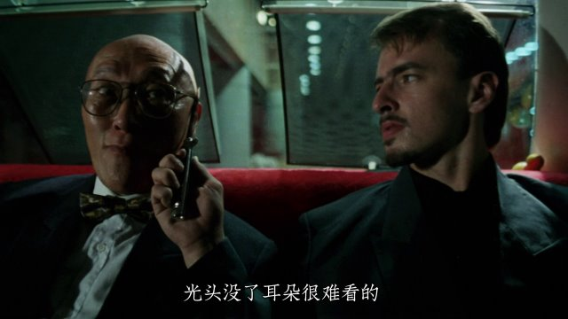

剧情真的就很普通，黑帮大佬郑则仕跟另一伙黑帮矛盾激烈。恰逢黎明这个长脚女婿要上门，于是前半部分就是郑则仕棒打鸳鸯，后半部分是笑面虎一伙绑票了周慧敏的英雄救美。笑面虎是徐少强友情客串的。这里是港片的老套路，除了徐少强以外的三个BOSS都是洋人，一黑一白一女。着重表扬一下这位女演员，名叫金佩恩（Kim Penn），整个90年代都活跃在港片里花式挨打。她的动作戏很漂亮，大长腿踢起来其实要比李赛凤好看多了。印象最深是成龙的警察故事2里，波涛汹涌。这部里发现她的臂部线条也是够可以的。
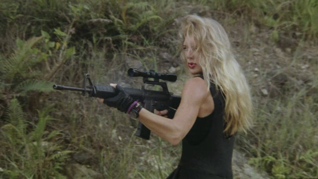

记忆中的镜头：小时候看到港片竟然借鉴大陆动画片，非常吃惊。
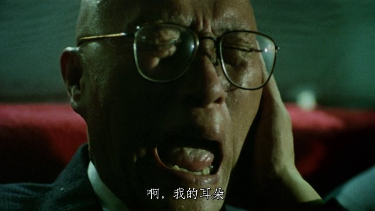