这片子的名字本来不是这个，而是下面豆瓣里那个又长又不通顺的。但当年录像带上就叫《真假威龙》，应该是蹭《逃学威龙》的热度，不过都是同一个导演的作品，不能算抄的，就像刘镇伟不停出“大话”一样。
这片子大概是在1994年的寒假，老妈单位的一个同事帮我借回来看的。现在搜到的这个版本，效果真不一定比录像带好（好像掐了好多）。

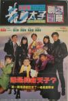

[机Boy小子之真假威龙](https://pewae.com/gaan/aHR0cHM6Ly9tb3ZpZS5kb3ViYW4uY29tL3N1YmplY3QvMTMwODE1Nw==)

导演：陈嘉上主演：关之琳 / 刘德华 / 刘镇伟 / 吴君如 / 吴孟达 / 袁和平 / 郭富城类型：动作 / 喜剧地区：香港首映时间：1992

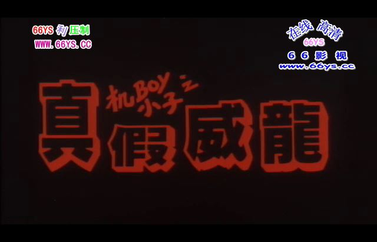

导演是大名鼎鼎的陈嘉上，演员则汇集了刘德华、郭富城和关之琳这三大花瓶，辅以金牌绿叶吴孟达和吴君如。因为是贺岁片，所以客串阵容也很强大。八爷这时候可一点也不显得老。
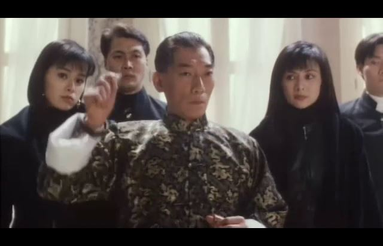

还有这个死胖子菩提老祖，出场5分钟果然死了。
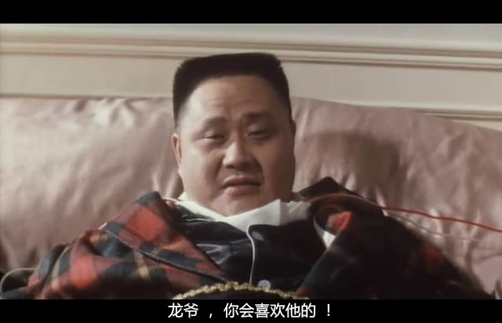

片子本身是相当随意的，就是把一堆笑料放进黑社会的框架里，炖一个皆大欢喜的贺岁套餐出来。
刘德华本片里扮演一个高智商的大孩子，全程卖萌，比童梦奇缘里还要过分许多。因为这个时候只有30岁的刘德华演技还未成熟，所以演得非常别扭。
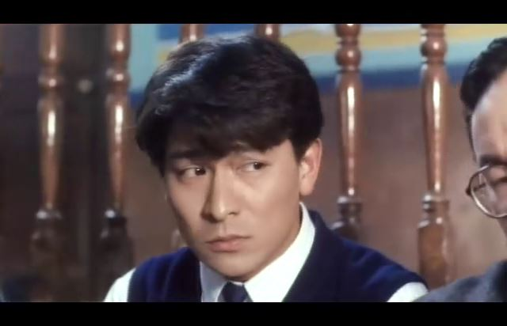
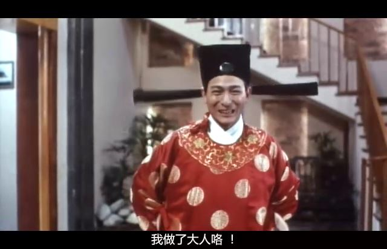

刘德华演得好演不好倒在其次，主要是颜值上被碾压了。倾国倾城的郭富城啊！而且导演应该是故意制造刘郭二人的冲突，有个刘德华在酒吧唱歌的剧情，刘德华唱的是“灯初上夜未央，来往的人多匆忙……”
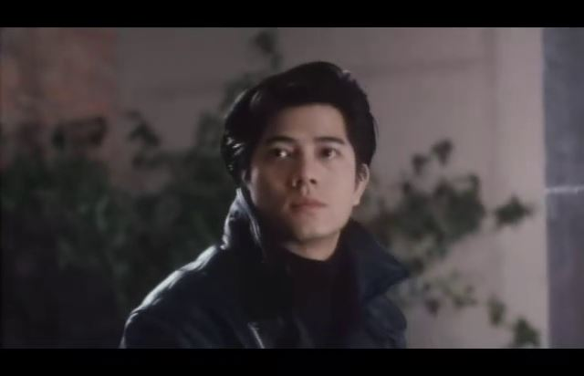

被关之琳再碾压一次。
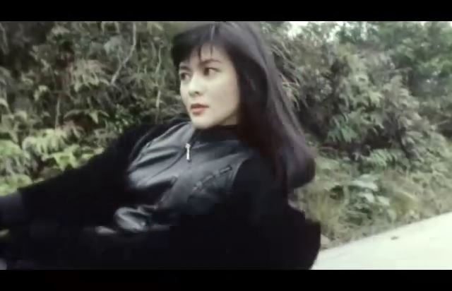

故事是非常单薄的。黑社会原老大刘镇伟挂了，让自己在意大利的私生子回香港接班。刘德华是大陆神童，在尼泊尔转机的时候拿了长得一模一样的黑社会老大私生子的身份证明，到香港顶替成了黑社会新老大。忠心小弟郭富城、笨蛋小弟吴孟达和花痴小妹吴君如傻呵呵地拥戴新老大。袁和平跟另一个龙套不服，跟刘德华争老大的位置，袁和平出动女儿（关之琳）暗杀，结果肉包子打狗。另一个龙套则一直到最后都负隅顽抗，成了最终大BOSS。
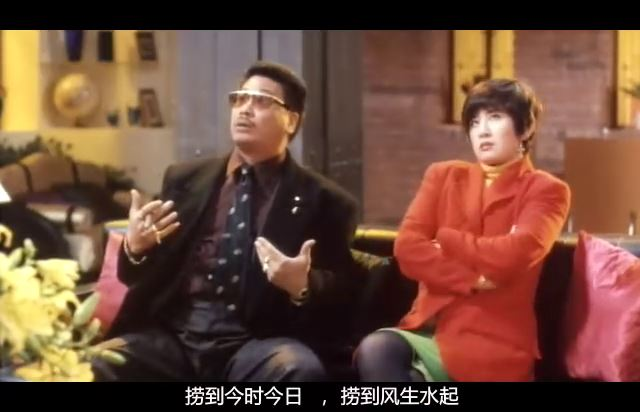

因为刘德华光知道玩，所以后来整个社团也光知道玩。下面这个镜头是社团开会的时候，关之琳和小姨子一人手捧了一个掌上游戏机。小姨子拿的是个Gameboy，而关之琳手上应该是个SEGA的GG，这在大陆可是相当稀罕的玩意儿，反正我只见过两次实物。这个片子的英文名叫game kids，但刘德华却只有一个碰GB的镜头。对了，小姨子的扮演者是导演陈嘉上的前妻。
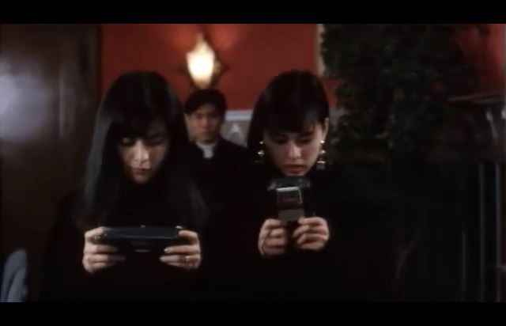

记忆深刻的镜头之一，刘德华半夜跟吴孟达吴君如打牌，输了在小弟面前扮舞女。说起来吴君如比关之琳还要小三岁，92年的时候才27，可怎么看怎么有40了。
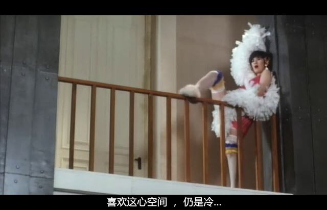
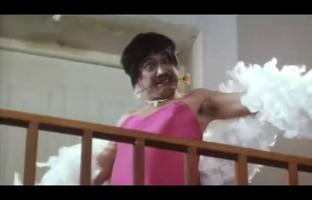

记忆深刻的镜头之二，刘德华在房间里用墙皮画了个关之琳的头像。
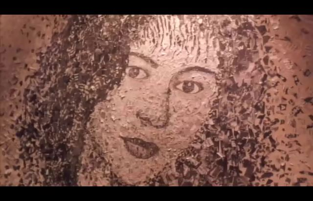

记忆深刻的镜头之三，刘德华救小姨子的时候，为了减低子弹威力，用坏人小弟的手来挡。刚好那时在看寒羽良，看到漫画这么流行，颇感意外。
那时的特效不敢细看，看图里的手多假啊。
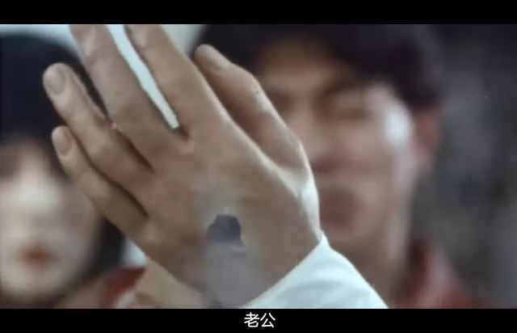
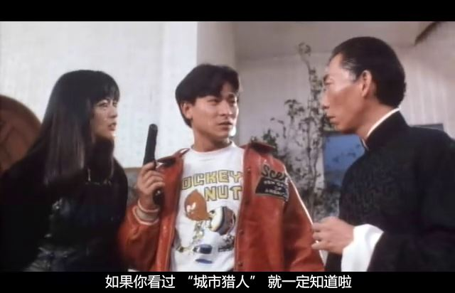

记忆深刻的镜头之四，刘德华最后直冲着反派的枪口而去，在对方开火的一瞬间躲子弹。为了截这张图，手指头都快抽筋了。
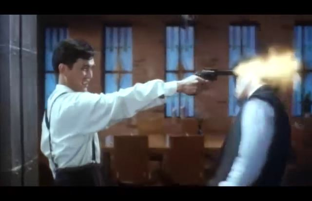
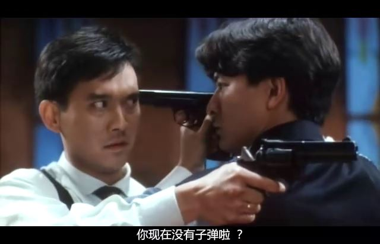