这部电影是八十年代马(东)先生的父亲马季凭借自己的影响力，带领徒弟们“触电”的一次尝试。总的说来是失败了，这玩意儿根本不能叫电影，只是一部大型的相声TV而已。

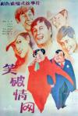

[笑破情网](https://pewae.com/gaan/aHR0cHM6Ly9tb3ZpZS5kb3ViYW4uY29tL3N1YmplY3QvMTk2MzY1Ny8=)

导演：胡书锷主演：冯巩 / 刘伟 / 赵炎 / 郑健 / 马季类型：喜剧地区：大陆首映时间：1987

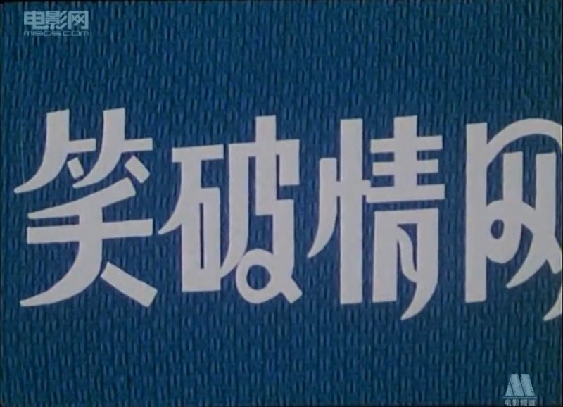
戏剧冲突什么的不能说没有，但太生硬了，简直就是群口相声直接分台词变成了剧本。光俩人对口说相声这种场景就出现了三四次，最后高潮部分一个相声说了10分钟，作为编剧，马季先生这剧本来得太草率了。
小时候我不太喜欢陈佩斯父子的电影，觉得闹腾。重温这部片却不禁让我怀念起《二子开店》来，二者同是87年拍摄的电影，知名笑星担纲，水准却判若云泥。人家老陈家真不愧是戏剧世家。

片子的主要角色都是马家军的成员。马季本人演反一，浓眉大眼的二徒弟赵炎领衔主演，三徒弟刘伟男二，四徒弟冯巩打酱油，搭档王金宝演村长，徒弟王谦祥李增瑞客串村民甲村民乙，师侄郑健演赵炎的搭档，另一个师侄戴志诚只有一句台词一个镜头，也不知是为了夸怹还是骂怹。
说来郑健戴志诚本来是李伯祥的徒弟，可不知为何与马季这一门走得很近，尤其郑健，跟马季赵炎刘伟冯巩都搭档过，简直是马家军御用，令人费解。
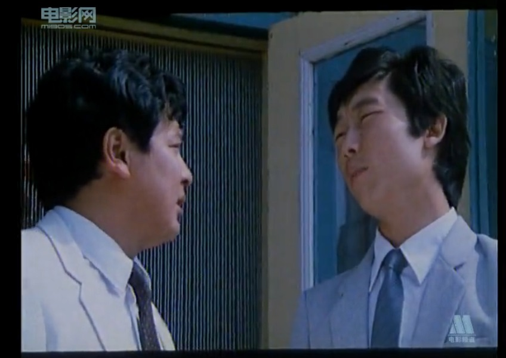

给马季点个赞，自惭形秽没硬演男一。马先生虽然有跟自己师父翻脸的丑闻，但那毕竟是特殊时期不能以常理度之。相声这行当盘子不大，旧规矩tmd跟黑社会似的，水浅王八多。马季这派不大像传统派的师父-徒弟模式，更接近现代的老师-学生模式，而且走晚会路线，所以内部矛盾要相对少一点。那面的侯派确实不堪，德云社天天好莱坞不提，55岁的陈寒柏认59岁的师胜杰当干爹，师胜杰竟然收了，比着不要脸。
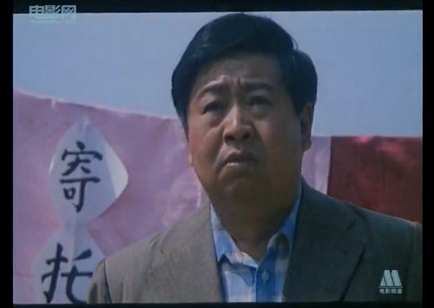

刘伟演了穿起剧情的个线索人物。赵炎10年前在渔村体验生活的时候，刘伟还是个小屁孩。10年后刘伟跑城里找赵炎要拜师学相声，赵炎正愁没灵感，决定重回当年去过的渔村。到渔村后发现这里送礼风盛行，尤其刘伟的大哥马季二婚，而且为他爹筹备70大寿，并假称赵炎随了500块的份子。这才引出村民对赵炎颇有怨言，认为他哄抬物价。赵炎怒不可遏，创作灵感也回来了，在马季的婚礼上说相声当面打脸。
说起刘伟哥，也算是朵奇葩。本来非常受马季重视，而且跟冯巩几次春晚也已经闯出来名堂，却偏偏一门心思想出国，跟师弟冯巩裂穴，到底是跑澳大利亚去了。你一说相声的去澳洲干啥？其实他特点挺尴尬的，以柳活儿见长，却唱不过笑林；心理素质不好大场面吃栗子。优点是长相还行声音甜美，个头也不错，当年跟冯巩老师是身高最高的相声搭档。这片子的剧情其实有个挺有意思的地方：镜头回闪10年前的时候，刘伟还是个最多十三四岁的小屁孩，然后剧情交待马季43，他爹过70大寿。所以他爹是46岁那年有的刘伟。也许他爹也是二婚？
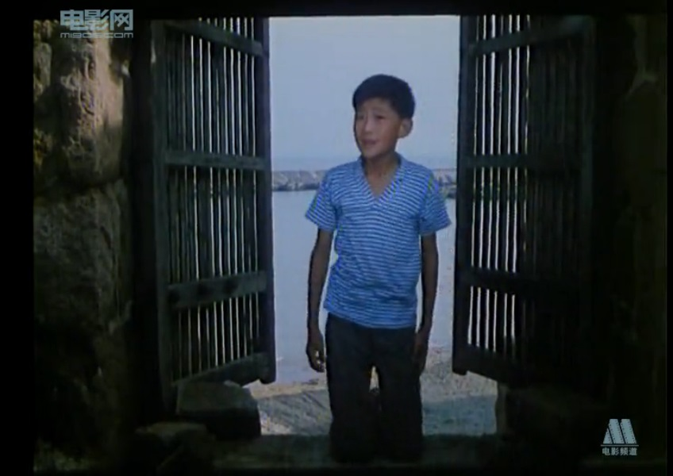
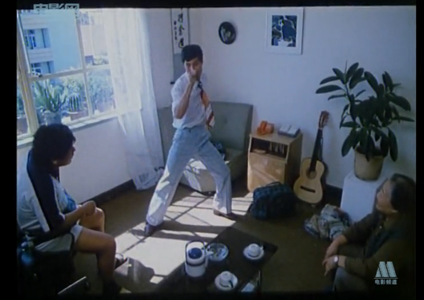
片子里的“现挂”：刘伟唱冬天里的一把火。
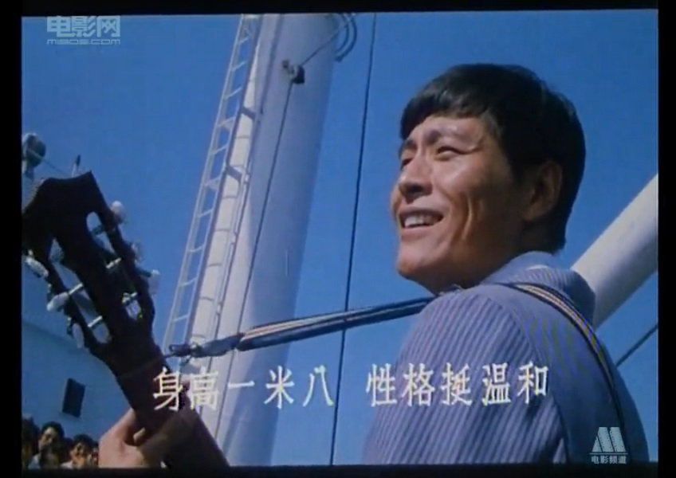

两个八十年代生活的小细节：
86、87年流行的蛤蟆镜。满大街都是卖眼镜的，十成是假的。当年报纸上砖家曾痛心疾首大呼不要在路边买墨镜戴，损伤视力。
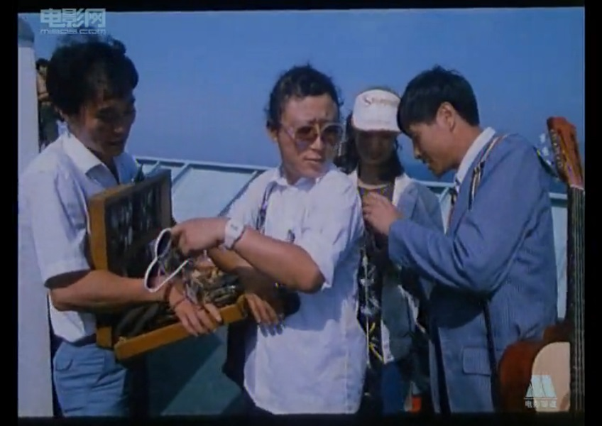
为了欢迎赵炎下乡，村里出动了鼓号队迎接。这玩意儿简直是八九十年代小学的标配。号手只要会吹do-mi-so-do就能够入选，反正只要会吹“mi-mi-do-mi-so”一首曲子就够了。然而我只是勉强能吹出声，没加入得了号队，只落了个打大鑔的活计，又累又脏。唯一的好处是跟小鼓队小丫头合练的机会比较多，可人家的目光都盯在帅帅的指挥哥哥身上。
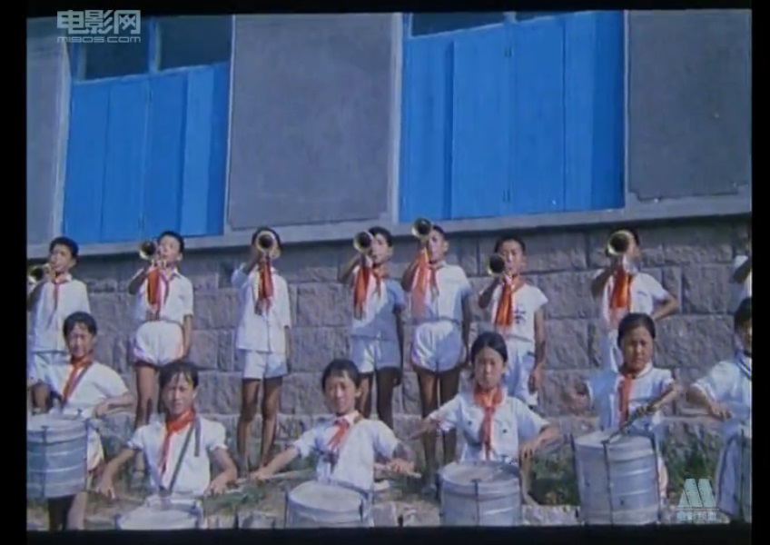

冯巩的戏份特别突兀。他演的是赵炎的同事或者徒弟，赵炎创作出新段子之后立刻把冯巩call到了乡下当人肉背景。然后冯除了露了几个脸有几句词以外对剧情屁作用没有。感觉就是因为冯巩名气大不出境不好而刻意加上的。
这对于电影演员里相声说得最好的冯巩老师来说，简直是一种羞耻。
但冯老师又不可或缺。要是没他的话，我可能就把这片忘干净了。准确的说，是他片里的老婆，哄孩子的时候有个国产电影喜欢用的漏点喂奶镜头。这次重温，本来是冲着这个镜头去的。
可惜只能找到m1905的在线片源，这种镜头当然是被和谐了。甚憾。
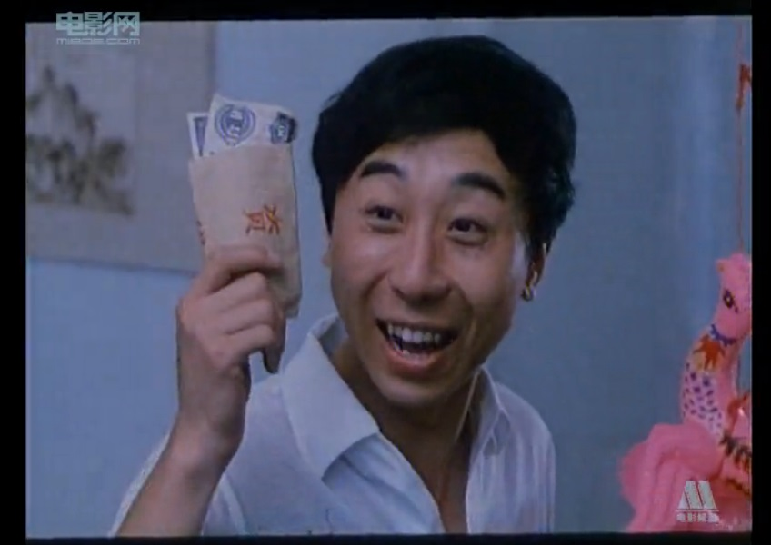

片子是在胶东沿海拍的，按说风俗应该跟我们协弃市差不多。可里面说随礼喜欢送脸盆和暖壶，这就非常诡异，这东西应该娘家准备啊。
不知这是八十年代伟大首都的习俗还是马老师臆造的。
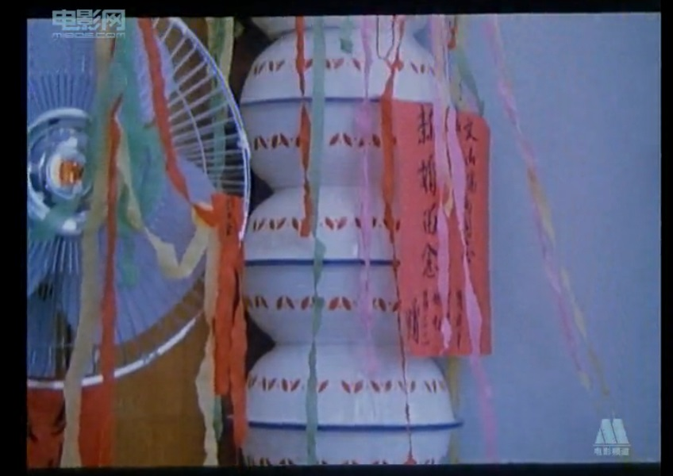

女婿们送的寿字。大女婿送5元炼钢工人拼出来的，二女婿是10元大团结拼出来的，三女婿是50元拼出来的。
海岛上87年的生活水平究竟如何我是不知道，反正我是到了89年的春节才第一次见到50元长啥样。那还是二表哥拿出来显摆的，只有一张。
当时这道具要是留着，现在可值钱了，87年50元当然只有80版，这玩意儿如今是面值的至少60倍！炼钢工人大约70倍，大团结量大，只有不到20倍。
截张大团结的图，因为我喜欢它的设计。
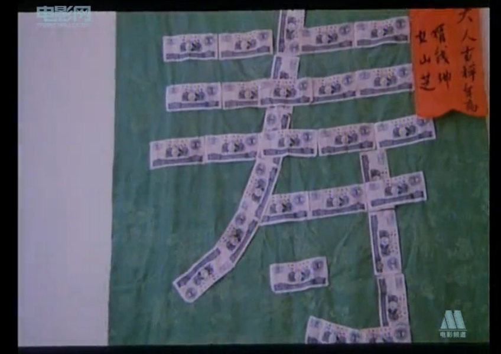

马季的新婚妻子出场的时候，画风突变。女演员身材高大动作迟缓，神情略呆滞。
编导可能是想表达“你二婚找这样的还好意思收红包”的意思。
但这地方的音乐特诡异，像变了调的哀乐，显得特别不尊重人。
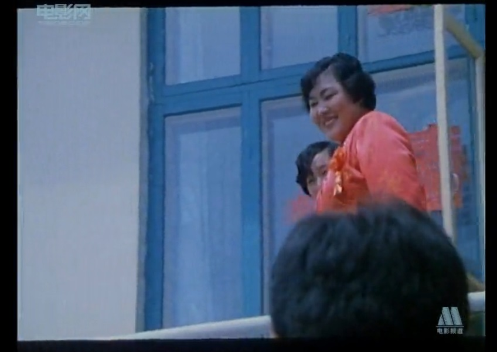

结尾的设计是赵炎把新作品当成给丈母娘上寿的贺礼，他媳妇儿听了段相声竟然同意了！同意了！了！
所以片名里的“情网”并不是张学友先生歌颂过的那种，而是“人情网”。整个片子想说通过相声的形势打破人情岁礼的陋习。
白日做梦！
我要是编剧，就把故事往后再多写一点，赵炎回去在岳母的寿宴上讲讽刺随份子的相声，被舅子们糊一脸。
提倡节俭可以，在自己丈母娘身上提倡节俭是找死，才叫深入生活。