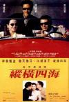

[纵横四海](https://pewae.com/gaan/aHR0cHM6Ly9tb3ZpZS5kb3ViYW4uY29tL3N1YmplY3QvMTI5NTQwOS8=)

导演：吴宇森主演：周润发 / 唐宁 / 张国荣 / 曾江 / 朱江 / 胡枫 / 邓一君 / 钟楚红类型：剧情 / 动作 / 喜剧 / 犯罪地区：香港首映时间：1991

重温了《偷天陷阱》，怎能置诸《纵横四海》于不理？
这片是1992年秋天学校组织在电影院（工矿俱乐部）看的。看完的感受当然就是一个过瘾。班上不少女生也就此成了张国荣的影迷。其实在我这个年龄段，张国荣的歌迷还真不多，毕竟我们开始有追星的本事的时候，张国荣已经退出歌坛了。
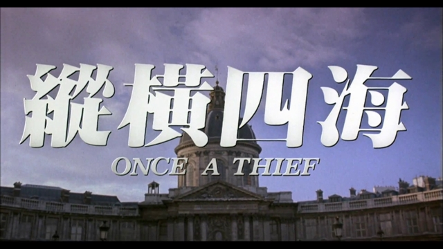

就偷画这点来说，本片是开创性的。三次偷画用了三种不同的手法，不得不佩服那个动作电影黄金年代导演和摄像们的想象力。第二次偷画最为精彩，无论是空中飞人摘画还是红外线逃脱，都启发了很多后来者。比《碟中谍1》阿汤哥的出场秀，比如《偷天陷阱》的钻红绳。其实贯穿剧情始终的那幅名画是露了点的。当年电影院是不是特殊处理过了，如今早已想不起。
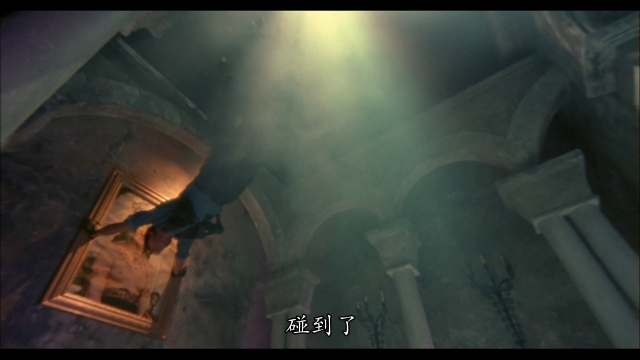

本片有一种属于吴宇森独有的潇（sao）洒（lang）。暴力美学的美是建立在不羁的基础之上的。什么太平轮，什么赤壁，没了那股骚劲，便不暴力，也不美。这种天生的气质正是吴大导拍不好沉重的历史题材的根本原因。
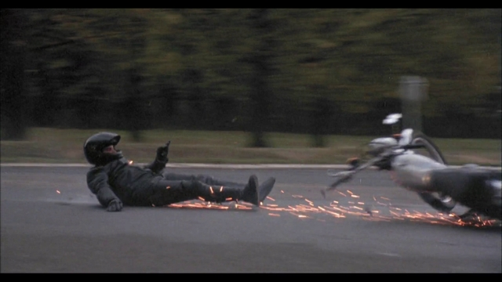

本人不是张国荣的影迷。本人也不是张国荣的歌迷。张国荣并不具备梁家辉和香川照之那种演啥像啥的本事。但是，在演绎忧郁气质这方面，他真的很强很强。
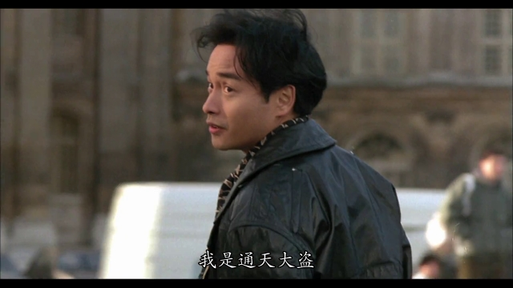

对我来说钟楚红是上一个时代的演员，她的电影看得并不是特别多。这次重温好好地观察了一下颜值，像刘涛和张可颐的结合。小圆脸的美女看着就是比尖下巴亲切。
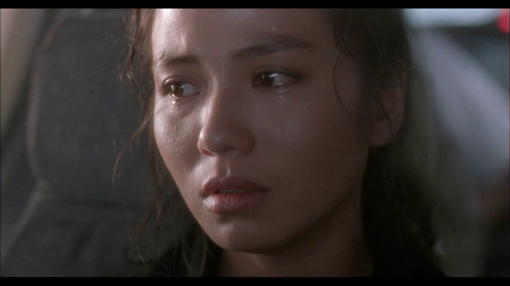
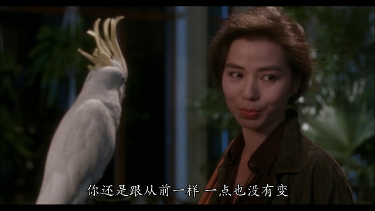

周润发是吴宇森的好朋友。因为周凭借《英雄本色》翻了身，所以后来只要吴宇森点名，周润发就会喊“到”。本片中周润发成功演绎了什么叫“有一种爱叫做放手”，洒脱。下面的台词更是迷倒一大票人。记得当时我同桌就特意找到了全篇抄在了歌词本上。我已经20多年没见过她了，也不知道她会不会遇上周润发这样的渣男。
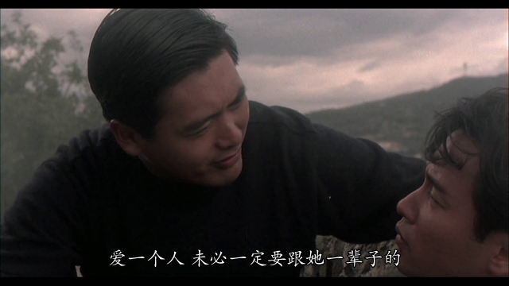
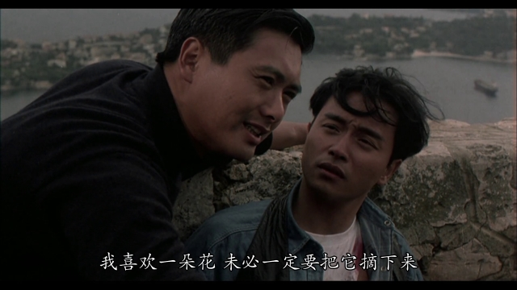
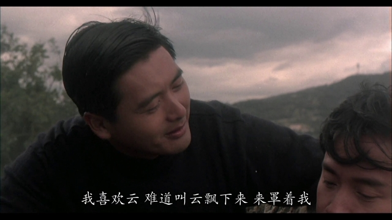

某瓣的评论上，有很多年轻人说本片配不上TOP250，只能说现在已经不是江湖义气的时代了。有代沟正常，所以不想说剧情和表演，单拎出特效来讨论。本片有非常多的驾车追逐戏，有火场，有爆炸。在没有电脑制作的年代，这些都是成本很高且很难控制的镜头。跟炫酷的CG特效相比，我更喜欢真刀真枪的撞车和爆炸场面。
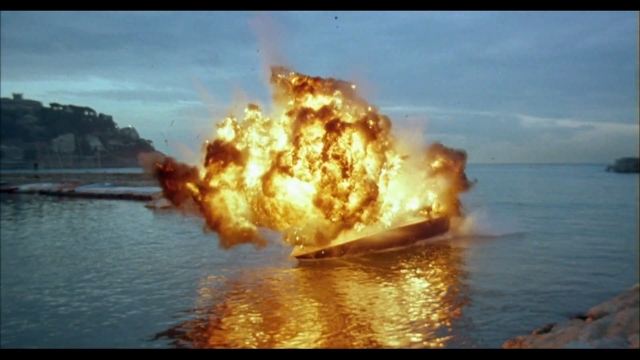

我看来，本片的缺陷在于周润发的逗逼设定，跟整体故事有种淡淡的不协调。还使了好多格调不太高的梗。可能吴宇森前一部《喋血街头》仆到了姥姥家，迫于资本的压力，各种流行的东西都要往里加吧…… 当年见识少，即使已经六年级了也没一个意识到说的是什么。现在学校可不敢给孩子看这么污的段子了吧。
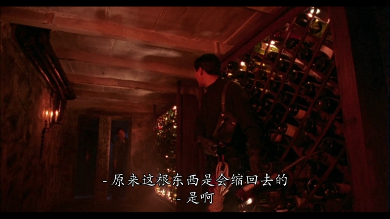
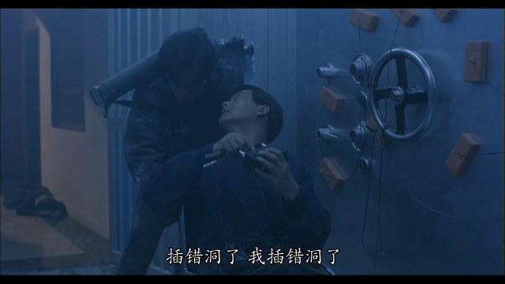

有个悬案，本片当中吴白鸽究竟有没有放过白鸽？有人说下面这个镜头就是，但我看这两只就是水鸟。
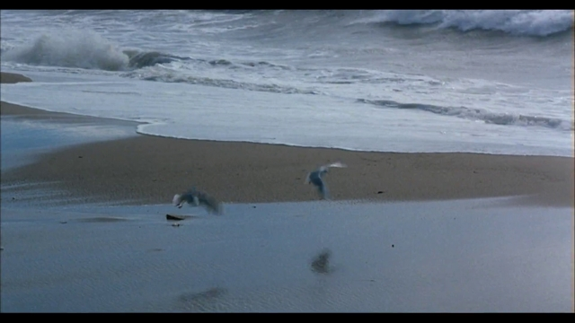

记忆中的镜头一：
红姑成功从胡枫身上摸到钥匙。
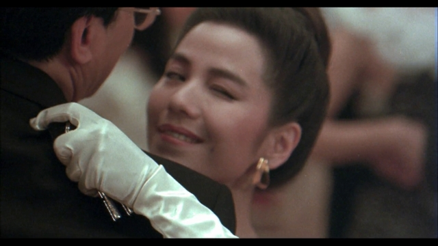

记忆中的镜头二：
红酒杯与红外线。
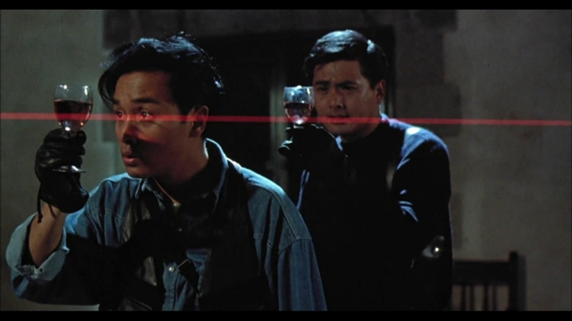
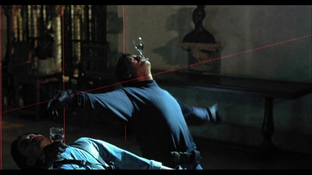

记忆中的镜头三：
馒头泡在稀饭里。
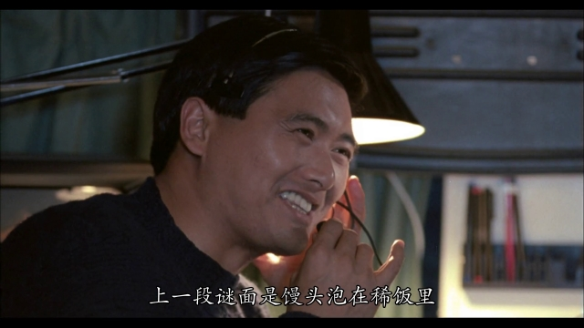

记忆中的镜头四：
在轮椅上翩翩起舞的发哥。
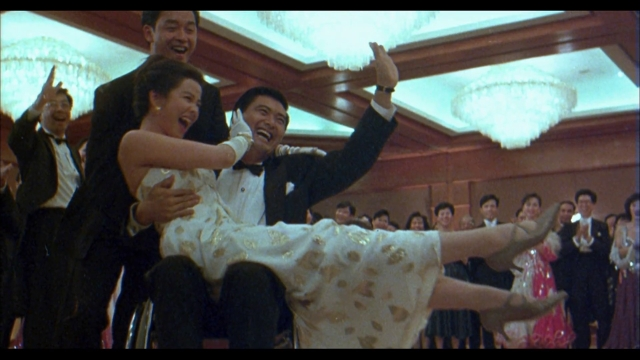