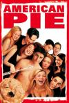

[美国派](https://pewae.com/gaan/aHR0cHM6Ly9tb3ZpZS5kb3ViYW4uY29tL3N1YmplY3QvMTI5NTI1My8=)

原名：American Pie导演：保罗·韦兹 / 克里斯·韦兹主演：克里斯·克莱因 / 塔拉·雷德 / 娜塔莎·雷昂 / 尤金·列维 / 托马斯·伊恩·尼古拉斯 / 艾丽森·汉妮根 / 艾迪·凯伊·托马斯 / 莎诺·伊丽莎白 / 西恩·威廉·斯科特 / 贾森·比格斯类型：喜剧 / 爱情地区：美国首映时间：1999

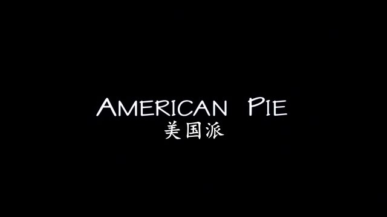

这种破处题材的电影，我并不清楚《美国派》是不是始作俑者，但确实没看过更早的。本片影响极大，20多年来在全世界范围内都效仿者众多。在我心中，无论它值多少分，都是电影史上的一部里程碑式的屎尿屁作品，是人生中必看的一部电影。
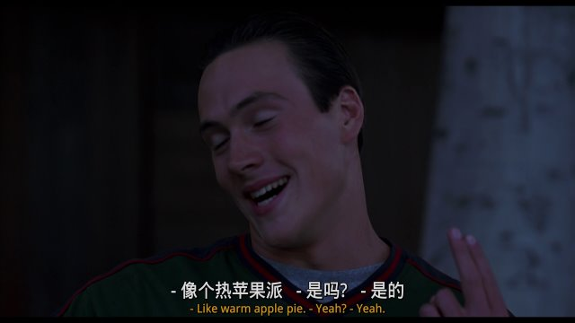

2000年夏天，大一升大二的暑假。
高中同学Rock要配笔记本，找我和Q当参谋。因为拿的现金，Rock妈还特意找了她开出租的老舅跟着。
当时配电脑通常会买张对系统要求高的游戏来“烧机器”。Rock自己不玩游戏，卖笔记本的老板说买张碟放也一样。然后她就跑旁边买了这部片子的盒装VCD。
没错，她非要上个死贵的DVD光驱。
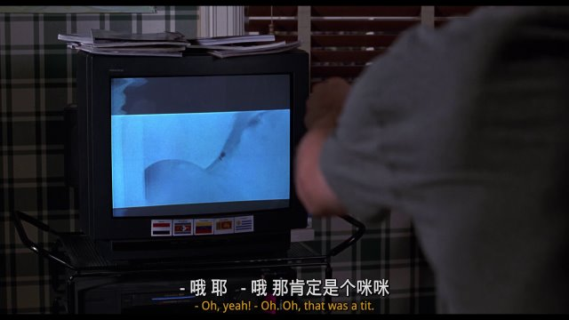

Rock的一大爱好是充分利用时间。她看笔记本配的比较顺利，就趁着我跟Q给她查坏屏的功夫打（IC卡）电话摇人，摇来了3个闺蜜和一只闺蜜的舔狗，下午陪她逛街。
大家都是高中的同班同学。
老舅一辆车没装下，又打了辆车。

到了她家，我装完软件，她开始烧机。
校园喜剧并不新鲜，性喜剧也是老生常谈，结合起来的青春性喜剧，本作好像是开山之作啊！
虽然卖碟的老板嘴里的片名是《美国处男》，但Rock显然没想到里面的内容是这个。更没想到7个男女一起看，人数和性别比例都跟片中看齐呢！
当然什么也没发生。嗯，那啥，她妈和她舅还在客厅里坐着呢。

表面上每个人都神态自若，至于内心各自的尴尬就只有自己知道了。貌似每个人都把笑声音量加了几十个分贝，示意门外的两个大人，我们看的是部喜剧片。
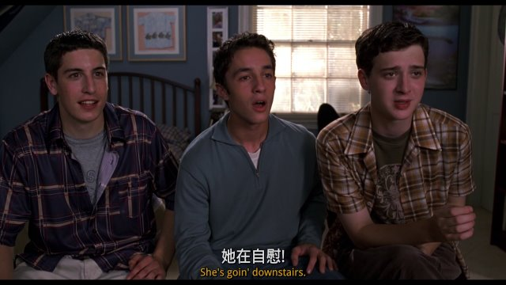

东欧女同学出场那段，海归的猪猪女还装模作样地点评了一下她的口音。我们都知道她想说的确实是口音。查资料，这位女同学的扮演者，父亲是黎巴嫩和叙利亚的混血，换句话说，这是个阿拉伯人啊！
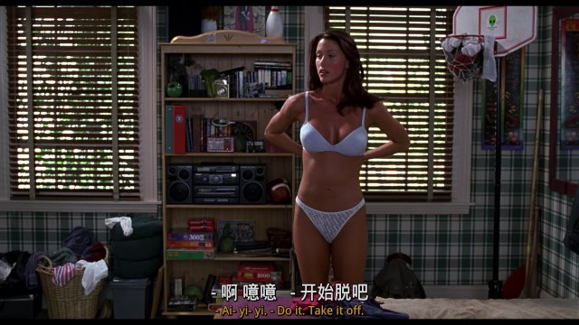

故事开头的时候不太能分辨出哪个是主角。直到开始用苹果派点题。贴心老爸的形象第一部里还不是特别鲜明，但已经凸显出跟中国父母的大不同。
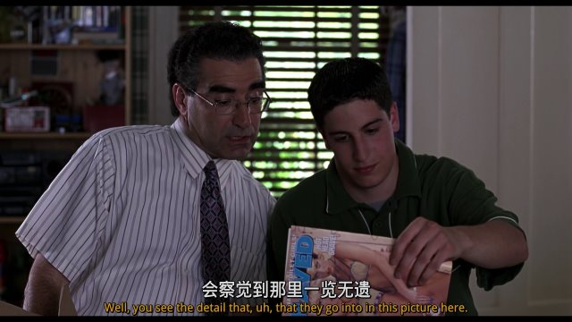

都说美国开放，其实看过欧洲电影之后就会知道美国的这种面向大众的R级片相当克己复礼。简单说就是口惠而实不至，并没有多少干货。除了东欧女同学的惊鸿一瞥以外，肉戏很少的。
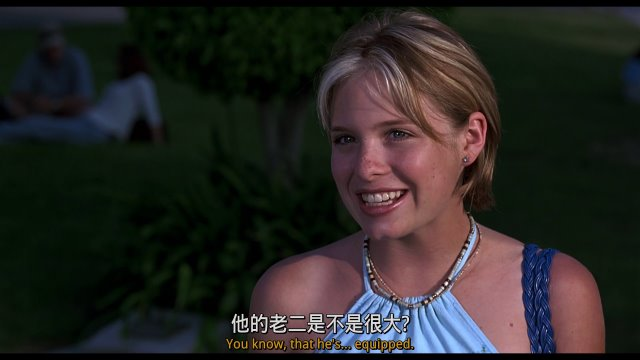
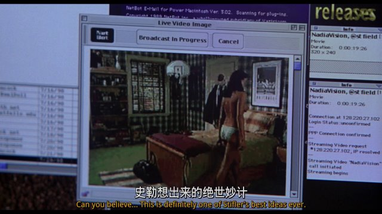

硬条妈和芬奇的分支，我看来是本片的最大亮点。主打一个峰回路转出其不意。这条线第一部是亮点，后面两部再用就没啥大意思了。当年我看的版本硬条还不叫硬条，这次下的版本也不叫。好像是第二部的港译名字吧。这个翻译还挺喜欢的。
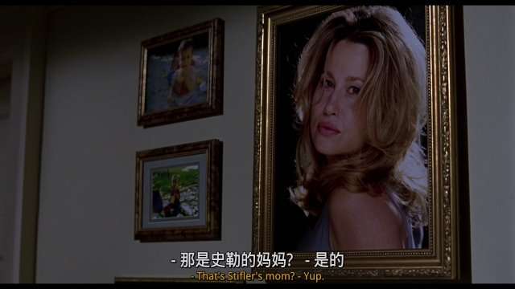
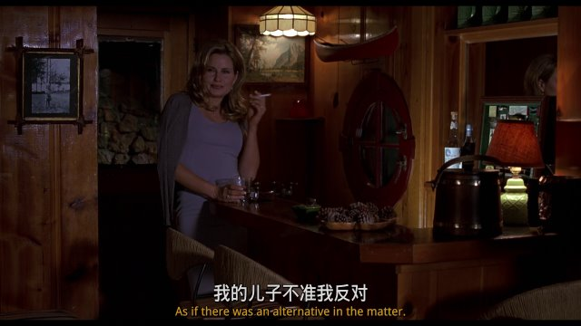

此系列有4部正传4部番外篇，其不负责任的趁热圈钱风格，像极了大洋对岸的《僵尸先生》系列。几位主演全班出现的是1、2、4，半数出演了3，其余4部番外真没啥看的必要。
这帮主演后来都没什么大出息，代表作除了美国派系列就是惊声尖笑系列。后续发展最好的应该算是演唱诗班小妹的米娜·苏瓦丽。今年看了她一部2020年的《谎言之底》，已经演孩子妈了不说，不看资料完全认不出是同一人，长残了。

记忆中的镜头一：在学校图书馆里故老相传的《性爱圣经》。
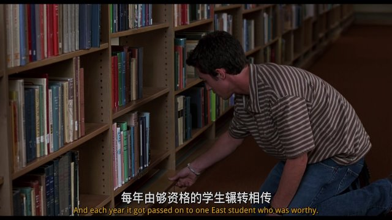

记忆中的镜头二：男主干派。
