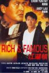

[江湖情](https://pewae.com/gaan/aHR0cHM6Ly9tb3ZpZS5kb3ViYW4uY29tL3N1YmplY3QvMTI5NzQ5Ny8=)

导演：黄泰来主演：万梓良 / 刘嘉玲 / 刘德华 / 周润发 / 李修贤 / 杨群 / 柯俊雄 / 王小凤 / 谭咏麟类型：剧情 / 动作 / 惊悚 / 犯罪地区：香港首映时间：1987

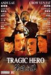

[英雄好汉](https://pewae.com/gaan/aHR0cHM6Ly9tb3ZpZS5kb3ViYW4uY29tL3N1YmplY3QvMTMwNjE0MC8=)

导演：黄泰来主演：万梓良 / 刘嘉玲 / 刘德华 / 周润发 / 成奎安 / 李修贤 / 杨群 / 柯俊雄 / 王小凤类型：剧情 / 动作 / 犯罪地区：香港首映时间：1987

这两部影片必须放在一起说，因为其本就是一而二，二而一的东西。
话说当年麦当雄找来文隽，拉上周润发刘德华万梓良野心勃勃就是想玩票大的。剧本是文隽被关在小黑屋里攒出来的，一不小心写多了，也拍多了。浪费那么多胶片心有不甘，索性把所有回忆的内容都剪掉，只留下“现在”部分的故事，成为《英雄好汉》。而回忆的部分也没浪费，新增谭校长樊梅生两个人物，原班人马补拍了4天，配上前面剪掉的内容，一部新电影《江湖情》就出炉了。
所以，《英雄好汉》与《江湖情》是正传与前传的关系，而不是当年口耳相传的正传与续集关系。
最讽刺的是，觉得《江湖情》比《英雄好汉》好的人不在少数。比如我爹，比如豆瓣评分。
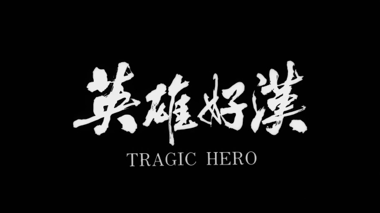
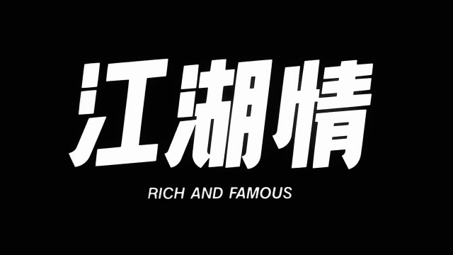

前面说过，《江湖情》是我家有单放机之后的[第一盘录像带](https://pewae.com/2017/07/memories_of_vhs.html)。《英雄好汉》则是我爹主动选择的“精品”录像。这两部片我小时候都看过5次以上。当年也算耳熟能详。岁月不饶人，小三十年过去，自己的记性真的已经出现坏道了。
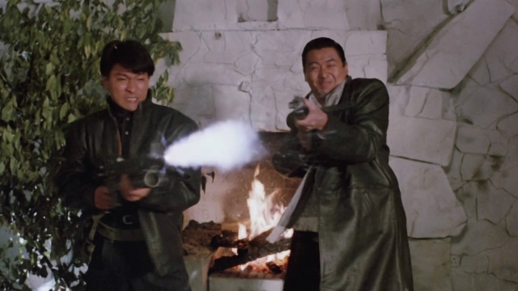

本系列是周润发和刘德华的首次合作。《英雄本色》之后，周润发从“票房毒药”的阴霾中走了出来，大背头黑道片俨然成了票房的保证。刘德华则是刚刚开始蹿红，负责帅就完了。
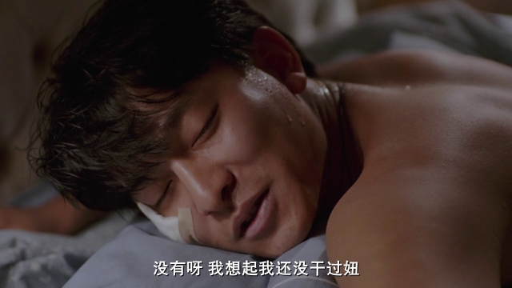
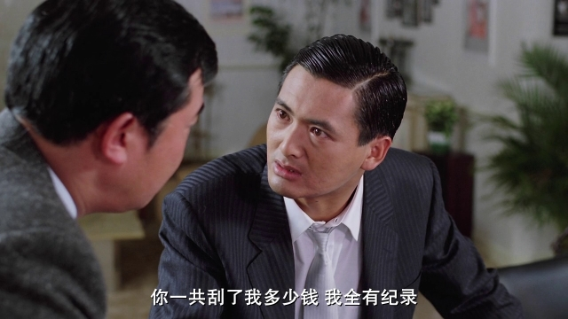

可是在这二部曲里，周刘二人的表演在另一位的光芒笼罩下显得黯然失色，能力压两大天王的人就是黑道大哥的代言人——万梓良先生。
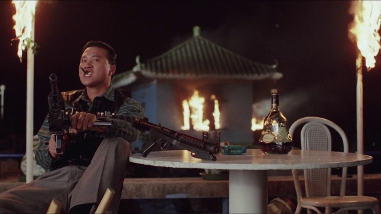

戏出不出彩当然是跟剧情有关。跟《无间道2》的吴镇宇不同，万梓良在片子里演的是十足的恶人，每个观众都恨他恨得牙根痒痒。以至于后来有一年春晚后的《编辑部的故事》的特别篇，万梓良出场演葛玲的表哥还是什么的，我妈当场说，大过年的，怎么找个坏蛋来。
万先生的表情控制天下一绝，几乎脸上的每块肌肉都能单独控制。相比之下只会往一侧撕嘴的亚洲舞王就是个弟弟。
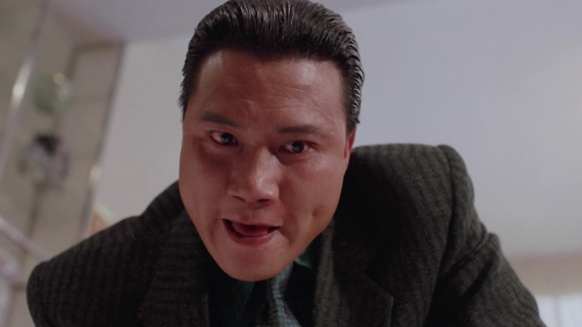
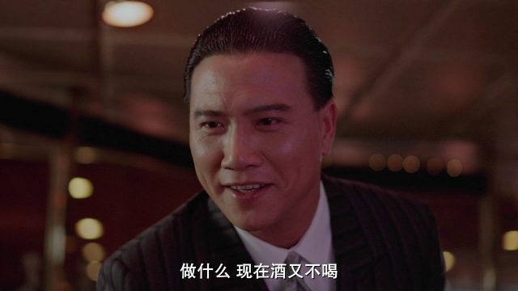

片子取名《英雄好汉》当然是为了蹭热度。文隽写的剧本也没什么特色，只能说抓住了商业片的脉络，不失分。买点是其火爆的枪战、飞车、爆炸等动作场面。本片的动作指导是梁小龙。最具特色的要算万梓良最后的死法：满身挂满子弹从二楼掉下，落进火堆里，砰砰砰炸死。
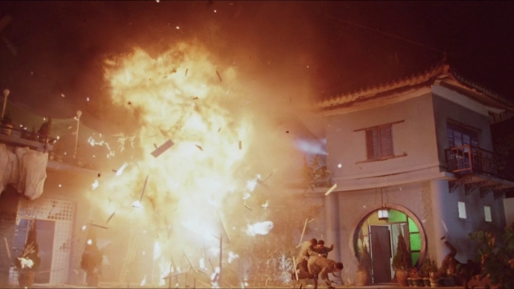

我不喜欢当年这种枪战片的原因之一是太过不真实，枪支只是烘托气氛的道具，时候未到，挨多少枪都不会死。片中刘德华就两次中枪，周润发也是两次，刘嘉玲一次，都活到了该死的时候。而剧情需要，王小凤只挨了一枪就挂了。
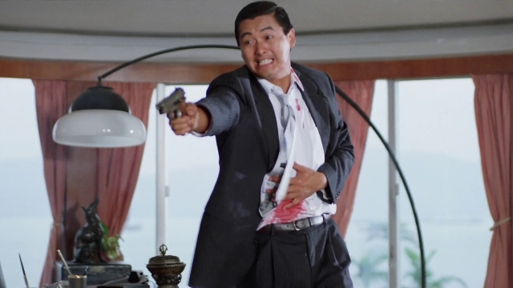

女主角是刘嘉玲，纯花瓶，换谁演都一样。那时的刘嘉玲还有些Baby fat。
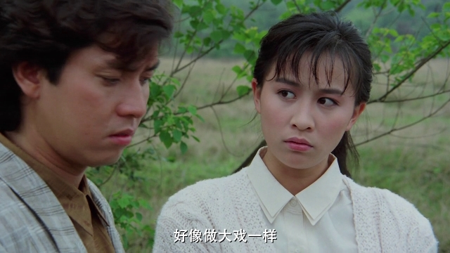

另一个女性角色是王小凤演的，西装扮相很飒。
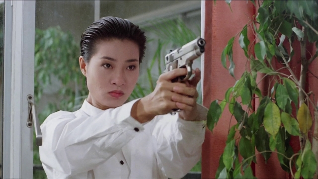

配角很有看头。因为第一部录像带就是《江湖情》，所以第一个印象深刻的配角就是大傻了。本片里大傻单枪匹马般作清洁人员想去暗杀万梓良，被乱枪干死。
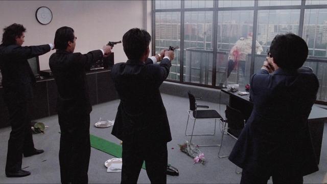
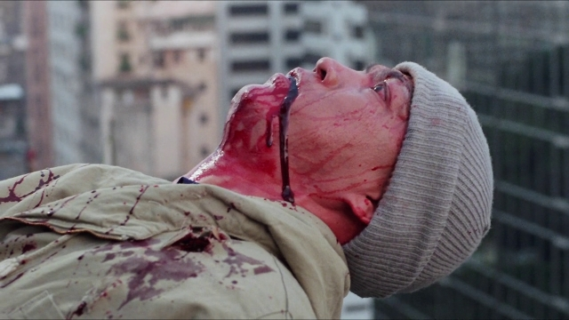

演周润发对头之一的朱老大的是来头颇大的台湾金马影帝柯俊雄。之前对这人一直对不上号，这次才算重新认识了弄死古龙的元凶。
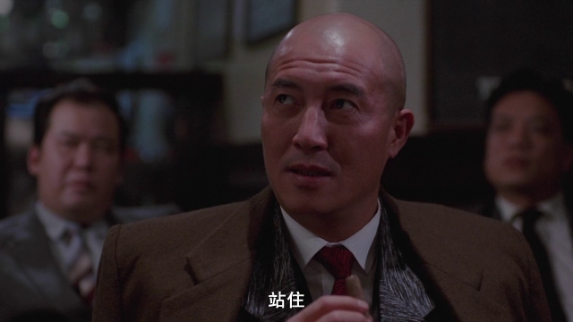

前传里追加的两个角色之一的老胖子，是导致周润发和万梓良反目的导火索。这老胖子的扮演者叫樊梅生，当年邵氏的武打演员出身。他有个儿子，叫樊少皇。
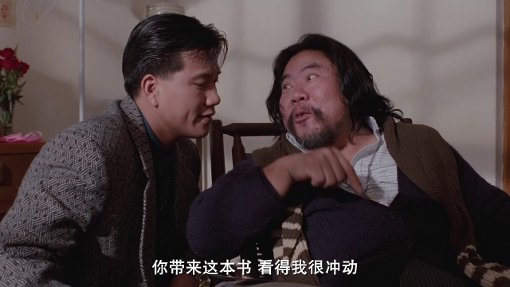

谭校长演的角色叫“麦英雄”，是个结巴，不知是不是制片人麦当雄先生在自嘲。为了烘托兄弟情谊而增加的角色，当然必须死。
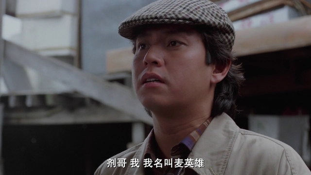

杨群难得演了一次正经老头。不过老头这回也太惨了，两个儿子自相残杀。
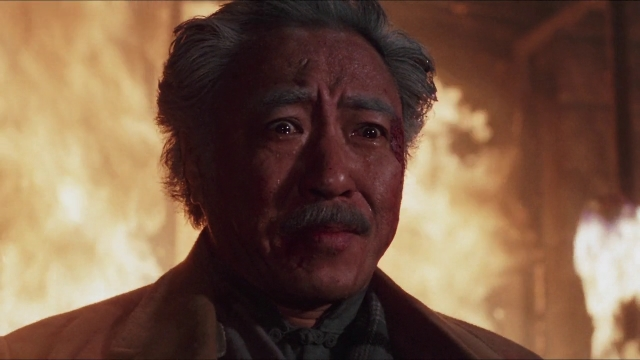

最后，也是这次重温的最大惊喜，万梓良手下的头号打手竟然是徐锦江老师演的。成名前跑个龙套不稀奇，但是，你们见过有头发的徐老师吗？
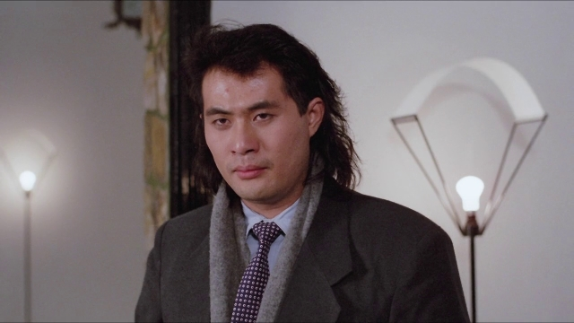

记忆中的镜头：
发哥的这个动作是录像带的封面。
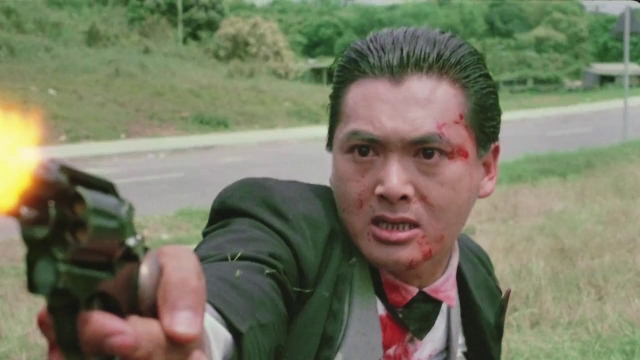