*按：昨天地铁太挤没法看手机，就站着开脑洞：【要不要跳槽】→【大连软件外包寡头】→【比尔盖茨】→【杀死比尔】→【袁八爷】，惊悚地发现对于《蛇形刁手》这部片子的记忆竟然仅剩下一句“猫爪！”了。这还了得？回家后赶紧从海盗湾下了个高清版重温一遍。随之意犹未尽，决定再开个坑，专门写对于这些老片的新感受。初步定个“老片”20年以上的标准吧。
也不打算写成标准的评论形式，看图写话最轻松。*

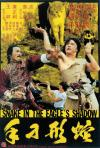

[蛇形刁手](https://pewae.com/gaan/aHR0cHM6Ly9tb3ZpZS5kb3ViYW4uY29tL3N1YmplY3QvMTQ5ODY1OC8=)

导演：袁和平主演：徐虾 / 成龙 / 石天 / 袁小田 / 赵志凌 / 陈龙 / 黄正利类型：动作 / 喜剧地区：香港首映时间：1978

《蛇形刁手》对成龙大叔和袁八爷（和平）来说都是成名作；对我来说也意义非凡——这片儿是我1987年通过单放机看的第一部录像（[之一](https://pewae.com/2015/08/after-about-donnie-brasco.html)）

第一次看录像的时候，并不知晓这片子比我还老，只觉得打斗精彩情节搞笑。这次重温，本没报太高的期待，想着拖拖拽拽半个小时就搞定了。熟料竟一口气从头看到结尾，毫无尿点。以现在的眼光看来，本片剧情太过俗套单调，搞笑情节也尽是老哏，可打斗还是tmd精彩啊！！当年对于这部片子的成功，袁八爷曾经在答记者问题的时候表示是因为“文戏剧本好。”——好个屁啊，您在动作设计上才是不世奇才好呗！
在不流行超慢动作特写，缺少电脑特技也不怎么吊钢丝的年代，八爷为了拍出有特色的打斗戏真是拼了。鹰爪的狠对蛇形的灵通过几场打斗表现得淋漓尽致。可惜影片高潮阶段龙叔的猫拳（刁手）动作设计其实蛮污的，降低了整个片子的水准。

本片的影响力那是相～当～的大。就我所知至少有两个日本ACG角色是在本片的影响下催生出来的。
第一个稍微接触点格斗游戏的都知道，《KOF》系列里的镇元斋。SNK的团队创造这个角色原型就来自《蛇形刁手》和《醉拳》这两部电影里的袁小田师父。游戏里镇元斋的肩靠、倒立、翻滚、背身站立等动作，在本片里几乎都能抓到一模一样的帧出来。为了确认是借鉴《蛇》多还是《醉》多，我不仅打了一遍KOF98，而且跑去搜了《醉》下载。结论是扮相半斤八两，但《醉》里袁老师父的打斗戏份远不如《蛇》里的多，该是以《蛇》为主。好吧我也是够无聊的了。
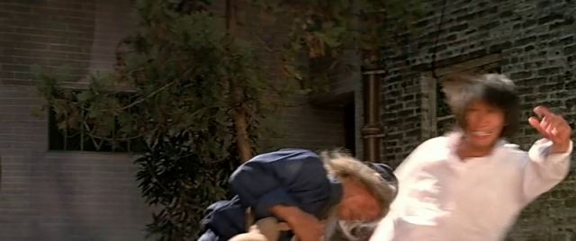
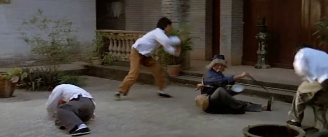
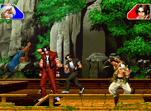
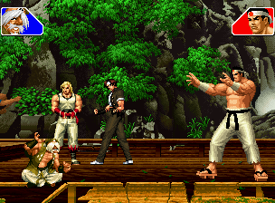
关于袁小田先生，再多说两句。第一他是香港电影史上第一位武术指导。第二他是袁和平袁祥仁的老爹。
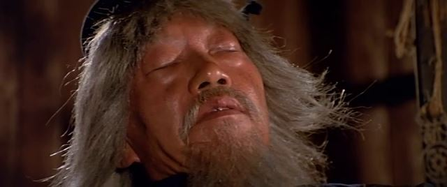
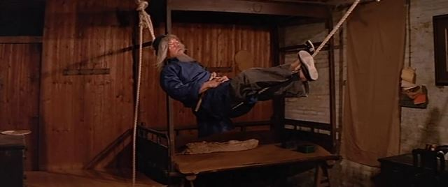

另一个是《龙珠》里的杀手桃白白。鸟山明大师亲口承认他非常喜欢成龙电影，就照着《蛇形刁手》里的大boss画的桃白白。
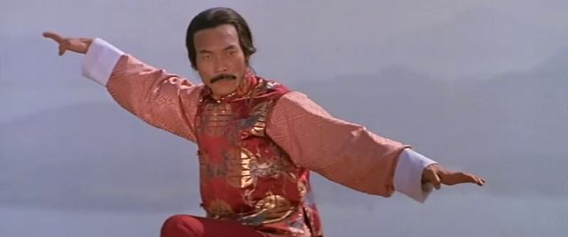
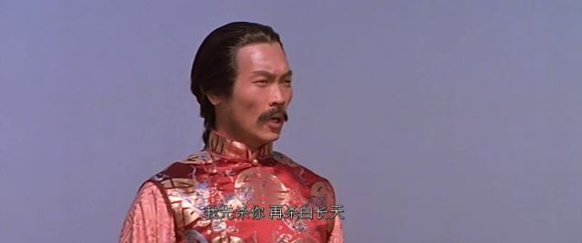
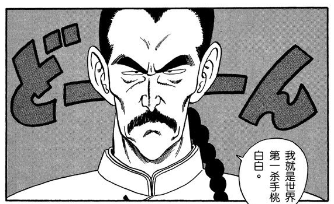
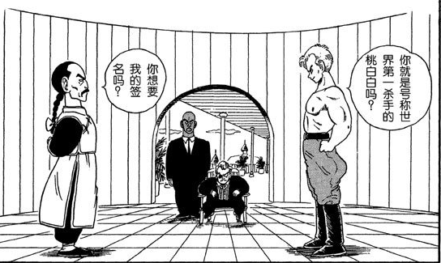

片头有些冗长。成龙先生在刺眼的红色背景下独自打拳。一板一眼，有些单调。
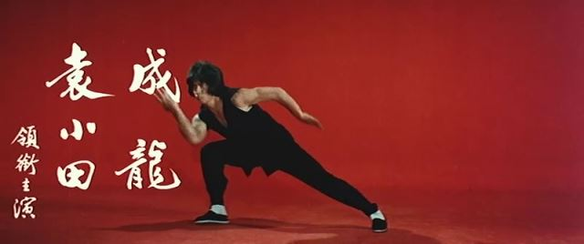
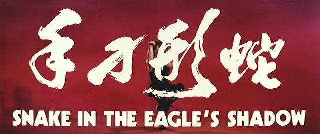

本片具有非常鲜明的70年代末80年代初风格。
比如人物脸谱化严重。基本每个角色一出场就知道他的身份。
奸人。有这演员叫啥的望告知。
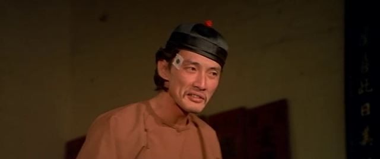
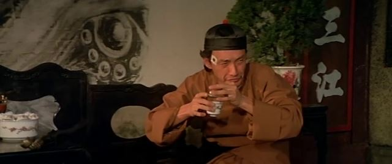
蠢人。
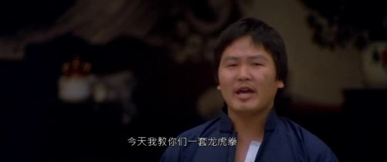
坏人。
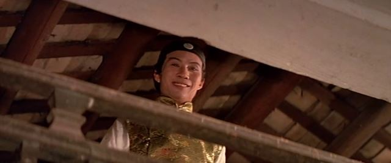
色厉内荏的人。
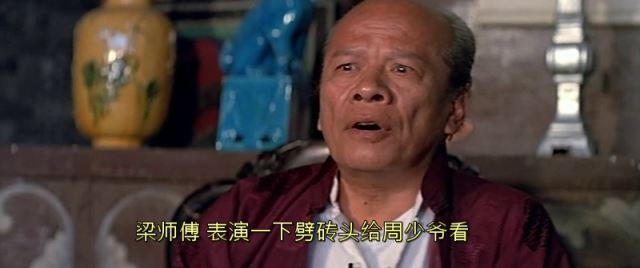
二五仔。
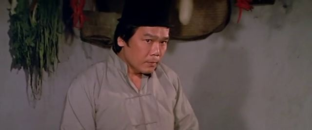

再比如演员表情较夸张。即使本片的定位是功夫“喜剧”，这满脸的刻骨铭心味儿在90年代之后就不多见了。比如下面演老鸨的老太太，自行联想并对比一下周星驰西游降魔篇和美人鱼里的那个群演大妈，高下立判。
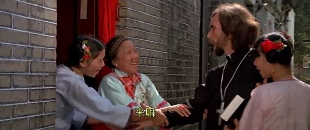

以及香港电影的特色——动作片里的西洋人必须是反派。
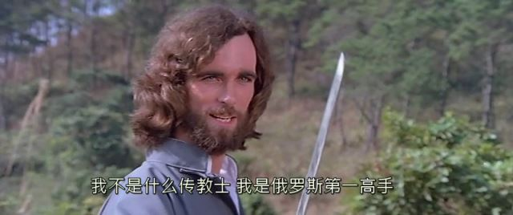

看看这个镜头，想起照片拍不好怪角度不对的段子。当然龙叔当年无论如何怎么也算不上丑就是了。
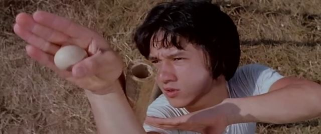

仁者见仁，淫者见淫。
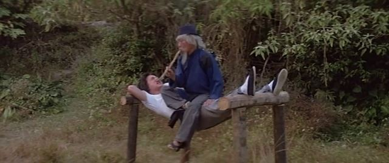

虽没有具体统计过，但印象里龙叔几乎每部片子里都要被这么弄上一下。所谓台上一分钟，台下十年功，镜头前的一下，指不定拍摄的时候是多少次！真是蛋蛋的忧伤呢！
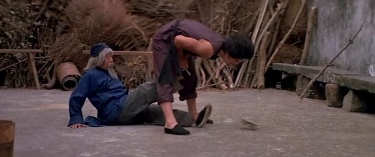

这个镜头拍出来特别不像成龙本尊。可又想不起来像谁。
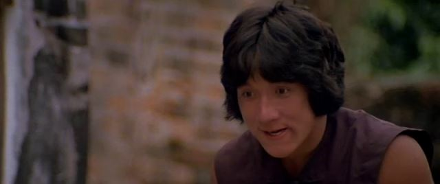

唯一一个记忆中保存了30年的镜头。非常莫名其妙。
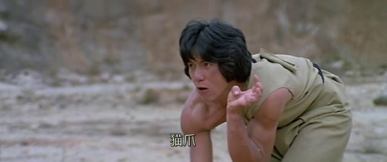

在片子的尾声，截图的时候还发现了一处穿帮镜头。哈哈，完美!
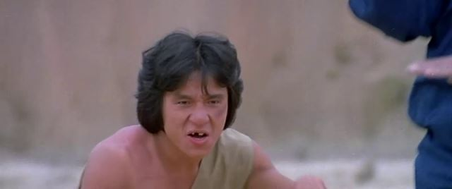
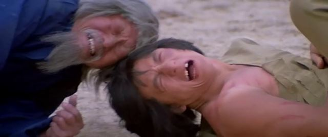