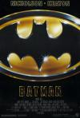

[蝙蝠侠](https://pewae.com/gaan/aHR0cHM6Ly9tb3ZpZS5kb3ViYW4uY29tL3N1YmplY3QvMTI5Nzk3MC8=)

原名：Batman导演：蒂姆·波顿主演：Richard Strange / 卡尔·蔡斯 / 威廉·胡特金斯 / 崔西·沃特 / 帕特·亨格尔 / 李·华莱士 / 杰克·尼科尔森 / 杰克·帕兰斯 / 杰瑞·霍尔 / 比利·迪·威廉姆斯类型：冒险 / 动作地区：美国 / 英国首映时间：1989

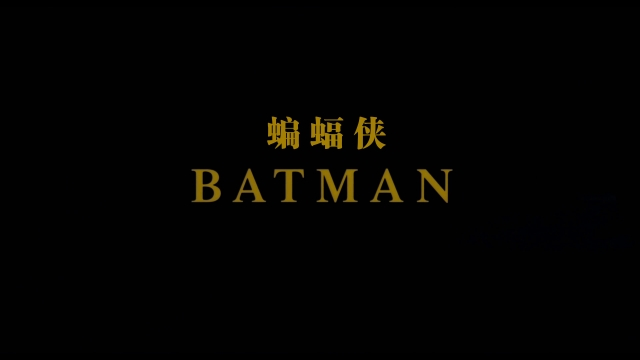

之前提到过，在录像带的时代，我们一家三口对英文片都不怎么感冒。我老爹唯二有可能换回来的外国片，要么是喜剧片，要么是枪战片——呃，恐怖片情色片什么的，我爹也不会让我看啊！
忘了是在1991还是1992年，这部《蝙蝠侠》就被当作枪战片被我爹给引进回了家里。
这部片子是1989年的全球票房冠军，是大热片——事实上在州长出演的那部之前蝙蝠侠系列都是品质的保证。我周围家里有放像机的小伙伴们几乎都看过这片。当然也跟我老爹一样，都当枪战片看的。
但我是真的想不起来看的是字幕还是配音了。
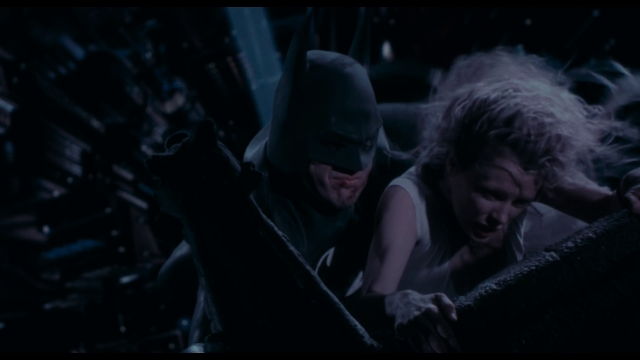

自古以来，美漫的剧情就乏善可陈。本作也就是个蝙蝠侠跟小丑互相复仇的结构，一点儿也不复杂。但重在品质啊。作为当年的大制作，美术和音乐都特别精细，特效也做到了那时候的极致，该爆炸爆炸，该有飞机有飞机。
也正是因为剧情的局限，男主角迈克尔基顿只能算中规中矩。远远不像个性鲜明的小丑那样令人印象深刻。基顿是80年代有名的喜剧明星，也不知怎么被选来当大制作的男主角。倒霉催的第一部被小丑全面压制，第二部被猫女和企鹅人全面压制，到第三部他终于辞演了。
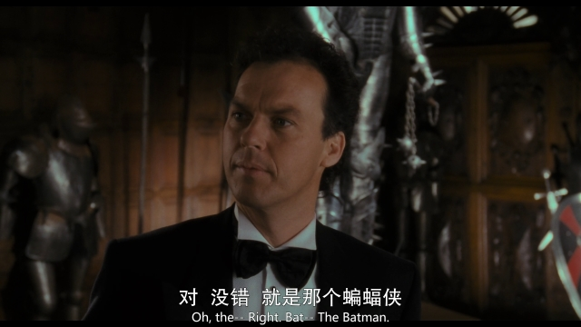

八十年代公映过的超人我是没赶上。蝙蝠侠本应是我接触的第一个超级英雄。但是，就像前面说的，我跟我爹一样，把这片当成普通的枪战片或者动作片看待了。
因为本片里蝙蝠侠真不能打。没什么超能力也就算了，拳头威力也就是个普通人。很多时候还要靠高科技的手盾蝙蝠标救命，一点儿也不狂拽炫酷。不接触原著或者背景资料，根本看不出他是“人类极限”。倒是小丑有个能把人变成干尸的超能力。却只用了一次，也没留下什么深刻印象。
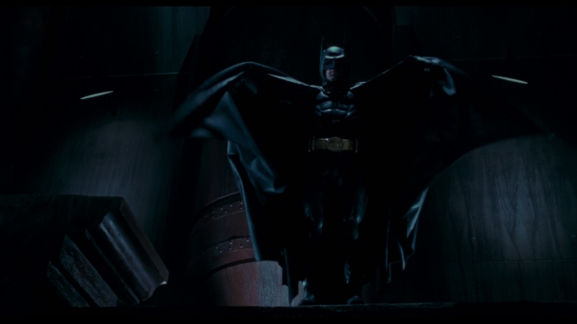
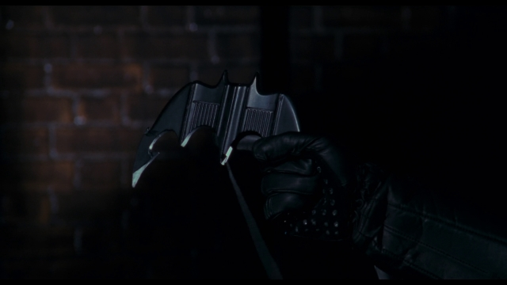

小丑的设定本就容易出彩，而尼科尔森真不愧是实力派巨星，把癫狂二字演绎得淋漓尽致。
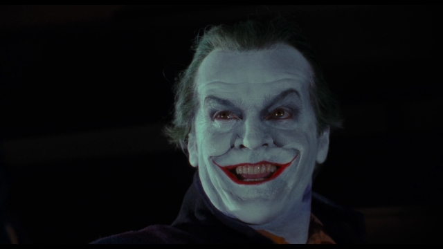
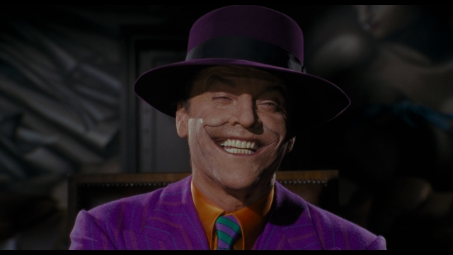

女主角是八十年代四大性感尤物之一的金·贝辛格。基本上就是个工具花瓶。而且衣服一直也穿得比较保守，真是白瞎了那双大长腿。
要说上世纪的蝙蝠侠系列一部一个花瓶大美女，真是够俗烂的。（一代目金·贝辛格，二代目蜜雪儿·费佛，三代目妮可·基德曼，四代目乌玛·瑟曼）
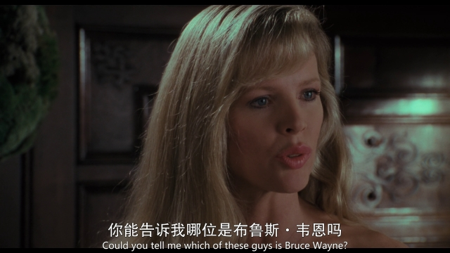

本片里蝙蝠侠可不像设定那样的不杀人。小丑变身前就是被他故意给扔到化学品罐子里的。而且最后决战的时候，小丑的一个手下也直接被他摔下了楼。这位手下还是个黑叔叔。在如今的黑命贵时代，反派黑叔叔都成缺稀品了。
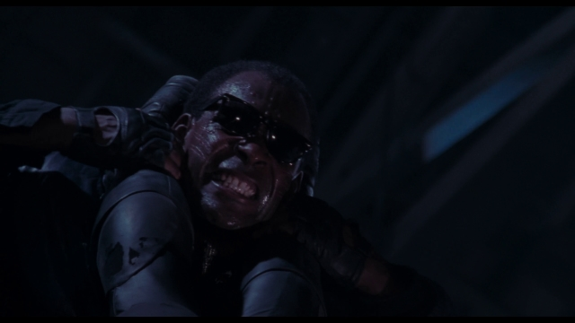

最后说一下本片里最受追捧的明星——蝙蝠车！
在那个年代，一辆能声控，有装甲，能长出机关枪，会喷火的敞篷黑色跑车简直是狂拽炫酷吊炸天！可以说制作方这辆车上应用的技术含量是超出了时代的，我盯着蝙蝠车长装甲的镜头来回看了好几遍，毫无破绽，难以想象以1989年的电脑技术是怎么做到的。毫不夸张地说，身边好几个男生都是被蝙蝠车吸引而走上了车迷的不归路。
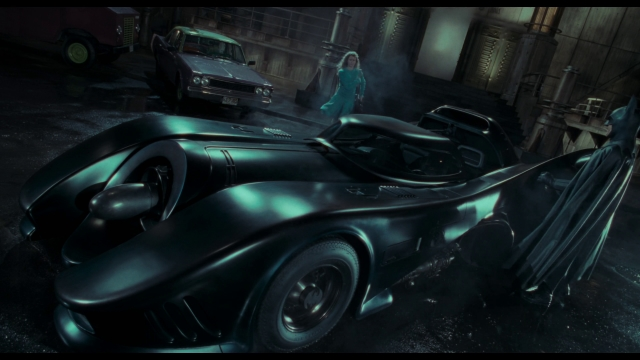

影片靠后还出场了一架蝙蝠战机，蝙蝠侠开着它牛逼哄哄地去救女朋友。但这货就LOW多了，被小丑金将军附体，只用一枪就给搂下来了……
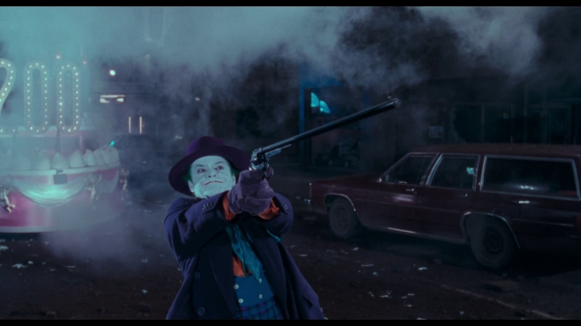

记忆中的镜头一：
小丑干坏事的时候要放音乐，所以总有个手下给他抗录音机。
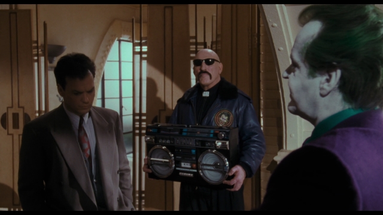

记忆中的镜头二：
蝙蝠侠和女主角第一次约会的时候，蝙蝠侠家的桌子太大，说什么话两人根本听不清。
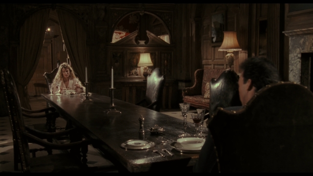

P.S:我知道前传系列的评价有多高，但它们不够20年，不在讨论之列。