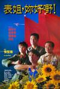

[表姐，你好嘢！](https://pewae.com/gaan/aHR0cHM6Ly9tb3ZpZS5kb3ViYW4uY29tL3N1YmplY3QvMTMwMjQ0MS8=)

导演：张坚庭主演：周文健 / 张坚庭 / 梁家辉 / 郑裕玲类型：剧情 / 动作 / 喜剧地区：香港首映时间：1990

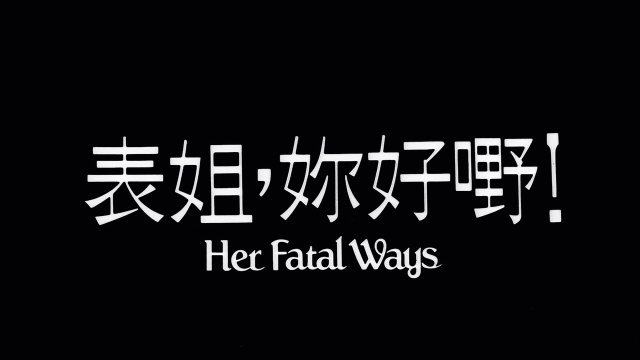

这次来一部政治上不怎么正确的片子。本片本不在回顾的第一序列中，因为我当年错过了前半小时，所以一直不知道片名是啥。
同样是在1993年小升初的漫长的暑假，某天去同学老刘家打麻将。他父母和一位朋友也在家。他们大人三缺一，我们小孩在我到了之后也三缺一。
于是老刘的妈妈就招呼我们吃西瓜看录像带，放的当然就是本片了。
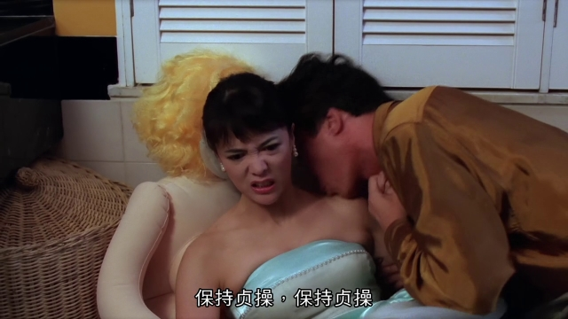

本片其实很有名，是张坚庭导演的“老表”系列的第一作。嘟姐郑裕玲凭借本片拿到了香港金像奖迄今为止唯一一个喜剧片影后。但是由于片子的内容是敏感的政治讽刺片，尤其嘟姐扮演的大陆女公安傲慢浮夸不讲规矩，可以说把大陆人黑了个底儿掉，再加上导演张坚庭本人黑料太多，所以本片在内地几乎就没被好好宣传过。嘲讽大陆公安是97前香港电影很喜欢用的一个手段。本片不是第一个这么做的，但却是第一个用大陆公安当主角的。不仅如此，整个“表姐”系列一共四部，每部都在乐此不疲地黑大陆公安……其实片子不仅黑了大陆，香港和台湾也一个没跑！
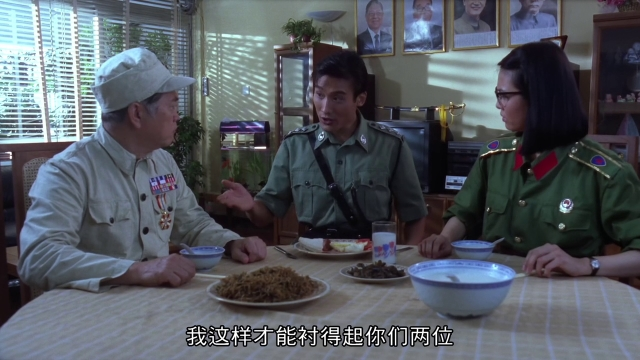

讽刺大陆人这事儿是不争的事实。而且的的确确也没有如实地反映大陆当时的真实面貌。故意抹黑却未必。我觉得是编剧先给角色套一个身份，然后往这个身份上堆积设定，堆来堆去，就容易过分，令一些人感到不适了。其实无论赵本山的东北农村人，还是横店量产的日本鬼子，或者春晚上的能歌善舞的边疆同胞，都是这么堆出来的。香港的编剧编排大陆人，同样如此，总是要恰饭的么。但感到不爽就要提出来，也无可厚非。
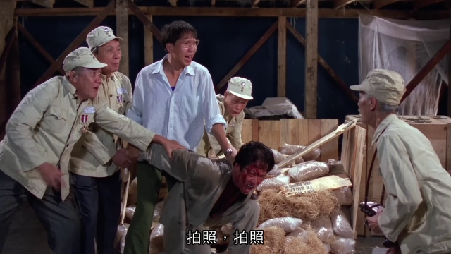

剧情倒是非常简单。郑裕玲扮演的大陆女公安带着侄子兼助手张坚庭押送一个毒贩到香港，并且想凭借毒贩抓到其上线。梁家辉负责接待。因为工作习惯差异闹出了一大堆笑话。最后的结局是各回各家各找各妈了，分手的地方应该是个口岸。90年的口岸竟然这么土的，真是出人意料。即便不是罗湖。
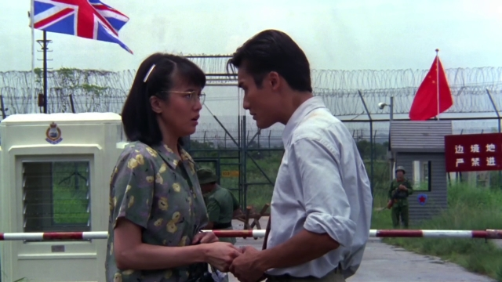

张坚庭的很多梗玩得是比较隐晦的。也正是这一点跟我的向性比较合。像这里就是在嘲讽八十年代国家承认特异功能。戴墨镜的就是导演张坚庭本人。
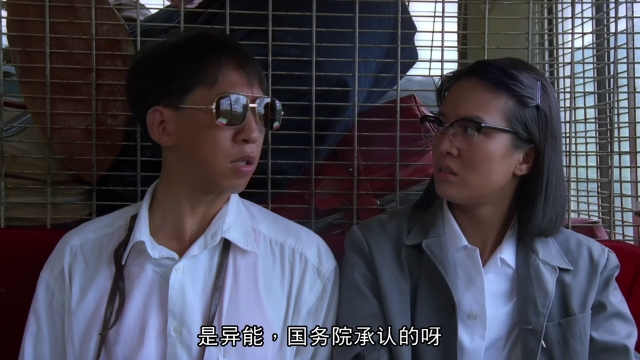

再比如，“慈祥的祖父”……
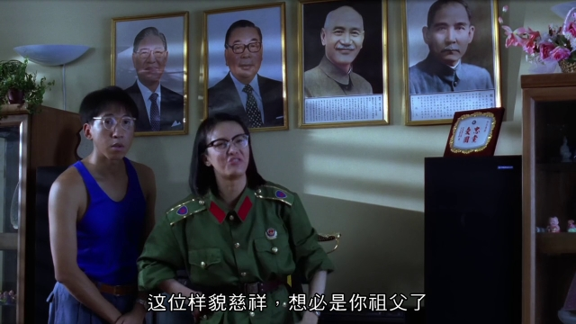

全片火力最猛的一段。这两年有香港人又把后面的图扒了出来。其实最狠的是第一句，有好事的拿这句话举报，一举报一个准，豆瓣条目肯定是要删除的。这个梗我不能解释，也不会解释的。
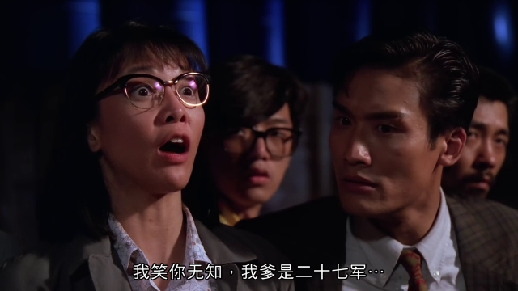
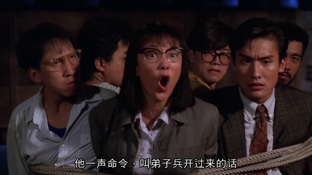
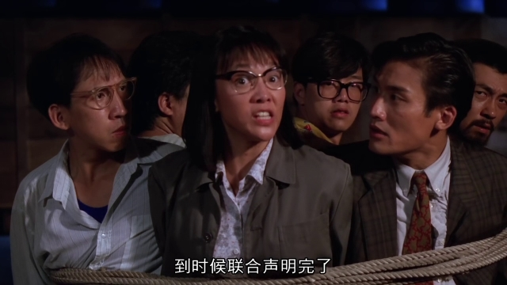
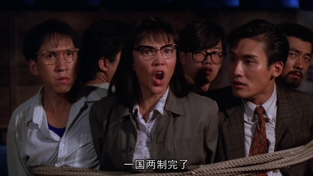
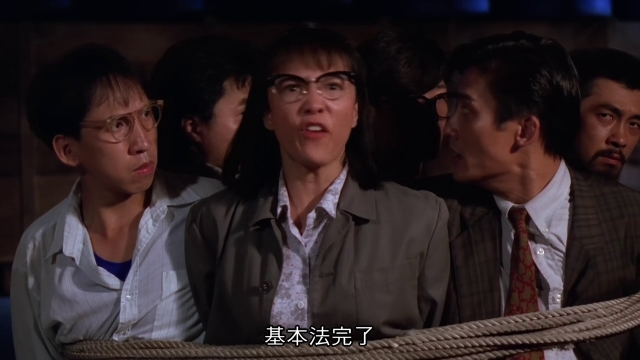

郑裕玲是八十年代TVB的头号当家花旦，以工作认真拼命而著称。本片中她的扮相一股扑面而来的老处女风，极尽刻薄自大却又不失可爱，其中尺度的把握殊为难得。反正我一看到她的扮相就会想起初中时的中年妇女教导主任。
嘟姐在85后的人群中几乎毫无名气，这是很诡异的事情。不知跟她主演不受待见的表姐系列有多大关系。不过嘟姐2000年后就没有再拍电视剧和电影了，颜值也跌得厉害，所以就让她一直活在那个年代，也挺好。
本片看粤语版尤其能看出嘟姐的用功——她在片里不仅把普通话说得有模有样，甚至还倒口了好几句川普。着实有资本给后来的什么古天乐渣渣辉好好地上一课。
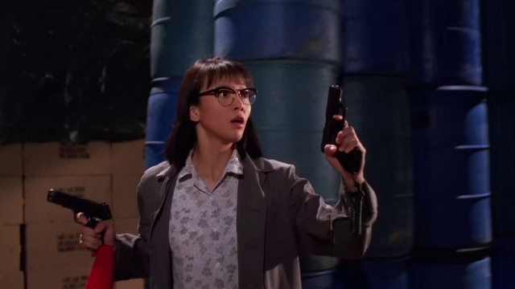

男主角是千面影帝梁家辉。梁家辉的演技自不须提，本片里他不争不占，很好地完成了作为工具人的绿叶任务。
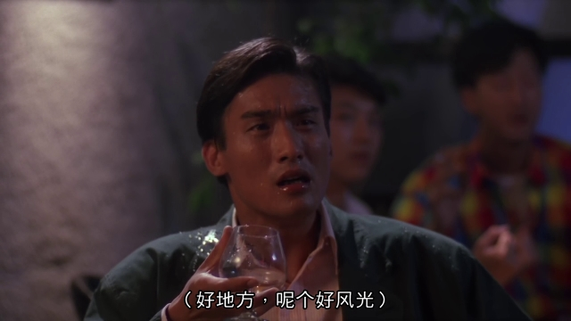

梁家辉的小跟班是初出茅庐的古明华和张锦程。嫩得出水的哟！
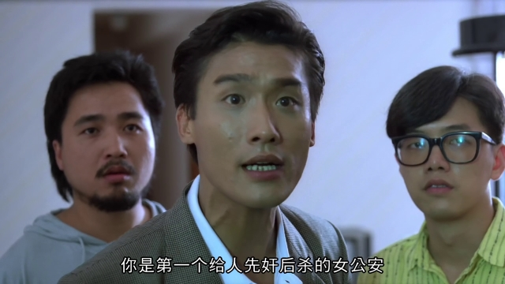

大反派方刚，是尼古拉斯赵四出道以前，华语电影界歪嘴歪得最成功的。这辈子就没演过任何好人！
方刚的跟班竟然是冯敬文和曹达华两位老爷子。如今两位老先生都已作古了。
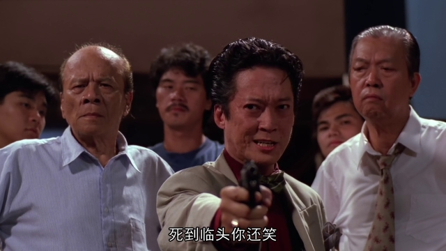

反派二号周文健，又是一个几乎没怎么演过好人的。这哥们竟然是混过好莱坞的。
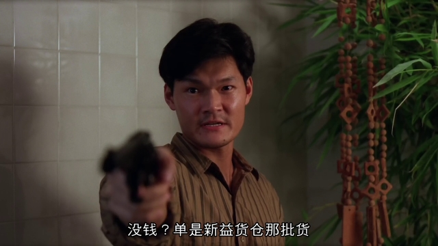

记忆中的镜头：
郑裕玲与梁家辉老爹对歌，老爹最后唱的是“一无所有”。
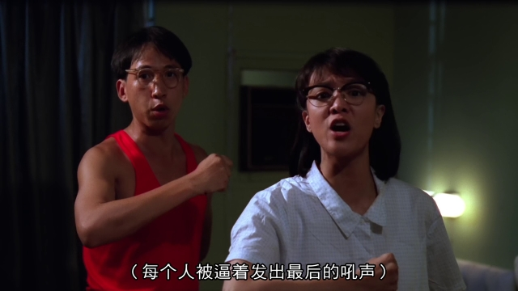
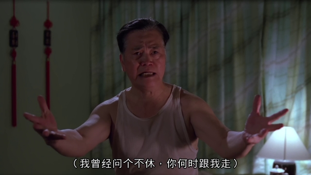

郑裕玲与老爹的一帮老兄弟们拼酒。
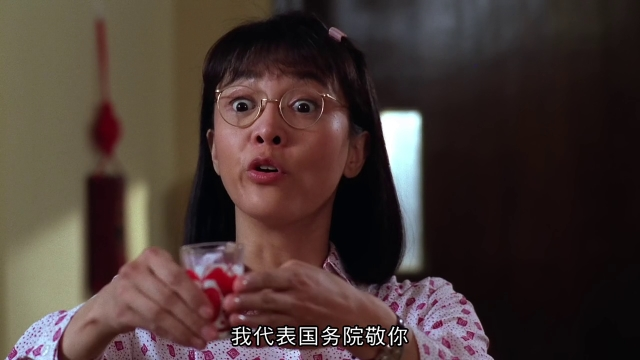
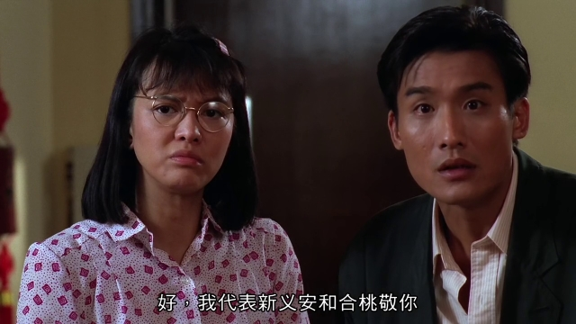

划拳扇嘴巴子。
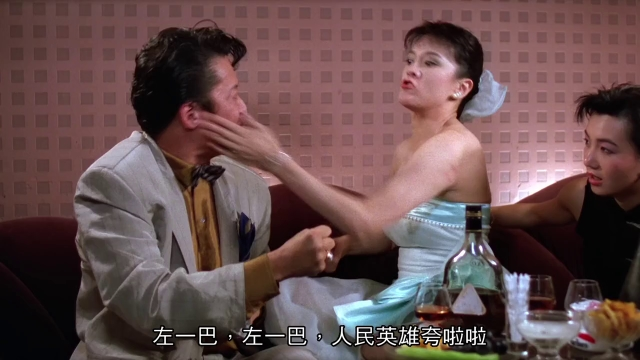