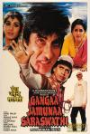

[讨还血债](https://pewae.com/gaan/aHR0cHM6Ly9tb3ZpZS5kb3ViYW4uY29tL3N1YmplY3QvMzc0NTI5Mw==)

原名：Gangaa Jamunaa Saraswathi导演：Manmohan Desai主演：米特胡恩·查克拉博蒂 / 贾亚·普拉达 / 阿米特巴·巴赫卡安 / 麦奈卡莎·萨谢蒂里类型：剧情 / 动作 / 爱情地区：印度首映时间：1988

印度片本身是很难留下深刻印象的。这片子唯一值得铭记的点是它的播出时间——1993年的除夕下午。
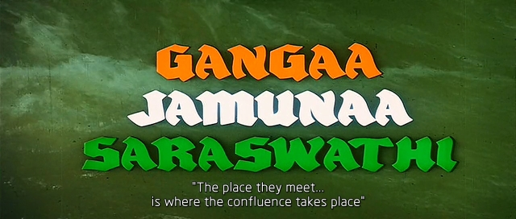

那是我们家在[金南路](https://pewae.com/2006/10/paulownia-at-jinnan-street.html)筒子楼老房子过的最后一个年。
每年除夕的那天我爸妈都是非常的忙。上午洗衣服，中午简单吃一顿饭之后开始收拾厨房，然后洗床单被套，下午4点多再出发去奶奶家过年。我就只能百无聊赖地等待。
那时候六年级的我已经通勤上学了，奶奶家刚好在上学的路线上，公交车只有一站。腊月二十七才从奶奶家回来，可心里还是惦记着早点去，说不定还能再打会儿游戏，于是从2点多开始就一遍一遍地问：“什么时候走？”
我妈自然是不耐烦的，但大过年的，也不好太过说我。就说：“要走的时候自然会走，你就老实看电视吧。”
1993年的时候，寒假的白天只有4个台可以看。当天，瘟都台放的就是这部译制片。顺便说一句，瘟都台大年三十下午放电影是有传统的，可能是只留值班人员，方便操作吧。印度片应该就是偷懒中的偷懒，长嘛。
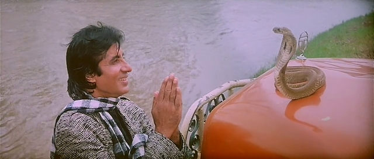

这片子大概2点多开始放的，集各种狗血剧情于一身，还穿插印度特色的唱歌跳舞，实在是不感兴趣。看了不到一个小时，我主动跟我妈申请：“要不我先自己去奶奶家吧。”
我妈同意之后，我换好新衣服，拎了两个袋子就奔赴奶奶家。
到奶奶家就很失望，一向慵惰的二姑竟然也把家收拾了，游戏机被装盒放到了柜顶，我也不好再闹着要玩。只好接着把片看完。
俗不可耐的地方可太多了。什么男一男二争女一啊，女一女二让男一啊，女一撞一下脑袋失忆了再撞一次又恢复啊，什么斩草不除根女二替男主挡枪啊，男二女二花式领盒饭啊，反派求饶后反杀啊……当然更少不了印巴片的特色歌舞。这也是我小时候对印度片产生刻板印象的原因，因为实在没有什么值得推敲的情节。
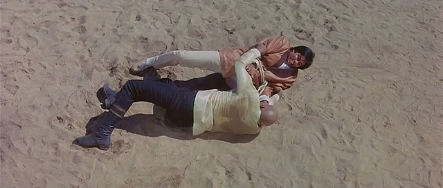

本片的主演可能叫阿米达普·巴强。加个可能是因为无论在某瓣还是在某度，无论是姓还是名，都有好几种译法。反正就这个人吧，号称是印度的成龙。从这部片子里反正看不出什么演技。打斗动作也单调，踢三四脚一个摔。作为动作片，巴先生没有露过哪怕1克拉肌肉出来。这位巴大叔岁数比成龙大很多，1988年的时候已经46岁了，这个镜头暴露了其真实的身体状况。但是46岁的成龙演了《上海正午》，身上的肌肉可是杠杠地。华语动作片明星里也就洪金宝能长成这样吧？
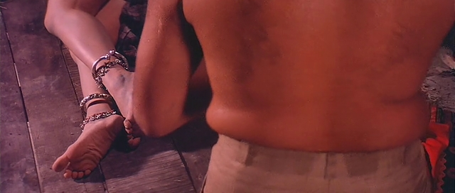

说起成龙，几年前成龙的《功夫瑜伽》“致敬”了本片里男主被倒挂在鳄鱼池子上方的场景。只不过给鳄鱼池换成了狮子笼。巧在那部片子里巴强也有客串，所以可能真的就是致敬来的。
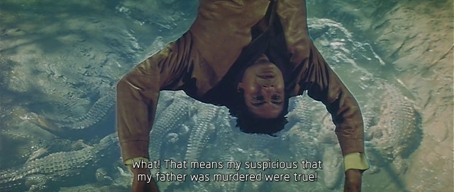

印度成龙可能有待商榷，但扮演主角舅舅的这位可是常年演坏人。上一部印度片《印度先生》里的反派穆甘博就是他演的，我愿意称他为印度何家驹。
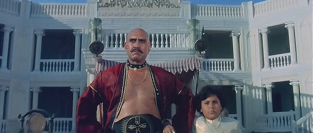
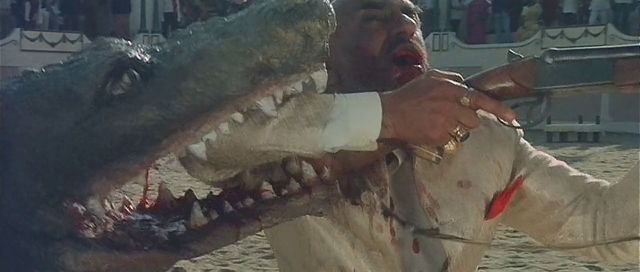

本片最搞笑的一幕是，女主在山顶上看到男主的大货车，一路又唱又跳从山顶跑下山底迎接。整个过程花了一首MV的时间倒不算什么，山上郁郁青青芳草萋萋，山根底下却忽然出现一个冰湖（池塘）。然后女主就呱唧掉冰窟窿里了。
捞上来以后就是喜闻乐见的肉身取暖一发入魂情节。这不就是千里送嘛！
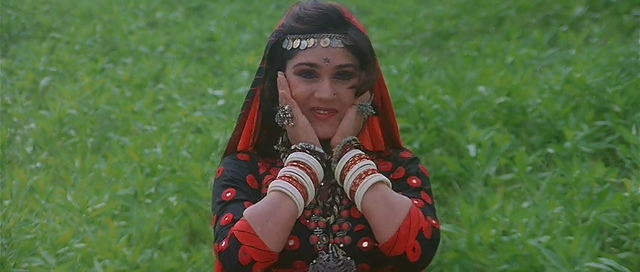
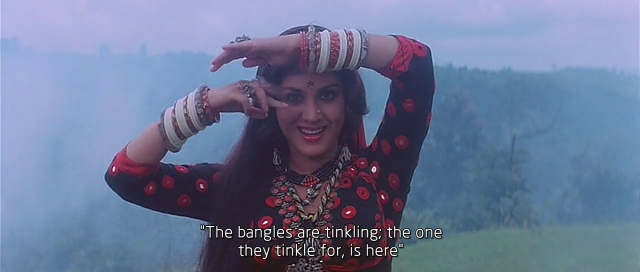
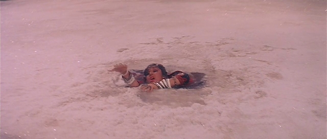

女一女二戏份差不多，长的差别是有，但还是不太好分辨。我第一次看的时候因为中间缺了一段，到结局时就把两人弄反了。这次重温，好像女主的舞蹈动作要更骚一些。
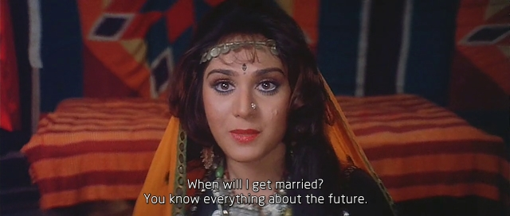
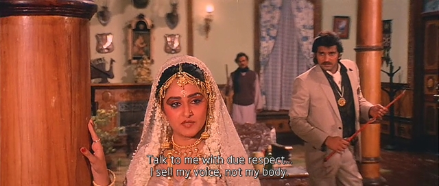
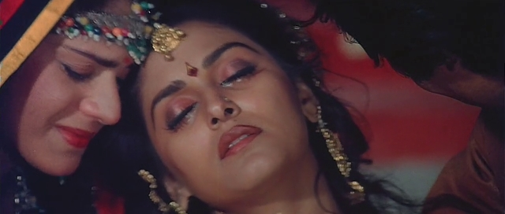
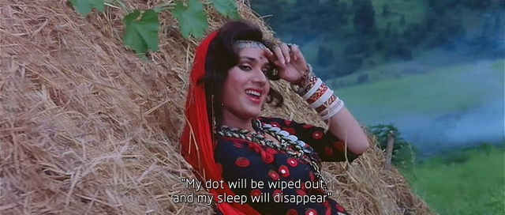

本片的迷惑之处一：最初和最终的场景，男主家的大别野，后来被大反派也就是他舅舅占了。你说你喜欢练武有个大校场我可以理解，但为什么还要有一圈看台？
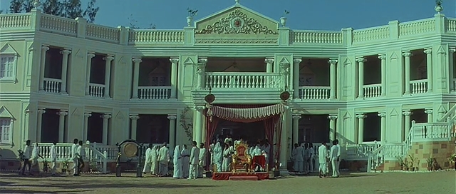
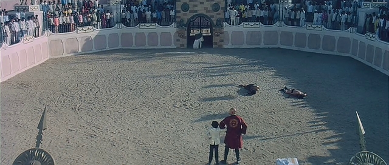

本片的迷惑之处二：前半段大部分时间，男主穿了一件黄色大毛衣。甚至部分时候毛衣外面还有外套，脖子上还有围巾。你说印度北部天冷都穿的厚也就算了，可看看同一场景里乱入跳舞的吃瓜群众都穿的啥？以至于后面好多时候，看到男主我就感到一股馊味儿。
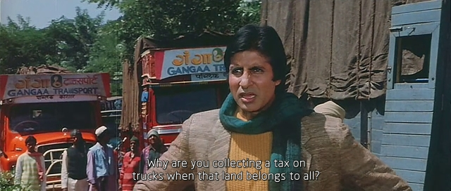
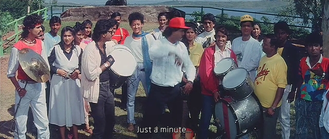
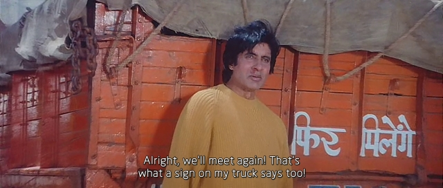

唯一一个记忆中的镜头：
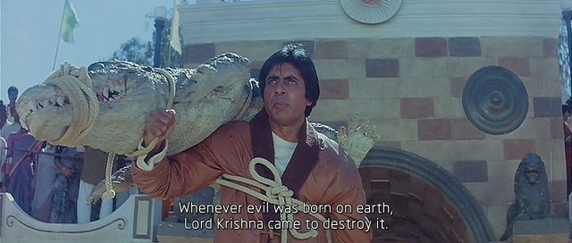

1993年啊，多么快乐的日子，那已经是30年前的事情了，真可怕！