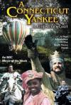

[误闯亚瑟王宫](https://pewae.com/gaan/aHR0cHM6Ly9tb3ZpZS5kb3ViYW4uY29tL3N1YmplY3QvMTc3OTA2MS8=)

原名：A Connecticut Yankee in King Arthurs Court导演：梅尔·达米斯基主演：凯西娅·奈特·普兰姆 / 勒内·奥贝尔若努瓦 / 吉恩·马修类型：冒险 / 喜剧地区：美国首映时间：1989

片子拍于1989年，是部电视电影。
这片儿就是[之前说过的](https://pewae.com/2017/05/the_world_is_bigger_than_you_known.html)，正大剧场1991年六一隆重推出的穿越剧。原著马克吐温。
找片的时候要特别注意1989，因为70年代也有同名作品。

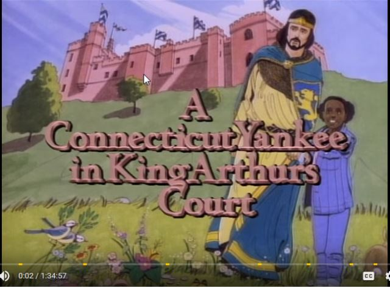
当年只看了一遍，这么多年过去了，留在记忆里的只剩下两三个镜头而已。可以说印象深刻完全是占了穿越这个题材的便宜。
呃，我确实不记得这片和《回到未来》哪一部是更早看到的了。
话说当年这片子也算是引起轰动了的，可现在根本没有配音版的资源。用英文原名在油管找到了资源，生生啃了下来。
我至少有20个月没啃过生肉了，而且油管原生的字幕是左边一条右边一条轮着蹦出来的，看的叫一个累。
肯生肉的时候会注意到一些看配音无法留意的小细节。下面这个语法我就琢磨了半天。
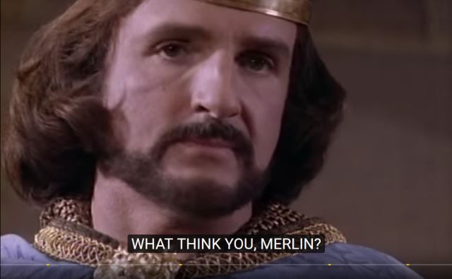

故事说的是一个小女孩，上课的时候挨训了不开心，跑去骑马，从马上掉下来穿越到了亚瑟王时期。帮亚瑟王平息了莫得雷德的阴谋之后，功成身退返回现代。
第一幕发生在课堂，老师在讲日蚀是怎么回事，然后说公元52X年，XX月XX日发生了一次日蚀。
我就纳闷了，这是历史课还是地理课，怎么什么都一起讲，伏笔用得也太牵强了吧！
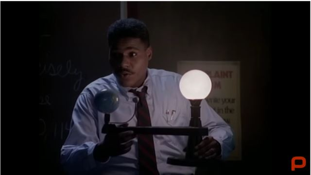

放学路上小姑娘展示了自己的两大杀器：拍立得和walkman。穿越后她因为肤色被当成魔鬼，从背包里拿出拍立得给梅林和亚瑟拍了照片，并且威胁说你敢动我我就把你的腿撕下来。亚瑟怕死怂了，给她封了个爵士“Sir Boss”。

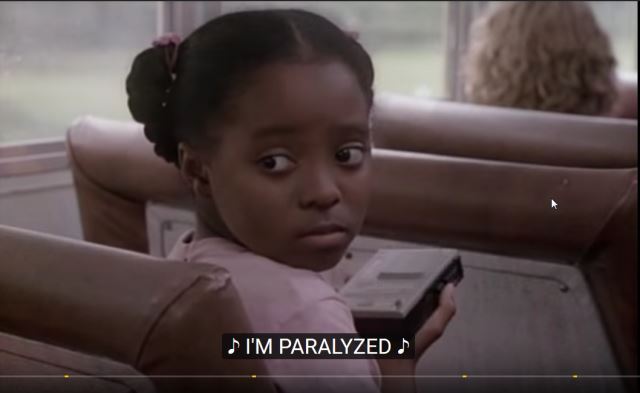
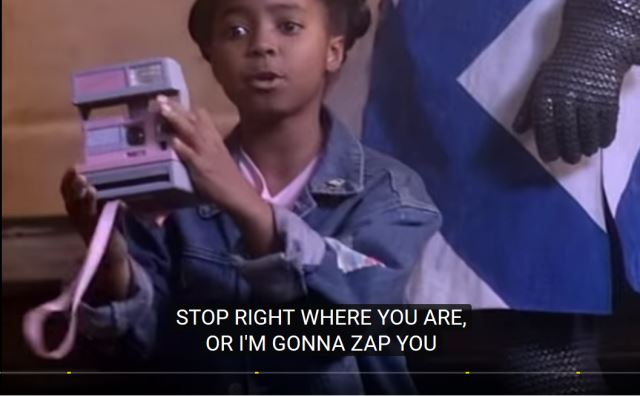

其实第一个出场的古代人当然是风华绝代的万人迷兰斯洛。
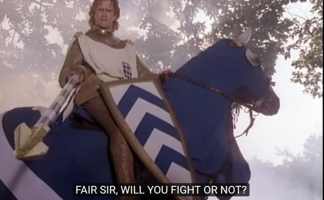

第二个就是王后桂妮维娅了。这个女演员非常漂亮。也难怪，毕竟是英国传说中地位相当于海伦的存在。
片子临近结束的时候有个镜头，送别小女孩的时候王后用暧昧的眼神瞟了身后的兰斯洛一眼，小女孩在热气球上看了个真切，Wow了一声。可惜当年看片的时候完全没读过亚瑟王的故事。要是等一年就好了，因为卡普空的游戏《圆桌骑士》，我可是跑去图书馆好一顿翻关于他们的故事。
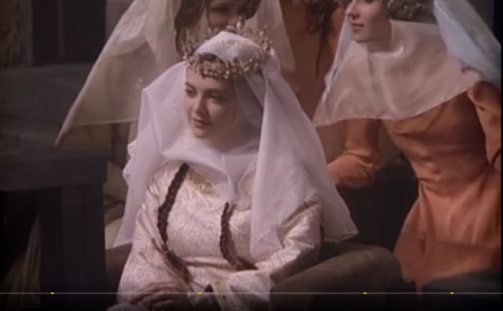

大反派莫得雷德的鼻子不知道是不是画的，反正尖得都要掉出来了。
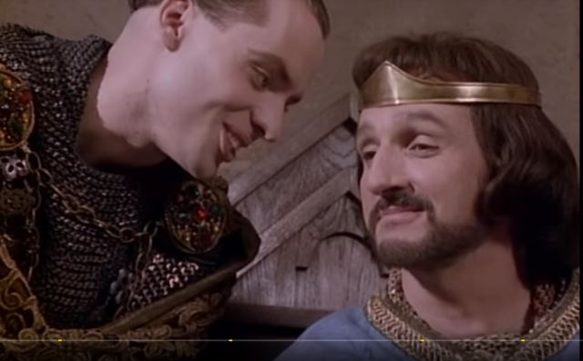

亚瑟跟小女孩混熟了以后，不知怎么就听信了蛊惑，带着小女孩下去微服私访。到了她姐姐（莫得雷德他妈）的地盘，被直接扣下，要杀头。
而且人家母子准备得很充分，把拍立得“杀死”了，walkman的电池也被抠走了。
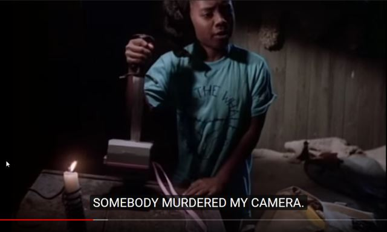

行刑的时候，姐姐大人和外甥大人一顿废话，终于拖延到了兰斯洛带着援兵到来……
形势逆转，莫得雷德不要脸地扔手套要跟小女孩决斗。好像根据什么骑士什么规定，小女孩是Sir，就必须应战。兰斯洛引用了另一个规定，代替小女孩出战。
一看莫得雷德这行头就不行，艹，古今中外有哪个正面人物是用连枷当武器的……
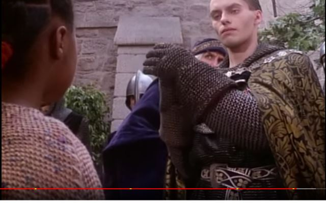
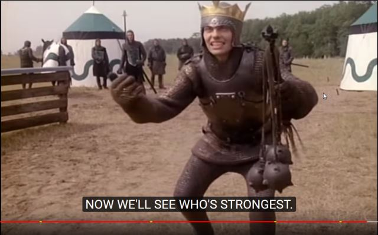

偏偏兰斯洛竟然打不过这个第二关小boss，还是靠小女孩跟小龙套两个，利用中场休息把兰斯洛的盔甲蹭得光可鉴人，下半场用平底锅把阳光打到盔甲上，晃得莫得雷德睁不开眼，从而一击逆转。
也对，卡婊的游戏里，金光闪闪说明级升满了呀！
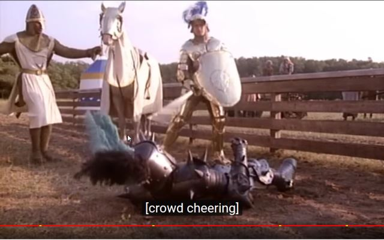

然而赢了也没什么卵用，老流氓梅林放了大招，把亚瑟王和他所有的骑士都关了起来。
小女孩放了终极奥义，成功地忽悠所有反派，说日蚀是自己的巫术，趁机跑了出来，把坏人都干掉，乘坐热气球返回现代，大结局。
这小女孩当年看着挺灵的，查了一下，终究是没红。始终在电视圈厮混。难道电视电影有错么？
好吧，人家比我还大一岁，我没资格嘲讽。

如果马克吐温的这篇小说真的是穿越文的鼻祖的话，那么下面这个段子就应该是穿越文毁段子的鼻祖：小女孩看到所谓圆桌骑士只是围在一张方桌边上吃饭，就问龙套是怎么回事，龙套一本正经地回答他们就是围着一张方桌。
而后来亚瑟和他的骑士们都被关起来了，商量怎么越狱的时候把牢房里的桌子凑一起凑了张圆桌，才是圆桌骑士的由来。
注意第二张左上角那个黑人，不仅仅是他可能是大名鼎鼎的帕尔齐法儿，而且这意味着片子的一处BUG：小女孩是因为肤色才被认为是魔鬼的，而这个骑士意味着前面的误会不成立。
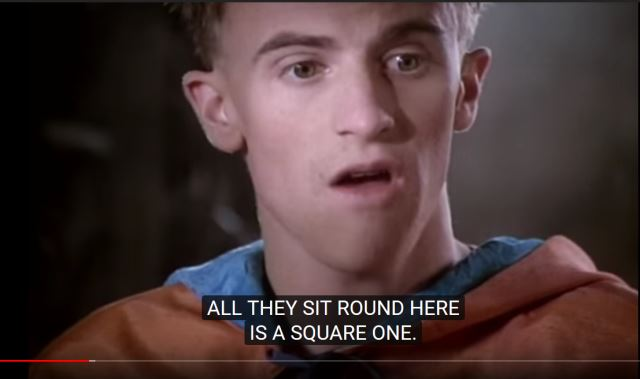
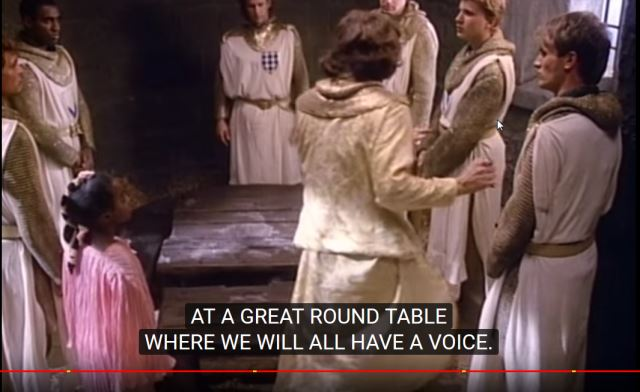

有点想玩游戏了。