本来就想趁过年回顾一部贺岁片的，恸闻鲁芬女士病逝，遂把这一部提前。

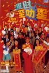

[运财智多星](https://pewae.com/gaan/aHR0cHM6Ly9tb3ZpZS5kb3ViYW4uY29tL3N1YmplY3QvMjE1NDczNC8=)

导演：王晶主演：吴镇宇 / 徐锦江 / 朱咪咪 / 王敏德 / 程东 / 罗家英 / 苑琼丹 / 袁咏仪 / 钟丽缇 / 陈百祥类型：喜剧 / 奇幻地区：香港首映时间：1996

其实也没多恸了。唏嘘而已。鲁女士恰好跟俺娘以及某鞑靼同岁。
鲁女士演了一辈子配角，大多数人对她印象最深的角色应该是《白面包青天》里的烈火奶奶。关于周星驰的讨论一直挺热，我这个系列是不打算写太多的。另外一部对鲁芬印象深刻的电影里，她演一个凶恶的女狱警，但那片子质量似乎不太高，也忘记了名字。
在这部贺岁片里，鲁芬跟另外两大女丑——朱咪咪和苑琼丹一道，扮演女主的同事兼牌搭子。鲁芬的戏一直挺一般的，再加上身边有苑女士这个顶级女丑存在，所以这部戏里表现并不出彩。
四个按摩女打个麻将能出300w的输赢，而且其中三个长这样——也就是电影里才有的事吧！
截个图，感慨完毕。
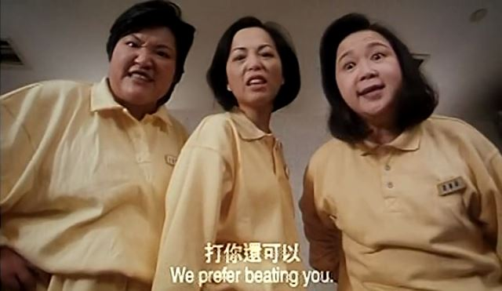

本剧是1996年的贺岁片，我第一次看是96年暑假租的录像。贺岁片没多少内涵，本来应该看过就忘的。但这部片子里的吴镇宇实在太出彩，其中的名台词在很长一段时间内，跟吴镇宇神经质的眼神绑定了。
按说这时候吴镇宇因为《古惑仔》里的出色表现逐渐开始名声鹊起。可是在那个时间点上，我并没有看过古惑仔。
于是乎，吴镇宇就跟“洋葱剁剁剁，眼泪流流流”划等号了。要说吴先生可没少演配角碾压主角的事儿。这是我所接触到的第一次。
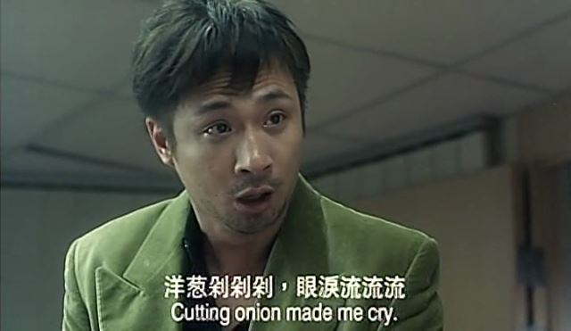
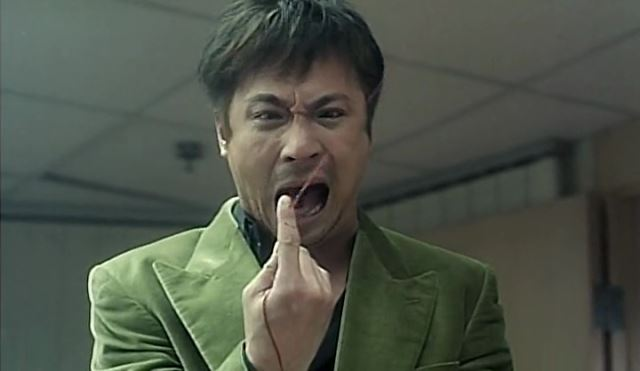

本片是王晶所擅长的屎尿屁大杂烩类型。20年前的王晶可谓思维敏捷脑洞大开，作品无论是否精致，总有一份意外的惊喜在等着你。
本片出品人是王晶和陈百祥，不知是不是成本压力的问题，由陈百祥本人担当男主。而且除了女主的靓靓袁咏仪以外，就再没找什么大牌来出演，除了刷脸找来的关系就是各个公司里为里不要钱也要宣传的新人。戏份多一点的就叫客串，更多一点的叫主演。只是露个脑袋的就打上字幕，生怕观众不认识。也算广告界的业界良心了。这些字幕新人死亡率非常高，20年后我能叫上名字的就只有一个钟汉良。
片名里的这个叻字相当让人困惑，国语版直接翻译成里“智”，但看字幕的话好像还有一些小聪明在里面。反正片尾花絮来看，叻并不像是一个正经的褒义词。
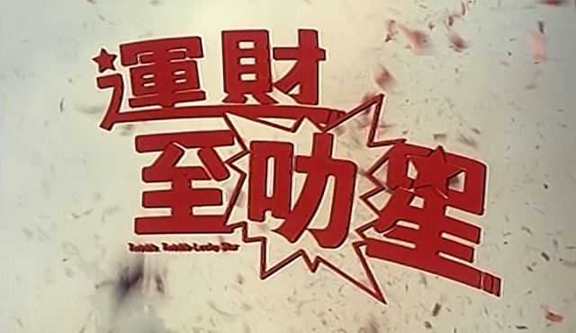

印象第二深的镜头，就是靓靓嫌胸小，让陈百祥施魔法弄里个超级巨奶。字幕里调侃的是彭丹，但国配的台词调侃的是叶子楣。叶子楣是个好同志，看到她想起下一期的话题有着落了。
话说在漂亮的女星当中，靓靓是非常能放得开的一个，喜剧片里扮丑耍贱得心应手。所以人家成为蝉联金像奖影后的第一人，不是没有原因的。后来销声匿迹多年更显得可疑。
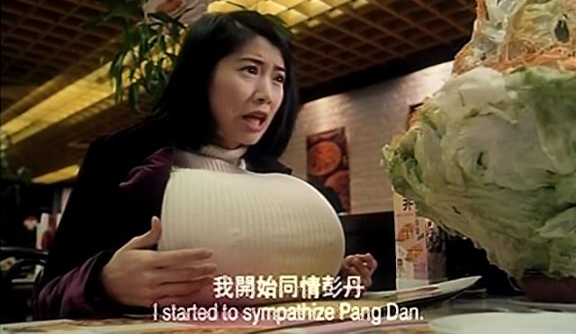
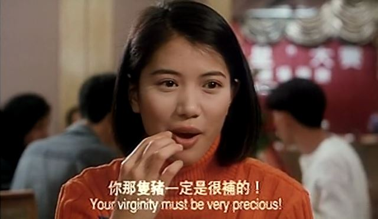
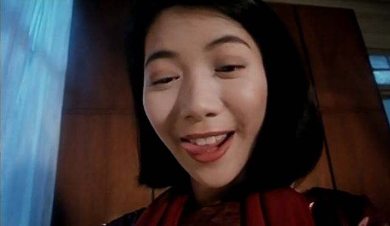

陈百祥这家伙，浓眉大眼的，却骨子里一股猥琐气，一看就不像好人。但他长期担任演员协会的会长，人脉应该是刚刚滴。
他鼓动来的这帮配角们倒一个个像喝里狼奶一样，纷纷超水平发挥。
譬如王敏德先生，虽然仍旧定位傻白甜老外，但细节处理非常到位。
再比如把碾压主角视为日常的苑琼丹女士。
再比如客串的时候发起疯来自己都怕的罗文大哥。
再比如一脸衰样衰神附体的黄一飞先生。
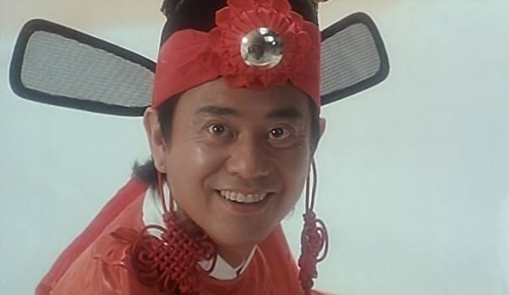

再譬如罗家英先生，表演非常风骚。但这还不是罗先生的最高水平，他最高水平的那部在名单上，现在年头未够。
这个造型是调侃郑伊健的。而且还有配套的台词，什么30年专注小白脸之类。没想到人郑帅哥又活活帅了20年。
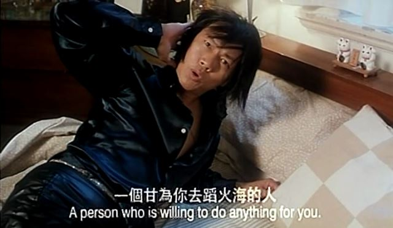

大傻也有客串赌神的表演。因为之前单独表扬过，就不贴图了。
重温的时候，这位先生看着好面熟。足足想了半个钟头才想起来是谁。您认出来了吗？
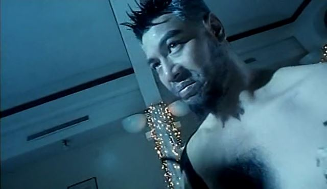

相比之下，身为女二的钟丽缇表现就很一般了。不过她定位一直就是花瓶，只要负责漂亮就行了，不出彩也正常。
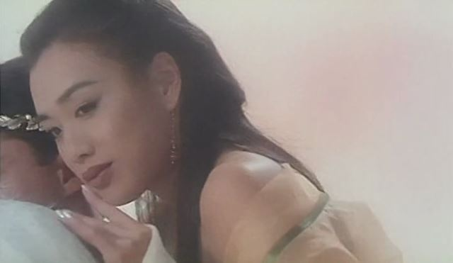
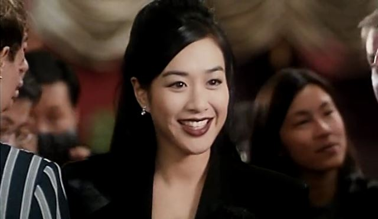

因为是贺岁喜剧，当年又尚未回归，所以各种热门话题梗层出不穷，什么万梓良戴安娜离婚啊，MJ整容失败啊之类。
最有深度的话题是下面这张图，表面说的是林建岳女朋友太多。
实际上那年林先生跟王祖贤女士同居，林父林母当众反对，林母甚至在媒体上说：“就当睡了个鸡。”
王美人因此被逼离港赴台。
时光荏苒，20年了，记得这段八卦的人怕也不多了的说。
对了，白胡子的月老是徐锦江先生扮演的，相当中规中矩，还没有他的配音给人留下的印象深。可能徐先生主角演得太多，不符合爆发条件。
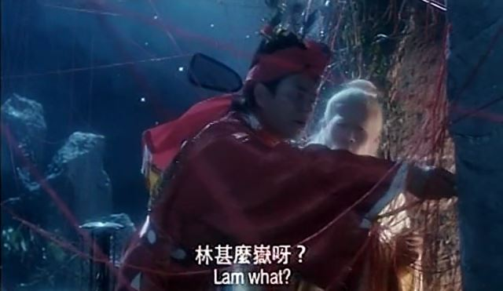

然而随着香港回归，王先生的灵气似乎也一起蒸发了。他已经再也炒不出一盘像样的贺岁杂烩饭了。可悲。