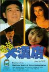

[金装大酒店](https://pewae.com/gaan/aHR0cHM6Ly9tb3ZpZS5kb3ViYW4uY29tL3N1YmplY3QvMTMwMzEzMA==)

导演：刘镇伟主演：叶童 / 吴耀汉 / 夏文汐 / 张学友 / 曾志伟 / 王祖贤 / 秦祥林 / 胡枫 / 郑则仕 / 钟楚红类型：喜剧地区：香港首映时间：1988

这片是90年春节在远房亲戚家看的。这不是最近吴耀汉去世了，忽然就从脑子里蹦了出来。
这是一部彻彻底底的烂片，奉劝现在的小伙伴们如果不是为了看王祖贤，千万别看。
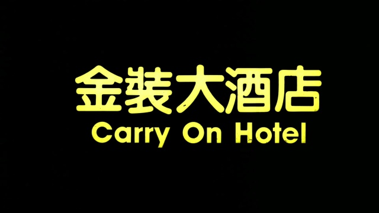

远房亲戚是我姥姥的舅舅的孙子，我管他叫舅，算是二次方的姑舅亲？这位表舅的另一个身份是我妈工友兼小学非同班同学。过年请我妈过去也不是联络亲戚感情，纯是为了感谢帮他小姨子找个工作。
那时酒足饭饱之后，通常都会给小孩安排去看录像或者打游戏。表舅也不例外。他问我：“我这有王祖贤你看不看？”
我：“好哇好哇。”
事实上对于90年的10岁小孩来说，这片子里的梗也是糊弄不住的。忍了一个多小时王祖贤才出场，我都快看睡了。
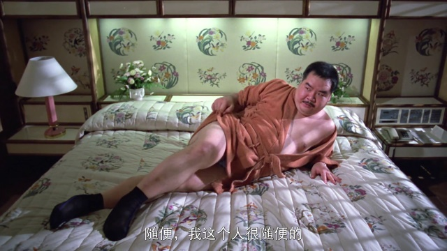

这是一部新加坡某酒店出钱拍的广告宣传电影。围绕酒店的各个方面拍了四个短片凑成一部戏，非常非常类似20年后的《命运呼叫转移》。刘镇伟也别出心裁，找来吕绣菱、钟楚红、夏文汐、叶童、王祖贤这一大票文艺片女神来演喜剧。只是效果挺磕碜的。
而且我要是出资方看了这片能吐血，笑料的堆积就完全基于酒店的不负责任嘛：
给点小费就能买通服务生偷装摄像机；电脑安保是弱智；总经理天天不干正事勾搭前台；中层只知道奉承领导；服务员随便进房间；酒店泳池服务员多管闲事；酒吧里有人偷酒喝；维修组迟到早退有人代打卡……
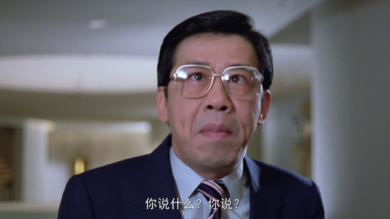

第一个故事其实是最有喜剧效果的。主线是客串的肥猫买通服务生安装摄像机，捉奸秦祥林和吕绣菱。秦祥林和吕绣菱发现有监控以后大演苦情戏，作为琼瑶的御用，确实有一些反差萌。
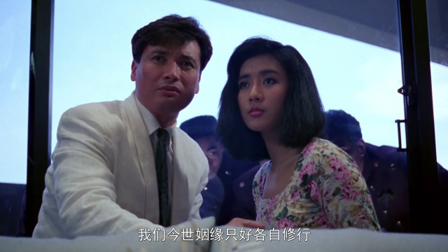
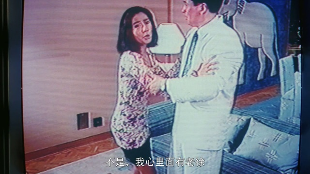

肥猫出场的时候贡献了一个名场面：抽烟甩手。网上说打了6辆车纯属谣传，实际这个片段出现在他下出租车的时候。
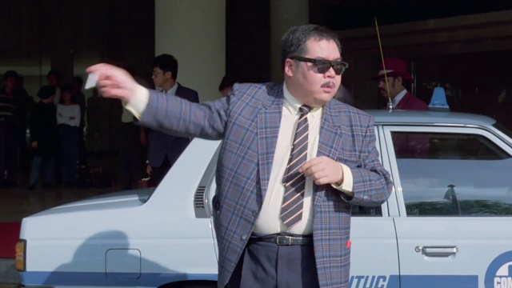

剧情里肥猫因为偷酒喝被提前退场了。真正看小电影真人表演的是这三位哥们儿。职员表里这三位写作蓝战士乐队。左一这位大哥全片里墨镜都没摘下来过，他就是后来的西门庆本庆单立文大官人。
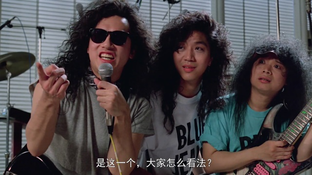

第二个故事是标准的八十年代老旧喜剧范本。吴耀汉继续五福星里那种神经质+聪明白痴的人设，冒充董事会特派员在酒店多吃多占。这一段全是烂梗。可以说吴耀汉八十年代的生涯大多在演这样的角色，虽然是喜剧但不怎么搞笑，装疯卖傻也需要别人帮衬才能出效果。
虽然在录像带时代没少看吴先生的片子，但真正留下深刻印象的还是瘟都92年播出的电视剧《司机大佬》。虽然我并不是冲他追的剧，但他那个大哥形象确实塑造得好。最近一次在银幕上看到吴先生是《救僵清道夫》，彼时就觉得他一脸病气。倒不是说对他的离世有多惋惜，只是觉得自己又老了一些。
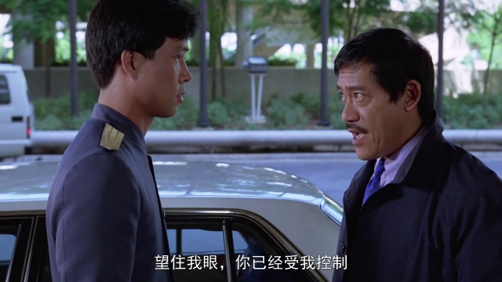
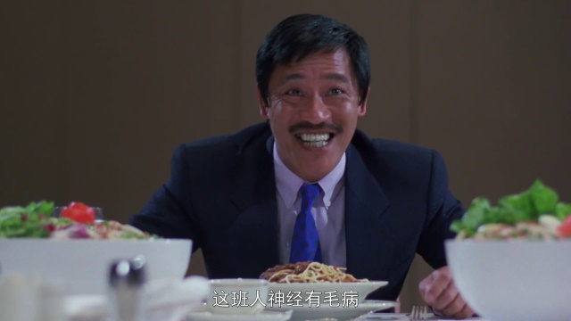

第三个故事格局特别小，就是曾志伟周旋于夏文汐钟楚红两大女神精病间的简单场景剧。不管是什么惊悚故事，一旦用精神病来进行解释就瞬间变得无聊。好在红姑的身材还是很顶的。
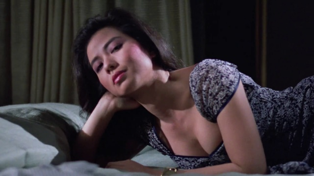
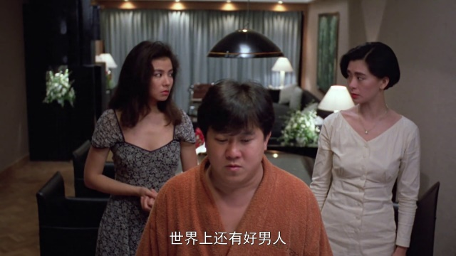

最后一个故事是老掉牙的“真爱就在身边”。学友哥叶童都演的好尬。
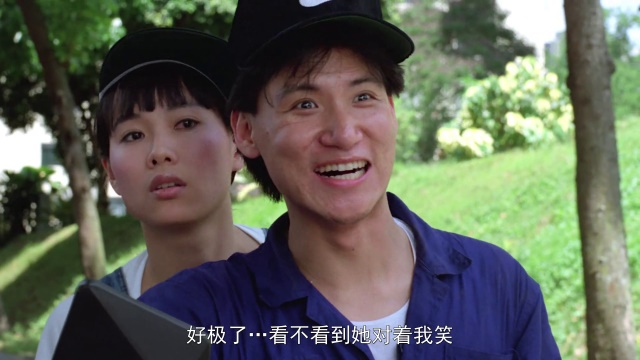

好在。本片唯一的优点，就是真的把王祖贤拍得很美。
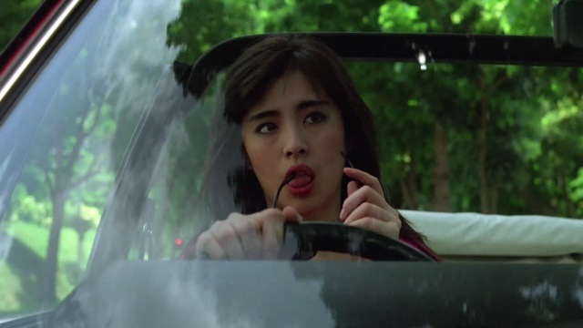
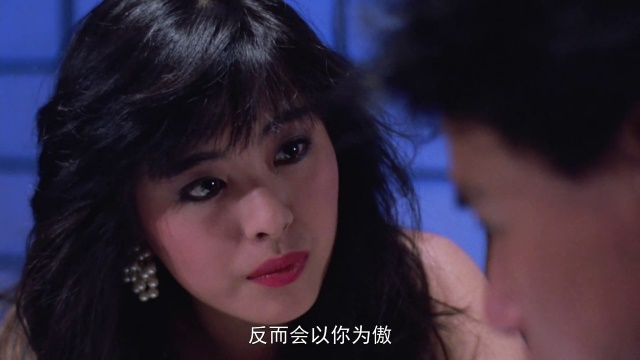
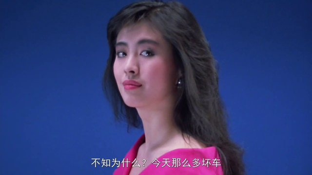