去年10月末许绍雄先生去世。
[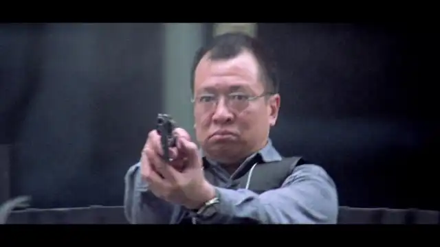](https://pewae.com/wp-content/gallery/videosnap/vlcsnap-2025-12-20-20h09m57s938.webp)
这位金牌绿叶，留给我印象最深的角色是《新扎师妹》里的方钟SIR。但[《新扎师妹2》](https://pewae.com/2024/04/review-love-undercover-2.html)写过了，重复一遍没啥意思，即使“方钟SIR的SIR字怎么写”比“亲吻我的右脚”有趣50倍。
其次是《暗战》中的总督察黄启发。但我对刘德华不感冒，如无意外不会再写他主演的电影了。
第三就是这部片子，劈腿大叔，“枪神”。
P.S:其实还有第四，《情不自禁》里的绿帽老公。

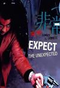

[非常突然](https://pewae.com/gaan/aHR0cHM6Ly9tb3ZpZS5kb3ViYW4uY29tL3N1YmplY3QvMTI5OTc4Mg==)

导演：游达志主演：任达华 / 刘青云 / 林雪 / 蒙嘉慧 / 许绍雄 / 黄卓玲类型：剧情 / 犯罪地区：香港首映时间：1998

[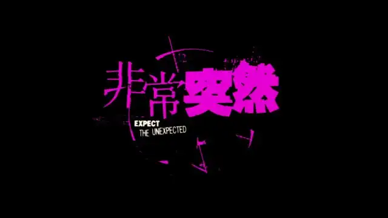](https://pewae.com/wp-content/gallery/videosnap/vlcsnap-2025-12-20-18h18m17s486.webp)

2002年的暑假，我在大工化院报了个考研政治辅导班。听了两节课就不想再去了。而那时我爸下岗在家，提前回家怕他问，于是每天早上出门满大街晃荡，到中午才回家。
某天转到友好广场旁边的小冷饮店吃冰，店里刚好放这个片子。没看到开头，从郑祖扮演的光膀子悍匪突围看起，坐那儿就被深深吸引，直到结束。
[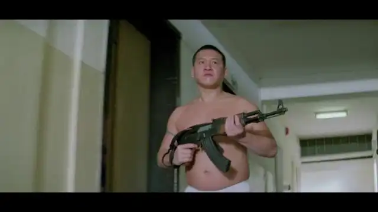](https://pewae.com/wp-content/gallery/videosnap/vlcsnap-2025-12-20-21h53m33s348.webp)

这是部极具银河映像早期疯魔风格的电影。司徒锦源的剧本处处透着四个大字：世事无常。
任达华、刘青云、许绍雄、黄卓玲和黄浩然是同一组的重案组警探。他们在追查一起3个笨贼打劫金店案件的过程中，发现了另外一组的4个悍匪。黄浩然中弹退场，到片子结尾都只能躺在医院。为了抓捕悍匪，主角团做了大量工作，又布控又叫支援，小心谨慎，抓捕的时候挂了防弹衣，但刘青云和任达华还是一人挨了一枪。解决悍匪团伙之后，全队去聚餐团建的路上发现了笨贼的车。于是乎全队上去搂草打兔子，没准备没支援没布控没防弹衣，被笨贼直接干团灭了。正如标题，非常突然。
[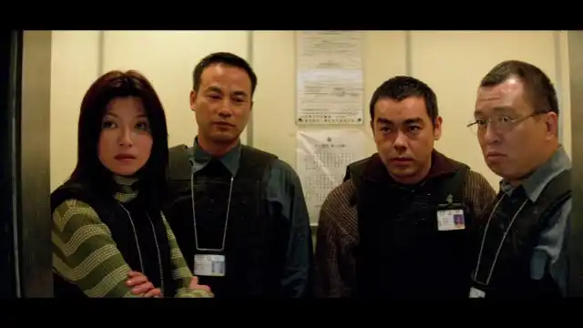](https://pewae.com/wp-content/gallery/videosnap/vlcsnap-2025-12-20-21h32m32s568.webp)
[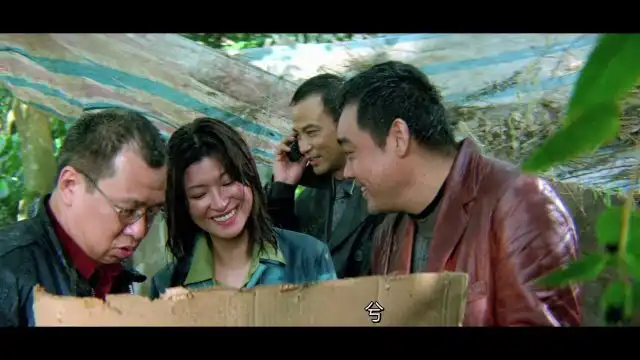](https://pewae.com/wp-content/gallery/videosnap/vlcsnap-2025-12-20-20h38m46s737.webp)

许绍雄在片中扮演一个老警察“枪神”。老枪神的烦恼是跟结发老婆没孩子，小三怀孕了又发现老婆得了癌症。他因此爆发了一句非常有哲理的台词：“有伞的时候没雨，有雨的时候就没伞。”
对于许绍雄这样的老配角演员来说，几乎不存在把好角色演坏掉的可能。而演得出彩那就是角色真的精彩。本作中枪神最有趣的地方是他跟刘青云的理念冲突，从头到尾两人的对话都是鸡同鸭讲。
[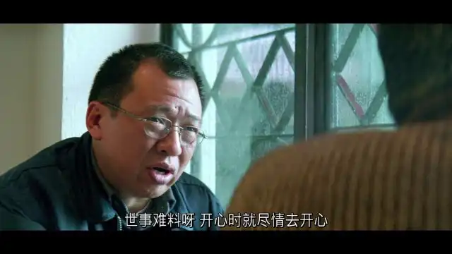](https://pewae.com/wp-content/gallery/videosnap/vlcsnap-2025-12-20-21h09m43s502.webp)

另一位出彩的配角是主角团里的黄卓玲。黄卓玲，有时写作黄卓菱，广告女郎身份入行，也是银河映像早期的御用绿叶。片中她戏份不少，跟任、刘、许飙戏不落下风，相当难得。有趣的是，前一年黄卓玲凭借在非纯血银河映像片《十万火急》中的表现，拿到了1997年金像奖最佳新人的提名；而蒙嘉慧凭借本片的表现拿到了1998年的最佳新人的提名。也算是一种薪火相传吧。
[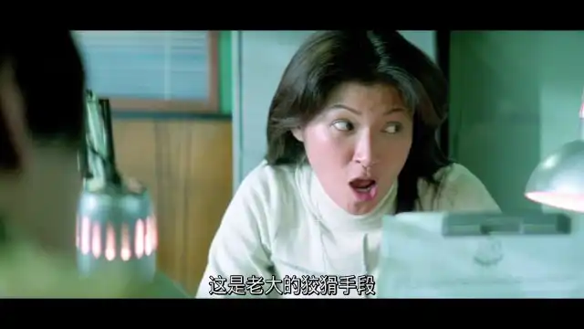](https://pewae.com/wp-content/gallery/videosnap/vlcsnap-2025-12-20-18h50m06s985.webp)

是的，蒙嘉慧就是本片女主了。她是那种非常有韵味的演员。当年我觉得她是郑伊健三个女友中最具有知性美的一位，谁能想到她婚后那么能败家啊。
[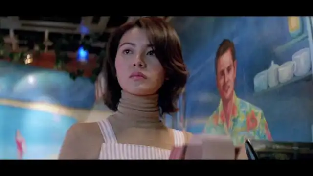](https://pewae.com/wp-content/gallery/videosnap/vlcsnap-2025-12-20-18h20m44s188.webp)
[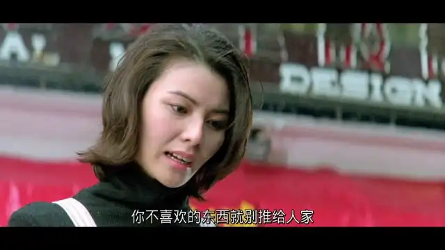](https://pewae.com/wp-content/gallery/videosnap/vlcsnap-2025-12-20-20h50m58s024.webp)

本片中林雪演了三个笨贼中的一个，是最先被主角团抓住的吃不上饭的大陆偷渡客。这好像是林雪演艺生涯中第一次出演有大段台词的角色，他的一段吃饭戏完成的非常出色，活脱脱的底层痞子。片尾字幕里还能看到林雪此时仍然兼着场务工作。恰好印证了普通人想成名，天赋努力和运气缺一不可。
[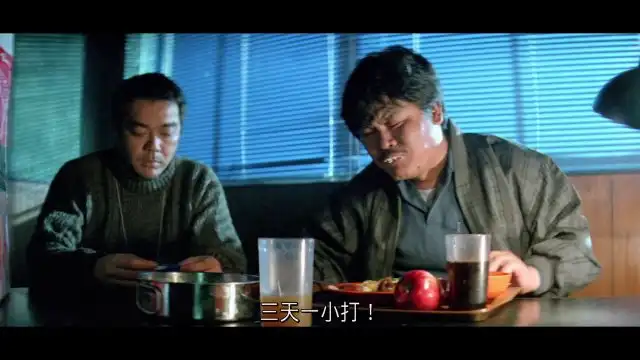](https://pewae.com/wp-content/gallery/videosnap/vlcsnap-2025-12-20-18h45m19s533.webp)

任达华刘青云轻车熟路，正常发挥。
[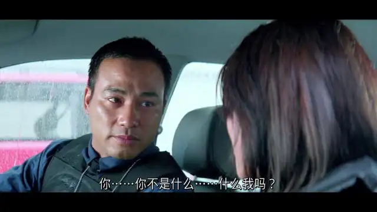](https://pewae.com/wp-content/gallery/videosnap/vlcsnap-2025-12-20-21h34m51s650.webp)
[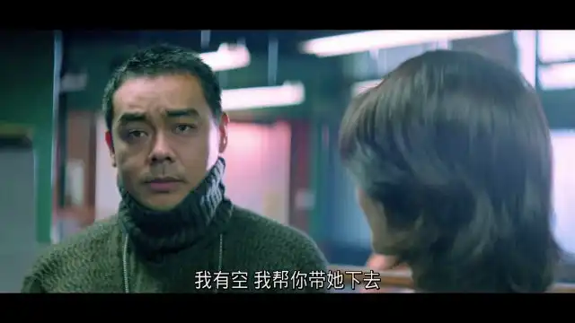](https://pewae.com/wp-content/gallery/videosnap/vlcsnap-2025-12-20-18h48m51s729.webp)

值得夸奖的还有黄嘉倩的配乐，跟全篇节奏配合默契。
[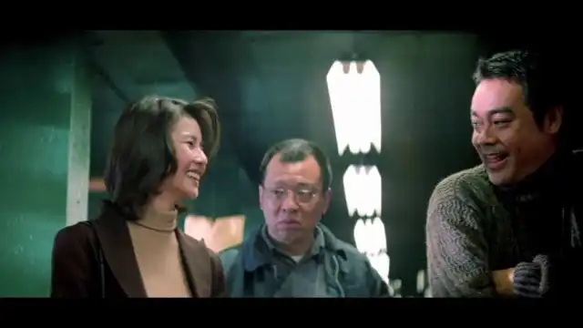](https://pewae.com/wp-content/gallery/videosnap/vlcsnap-2025-12-20-18h51m14s001.webp)

02年的时候没看到片头，这次重温才知道，片子开始的时候是有露点镜头的。我其实非常想知道当年冷饮店的VCD究竟是个怎样的版本。
[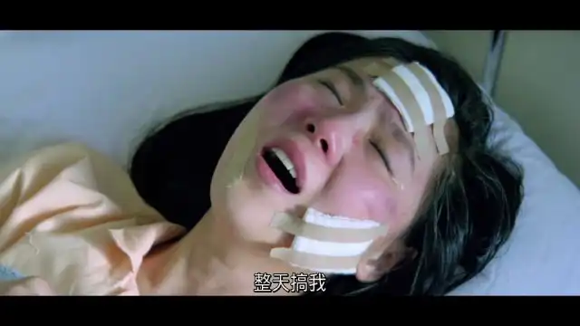](https://pewae.com/wp-content/gallery/videosnap/vlcsnap-2025-12-20-18h39m56s069.webp)

这部片子我强烈推荐没看过的小伙伴看一遍。绝对是一种写故事的艺术：悍匪被解决掉；蒙嘉慧跟刘青云明确了关系，只差捅破最后一层窗户纸；黄卓玲跟任达华澄清了误会，准备去跟医院的黄浩然告白；许绍雄决定跟两个老婆坦白。一切美好，戛然而止。全员挂掉，字幕滚出，非常niubility。
[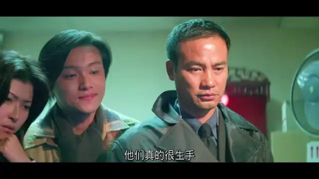](https://pewae.com/wp-content/gallery/videosnap/vlcsnap-2025-12-20-18h34m24s022.webp)

记忆中的镜头：
刘青云非常帅地上前拦车，被一枪搂倒，“非常突然”。
[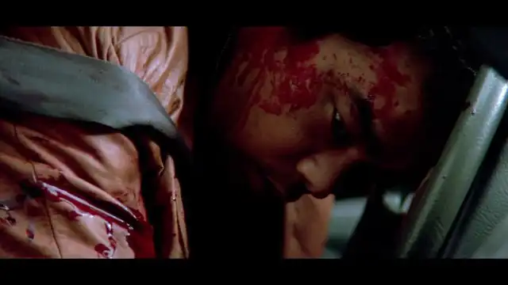](https://pewae.com/wp-content/gallery/videosnap/vlcsnap-2025-12-20-21h40m25s893.webp)