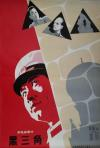
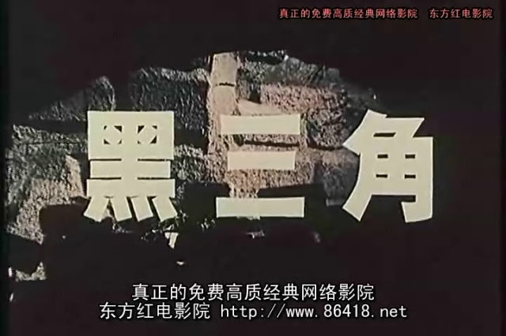
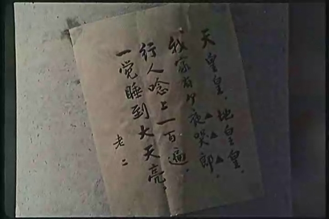
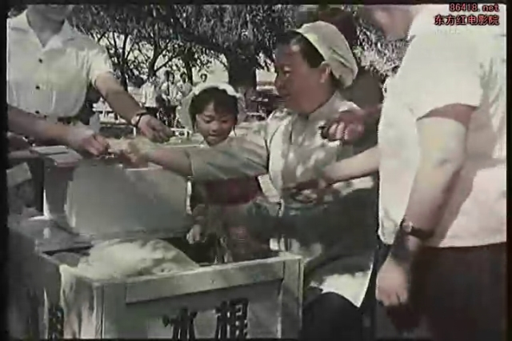
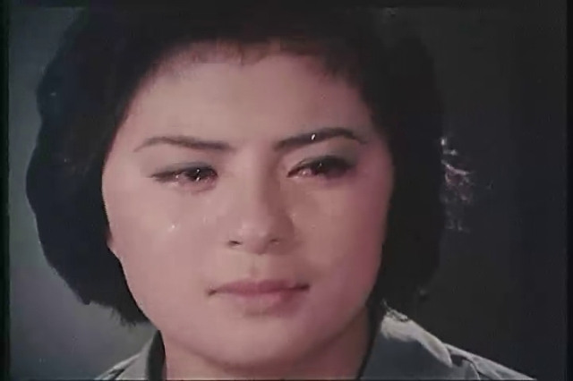
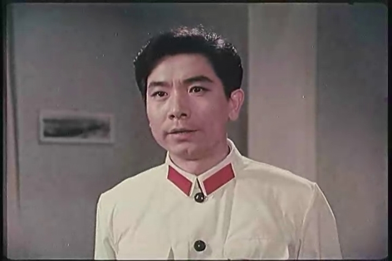
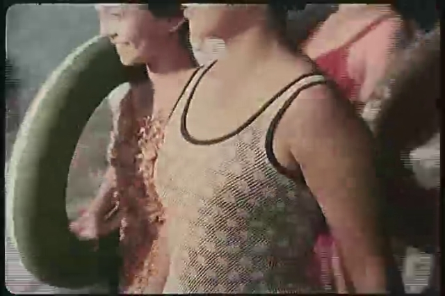
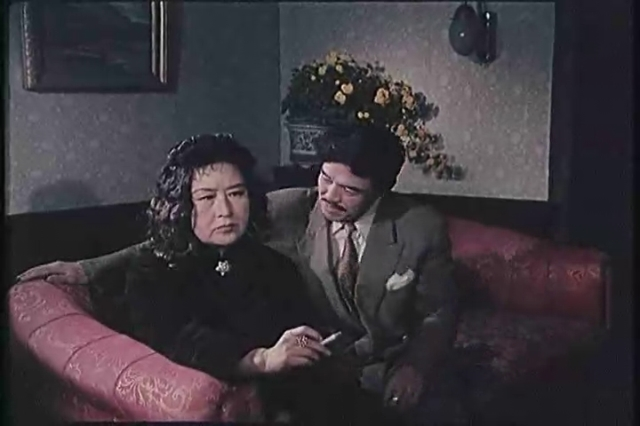
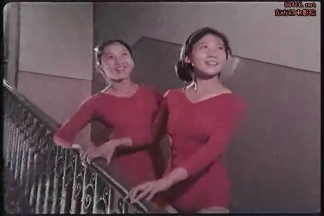
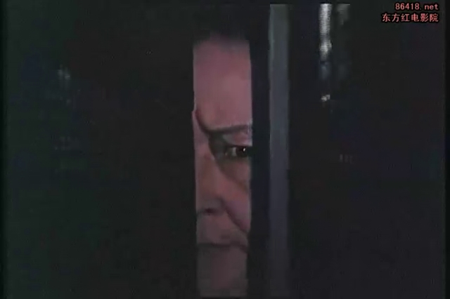

[黑三角](https://pewae.com/gaan/aHR0cHM6Ly9tb3ZpZS5kb3ViYW4uY29tL3N1YmplY3QvMTMwNzkxMA==)

导演：刘春霖 / 陈方千主演：凌元 / 刘佳 / 张平 / 雷明类型：剧情 / 动作 / 悬疑地区：大陆首映时间：1977

贵国因为不能说的机密太多，所以特务也太多。从1949年到1978年，从上到下热衷的一项全民活动，叫做“抓特务”。特务大多来自美国日本台湾，抓到以后又是游街又是教育，花样繁多。由此也衍生出一种独特的电影类型——反特电影。其实也没多么高深莫测，只不过是警匪片的一个变种罢了，或者把特务二字等量代换成“间谍”，算作谍战片也行。我不知道苏修老大哥和越共白眼狼小老弟有没有拍过反特片，也不敢说这是独一份的。

反特电影一直陆陆续续拍到90年代，良莠不齐。我印象中最深的片子有两部，这部是其中之一。本片拍摄于文革结束后、十二届三中全会召开前的1977年，所以在八十年代重放，也不算太古老。
然后呢，虽然是将抓特务的，片子却不怎么血腥暴力，起码比少林寺南拳王之类的要温和许多，所以，假期里就经常重播。

黑三角当然对应的是红五星，是邪恶的象征。凡是出现连续三个黑三角的地方，就是特务们在对暗号。剧情的一大弱点是特务们的一身本事都用在接头对暗号身上了，其余无论是战斗力还是隐藏能力都弱得令人发指。
像下面这张图，说的是要在“地皇宫”碰头。还真挺隐蔽的。可接上头之后呢？传了张明文小纸条，我了个去！

影片拍摄的年代，中美已经建交，中日关系也已缓和。所以特务们的上家是苏联人。大约也就是因为这个原因，影片的背景和拍摄地都是哈尔滨。
女反派是由凌元老师出演的，扮演一个在河边卖了20年冰棍的老特务。凌老师演了一辈子和蔼老太太，就演过这么一个坏人。这一个坏人实在是深入人心。
这么说吧，我小的时候，80年代，这种冰棍箱子还随处可见，但基本没有老太太卖，有老太太卖的，小孩都不敢靠近。

女主角刘佳，凭借此片红遍全国。本片号称票价一毛五，刘佳独占一毛四。确实是全方位无死角的美女。唯一一点奇怪的是面相成熟，怎么看也不像17岁。
刘老师40岁的时候又演了任长霞，再创辉煌。好几个叫小刘佳的完全没法比。

上面刘老师的哭戏，是在组织上揭穿真相的时候。这段戏我觉得是全片最大的败笔。
就算养母是特务吧，好歹也养了你20多年。两个“组织上的人”说了几句，拿出一张两岁的照片，你就立刻信了？一旦来找你的才是真特务咋办？？
当然，观众都知道来找她的是男主角。老熟人，乌鸡国国王嘛！

女主角一开始是被怀疑对象，警察调查的时候趁机秀了一把社会主义的幸福生活。女主是文化宫的钢琴老师，第一次出场是在独唱。还跟调查组有一次擦肩而过，带着小朋友们去江边游泳了。
嗯。70年代末的泳衣，你们见过吗？我其实是见过的。

最搞笑的地方是凌元老师身份被揭穿，镜头回闪到20年前，说她当年是“上海滩一朵花”。
有长这样的花么？人家当时已经60岁了，而且不像刘晓庆那种老妖怪，早就专注于演老太太了。

时代所限，好多废镜头。像什么“戏不够，拿烟凑”啊。像什么莫名其妙坐镇指挥的上级领导啊。像故作高深的苏联接头人啊。
这个文化宫学员们从楼上走下来的场景，简直把摆拍二字刻在脸上。

总之呢，这部电影前半截推理斗智比较有趣，后半段抓捕就令人昏昏欲睡了。

记忆中的镜头：藏在门后的老特务。
