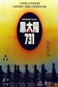
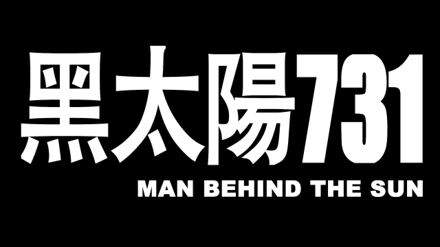
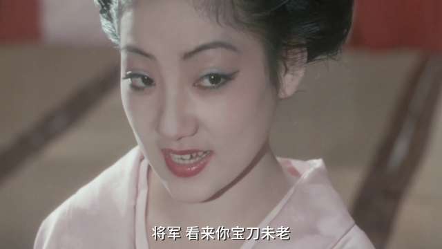
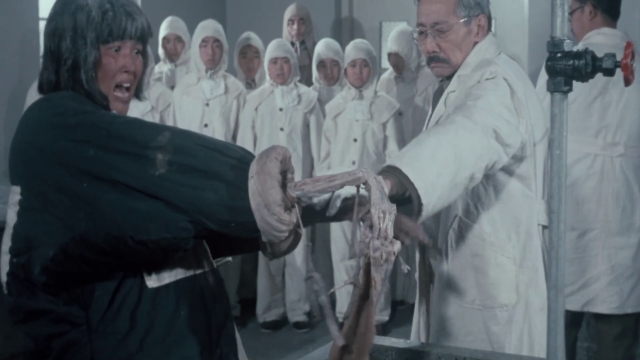
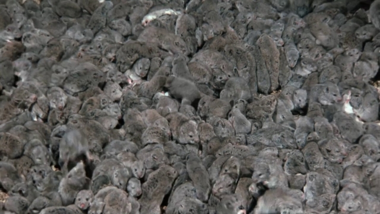
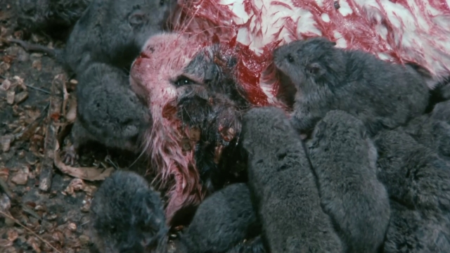
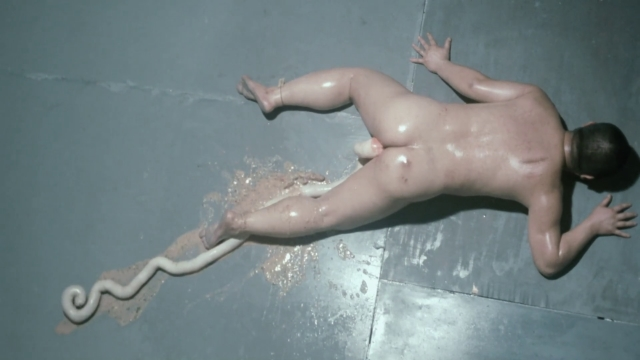
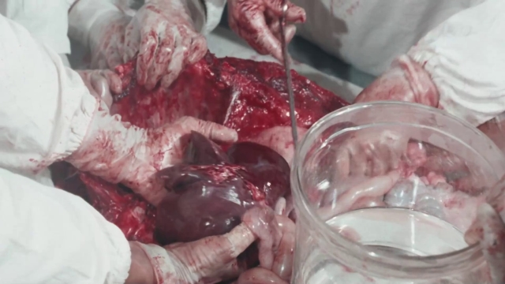
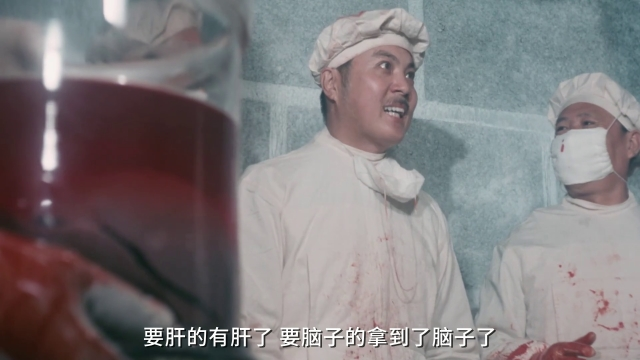
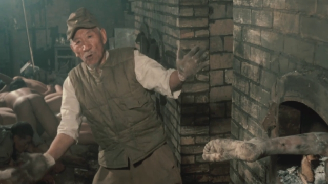

[黑太阳731](https://pewae.com/gaan/aHR0cHM6Ly9iYWlrZS5iYWlkdS5jb20vaXRlbS8lRTklQkIlOTElRTUlQTQlQUElRTklOTglQjM3MzEvMzc0NjIyMQ==)

导演：牟敦芾主演：吴代尧 / 权哲 / 李柏林 / 梅兆华 / 王刚1 / 王润身 / 田介夫 / 金铁龙 / 陈建新类型：剧情 / 历史 / 恐怖地区：香港首映时间：1988

本片凶名赫赫。对一向荤素不忌的我来说，这是绝无仅有的童年阴影。
大约也就是1989年吧，我们班主任老师就在一次课间对我们说：“电视报上报这个礼拜X协弃台会放《731》，大家能看的尽量跟家长一起看一下，看看当年的小日本有多么残忍，对比一下我们现在来之不易的生活……”

谁叫咱种花家莫得分级制度呢，这部明明是香港电影分级改制后的第一部三级片，却堂而皇之地被冠以教育意义登上各地电视台（不过有没有公映确实不记得了）。这片子看完真的真的会导致小伙伴身体和心理的不适，除非家里大人及时换了台。
说来也怪，在那么两三年里，换台的时候经常能遇到这片子。后来一下子销声匿迹了，不知是不是有什么领导后知后觉发出了指示。

剧情嘛，算了，本片的名场面过于勾魂夺魄，以至于讨论剧情都是多余的。

名场面一：野外冻伤实验。在天寒地冻的哈尔滨，先往人胳膊上浇水冻实。然后在实验室里用温水浸泡。在胳膊上一敲，瞬间骨肉分离露出白骨。讲真，如果只是两只胳膊的骷髅没什么可怕的，但是配合上镜头的“一闪”，实在是太揪心了。

名场面二：研究鼠疫用的成千上万的老鼠。老鼠+密集，就问你怕不怕！而且那个年代没有电脑特技，老鼠是制片方一只一只跟当地老百姓买的活体。最残忍的是后面有个剧情，石井四郎把一只猫扔进了老鼠堆，然后猫被活活咬死。想想就浑身不适。猫也是活猫啊！

名场面三：减压实验，人体被内压撑爆，肠子粑粑流一地。

名场面四：几个实验室同时要新鲜的器官做实验，所以让一个少年兵骗来外面的一个小孩，活体摘除内脏。此处还有台词：“想要心的得到心，想要肝的得到肝”。

名场面五：负责烧尸体的老鬼子，一边喝酒一边跳舞一边往焚化炉里塞人体器官。

牟敦芾这位导演简直是个疯子。别的导演加肉戏也好，加血腥也好，都是为了吸引更多人来看。而这位，则热衷于表现残忍。
这位导演还有另外一部很有名的作品——《打蛇》，友情不推荐一下。