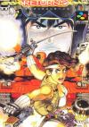

[重装机兵：回归](https://pewae.com/gaan/aHR0cHM6Ly93d3cuZG91YmFuLmNvbS9nYW1lLzEwNzY3NDk1)

原名：Metal Max Returns别名：重装机兵R / メタルマックスリターンズ机种：SFC厂商：DATA EAST类别：RPG发行年月：1995-09耗时：72

哈喽，终于轮到若干个小伙伴心心念念的《重装机兵》了。
重装机兵的红白机原版（MM1）是少数几个在内地声望远远高于日本本土的游戏之一。这里汉化所起到的作用居功至伟。
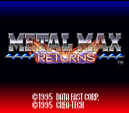

但这个游戏对我来说却不存在任何童年光环，只是一次“一步之遥”的错过。
1996年9月末，学校秋季运动会的Day2恰逢中秋节，所以校领导闭幕式上的废话比较少，差不多下午1点多就结束了。我跟宝宝两个趁机跑去电子市场，买了一台世嘉机。我出钱买机器，宝宝出钱买卡。但是中秋节家里大人大概率提前下班，把机器带回家风险太大。就被宝宝占了先机，把机器扔在他奶奶家的书架里。
后面的三个月，想的就是赶紧放寒假，把世嘉机要回来，好好爽一爽。咱已经告别黄卡，进入黑卡时代了。
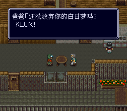
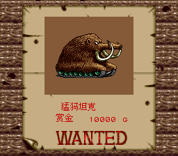

1997年的高中的第一个的寒假还挺长的，从腊月二十四开始（一直到邓爷爷开追悼会那天，提前结束）。小年晚上回奶奶家吃完饭，二姑非要留我住两天。我琢磨后面两天赶上周六周日，我爸休息我在自己家也玩不了心心念念的世嘉机，就应下了。
表妹给我献宝她搞到的两盘不错的卡。有《功夫猫党》、《俄罗斯方块+炸弹方块》、《打气人2》、《SD快打旋风》这几个我没玩过的和《松鼠大战2》、《忍者神龟3》这两个以前玩得不多的。该说不说，都挺好玩的。
第二天上午，表妹出去一趟又搞回来一盘文字卡，说有个跟她混的小弟玩不明白，听说我游戏玩的多，让帮忙探探路。把卡换上后，《重装机兵》四个大字映入眼帘。我心说这不是电软上才介绍过的嘛，小小山寨RPG，有啥可怕。表妹小我3岁，那位小弟又小她2岁，当时还上小学呢，玩不明白“文字卡”很正常啊。有人为这样的事求我，我还挺沾沾自喜。
下午就玩了两三个小时。打到巨炮那里两次没过去。按照一般RPG的规律，此处要么要去找制敌线索或者克星宝物[[1]](https://pewae.com/2022/10/matel-max-returns.html#inner_anchor_1)，要么要练级，都不是一时半会能搞定的，就撂那儿了。这RPG显然不是山寨游戏，但除了装备要搞两套，也没什么别的了不得的。换卡玩《功夫猫党》。当时有个误区，不能随时随地存档的RPG是上一个时代的产物，要低一个档次，不玩也罢。
第三天早上，插上再玩，竟然掉记录了。这评价不禁又降一档。没到中午的时候小弟过来学习，我便给他演示了什么叫装备，什么叫存盘，什么是翻箱倒柜，什么是迷宫和陷阱。从第一个村子开始，到拿完坦克开到第二个村子存盘，复位读档。一套下来，小弟佩服得五体投地。因为演示的时候没掉记录，我也就没跟他说记录和电池的事儿。
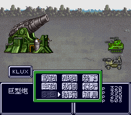

回家之后，给电软96年12期上的两页攻略[[2]](https://pewae.com/2022/10/matel-max-returns.html#inner_anchor_2)折了个角，这游戏就此翻篇了。
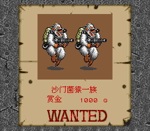
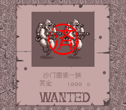
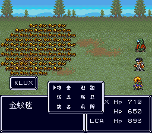

97年后来的两期电软《秘技偏方》里，又陆续刊登过军号BUG和组合激光枪的方法。稍微留意了一下，因为有“偏方”就意味着有人玩。这游戏还这么受欢迎呢？不过也没啥，97年5月我又入手了GB砖头机，更加不重视红白机游戏了。
再后来又陆续能看到MM1的各种消息，我意识到自己可能错过了一款不错的游戏。错过了便错过了，好游戏那么多，再玩新的就是，我从不以此为意。
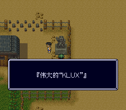

因为毫无感情纠葛，所以这次（重）玩，也就并不拘泥于FC版。那我当然要选游戏感受更好的超任复刻版（MMR）啊。另外，我是非常佩服SFC上的这位汉化作者的。他竟然不厌其烦地直到2021年还在进行修订。因为我之前汉化过一个游戏，所以我知道，如果只凭兴趣的推动，那么汉化到文本导入，游戏正常载入，能看懂完整剧情的时候一定是热情勃发的，随后便会进入不应期，什么修改错别字、调整溢出、润色文本之类的工作，又繁琐又缺乏成就感。
出于对原作以及汉化者的敬意，国庆假期开始玩这个游戏的时候，除了即时存档，我没有上任何修改的手段。
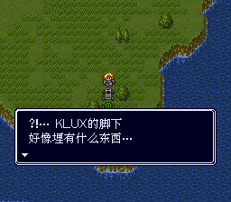
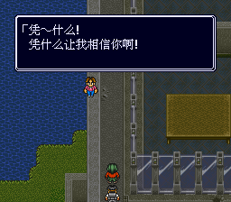
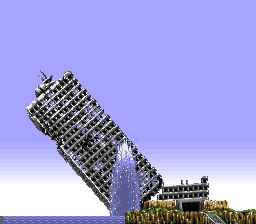

但是有些骨子里的东西是藏不住的你知道吗？
MMR增加了一条从弗里经索鲁到地狱门的地铁遗迹通道。这条路战车走不通，只能一路白刃战过去。通道里还有打人非常痛的激光蚯蚓。如果在真机上，想在低级别穿到地狱门那可真是九死一生。但模拟器有即时存档就容易多了。出隧道之后，在地狱门西村（阳关村）换了装备还不满足，又继续跑到了下面的卡拉才飞回去打正常流程。
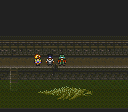
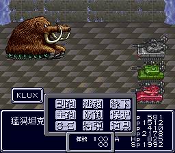

10月5号晚上打到这里，出村一看，山火没起，我的火就来了。10月6号回档到打变异鳄鱼的地方，打了一天，不起火。10月7号替换成0.95汉化版，再回档到变异鳄鱼，又打了一天，仍旧不起火。
我的个心啊，拔凉拔凉的。一个十一假期白忙活了。而且打到这块儿剧情差不多已经进行了85％，只剩两个赏金首和最终BOSS诺亚了，就此放弃实在心有不甘。
我还是认定了自己的跳关操作加上汉化版导致了无法进行下去。一狠心，日文版重新开档。
为了挽回损失的时间，再重新开档就直接上手段。等级、人道具和战车装备统统安排上，照着攻略谨小慎微，该进的村子一个不落，该对话的NPC一个不少，该打的赏金首挨个突突。别说，三个角色每人一把攻击500的激光枪，爆射马歇尔的感觉真的好爽。
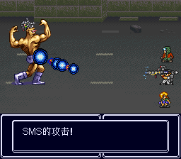

假期结束的这个礼拜，每个晚上打一点儿，到周四又到了老地方，心情忐忑地带走8号战车后，仍旧不见火起。因为已经是日文原版，那肯定不是rom的问题，只能是我的问题了。心情复杂地出村转了转——妈的，原来我搞错了起火的山。所谓的山火，并没有发生在卡拉上方那座可见的山上，而是发生在东侧两个屏幕之外。我第一次玩的钻地道没问题，跳流程拿战车也没问题，0.96版没问题，有问题的只是少往东走了两步路。
放下超级档，读回10月5号的档，继续。
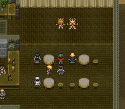
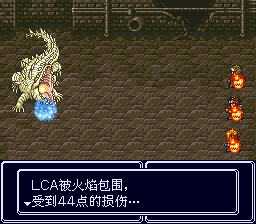

咱没好好玩过MM1，所以军号、烟雾弹、雷达三大利器究竟被削弱了多少完全没有概念。但MMR的3678号车能装双SE这个变化真是太爽了，三辆坦克都配上改满的双圣剑导弹，那真是神挡杀神，佛挡杀佛，诺亚挡杀诺亚（两三个回合就能解决）。
MMR还多出了一个援护系统，强大到了影响游戏平衡的程度，只需要给5号坦克换个艾米C装置，装一把雷电机关枪拖在队伍后面，铁蜈蚣戈麦斯沙漠之舟会立刻变得不值一提。
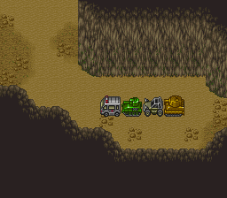
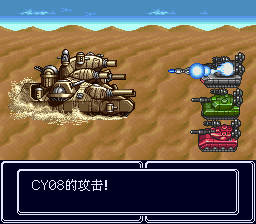

珍藏了26年的攻略一个字都用不上。且不说网上图文并茂的资料到处都是，还有带解说的视频可以参考（不过我没看视频）。单就游戏本身，MMR增加的要素比比皆是，而且MM1汉化版的各路名词为了省空间，用了好多缩写，翻译水平也不咋地。到了MMR少硬件的制约，80%的名词都更新了，一份对不上名字的名单堪比密码表，留着也没用。时代变了。
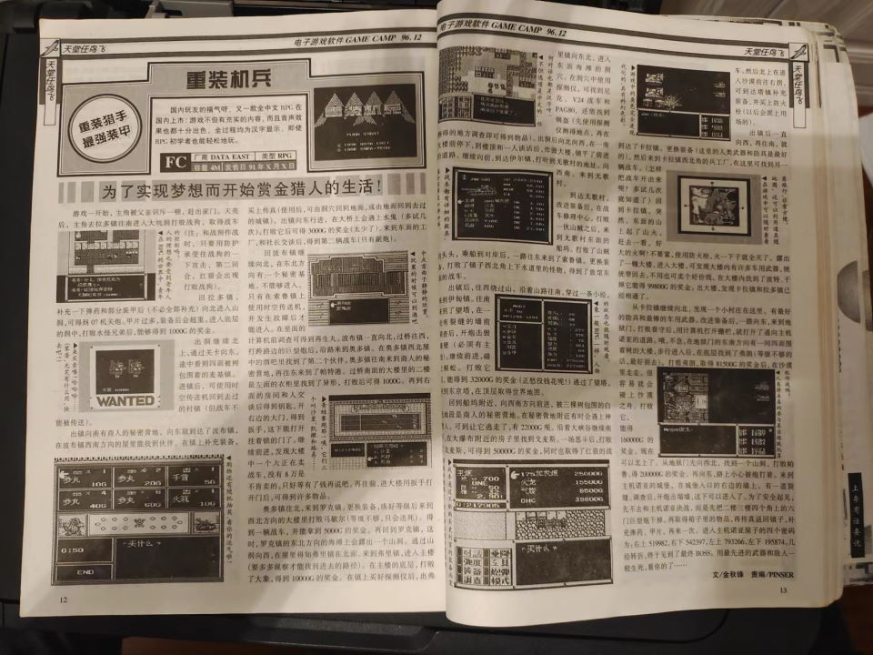

虽然没玩过MM1，单从本次找各种资料就能够看出，MMR是少见的良心复刻。在某日文MM系列专题网站上，MMR不仅单列，而且排名高居系列第三位。我所收集到的MMR相对于MM1的大区别：
操作可以设置快捷键。
烟雾弹、军号的BUG被修正了，再也没有那么神奇的作用。雷达的作用也被削弱。
追加了像样的通关音乐和画面。
战车配置变化：2号车SE和主炮能够互换，且驾驶员能够不下车直接使用人类武器和道具；3号车、5号车SE和副炮能够互换；6号、7号车可以装双SE；8号车可以双副炮双SE。
增加了五个赏金首；两种mini游戏；若干武器和道具，修改了某些武器的获得方式，其中最强的引擎和最好用的主炮都变得不再限量。
新增了东西向地铁废墟，可以提前到达地狱门。
新增了索尔镇双子大楼这一迷宫。
新增了道具BS机，能够查询资料呼叫增援远程操控战车。
强化了C装置，增加了归还功能、回收功能、迎击功能和援护功能，其中援护功能非常强大。
~~丰富了红狼和妮娜故事线。~~
增加了一些刷钱的日常赏金任务和酒吧回收的道具。
增加了称号系统。
总之这是一个玩法非常丰富的RPG，强烈推荐玩过红白机MM1的朋友们感受一下这款熟悉又陌生的游戏。
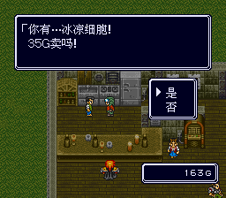
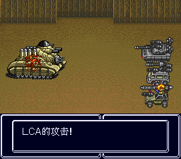
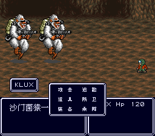
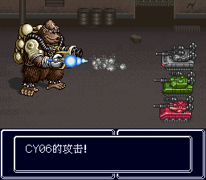

查日文资料，意外发现一条PF=10的屁技：
进入游戏，选择一个档位，跟老爹对话以后，进村存档。然后reset游戏，选择刚才的存档开始新游戏。这时会出现存档无法保存的提示，无视它。
进入游戏，会发现主角身上的钱多达99999999G。但代价是无法存档。存盘点的人还会吐槽你：“都跟你说了没法存档”。
所以在真机上只能算个毫无实用价值的彩蛋，但现在用模拟器还真不一定，反正我是没敢深入往下玩，谁有兴趣谁试。
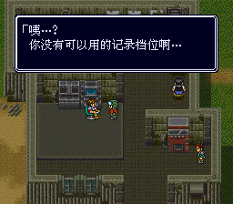

红狼与妮娜的故事好像还挺著名的。~~MMR特意给这对狗男女加了段戏——~~如果见帕鲁时主人公的队伍里有红狼坦克，妮娜就会殉情；如果没有，妮娜则会在那里当望夫石。提前存个盘，两个故事都感受一下。
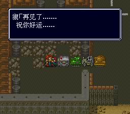
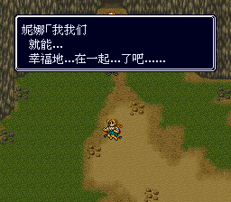
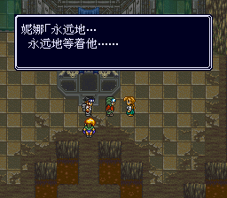

MMR的一个缺点：遇敌率实在太高，岁数越大越忍受不了频繁踩地雷。
MMR的一个优点：逃跑成功率接近100%。
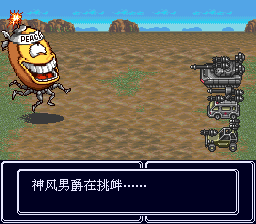

5个新增赏金首。共同点是都有一手不咬人隔央人的状态攻击。
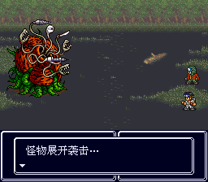
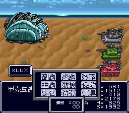
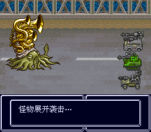
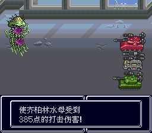
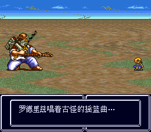

个人感觉游戏中最难打的赏金首是弗兰肯，其次甲壳虫车。全游戏最难打的敌人不是任何一个赏金首，也不是诺亚，而是老朋友巨炮。
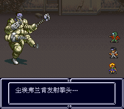

最终BOSS，多少人的童年阴影，诺亚。
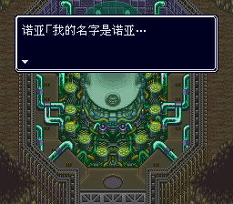
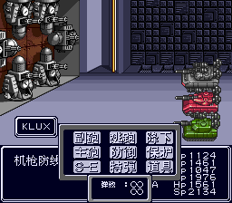
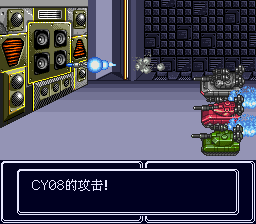
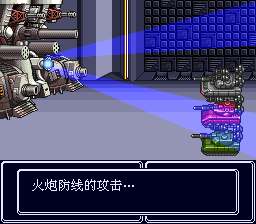
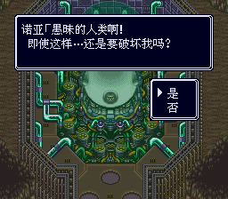
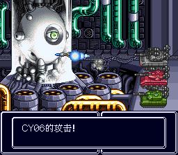
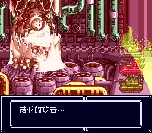
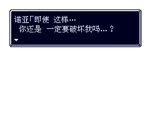

通关画面会回顾遇到的人、去过的地方和干掉的赏金首。
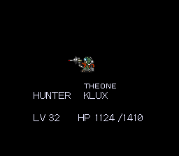
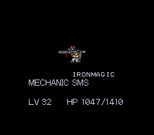
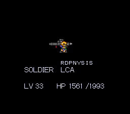
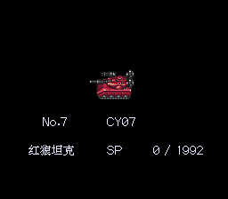
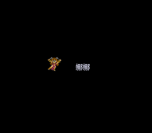
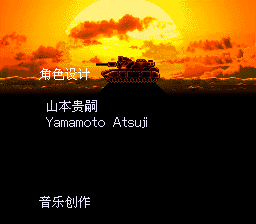
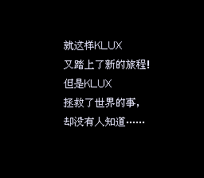

---

- [(1)](https://pewae.com/2022/10/matel-max-returns.html#inner_ref_1)：我的判断是正确的，这里需要穿甲弹。
- [(2)](https://pewae.com/2022/10/matel-max-returns.html#inner_ref_2)：按照现在的公开情报，这个游戏是先锋卡通汉化的。先锋卡通和电软其实是一家人，电软只给这么小篇幅的攻略，那就真是卖断给盗版商了。并且外星科技还有一版《机甲战士》，外星科技是当时电软非常重要的广告客户。对比当年狂吹《赌神》的盛况，电软明显是不把MM汉化版当自己孩子了。