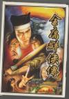

[金庸群侠传](https://pewae.com/gaan/aHR0cHM6Ly93d3cuZG91YmFuLmNvbS9nYW1lLzEwNzUyODg2Lw==)

机种：PC厂商：河洛工作室类别：RPG发行年月：1996-11耗时：220

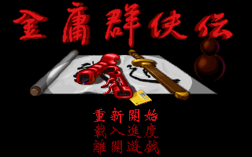
这次出场的是鼎鼎大名的DOS中文游戏里的佼佼者——《金庸群侠传》。
通常人们喜欢把本作和《仙剑》成为双~~壁~~璧，而且仙剑的评价还要更高一些。但是个人看法，仙剑除了全中文就没什么像样的优点了；金庸群侠传除了头像丑点就没什么大的缺点了。
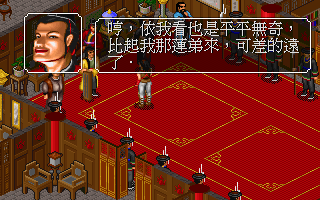
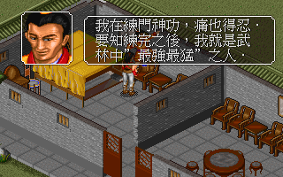

这个游戏是我在没有PC以前最喜欢的PC游戏。最早接触是在1997年的7月，因为高考，那个周末破天荒不用补课。小伙伴们一起去给徐二庆生。徐二哥高一做了个大手术以后，家里就给配了电脑，奔腾166。那天他们另外一群人在客厅打扑克，我跟宝宝两个重度游戏爱好者在屋里玩电脑。这个游戏徐二当时正在攻关，作为金庸和RPG双料专家的我，接着徐二的档打得相当欢快。
当时主要干了三件事：在武当派隐藏的角落里摸出了真武剑，上峨嵋派逼死灭绝拿到了倚天剑，破解了著名的“二午寺，一山恶”谜题，完成了神雕侠侣，然后顺手学了九阴真经。
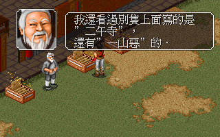
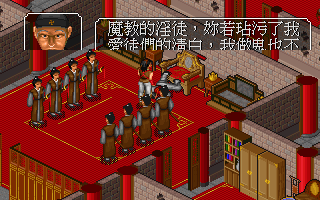

晚上就光顾着喝酒了，跟徐二说弄了两把攻击力很高的武器，他还高兴得很。
回学校之后就只剩下埋怨我了：学九阴之后，内力变成了阴属性，就学不来范围攻击的大招九阳真经了；刚好我手上有两期《大众电脑》的攻略，查完之后告诉他找虚竹或者游坦之，都能够把内力变成白色，之后就能解决这个问题了。过了几个礼拜，他又跑来掐我脖子：因为道德被我祸祸得太低，招不到虚竹，而又没低到能找游坦之的程度。当时的《大众电脑》上就是这么写的，只有两样武功能调和阴阳，我们都不知道最简单的北冥神功就能解决这个问题。
徐二掐我脖子的时候，说的是我搞得他的主角“满脸臭气”，这个死文盲！
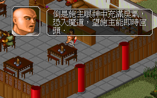

所以大学配了电脑之后，刚好赶上15元“正版风暴”，第一时间入手，欢快地打了好几天。再后来01年家里也配了电脑，更是又奋战了一天一夜。当时还以为对这个游戏的欲望已经耗尽了。
可这次重新开动，仍旧觉得很好玩呀！又来了个通关三连。
不仅没有厌倦，而且，这次重温让我对队友的实力有了再认识：时间足够的前提下，胡青牛是比张无忌更好用的奶妈，而单体攻击力最强的队友竟然是一开始就能碰见的林平之！
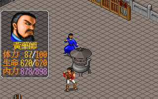

当初困扰徐二哥许久的问题其实也能解决——五岳派问题解决后，逮着唐文亮一个劲K就行，打一次降一点。
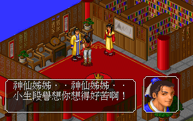

在比较注重游戏性的我看来，本作的魅力主要体现在两点之上：一曰成长性，二曰道德系统。主角可以学习花样繁多的招数，召集不同的队友来壮大自己。续作《武林群侠传》把队友给废掉了实在令人费解。道德系统就更有趣了，打破了之前玩RPG翻箱倒柜，见人就说话的桎梏，随便动手可能会导致打不过最终BOSS！
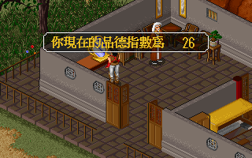
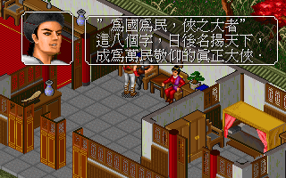

游戏里有两大合法BUG：其一是野球拳，大约挥空60次长一级，十级以前就是废物，但到了十级之后摇身一变成为游戏里攻击力最高的招数；其二是王语嫣放在队伍里能同时加攻击buff和降敌攻击的debuff。再加上攻击两次的左右互搏，没什么敌人能是一合之敌。三项合一连游戏里最强大的东方不败都能直接秒，彼时颇有一种空有屠龙之技，世界上却已没有龙的遗憾之情。所以打着打着就会不自主地想走邪恶路线，因为十大善人比十大恶人厉害得多，同时对付带左右互搏的周伯通和郭靖，三个会降龙十八掌的，可以令人肾上腺素飙升。
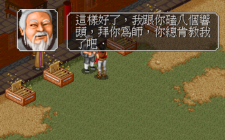

学化功大法和含沙射影是可以让任意攻击带毒的，走恶人路线的理由又增加一条。
一般来说，即使走坏人路线，也没人去杀一灯。因为杀了一灯就拿不到最重要的武功——左右互搏了。可是一灯的房子里有两个箱子好诱人啊，还是存个档把一灯杀了吧。
结果，杀了一灯门也还是不开……
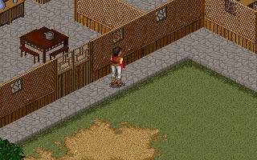

游戏整体难度不大，因为容量有限，所以很多部小说只有一两个剧情就拿到书里。最惨的是《白马啸西风》和《鸳鸯刀》，没出现过任何一个人物和场景。另外，金老先生的开山之作《书剑恩仇录》也只出现了一个黄衫翠羽，连敌人都是借用《神雕》的，让期待骆冰的人好失望啊！剧情最多就集中在《笑傲》、《倚天》、《天龙》这三部上。可能是因为出场的帮派和人物比较多，好安排剧情吧。
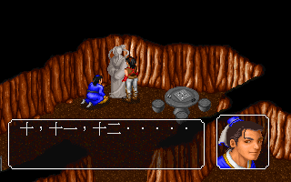

场面比较宏大的战役也是三处：光明顶战六大派，黑木崖战东方不败，以及战明教的四大法王和光明左右使。东方不败是游戏里所有敌人中攻击力最高的，两下就能把主角秒了。不过三大BUG于一身的主角，打谁都是一拳。所以游戏里最难打的地方反倒不是这三大战役，而是胡斐单挑苗人凤的剧情杀。刀法里实在是没几个厉害的存在。
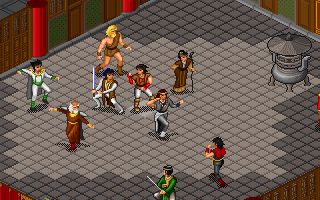
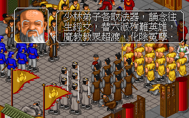
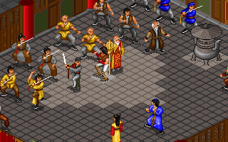

当年一个比较新鲜的设定是辟邪剑法和葵花宝典只有自宫之后才能学。其中辟邪剑法确实是除野球拳外主角能学到的最厉害的单体攻击。我是从来没给主角练过，倒是为了让令狐冲单挑更厉害，切过他的。其实切不切只有任我行能看出来。话说任盈盈都没出场，你管个蛋的蛋啊！
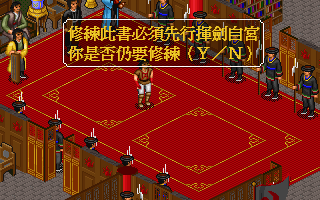
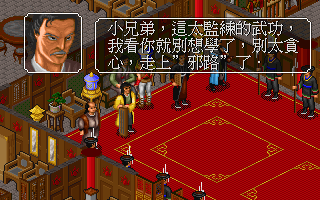

那时还没流行起GAL game，女队友是不可攻略的。除了王语嫣这个bug和小龙女以外，所有的女队友初期都不怎么好用。唯一一个看上主角的是蓝凤凰，很笨，却又没笨到练左右互搏的程度，加上用的是鞭子这种没什么厉害招数的武器，实在没法当成女主角看待。
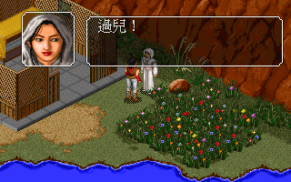
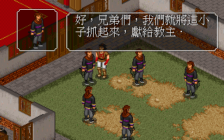

游戏当中有个分支剧情一直耿耿于怀，都成了死不瞑目级别的了。就是如何给何太冲的老婆治病。十几年来明察暗访，现在的结论是这段剧情在正式发布的时候做了大量删减，把医生放走了就没后续了。当年可是被谣言害得不轻：什么张无忌学毒经法——张无忌根本学不了毒经，修改了之后才能学。还有什么一队大夫法，胡青牛满级法……
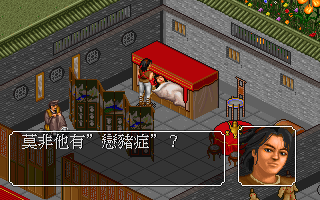

最终还是选择了恶人路线。这台词，看着就爽啊……我就喜欢你们看我不爽又干不掉我的样子。
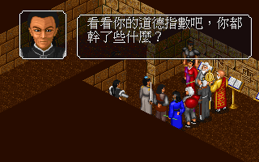
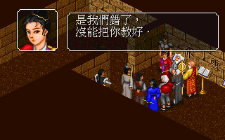
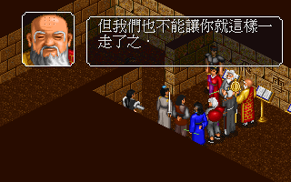
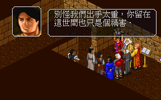
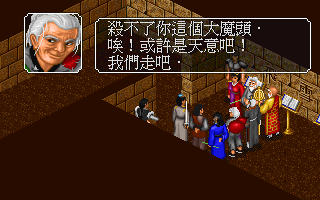

通关！
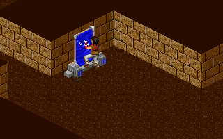
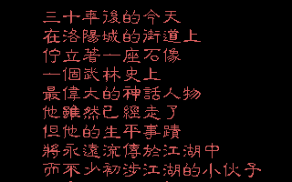
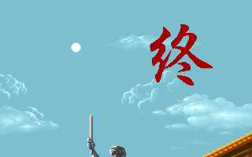
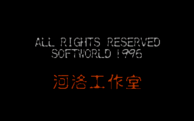