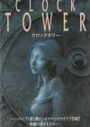

[钟楼](https://pewae.com/gaan/aHR0cHM6Ly93d3cuZG91YmFuLmNvbS9nYW1lLzEwNzg0OTMy)

原名：Clock Tower / クロックタワー别名：钟楼惊魂机种：SFC厂商：HUMAN类别：AVG发行年月：1995-09耗时：7

去年11月开始，搞了个小发明。窟窿越搞越大，时间耗费很多。差不多到上个月才出来个结果。
以至于大半年的时间都没怎么好好玩游戏。
目前功能实现得七七八八了，游戏时间可以继续了。
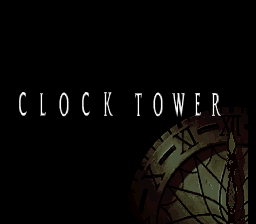
知新篇就是要探索没玩过的游戏。名单上面的名作又以SFC为最多，一点一点来吧。
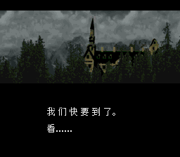

说起恐怖游戏，其实俺跟很多朋友一样，接触的比较晚。摸过第一个像样儿的恐怖游戏是寝室买了电脑以后，2000年接触到的PC版《生化危机2》。上手没有5分钟便放弃了——伪3D玩起来头晕，且操作别扭。便退而站在老大和老四身后指点江山。大约看着老大通了一版，老四把里昂和克莱尔各通了一版。后来又看老四通了两次《生3》，仅此而已。后面的作品几乎没有不是3D的，我也就几乎都没碰过。
故而此次选新游戏，没太费尽就挑出了《钟楼》这部2D日式恐怖游戏的里程碑式作品。犹记当年《电软》对二代的一句追捧：“我已经迫不及待弄死你了！”
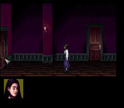

真正玩起来以后，即使我已经关了灯戴了耳机，恐怖的感觉也仍旧不太强。作为日式恐怖游戏的代表，本作的长处是氛围营造比较好。超任本身就略显灰暗的色调，加上单调的皮鞋踩在地板上的一成不变的“嗒嗒声”，以及时不时从角落里窜出来的小惊喜。咱恐怖游戏虽然玩得不多，可恐怖片却看了海量啊，有些小儿科了。
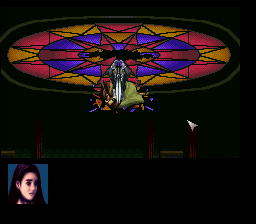

因为是汉化版，所以我前两天玩时逞强没看攻略。这游戏的设定太讨厌了：不该碰的东西，或者不该进的门，或者进了二次的门，都有可能引出强大而又恶心的剪刀人。被剪刀人追上就是九死一生，这一生还要利用地形和运气。偏偏这部作品操作起来相当不顺手，后面有追兵的时候很难抓住转瞬即逝的机会选中合适的位置摆脱困境。而模拟器虽然有即时存档可以利用，但是手忙脚乱下误触存储键也有好几回。如果再来一次的话我一定不会玩SFC版本，Windows版直接用鼠标操作，应该方便多了。
总之前两天的五六个小时就是在花样赴死。其中还误打误撞打出了一个坐汽车逃跑的Bad Ending：结束了，也挂了。我觉得我玩RPG养成的乱开门乱翻箱子的毛病快被修理好了。
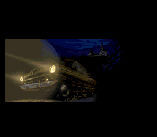
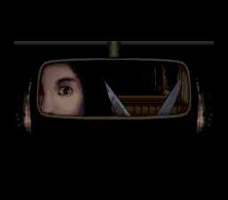

有了攻略，配合上即时存档，难度瞬间便下来了。通关的这一次，运气非常棒，除了跳不过去的剧情，竟然一次剪刀人或者玛丽都没遇到，顺顺利利没到40分钟就达成了完美通关。
回头再品，这部作品的流程很短，谜题也都挺简单的，最大的魅力就只有剪刀人和遇到危险时动人心魄的音乐。
我非常怀疑生三的追击者便是借鉴自这部作品的剪刀人。
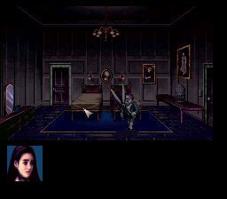

故事其实也挺俗套的，什么畸形/超能力双生子，挂在冰柜里的人肉，吃人的老大爷，邪恶的仪式之类，都是司空见惯。达成完美结局的第一要务其实是不能乱翻乱调查，只要不看到伙伴的尸体，她就还活着。
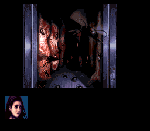
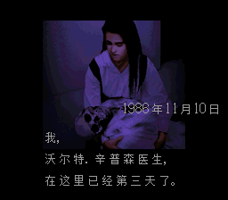
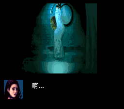

最后的三个BOSS其实挺没意思的。
巨婴被烧死。
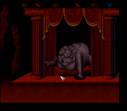
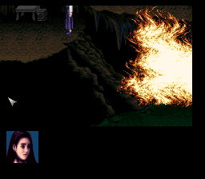
剪刀人被钟声吓死。
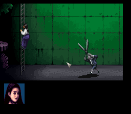
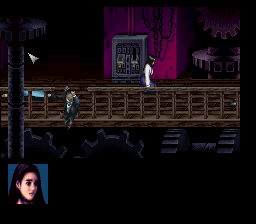
女人被乌鸦推下高台。
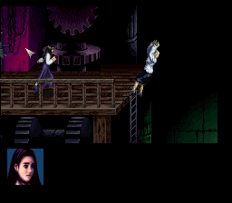

通关！
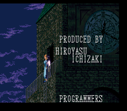