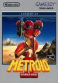

[银河战士2：萨姆斯归来](https://pewae.com/gaan/aHR0cHM6Ly93d3cuZG91YmFuLmNvbS9nYW1lLzI2MzQ3NjE5Lw==)

原名：Metroid II: Return of Samus别名：萨姆斯归来 / 密特罗德2机种：GB厂商：任天堂类别：ACT发行年月：1992-01耗时：9

银河战士在游戏历史上是有着举足轻重地位的游戏。它是任氏招牌名作之一，历史上第一个使用女性角色作为主角的动作游戏。当然，按照设定，主人公萨姆斯阿兰身高191，体重90公斤，可不是什么普通的萌妹子。
同时银河战士也是2D动作冒险类的开山鼻祖，把这个类型发扬光大的，是2代以后的恶魔城。
可能是首发在磁碟机上的原因，银河战士的盗版卡流传较少，在国内没获得到应有的地位。
美国玩家特别喜欢银河战士1，凡有评选几乎都稳居前十。IGN上排名高居第6，而中国玩家所熟悉的魂斗罗不过第14而已。
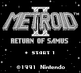

Metroid这个名字有些吊诡。它是外星入侵者的名字，本身是Merto和Android的合成词。所以跟什么银河什么战士根本没啥关系，直译过来应该是“地铁机器人”。（铁胆地铁侠？）拥有任天堂版权的中国神游公司把这个系列翻译成“密特罗德”，信倒是信了，但既不达也不雅。
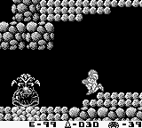

因为GB机能有限，许多名作不愿意在GB上推出不带任何前缀后缀的续作，怕砸了招牌。银河战士2是少有的出在GB上的正统续作。想到这个系列早期的制作人是GameBoy之父横井平军先生，这么做倒也无可厚非。
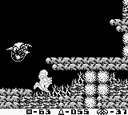
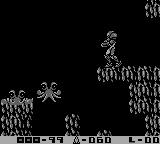

一字概括马里奥：跳，一字概括森喜刚：拍，一字概括卡比：吸，一字概括银河战士：“团成一团，圆润离开”。
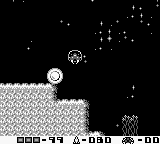

银河战士2严格说来只有一张大地图。只不过在取得某些道具之前，后一部分的地图不会开放而已。因为GB机能所限，敌人的数量少攻击花样也不多，制作组为了增加难度就设计了一个超大的地图，游戏泰半时间都是在找路，钻地道、跳跳跳，不仅降低了游戏体验，而且爬墙和跳跃的操作非常累手！
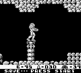
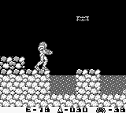

银河战士系列里的传统中boss。水母状的这个必须先用冷冻枪冻住，然后发五发导弹干掉。要是被近了身就死定了！
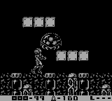

会飞的这个和很讨厌，打底下没用，必须跳起来打正面和背面。
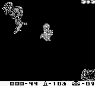

最终BOSS，打它张开的嘴才行。
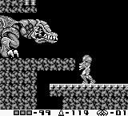
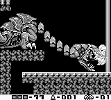

通关！
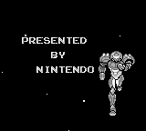
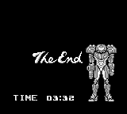

在三小时之内通关的话，能欣赏到萨姆斯的比基尼福利。这个要求其实非常难达到，为了看这张比基尼我都改得不要脸了。因为地图太大，而且子弹消耗得很快，不捡提升弹量的道具的话到最终BOSS那儿就弹尽粮绝了，而提升弹数的道具大多在偏僻的犄角旮旯里，不背地图想一两次就做到3小时内通关简直是痴心妄想。
好不容易打（gai）出了比基尼通关画面。记住，萨姆斯身高191，体重90公斤。

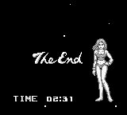