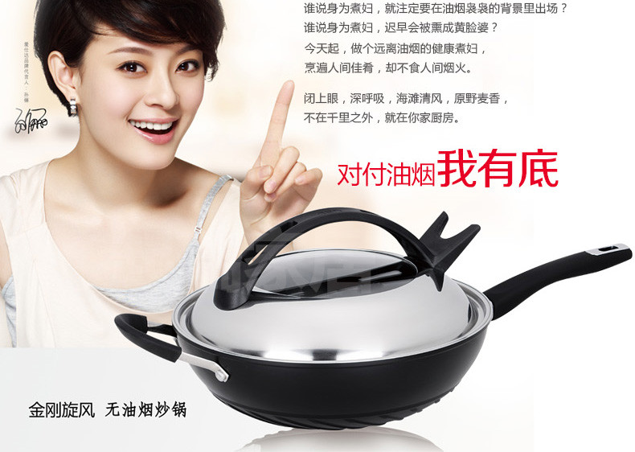

午休时间，小萍跟小琳照旧在茶水间闲扯妈妈话题。通常她们有30%的概率把话题引到婆婆身上，今天也不例外。

小琳：“磕了。我婆婆昨天又把我的锅刷坏了。跟她说她也记不住，直接上钢丝球。我把钢丝球扔了她就再买。这都弄坏我第二个锅了。”
小萍：“我婆婆也是，喜欢把锅烧得特别热再倒油，两次就坏了。我那锅从日本带回来的，小两千块呢！”
小琳：“我的锅也接近一千一个。怎么跟她们说都不听呢？这要是自己妈，我早就……”

媳妇们的抱怨当然是有道理的：上千块的锅，被婆婆们几下就弄得不能用了，一个一个都是老顽固，还说我跟你不对眼，跟你说了多少次了……此处省略一万字……
婆婆们似乎也挺冤枉：给儿子儿媳孙子孙女做饭还做出毛病了？锅有什么金贵的，就是借机会找事儿！我成天给你们带孩子容易嘛……此处省略一万字……一个破锅能怎样！！

理解万岁？别扯了！
如果媳妇能耐心跟婆婆解释并且婆婆能虚心接受的话，婆媳关系就不叫千古难题了。

锅大爷啊锅大爷，这锅你就背了罢！
——谁叫你一方面把自己吹得怎么怎么加热均匀保持营养减少油烟不溅油花，让现在的砍手党媳妇们不弄一只回家都不好意思跟人打招呼；另一方面那涂层弄得命比纸薄，热不得划不得，一旦破掉整个变废铁。
你就不能把那层玩意儿弄得再结实一点再耐划一点，比如拿烤瓷牙的技术来借鉴一下？
对，还有那帮砖家叫兽和微信养生党在一边唯恐天下不乱：涂层一破相当于每餐吃毒药……

作为男人，只能把事儿赖到锅身上。
谁叫咱家也有这么一只~~媳妇~~锅来着？