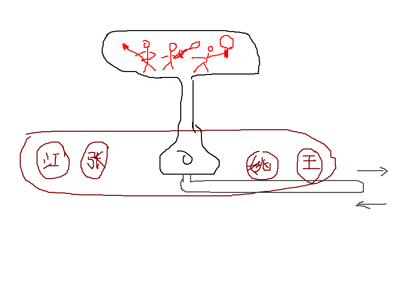

*前面的三年，虽然有零星的记忆，但我并不能够肯定哪件事情发生在哪年。所以，都用后来发生的事情代替了。但是从1984开始，每一件事都是可以确定发生在那一年的了。*

雨辰哥是大姨家的大儿子，小亮哥的大哥。
大姨家有三个孩子。姥姥那段时间也在大姨家住。所以两间房间一共摆了四张床。其中大屋并排放了一张两米，一张一米二的床。两张床之间也就不到80厘米的一个小过道。
那一天，身为初三学生的雨辰哥难得在家里看着我。跟我差了12岁的他和我之间也没什么太多可以讲的话题，更何况他本身挺讨厌小孩子的。于是他决定给我弄个玩具出来，让我消停一会儿，好让自己有时间整理邮票。

他采取的方法是，找出了自己小学时候没做完的手工课模型——那种劣质纸板做成的、按照说明一步一步做下去就能弄出来的小纸模玩具。他拿了剪子浆糊在小床上有板有眼地做手工，我就在两个床之间跳来跳去。基本上跳个三五回就会跑去问：“哥，做完了没？做完了陪我玩‘小猫钓鱼（扑克的一种玩法）’吧！”
开始的时候他还总提醒我别跳注意安全。后来看我没事而且根本不听那一套也就索性不说了。而我见他不搭理我，就更加变本加厉，开始往他怀里跳。前两次可能前戏够长，他准备充分地躲开了。
第三次也不是第四次的就比较悲催，可能是我跳的时候出的声音太小了，他没有反应过来。我一巴掌拍在了剪刀上，鲜血直流。

他赶忙背着我出门去找还在上班的大姨夫。大姨夫领着我去了油漆厂卫生所。大夫看了一眼说，就是破了点儿皮，没事。你看这小孩都不哭。包了两层纱布，扎了针破伤风针之后就把我放了回来。
雨辰哥把我背回家之后，趁着我消停，赶忙把那件手工给做完了。那东西挺好玩的，构造像个天平。中间指针是三个系红领巾的小孩手里拿着刀枪，两边的托盘里一边俩脑袋。正式名称叫“打倒四人帮”……大概的样子见图示。

可是终究还是留下了阴影。6年小学下来，我手工课连4分都得靠老师怜悯才能拿。剪刀和胶水不给力呀～～

这是我有记忆之后的第一次受伤。当时也觉得挺炫的，老娘来接的时候还特意挥舞着纱布给她看……

==== Update 14.11.9 ====
找到一张跟原图十分接近的宣传画
